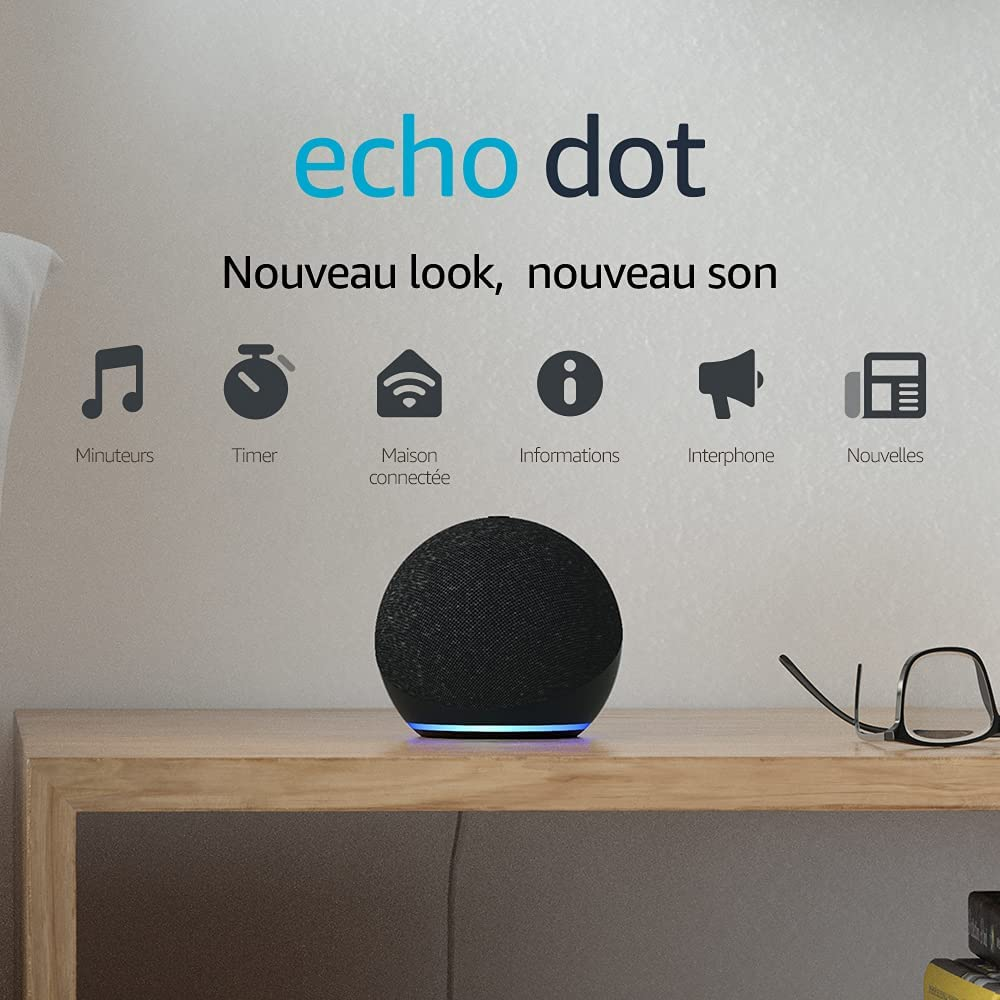
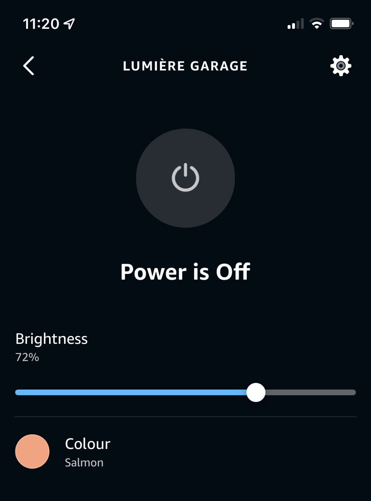

Salut à tous !

Aujourd'hui je suis heureux de lancer Gladys Assistant 4.9, une version majeure avec une intégration très demandée : l'intégration Amazon Alexa 🥳

Cette intégration veut dire que nous sommes désormais compatible avec les deux principaux assistant vocaux du marché : [Google Home](/fr/docs/integrations/google-home) et [Alexa](/fr/docs/integrations/alexa).

## Tirage au sort : Gagne un Amazon Echo Dot (4e génération)

A l'occasion de la sortie officielle de l'intégration Amazon Alexa, je veux offrir un Amazon Echo Dot 4ème génération à un utilisateur Gladys Plus !

Pour participer au concours :

- Inscris-toi sur [Gladys Plus](/fr/plus/) entre maintenant et ce **dimanche 26 Juin 2022 à 20h30**
- Tirage au sort le 26 juin à 21h parmi tous les utilisateurs actifs Gladys Plus !
- Livraison en UE uniquement

Si tu es gagnant, je te contacterais pour t'envoyer un Amazon Echo Dot 🙂

Le replay du live Youtube de lancement est disponible ici :

<iframe  src="https://www.youtube.com/embed/Da_AQSQedFg" title="YouTube video player" frameborder="0" allow="accelerometer; autoplay; clipboard-write; encrypted-media; gyroscope; picture-in-picture" allowfullscreen></iframe>

<!--truncate-->

## Les nouveautés de Gladys Assistant 4.9

### Intégration Amazon Alexa

Il est désormais possible de contrôler vos appareils Gladys dans Alexa, autant sur smartphone qu'à la voix.

Vous pouvez contrôler les appareils ayant ces fonctionnalités :

- On/Off (Lumières, prises)
- Contrôle de la couleur des lumières
- Contrôle de la luminosité des lumières

Concrètement, vous pouvez désormais demander à Alexa :

- "Alexa, allume la lumière du salon !"
- "Alexa, éteins la lumière !"
- "Alexa, change la couleur de la lumière du salon en bleu !"

Sur smartphone, vous retrouvez vos appareils dans l'application Alexa, et pouvez les contrôler de n'importe où dans le monde, quel que soit l'appareil (même du DIY, et même si l'appareil final n'est pas compatible Alexa).

Pour configurer l'intégration Amazon Alexa, suivez notre tutoriel: [Configurer Alexa avec Gladys](/fr/docs/integrations/alexa).

### Injecter des variables dans une requête HTTP dans les scènes

Dans les scènes, vous pouvez désormais injecter des variables dans l'action "Requête HTTP".

Le but est de pouvoir envoyer de la donnée à un service externe :

- Node-RED ([Notre vidéo](https://www.youtube.com/watch?v=bpmHzR8_S5g))
- [n8n](https://n8n.io/)
- IFTTT

### Zigbee2mqtt: Ajout de la compatibilité avec le bouton Sonoff SNZB-01

L'intégration Zigbee2mqtt supporte désormais plus de clics sur le bouton Sonoff SNZB-01.

## Comment mettre à jour ?

Si vous avez installé Gladys avec l’image Raspberry Pi OS officielle, vos instances se mettront à jour **automatiquement** dans les heures à venir. Cela peut prendre jusqu’à 24h, pas de panique.

Si vous avez installé Gladys avec Docker, vérifiez que vous utilisez bien Watchtower. Voir la [documentation](/fr/docs/installation/docker#mise-à-jour-automatique-avec-watchtower).

Avec Watchtower, Gladys se mettra automatiquement à jour.

## Remerciements aux contributeurs

Encore une fois, merci à tous ceux qui ont contribué à cette release ! On se retrouve sur [le forum](https://community.gladysassistant.com/) si vous voulez parler de cette release :)

## Supporter le projet

Il y a plein de façons de supporter le projet :

- Participer aux discussions sur le forum, aider les nouveaux.
- Contribuer au projet en proposant des nouvelles intégrations/fonctionnalités.
- Améliorer la documentation, qui est open-source.
- Faire un [don ponctuel](https://www.buymeacoffee.com/gladysassistant).
- S'inscrire à [Gladys Plus](/fr/plus).

Merci à tous ceux qui supportent Gladys 🙏
