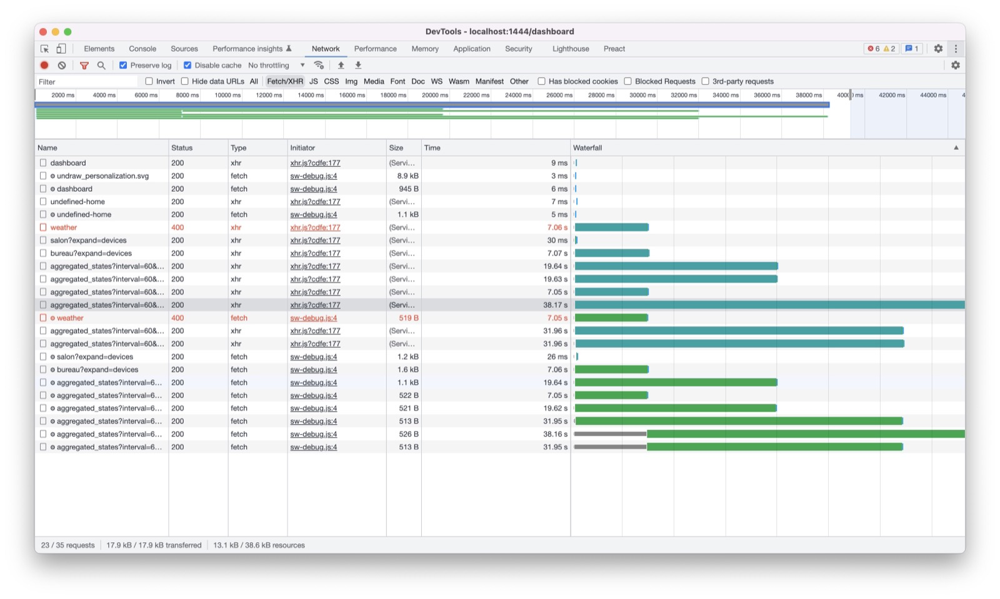
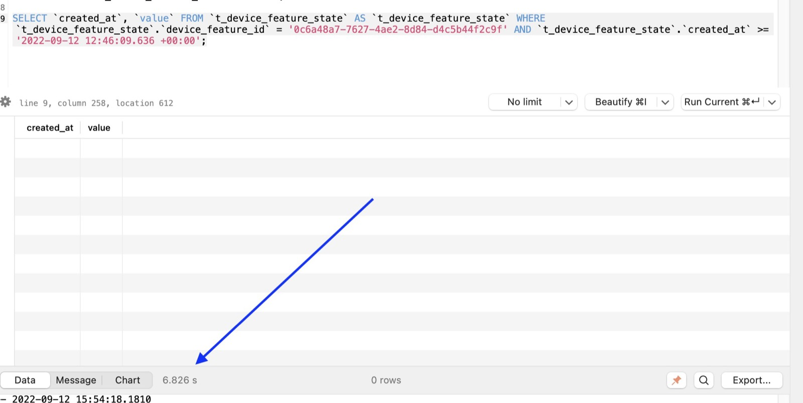
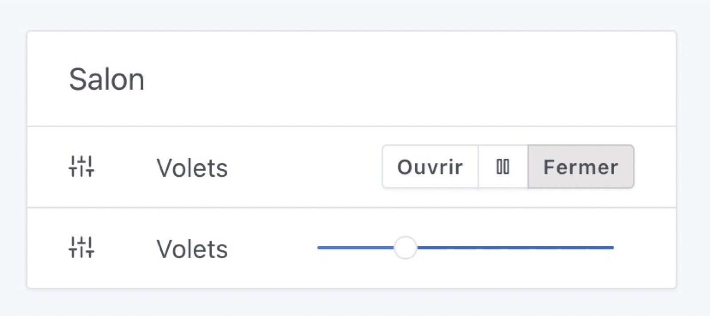

Salut à tous !

J'espère que vous avez tous passé de bonnes vacances d'été 🙂

Cette rentrée a été très productive côté Gladys, et je suis heureux de lancer aujourd'hui Gladys Assistant v4.10, une mise à jour avec beaucoup de nouveautés, autant côté intégrations que côté core.

<!--truncate-->

## Les nouveautés de Gladys Assistant v4.10

### Comptabilité avec les télécommandes IR Broadlink

Une nouvelle intégration est disponible 🎉

Les appareils Broadlink sont des télécommandes infrarouges connectées en Wi-Fi qui vous permettent de contrôler des appareils infrarouges ( télévision, climatisation, chaine Hi-Fi ) à distance.


Dans Gladys v4.10, Gladys est capable de se connecter à ces appareils et vous pouvez donc les intégrer à Gladys !

Si l'intégration vous intéresse, le Broadlink RM4 Mini est disponible pour [21.99€ chez notre partenaire Domadoo](https://www.domadoo.fr/fr/controle-infrarouge/5592-broadlink-telecommande-universelle-irwifi-rm4-mini-pour-smartphone.html?domid=17) par exemple!

### Amélioration drastique des performances du tableau de bord

J'ai eu des retours sur le forum comme quoi le tableau de bord de Gladys pouvait être lent à charger sur les instances avec beaucoup de graphiques/et beaucoup de capteurs.

J'ai demandé à un utilisateur concerné de m'envoyer sa base de données, et je me suis vite rendu compte du problème :



Son tableau de bord mettait 40 secondes à charger : ce n'est pas normal du tout !! 😅

J'ai donc rejoué une par une chaque requête SQL utilisée lors de l'affichage de son tableau de bord, et je suis tombé sur une requête assez simple qui mettait pourtant 6 secondes à être exécutée, et qui ne renvoyait rien :



J'ai utilisé `EXPLAIN QUERY PLAN` sur cette requête pour comprendre ce qui se passait sous le capot de SQlite.

L'explication était assez simple, certes il y avait bien les bons indexes sur les 2 attributs utilisés dans la requête (`device_feature_id` et `created_at`), cependant SQlite n'en utilisait qu'un seul, et ensuite faisait un scan séquentiel du résultat pour filtrer sur le `created_at`.

La solution a été assez simple aussi: j'ai rajouté un index sur le couple (`device_feature_id`, `created_at`), afin que SQLite puisse utiliser cette index pour les 2 attributs.

```sql
CREATE INDEX ix_device_feature_state_device_feature_id_created_at
ON t_device_feature_state (device_feature_id, created_at);
```

Après avoir ajouté cette index, cette requête est passée de 6 secondes... à 5 ms! ⚡

Son tableau de bord est passé de 40 secondes de temps de chargement... à 100 ms! ⚡

Cette amélioration de performance est disponible dans Gladys Assistant v4.10, n'hésitez pas à me tenir informé sur le forum si vous voyez une différence 😉

Attention, la construction de l'index peut prendre un peu de temps lors de la mise à jour ( suivant la taille de votre base de données ), cette mise à jour sera probablement un peu plus longue que les autres !

Si ça vous intéresse, la discussion sur le forum [est disponible ici](https://community.gladysassistant.com/t/probleme-de-performance-sur-dashboard-avec-beaucoup-de-graphiques/7522/6?u=pierre-gilles).

### Sélectionnez de quels appareils vous voulez garder l'historique des états

Il est maintenant possible d'exclure certains appareils de l'historisation des états, afin d'alléger votre base de données Gladys.

Je vous invite à vous connecter à votre instance Gladys, et dans chaque intégration vérifiez que vous n'enregistrez que l'historique de ce dont vous avez besoin:


Je précise qu'à chaque fois que vous changez ce paramètre sur un appareil, Gladys fera tourner un `VACUUM` sur la base de donnée SQLite, ce qui "nettoie" la base de données et purgera des vieilles valeurs !

### Support des calendriers WebCal

WebCal est un standard pour accéder à des calendriers iCal ( Les fameux fichiers `.ics` ).

Beaucoup d'organismes partagent des calendriers publics WebCal pour partager des programmes : calendrier des jours fériées, match de foot, émissions, etc...

Gladys supporte désormais ces calendriers, et peut les synchroniser via l'intégration Caldav.

Concrètement, il vous suffit d'ajouter une URL WebCal à votre calendrier (iCloud, NextCloud, peu importe), et ensuite Gladys vous proposera de le synchroniser dans l'interface de l'intégration CalDav.

Vous pouvez ensuite utiliser ces calendriers dans les scènes pour déclencher une scène [quand un évènement du calendrier arrive](/fr/docs/scenes/calendar-event-is-coming-trigger/) par exemple 😉

### Gestion des volets roulants dans l'intégration MQTT

Il est maintenant possible d'ajouter des volets roulants dans Gladys, pour l'instant via l'intégration MQTT uniquement ! ( L'intégration dans Zigbee2mqtt est en cours ).



Vous pouvez créer dans Gladys un volet roulant qui sera contrôlable avec 3 actions :

```
STOP: 0
OPEN: 1
CLOSE: -1
```

Il est aussi possible de contrôler la position du volet roulant ( si c'est supporté par votre modèle de volets roulants ).

### Zigbee2mqtt: Affichage de la qualité de signal sur le tableau de bord

L'intégration Zigbee2mqtt renvoie un attribut "Force du signal" pour les appareils Zigbee de votre réseau. Cela permet de jauger si votre appareil est bien situé, ou s'il est trop loin.

Gladys récupère désormais cet attribut et vous permet de l'afficher sur le tableau de bord :


### Zigbee2mqtt: Ajout du support des capteurs de VOC (qualité de l'air)

Les VOC, ou "Volatile Organic Compounds" en anglais sont des produits chimiques qui se retrouvent dans l'air de votre maison et qui proviennent de différentes sources : peintures, meubles, produits d'entretiens, etc...

Ces polluants sont parfois observés dans des niveaux 2 à 5 fois supérieurs à l'extérieur de la maison, et ont des effets longs termes néfastes sur la santé.

Il existe des capteurs Zigbee pour mesurer ces fameux "VOC", et Gladys est désormais compatible avec eux.

### Tasmota: Ajout du support des appareils renvoyant des tableaux de valeurs

Certains appareils Tasmota comme le Sonoff Dual R3 n'étaient pas bien gérés par Gladys.

Nous les supportons désormais.

### Plein de corrections de bugs et d'améliorations d'interface

Cette mise à jour apporte son lot de correctifs de bugs, et d'améliorations de l'interface.

Vous pouvez retrouver la liste des corrections complètes dans le [CHANGELOG](https://github.com/GladysAssistant/Gladys/releases/tag/v4.10.0).

## Comment mettre à jour ?

Si vous avez installé Gladys avec l’image Raspberry Pi OS officielle, vos instances se mettront à jour **automatiquement** dans les heures à venir. Cela peut prendre jusqu’à 24h, pas de panique.

Si vous avez installé Gladys avec Docker, vérifiez que vous utilisez bien Watchtower. Voir la [documentation](/fr/docs/installation/docker#mise-à-jour-automatique-avec-watchtower).

Avec Watchtower, Gladys se mettra automatiquement à jour.

## Remerciements aux contributeurs

Encore une fois, merci à tous ceux qui ont contribué à cette release ! On se retrouve sur [le forum](https://community.gladysassistant.com/) si vous voulez parler de cette release :)

## Supporter le projet

Il y a plein de façons de supporter le projet :

- Participer aux discussions sur le forum, aider les nouveaux.
- Contribuer au projet en proposant des nouvelles intégrations/fonctionnalités.
- Améliorer la documentation, qui est open-source.
- Faire un [don ponctuel](https://www.buymeacoffee.com/gladysassistant).
- S'inscrire à [Gladys Plus](/fr/plus).

Merci à tous ceux qui supportent Gladys 🙏
