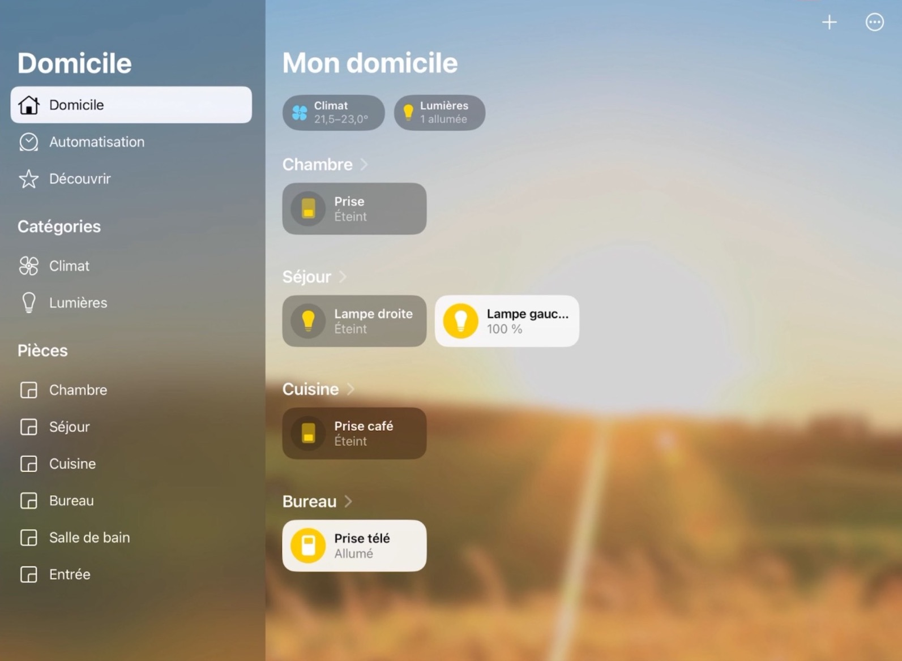
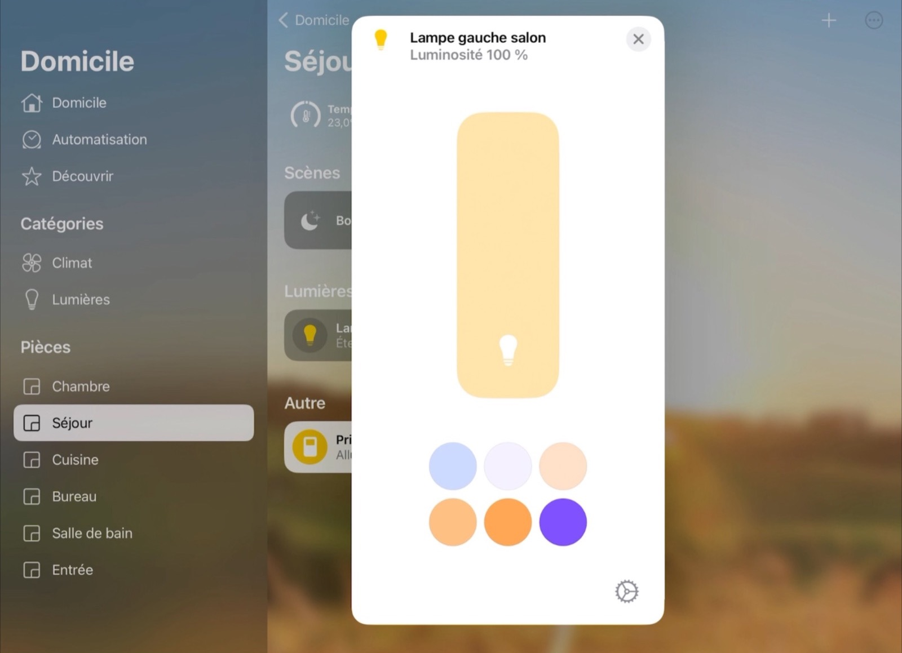
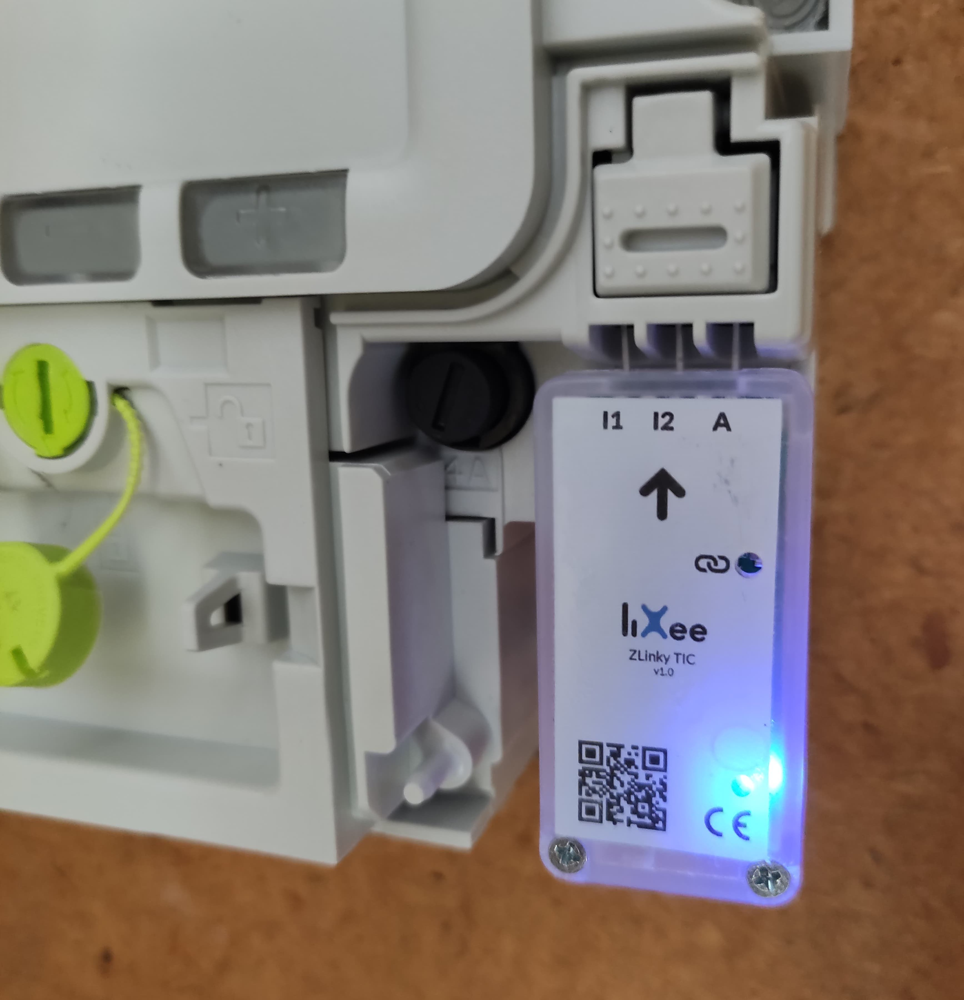
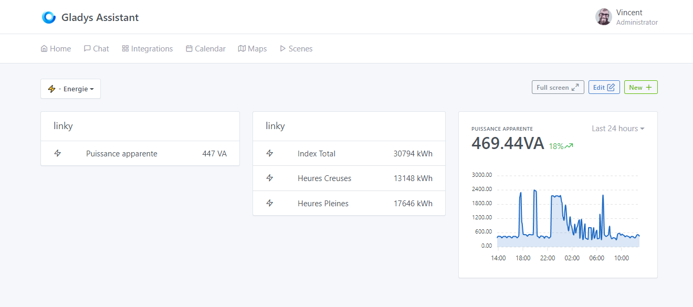
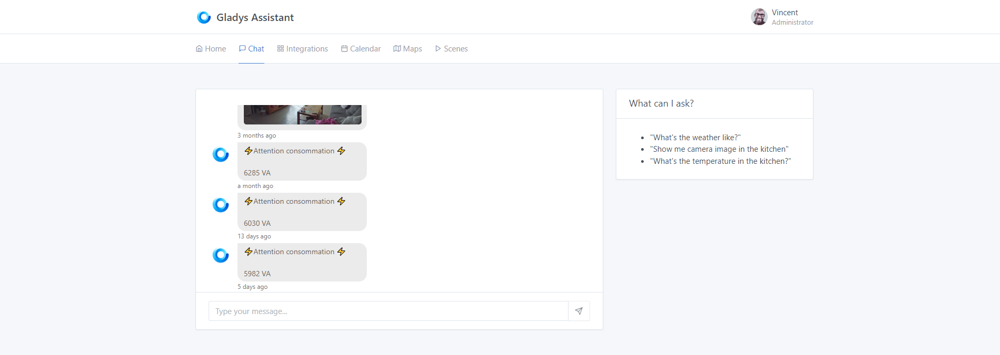
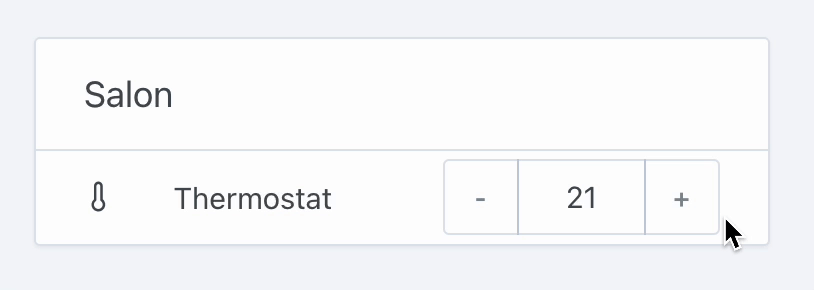

Salut à tous !

Aujourd'hui c'est le lancement de Gladys Assistant 4.12, une version importante qui ajoute son lot de nouveautés 😎

J'ai présenté cette version dans un live YouTube que vous pouvez revoir en replay ici :

    <iframe src="https://www.youtube.com/embed/MT8iGphtm0M" title="YouTube video player" frameborder="0" allow="accelerometer; autoplay; clipboard-write; encrypted-media; gyroscope; picture-in-picture" allowfullscreen></iframe>

<!--truncate-->

## Les nouveautés de Gladys Assistant 4.12

### Intégration HomeKit/Siri

Il est désormais possible de connecter son Gladys à l'écosystème Apple via HomeKit afin de pouvoir contrôler toute sa domotique sur son iPhone, iPad, Watch, Mac !

Par exemple, sur iPad, vous pouvez retrouver dans l'application "Maison" les appareils que vous avez ajoutés dans Gladys :

Vous pouvez les contrôler :

Et aussi créer des scénarios utilisable ensuite dans Siri.

Pour l'instant nous gérons les types appareils :

- Ampoules (On/Off, couleur, température et luminosité)
- Prises (On/Off)
- Capteur de température

Sur demande, nous ajouterons d'autres appareils suivant les besoins de la communauté, n'hésitez pas à passer sur [le forum](https://community.gladysassistant.com/).

### Suivi de la consommation électrique en direct avec le Linxee TIC Zigbee

Le Lixee TIC est un petit dongle qui se branche sur le compteur électrique Linky et qui est capable d'envoyer vos données de consommation en direct à Gladys en Zigbee.

Ce dongle est disponible pour [49€ chez notre partenaire Domadoo](https://www.domadoo.fr/fr/box-domotique/5914-lixee-module-tic-vers-zigbee-30-pour-compteur-linky-3770014375148.html?domid=17).

Une fois branché à Gladys, il devient possible d'afficher dans Gladys la puissante apparente de votre installation en direct:

Dans les scènes, vous pouvez configurer Gladys pour recevoir une alerte si jamais vous consommez trop et que votre compteur risque de disjoncter (si vous lancez le four, la machine à laver, les plaques, le chauffage en même temps !)

### Contrôle du chauffage dans Gladys

Un nouveau type d'appareil est maintenant disponible dans l'intégration MQTT (et bientôt sur les autres intégrations), c'est le thermostat !

Vous pouvez changer la température de consigne depuis votre tableau de bord, ou dans les scènes :

### Améliorations diverses et correction de bugs

- Correction d'un bug où les graphiques étaient mal rafraîchis lorsque l'utilisateur change de tableau de bord.
- Amélioration des traductions française sur la suppression d'un appareil avec beaucoup d'états
- Ajout d'une icône "cpu" pour les appareils de type "température de l'appareil"
- Gladys Plus: Début de la migration vers socket-io v4.0

Le CHANGELOG complet est disponible [ici](https://github.com/GladysAssistant/Gladys/releases/tag/v4.12.0).

## Comment mettre à jour ?

Si vous avez installé Gladys avec l’image Raspberry Pi OS officielle, vos instances se mettront à jour **automatiquement** dans les heures à venir. Cela peut prendre jusqu’à 24h, pas de panique.

Si vous avez installé Gladys avec Docker, vérifiez que vous utilisez bien Watchtower. Voir la [documentation](/fr/docs/installation/docker#mise-à-jour-automatique-avec-watchtower).

Avec Watchtower, Gladys se mettra automatiquement à jour.

## Remerciements aux contributeurs

Encore une fois, merci à tous ceux qui ont contribué à cette release ! On se retrouve sur [le forum](https://community.gladysassistant.com/) si vous voulez parler de cette release :)

## Supporter le projet

Il y a plein de façons de supporter le projet :

- Participer aux discussions sur le forum, aider les nouveaux.
- Contribuer au projet en proposant des nouvelles intégrations/fonctionnalités.
- Améliorer la documentation, qui est open-source.
- Faire un [don ponctuel](https://www.buymeacoffee.com/gladysassistant).
- S'inscrire à [Gladys Plus](/fr/plus).

Merci à tous ceux qui supportent Gladys 🙏
