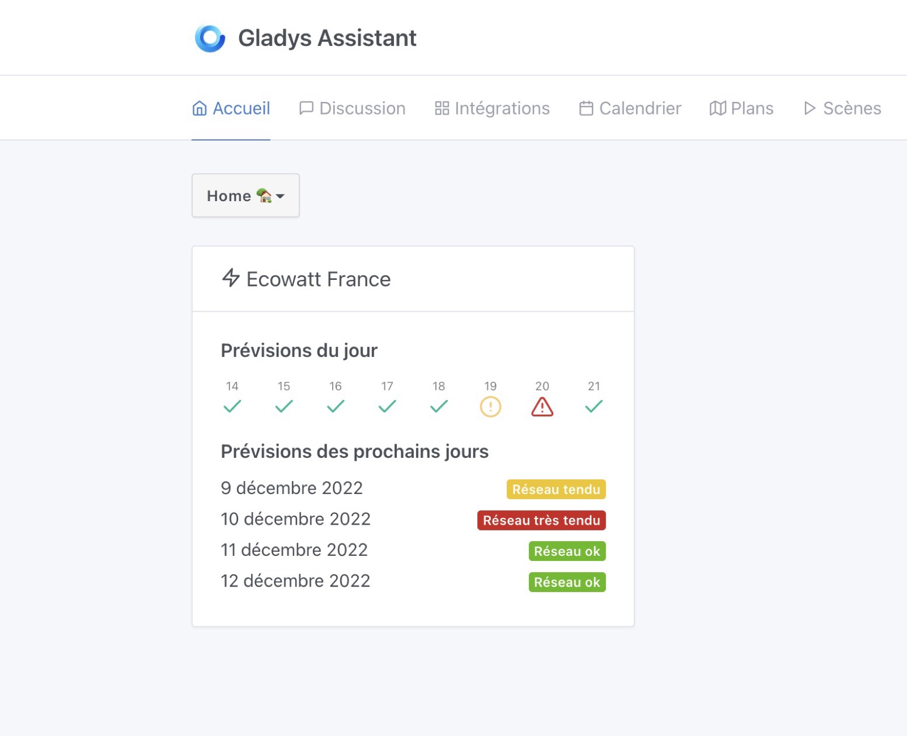
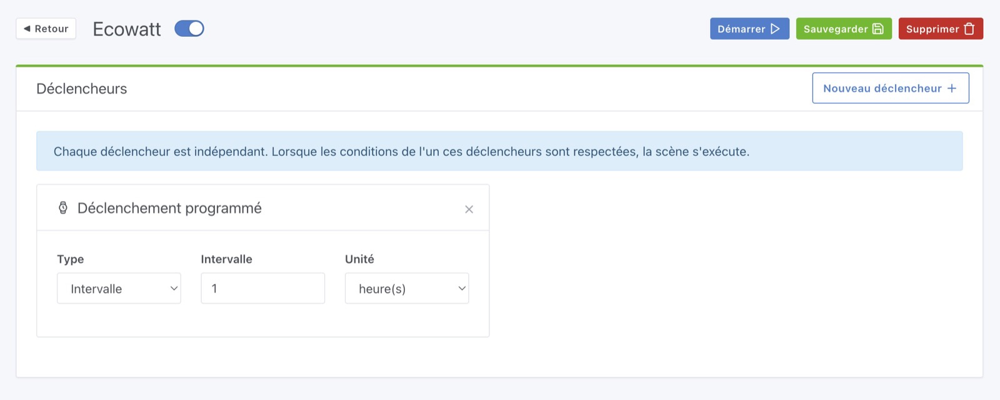
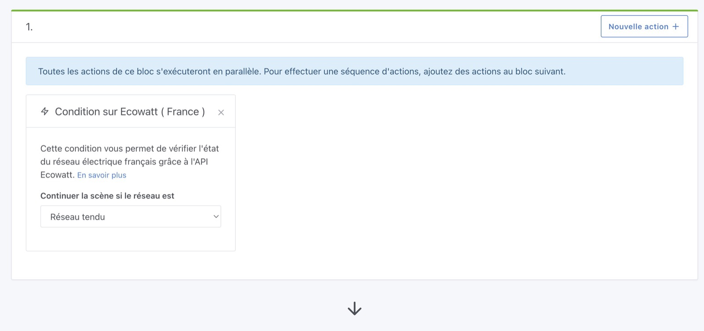
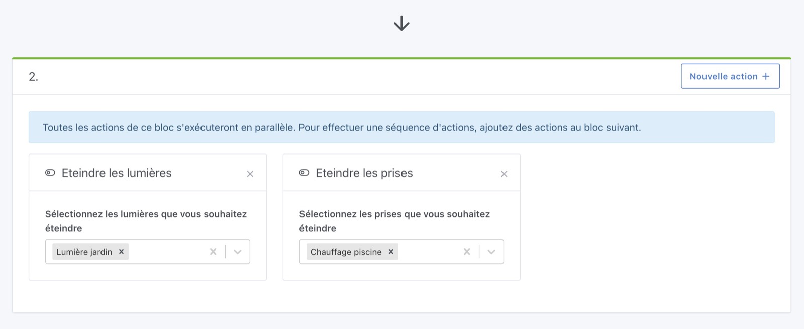
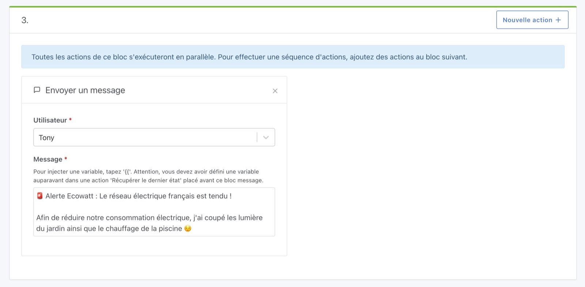
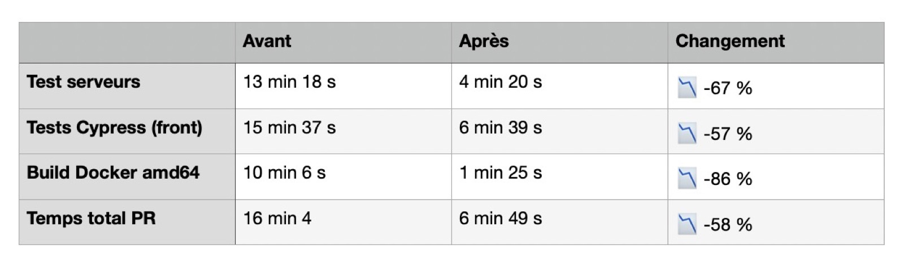

Salut à tous !

Dès ce lundi, RTE prévient qu'une première alerte Ecowatt orange pourrait être lancée.

Et si nos maisons pouvaient automatiquement réagir quand le réseau électrique est en tension, et réduire automatiquement leur consommation ?

Ce n'est pas de la science-fiction, c'est possible depuis Gladys Assistant 4.13 !

<!--truncate-->

## Les nouveautés de Gladys Assistant 4.13

### Intégration Ecowatt

Ecowatt est un [site](https://www.monecowatt.fr/) ainsi qu'une API proposée par RTE qui permet de suivre les prévisions de consommation électrique sur le réseau français.

En cas de pic de consommation, Ecowatt propose 2 niveaux d'alertes :

- Orange: Le réseau est "tendu": Les écogestes sont les bienvenus pour réduire la consommation globale.
- Rouge: Réseau électrique très tendu. Coupures inévitables si la consommation n'est pas réduite.

Dans Gladys, nous sommes désormais intégré avec l'API de RTE afin de pouvoir visualiser les prévisions, et y réagir automatiquement.

Sur le tableau de bord, il est maintenant possible de suivre ces prévisions Ecowatt :

Dans les scènes, vous pouvez maintenant créer une scène qui tourne toutes les heures :

Cette scène continuera uniquement si le réseau est "tendu" :

Et si oui, coupera le chauffage de la piscine, et les lumières du jardin :

Puis vous enverra un message Telegram pour vous prévenir :

Pour en savoir plus: [Les recommandations d'Ecowatt](https://www.monecowatt.fr/ecogestes).

Pour l'anecdote, j'ai développé cette intégration **en urgence** afin de permettre aux utilisateurs Gladys de répondre à cette situation inédite ! On en parle [sur le forum ici](https://community.gladysassistant.com/t/integration-ecowatt-des-scenarios-intelligents-dans-gladys-en-cas-de-tension-sur-le-reseau-electrique/7720).

### Passage à Node.js 18 LTS

C'est officiel, Gladys tourne désormais en Node.js 18 LTS, un changement majeur pour nous qui tournions en Node 14 ^^

Depuis cette mise à jour, les tests sur notre intégration continue s'exécutent bien plus rapidement: de 16 min à 6 min pour un build de PR !

Cette mise à jour rend l'installation de Gladys beaucoup plus simple pour les nouveaux développeurs, car nous avons retiré de Gladys des dépendances qui étaient compliquée à installer.

Développeurs, c'est le moment de nous rejoindre !

Pour en savoir plus sur ces améliorations de performances, j'ai écris un [article complet sur le forum](https://community.gladysassistant.com/t/passage-a-node-js-lts-16-18-fin-de-open-zwave/7708).

### Clap de fin pour l'intégration Open-Zwave

L'intégration Open-Zwave est désormais officiellement retirée de Gladys ([Les raisons](https://community.gladysassistant.com/t/qui-utilise-encore-lintegration-open-zwave/7705)).

Nous travaillons sur une nouvelle intégration basée sur Zwave-js-ui, mais en attendant il faut s'armer de patience et utiliser Node-RED + Zwave-js-ui.

## Comment mettre à jour ?

Si vous avez installé Gladys avec l’image Raspberry Pi OS officielle, vos instances se mettront à jour **automatiquement** dans les heures à venir. Cela peut prendre jusqu’à 24h, pas de panique.

Si vous avez installé Gladys avec Docker, vérifiez que vous utilisez bien Watchtower. Voir la [documentation](/fr/docs/installation/docker#mise-à-jour-automatique-avec-watchtower).

Avec Watchtower, Gladys se mettra automatiquement à jour.

## Remerciements aux contributeurs

Encore une fois, merci à tous ceux qui ont contribué à cette release ! On se retrouve sur [le forum](https://community.gladysassistant.com/) si vous voulez parler de cette release :)

## Supporter le projet

Il y a plein de façons de supporter le projet :

- Participer aux discussions sur le forum, aider les nouveaux.
- Contribuer au projet en proposant des nouvelles intégrations/fonctionnalités.
- Améliorer la documentation, qui est open-source.
- S'inscrire à [Gladys Plus](/fr/plus).

Merci à tous ceux qui supportent Gladys 🙏
