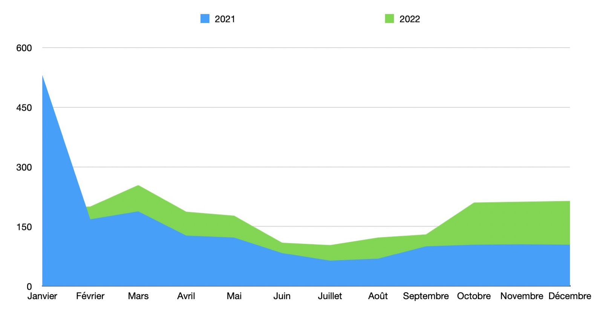
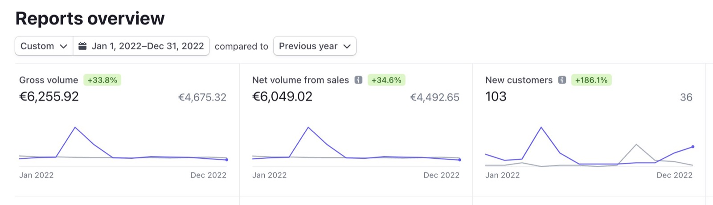
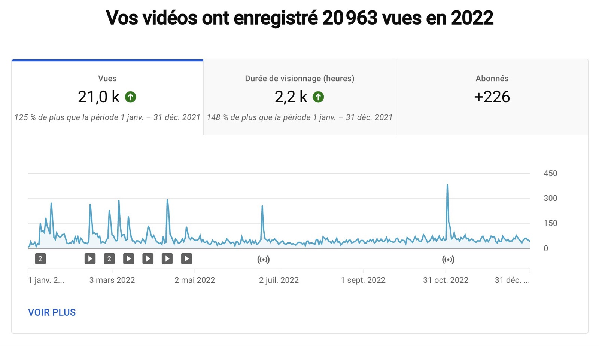

Salut à tous, et bonne année !

Quelle année, 2022 🤩

J'aimerais revenir dans cet article sur tout ce qui a marqué 2022, et vous présenter mes projets pour 2023.

Si vous préférez ce bilan en vidéo, j'ai fais un live YouTube qui est disponible en replay ici :

    <iframe  src="https://www.youtube.com/embed/l2E1wNF-Mtw" title="YouTube video player" frameborder="0" allow="accelerometer; autoplay; clipboard-write; encrypted-media; gyroscope; picture-in-picture; web-share" allowfullscreen></iframe>

Les bilans des années précédentes:

[2021](/fr/blog/2021-year-in-review), [2020](/fr/blog/bilan-2020-gladys-assistant)

<!--truncate-->

## Que s'est-il passé en 2022 ?

2022 a été une année très positive pour Gladys Assistant !

Déjà côté développement, nous avons été encore plus productif que l'année dernière avec 28 versions de Gladys sorties en 1 an, soit une version toutes les 2 semaines en moyenne.

C'est un rythme déjà assez soutenu que nous n'essayerons pas de battre, car faire trop de versions peu devenir un peu lourd pour les utilisateurs, et mettrait en péril la stabilité de Gladys car il faut du temps pour tester proprement chaque version.

Je pense que garder un objectif de 2 versions par mois pour 2023 est une bonne idée.

On peut se rappeler de fonctionnalités marquantes en 2023 :

- [Déclencheur et condition sur les évènements du calendrier dans les scènes](/fr/blog/gladys-assistant-4-8-with-calendar-in-scenes/)
- [Compatibilité avec Amazon Alexa](/fr/blog/gladys-assistant-4-9-with-alexa-integration/)
- [Support des télécommandes IR Broadlink](/fr/blog/gladys-assistant-4-10-broadlink-and-performances/)
- [Gladys devient compatible HomeKit !](/fr/blog/gladys-assistant-4-12-homekit/)
- [Intégration Ecowatt & Node.js 18](/fr/blog/gladys-assistant-4-13-ecowatt/)

Un grand MERCI à tous les développeurs qui ont contribué à ces versions, au total nous avons intégré plus de 200 PRs en 2022, c'est un très gros chiffre qui témoigne de la productivité du projet 🎉

Merci à Alexandre Trovato, Vincent Kulak, Bertrand D'Aure, Cyril Beslay, Corentin Allemand, NickDub, Terdious, Romuald Pochet and Nicolas Geissel! 🙏

### L'usage

En 2022, si on compare le nombre d'installations mois par mois avec les mois de 2021, on se rend compte qu'à part janvier, tous les mois de 2022 on fait mieux que 2021 !

Janvier est le seul mois supérieur en 2021 car c'était le 2ème mois du lancement de Gladys Assistant 4, et il y avait eu une couverture presse assez importante à l'époque.

En terme de revenu, Gladys Plus a fait 6 255€ de chiffre d'affaire en 2022, soit une augmentation de +33,8%.

Le chiffre en absolu est relativement faible ( pour une entreprise ), mais la tendance est très positive et me montre que le projet va dans le bon sens. J'en parlerais plus tard dans cet article !

### La chaine YouTube

C'est simple, en 2022 la [chaîne YouTube](https://www.youtube.com/@GladysAssistant) a doublé par rapport à 2021.

On est passé de 9k vues en 2021 pour 20k vues en 2022, 800 heures de visionnages en 2021 pour 2 200 heures en 2022.

Record ! 🚀🚀

J'ai pourtant sorti 8 vidéos et 3 lives, contre 5 vidéos et 5 lives en 2021, soit seulement +10% de plus.

Pour moi, YouTube est toujours un excellent moyen de communiquer sur ce qu'on fait sur Gladys, et de faire des tutoriels plus concrets que les tutoriels écrits.

C'est aussi un moyen d'être visible sur YouTube, et d'être mis en avant par l'algorithme en recommandations d'autres vidéos.

Quelques vidéos qui ont bien marché en 2022 :

- [Gérez vos appareils Zigbee dans votre domotique avec Zigbee2mqtt et Gladys Assistant](https://youtu.be/ALW3uDB9P0s)
- [Installer un Raspberry Pi sur un disque externe SSD sans ligne de commandes (pour débutant)](https://youtu.be/Zn7imzI0oYU)
- [Live : Lancement de Gladys Assistant 4.9 avec le support d'Amazon Alexa](https://youtu.be/Da_AQSQedFg)
- [Louis et sa boîte aux lettres connectée - Gladys Assistant chez vous #1](https://youtu.be/XXanY-SP_5w)

### Les réseaux sociaux

Sur les réseaux sociaux:

- [@gladysassistant sur Twitter](https://twitter.com/gladysassistant) rassemble 2 775 followers
- [Gladys Assistant Facebook](https://www.facebook.com/gladysassistant) comptabilise 763 likes
- [@gladysassistant sur instagram](https://www.instagram.com/gladysassistant) rassemble 575 abonnés

Et enfin 2 266 followers sur [mon Twitter personnel](https://twitter.com/pierregillesl) !

### La newsletter

Au niveau de la newsletter, vous êtes 3 388 à suivre la [newsletter Gladys Assistant](https://email-list.gladysassistant.com/subscription/1mXJoEWEl).

- 2874 abonnés en français
- 514 abonnés en anglais

C'est en décroissance, mais comme je disais déjà l'année dernière j'ai activé la détection de "bounce" sur la newsletter, et à mon avis la newsletter a continué de purger d'anciens emails qui n'étaient plus actifs.

En revanche, j'espère avoir de la croissance en 2023 sur cette partie car j'essaie toujours d'envoyer du contenu de qualité, sans être trop fréquent pour ne pas spammer mes lecteurs.

### Le GitHub Gladys Assistant

Nous sommes à 2 233 stars ⭐ sur le [repo Gladys Assistant](https://github.com/GladysAssistant/Gladys)

C'est +19% par rapport à l'année dernière !

Toujours une croissance à deux chiffres sur le Github 😍

Je compte sur vous pour nous soutenir sur GitHub en mettant une étoile ⭐ au projet.

## Projets et objectifs pour 2023

Bon, le plus important: que nous réserve 2023 sur Gladys ?

### Optimisme

Comme je vous disais, la croissance de l'usage, ainsi que du chiffre d'affaires Gladys Plus, tout ça me rend beaucoup plus confiant pour la suite.

Contrairement à la fin 2021 où mon avis était mitigé, je suis convaincu que Gladys est un projet au potentiel infini si on continue dans cette trajectoire.

De mon côté, j'ai envie d'aller plus loin en 2023, et pour cela j'ai créé une nouvelle structure juridique : **Gladys Assistant SAS**.

Jusque-là, j'encaissais le revenu Gladys Plus sur ma micro-entreprise personnel, à côté de mon revenu freelance. Le souci de cette micro, c'est que ce statut ne me poussait pas à ré-investir le revenu Gladys Plus dans la croissance, car une micro ne permet pas de déduire ses charges: le revenu d'une micro est considéré comme du revenu personnel, ce n'est pas une entreprise séparée de l'individu.

Ce changement de statut va donc me permettre de re-investir le revenu de Gladys Plus dans des projets divers : jeux concours ? Proposer des bundles matériel + Gladys Plus ? Financement de matériel domotique ? Marketing ? Payer un presta ? Tout devient possible !

Cela peut paraître être un changement tout bête, mais pour moi c'est un changement complet de paradigme qui aura un énorme impact sur le projet en 2023.

Si vous voulez contribuer à cette croissance en 2023, rejoignez-nous sur [Gladys Plus](/fr/plus) !

### Côté produit

Côté produit, j'ai plein d'idées pour 2023, mais l'idée principale est toute simple: satisfaire les utilisateurs Gladys.

Vous êtes beaucoup à faire des [demandes de fonctionnalités sur le forum](https://community.gladysassistant.com/c/feature-requests/43/l/latest?order=votes), et l'objectif reste d'abattre ces demandes une par une de la plus votée à la moins votée.

Quelques avancées que j'aimerais voir en 2023 sur Gladys :

- Duplication de scènes + box "heure" sur le dashboard
- Intégration Enedis-Linky
- Nouvelles intégrations (Zwave-js-ui, Withings, Yeelight)
- Amélioration UX très demandée : Re-ordonner les scènes, le tableau de bord, etc...
- Plus de contenu : Tutoriel mini-PC ? Meilleure documentation développeur ? Plus de vidéos Youtube !
- Support de Matter ?

## Merci à tous !

Merci à tous ceux qui supportent Gladys, que ce soit en développant des nouvelles fonctionnalités, en contribuant via [Gladys Plus](/fr/plus/), via des [dons ponctuels](https://www.buymeacoffee.com/gladysassistant), ou en aidant sur le [forum](https://community.gladysassistant.com/).

Encore bonne année à tous !

Pierre-Gilles Leymarie
