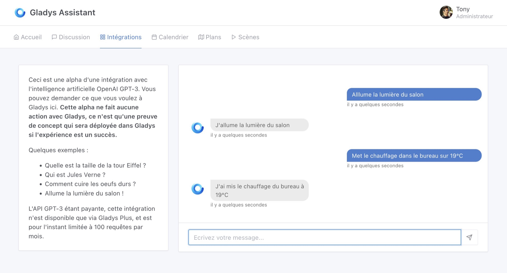
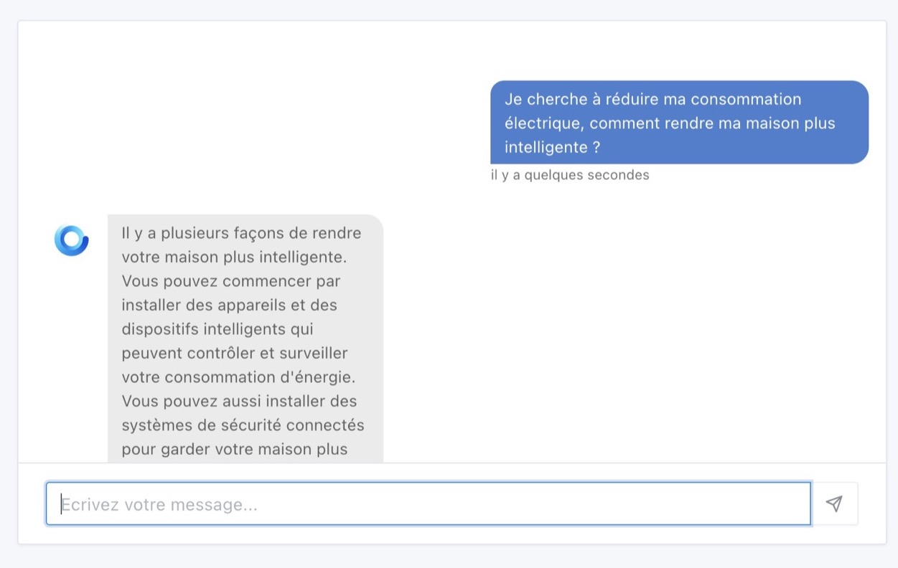
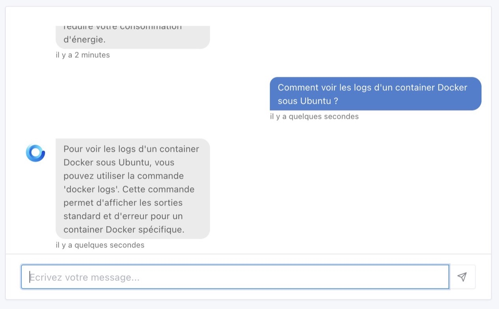
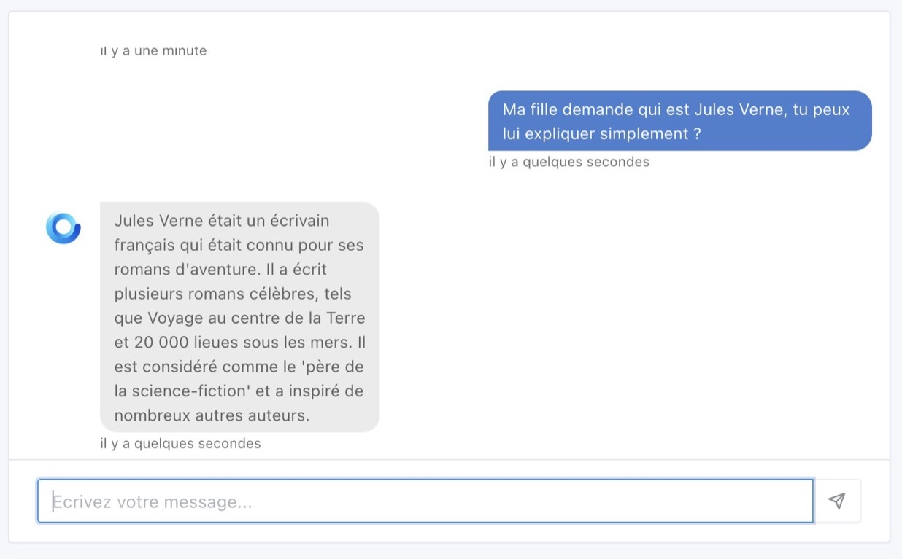
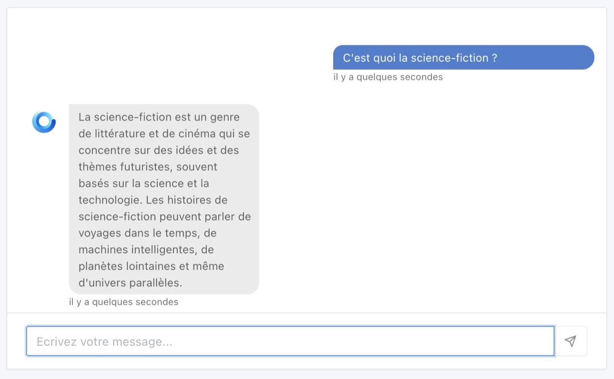
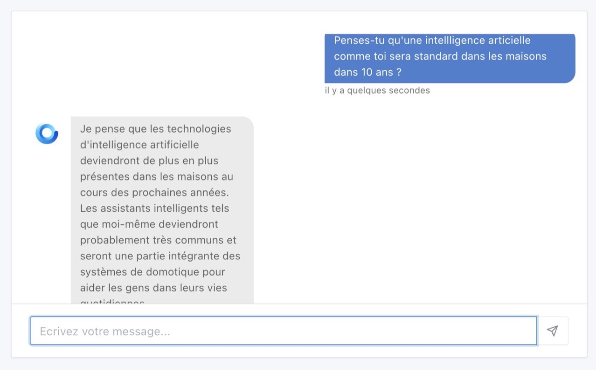
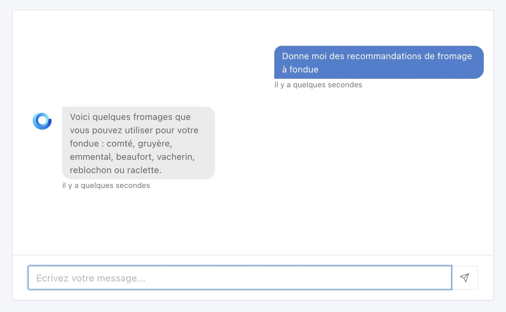
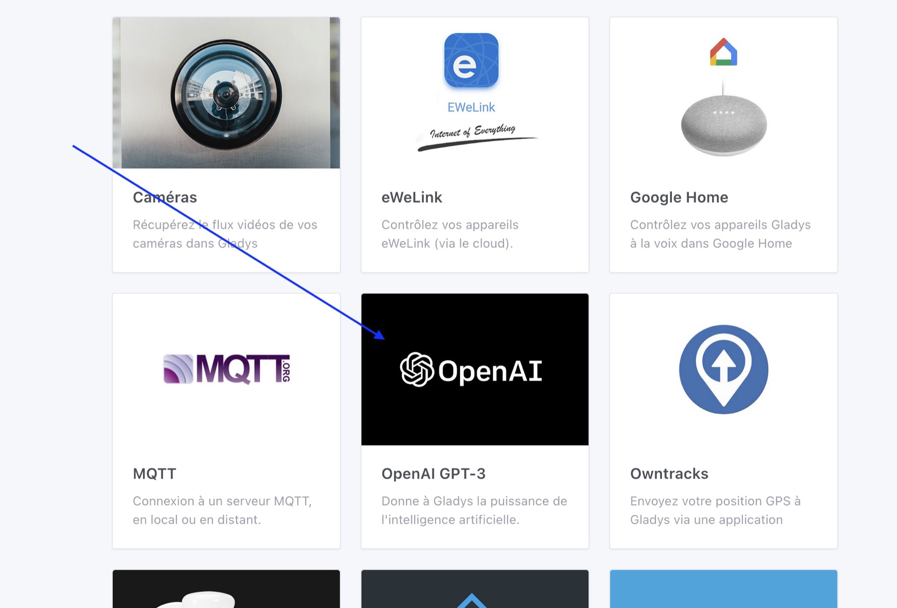

Salut à tous !

A part si vous vivez dans une grotte, vous avez probablement entendu parler de ChatGPT/GPT-3, une intelligence artificielle développée par OpenAI.

Sur internet, tout le monde a tenté de discuter avec cette IA, que ce soit pour voir si elle allait nous remplacer au travail, faire mieux que nous a des examens d'universités, ou juste pour voir sa réaction quand on lui pose des questions alambiquées.

De mon côté, je pense que cette IA est un outil formidable, une sorte de moteur de recherche sur-puissant, accessible au language, qui a accès à un dataset impressionnant !

## Quel rapport avec Gladys ?

Dans Gladys, nous avons toujours eu un onglet "Discussion", qui permet d'envoyer des demandes à Gladys: "Allume la lumière du salon", "Montre moi la caméra du jardin", "Quelle est la température dans la salle de bain ?".

Sur le principe, cet onglet fonctionne de la même manière que GPT-3 : nous avons entrainé un réseau de neurone sur un ensemble de données, pour lui "apprendre" à répondre à des commandes utilisateurs.

La différence entre l'implémentation actuelle dans Gladys, et GPT-3, c'est la taille des données d'entrées.

Là où Gladys a été entrainée sur quelques commandes, GPT-3 a été entrainé sur 175 milliards de paramètres, notamment :

- Des petabytes de pages web crawlées pendant 8 ans
- Tout le contenu de Reddit ayant plus de 3 upvotes
- Plein de livres
- Tout Wikipédia

Pour entraîner ce modèle, OpenAI a utilisé un cluster de 10 000 cartes graphiques Nvidia V100. Monstrueux !

Une fois entrainé, ce modèle est tellement gros qu'il faut un serveur avec au moins 175 Go de mémoire vive pour le faire tourner 🤯

Bref, vous l'avez compris, GPT-3 est à un niveau impressionant difficilement atteignable à notre petite échelle.

## Intégration OpenAI GPT-3 dans Gladys

Ce modèle, OpenAI ne l'a pas créé pour eux, il est disponible via une API ( payante, car les 10 000 Nvidia V100 il faut les payer ^^).

C'est cette API que j'ai intégrée dans Gladys !

J'ai fais des tests pour voir si GPT-3 pouvait avoir un intérêt dans le cadre de la domotique, et franchement c'est bluffant.

J'ai travaillé le "prompt" que j'envoie à GPT-3 pour délimiter le cadre des intéractions possibles, et ça marche super bien !

GPT-3 arrive à classifier chaque demande, et peut répondre à plein de questions car je le rappelle GPT-3 a accès à du contenu venant de partout sur internet.

Mais assez parlé...

## Démonstration

Les basiques, demandons à Gladys de contrôler des appareils de la maison :

Tiens, j'ai une question de domotique, qu'en penses Gladys ?

Je ne me souviens plus comment on affiche les logs d'un container Docker...

Un peu de culture générale, qui est Jules Verne ?

Science-fiction, késako ?

C'est quand même dingue, est-ce qu'on serait pas en avance avec Gladys ?

Mais c'est pas dangereux tout ça ? J'ai vu i-Robot, et les humains se faisaient enfermer chez eux !

Ouf, on est passé pas loin d'une catastrophe là !!

Ah attend, Gladys je dois faire à manger, tu te souviens comment on fait les oeufs durs ?

Bon, les oeufs c'est sympa mais il fait froid là, c'est une fondue qu'on veut !!

Bref, vous l'aurez compris, c'est archi-puissant GPT-3 😁

## Comment tester ?

L'API GPT-3 étant payante, je propose cette intégration à tous les utilisateurs [Gladys Plus](/fr/plus).

Si vous voulez tester, il faut passer à Gladys Plus, et en bonus vous soutiendrez la croissance d'un projet français 🇫🇷

A l'occasion de ce lancement, j'ai lancé le code promo **SMART2023** qui donne -40% de réduction sur votre premier paiement Gladys Plus, pour 59,99€ l'année ( soit 4,99€/ mois ).

Pas d'excuses !

➡️ ➡️ [En savoir plus sur Gladys Plus](/fr/plus) ⬅️ ⬅️

Vous devez être en Gladys Assistant v4.15 pour profiter de cette intégration, et vous retrouverez l'intégration dans l'onglet "Intégrations" :

## La suite

Pour l'instant, cette intégration est une alpha, le but est de recueillir vos retours et vous permettre de tester.

Cette intégration n'a pour l'instant aucun impact sur votre système domotique, si vous lui demandez d'allumer la lumière, elle vous répondra mais ne fera pas l'action.

Suivant vos retours, on pourra intégrer GTP-3 entièrement avec Gladys.

Alors, vous en pensez quoi ?

J'attends vos retour sur [le forum](https://community.gladysassistant.com/) !

## Comment mettre à jour ?

Si vous avez installé Gladys avec l’image Raspberry Pi OS officielle, vos instances se mettront à jour **automatiquement** dans les heures à venir. Cela peut prendre jusqu’à 24h, pas de panique.

Si vous avez installé Gladys avec Docker, vérifiez que vous utilisez bien Watchtower. Voir la [documentation](/fr/docs/installation/docker#mise-à-jour-automatique-avec-watchtower).

Avec Watchtower, Gladys se mettra automatiquement à jour.
