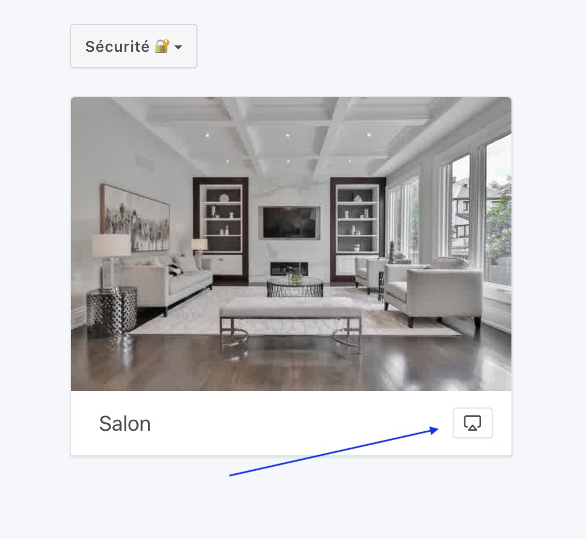
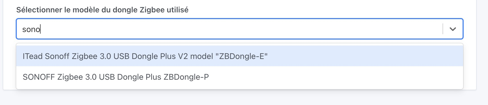
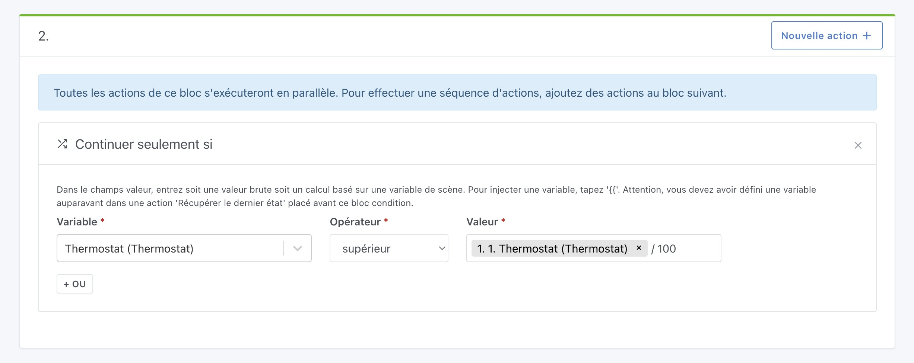
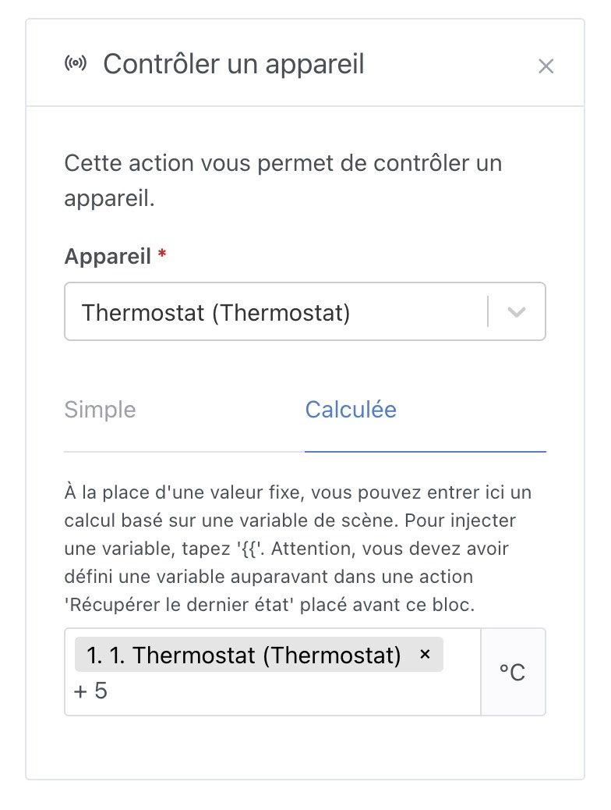

Salut à tous !

Je suis heureux de vous présenter aujourd'hui Gladys Assistant 4.23.

J'ai fais une vidéo pour présenter cette version en détail en expliquant comment chaque nouveauté fonctionne :

    <iframe src="https://www.youtube.com/embed/cbu1IbvKAKM" title="YouTube video player" frameborder="0" allow="accelerometer; autoplay; clipboard-write; encrypted-media; gyroscope; picture-in-picture" allowfullscreen></iframe>

<!--truncate-->

## Live streaming de caméra

La fonctionnalité majeure de cette version, c'est la possibilité de regarder ses caméras en live sur le tableau de bord, que ce soit en local, ou à distance via Gladys Plus.

Le flux vidéo est chiffré de bout en bout avant de garantir votre vie privée, comme toujours 😉

**Note:** Cette fonctionnalité demande pas mal de ressources (lire un flux vidéo, le compresser, le chiffrer, en live, ça demande des ressources !), si le live ne démarre pas ou met vraiment trop de temps à démarrer, c'est peut-être que votre machine n'est pas assez puissante pour ça. Les Raspberry Pi 32 bits ne sont pas assez puissants pour cela par exemple.

## Sélection du modèle du dongle Zigbee

Dans l'intégration Zigbee, il est désormais possible de sélectionner quel modèle de dongle Zigbee vous utilisez, ce qui mettra à jour le fichier de configuration Zigbee2mqtt automatiquement !

Merci à AlexTrovato pour le développement 👏

## Calculs dans les scènes

Dans les scènes, il est désormais possible de faire des calculs mathématiques à 2 endroits :

Dans la condition "continuer seulement si", il est possible de comparer plusieurs variables entre elle, tout en faisant un calcul mathématique :

Dans l'action "contrôler un appareil", il est possible d'utiliser une variable ainsi qu'un calcul mathématique pour déduire la valeur qui sera envoyée à l'appareil.

Très pratique pour faire des scènes dynamiques qui s'adapte à l'exécution de la scène !

Merci @bertrandda pour le développement 👏

## Intégrations NextCloud Talk

Nouvelle intégration ! Cette intégration permet d'utiliser NextCloud Talk pour discuter avec Gladys, de la même manière que fonctionne l'intégration Telegram.

Merci @bertrandda pour le développement 👏

## Divers améliorations et correctifs

- Amélioration du process de création de compte: plus responsive, plus simple, avec moins d'informations à remplir.
- L'intégration Homekit supporte désormais les capteurs d'ouverture de portes/fenêtres
- Le tableau de bord affiche les noms des capteurs de manière plus claire ([#1749](https://github.com/GladysAssistant/Gladys/pull/1749))
- Correction d'un bug sur l'action "Requête HTTP" qui ne permettait pas d'avoir un body de requête POST vide ([#1772](https://github.com/GladysAssistant/Gladys/pull/1772))

## Comment mettre à jour ?

Si vous avez installé Gladys avec l’image Raspberry Pi OS officielle, vos instances se mettront à jour **automatiquement** dans les heures à venir. Cela peut prendre jusqu’à 24h, pas de panique.

Si vous avez installé Gladys avec Docker, vérifiez que vous utilisez bien Watchtower. Voir la [documentation](/fr/docs/installation/docker#mise-à-jour-automatique-avec-watchtower).

Avec Watchtower, Gladys se mettra automatiquement à jour.

## Remerciements aux contributeurs

Encore une fois, merci à tous ceux qui ont contribué à cette release ! On se retrouve sur [le forum](https://community.gladysassistant.com/) si vous voulez parler de cette release :)

## Supporter le projet

Il y a plein de façons de supporter le projet :

- Participer aux discussions sur le forum, aider les nouveaux.
- Contribuer au projet en proposant des nouvelles intégrations/fonctionnalités.
- Améliorer la documentation, qui est open-source.
- S'inscrire à [Gladys Plus](/fr/plus).

Merci à tous ceux qui supportent Gladys 🙏
