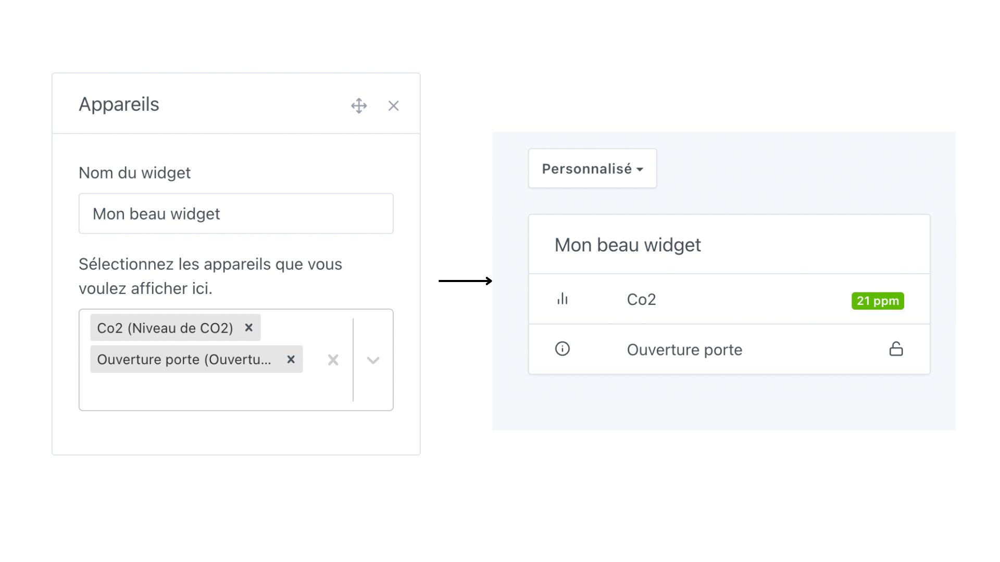
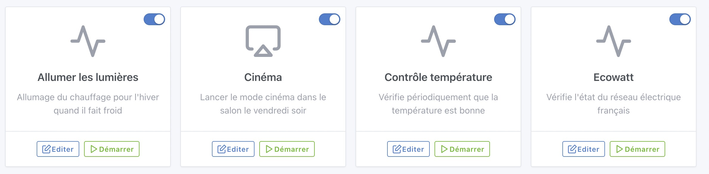
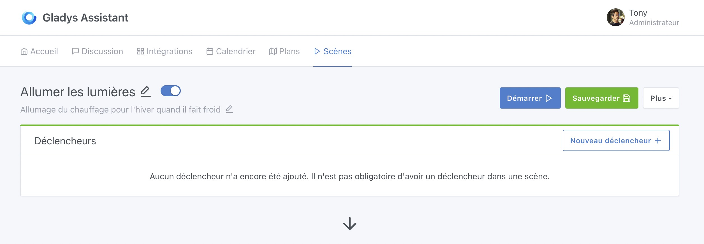
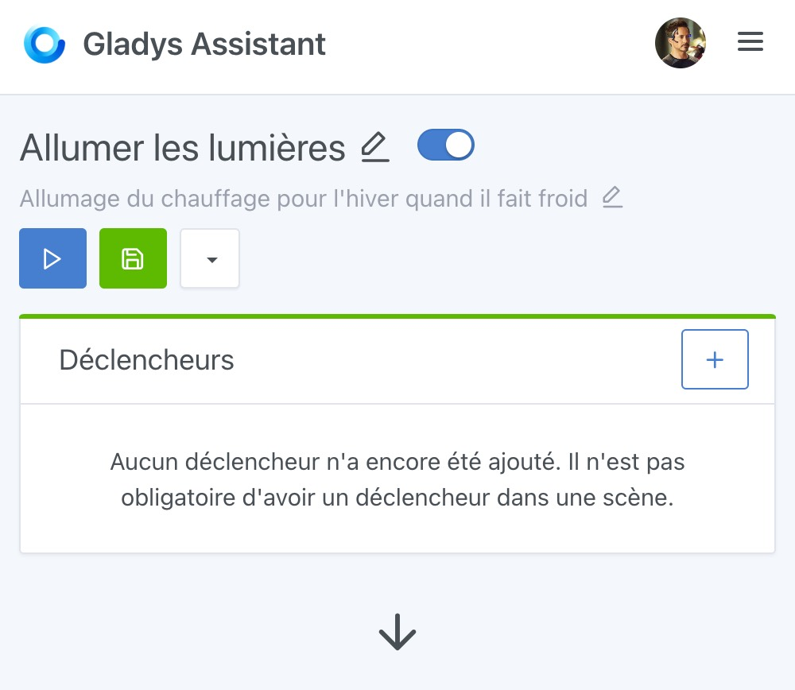
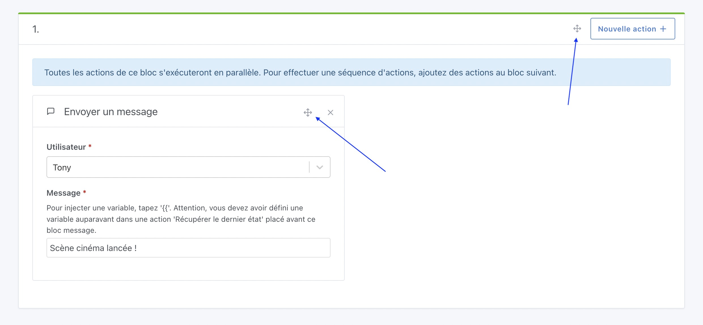
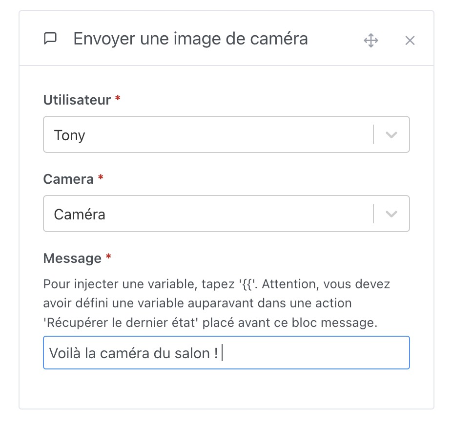
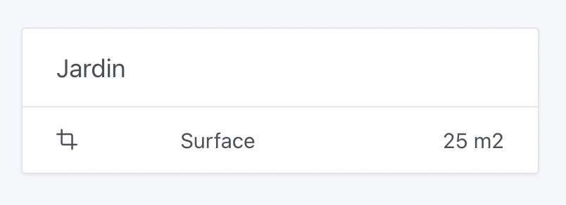
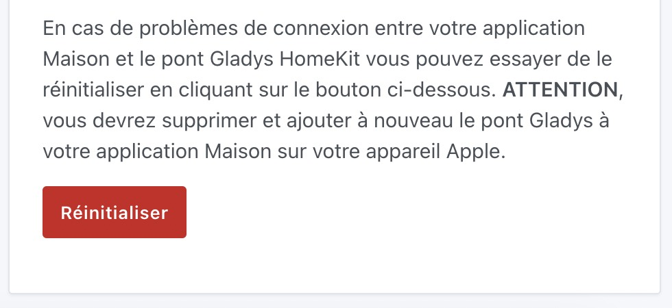

Salut à tous !

Nouvelle version de Gladys aujourd'hui avec des changements vraiment sympa qui améliorent l'utilisation de Gladys au quotidien

Juste avant de commencer : si vous cherchez du matériel pour faire tourner Gladys, un mini-PC Beelink est un excellent moyen de démarrer en domotique avec du matériel fiable et performant.

Certains dans la communauté en ont même commandés plusieurs, c'est pour dire 😂

La communauté est assez unanime pour dire qu'aujourd'hui, les mini-PC sont une alternative plus que sérieuses aux Raspberry Pi, difficilement trouvable, et au final à un prix similaire quand on prend toute en compte ( Carte + SSD + alimentation + boîtier ).

👉 Retrouvez nos recommandations actuelles dans le [guide du matériel recommandé](/fr/docs/installation/recommended-hardware/).

## Nouveau widget "Appareils"

{/* truncate */}

C'était un point de frustration pour beaucoup, jusque-là il n'était pas possible de créer un widget "Appareils" mixant des appareils venant de différentes pièces.

C'est désormais corrigé avec ce nouveau widget développé par Lokkye, qui est entièrement personnalisable : vous pouvez y glisser n'importe quel appareil, et mettre le titre que vous voulez :

## Amélioration de l'UX des scènes

L'expérience générale de création et d'édition de scènes a été grandement améliorée dans cette version.

Déjà, une scène a désormais une description éditable ce qui vous permet de mieux discerner vos scènes :

Cette description peut être éditée super simplement d'un clic sur la description dans la scène :

Vous remarquerez que le cartouche en haut de l'écran d'édition des scènes a été amélioré pour être plus fonctionnel et plus lisible. Les fonctionnalités secondaires (Duplication et suppression) ont été reléguées à un bouton "Plus" pour ne pas surcharger l'écran de bouton en permanence.

Sur mobile, le responsive a été amélioré pour que l'écran reste lisible et clair même sur petit écran :

Enfin, la fonctionnalité la plus demandée est enfin possible dans Gladys : déplacer des actions/bloc d'actions dans les scènes.

Grâce à cette croix sélectionnable, il devient possible d'attraper des actions et en drag & drop les déplacer à un autre point de la scène.

## Envoyer une image de caméra dans les scènes

Super PR de Lokkye qui permet désormais d'envoyer une image de caméra par message dans les scènes.

L'idée de cette fonctionnalité est de pouvoir faire des scènes "Si un mouvement est détecté ALORS envoie moi une image de la caméra extérieur par message" :

## Google Home : Correction d'un bug de gestion de la luminosité

J'ai eu le retour d'un utilisateur Suédois de Gladys qui m'a expliqué que ses ampoules IKEA Tradfi ne marchaient pas très bien avec l'intégration Google Home.

Quand il définissait la luminosité à 100% dans Google Home, ses ampoules n'étaient qu'à la moitié de leur luminosité dans Gladys.

La raison de ce bug étaient tout simple : les IKEA Tradfi ont une luminosité de 0 à 254 et non pas de 0 à 100%, il faut donc faire une petite étape de conversion pour passer de l'échelle de Google Home (0-100%) à l'échelle des Tradfi (0-254), et de dans les deux sens.

Le bug a été corrigé [dans cette PR](https://github.com/GladysAssistant/Gladys/pull/1813).

N'hésitez pas si vous voyez des bugs de ce style, je suis toujours preneur de ces petits détails qui gâchent l'expérience 🙂

## Ajout des unités de surface

C'était une demande de Hizo sur le forum, il est désormais possible d'ajouter des périphériques MQTT de surface.

Pratique par exemple pour un aspirateur robot qui retourne la surface nettoyée / en cours de nettoyage.

## HomeKit : Ajout d'un bouton pour réinitialiser la liaison

Grâce à une PR de bertrandda, il est désormais possible de réinitialiser la liaison avec Homekit dans Gladys :

## Comment mettre à jour ?

Pour mettre à jour Gladys, nous recommandons d'utiliser Watchtower : il met à jour votre conteneur automatiquement dès qu'une nouvelle version est disponible. Voir la [documentation](/fr/docs/installation/docker#mise-à-jour-automatique-avec-watchtower).

## Remerciements aux contributeurs

Encore une fois, merci à tous ceux qui ont contribué à cette release ! On se retrouve sur [le forum](https://community.gladysassistant.com/) si vous voulez parler de cette release :)

## Supporter le projet

Il y a plein de façons de supporter le projet :

- Participer aux discussions sur le forum, aider les nouveaux.
- Contribuer au projet en proposant des nouvelles intégrations/fonctionnalités.
- Améliorer la documentation, qui est open-source.
- S'inscrire à [Gladys Plus](/fr/plus/)

Merci à tous ceux qui supportent Gladys 🙏
