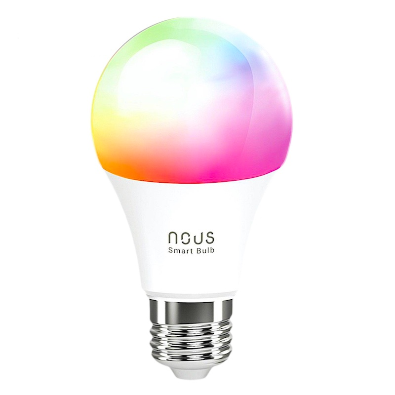
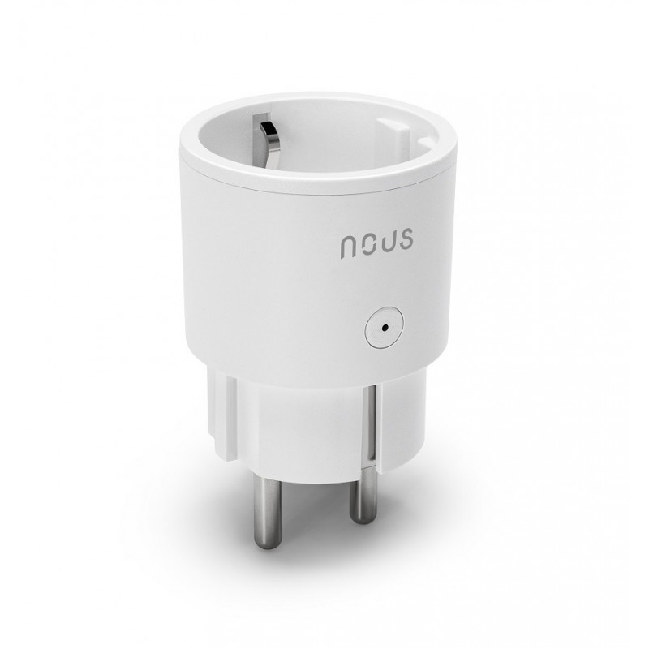
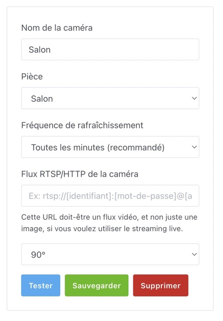

Salut à tous !

Je suis heureux d'annoncer aujourd'hui Gladys Assistant 4.26, une version qui apporte la compatibilité avec les appareils compatible Tuya.

Il était déjà possible d'utiliser certaines appareils Tuya Zigbee avec Gladys via notre intégration Zigbee2mqtt, mais désormais, les prises connectées et ampoules Wi-Fi sont aussi compatibles via une intégration Tuya officielle 🎉🎉

## Une prise connectée Tuya OFFERTE avec Gladys Plus !!

A l'occasion de ce lancement, je vous propose -40% sur le premier paiement à Gladys Plus avec le code **TUYA2023**.

Pour les 21 prochains abonnés, et uniquement cette semaine, j'enverrais une prise connectée avec contrôle de la consommation Tuya 🥳🥳

Dépêchez-vous, ça se passe [sur Gladys Plus ici](/fr/plus/) !!

## Les appareils compatibles

Les ampoules NOUS Wi-Fi Tuya E27 [à 7,64€ l'ampoule chez Domadoo](https://www.domadoo.fr/fr/peripheriques/6294-nous-ampoule-intelligente-rgb-wifi-tuya-format-e27-5907772033142.html?domid=17) sont compatibles.

Aussi, les prises NOUS Wi-Fi Tuya avec contrôle de la consommation électrique, disponible à [8€50 chez Domadoo](https://www.domadoo.fr/fr/peripheriques/6211-nous-prise-intelligente-wifi-mesure-de-consommation-10a-5907772033999.html?domid=17) sont compatibles avec Gladys !

Pour configurer ces appareils, vous pouvez suivre le tutoriel [dans la documentation de Gladys](/fr/docs/integrations/tuya/).

Si vous avez d'autres appareils Tuya qui ne sont pas encoré géré, n'hésitez pas à venir sur [le forum](https://community.gladysassistant.com/) pour en parler.

Un grand merci à [Lokkye](https://community.gladysassistant.com/u/lokkye/summary) sur le forum pour ce développement 🙌

## Rotation des images de caméras

Il est maintenant possible de tourner une image de caméra à 90°, 180°, et 270°, sur le tableau de bord et dans les lives vidéos.

Merci à Lokkye pour ce développement 🙌

## Comment mettre à jour ?

Si vous avez installé Gladys avec l’image Raspberry Pi OS officielle, vos instances se mettront à jour **automatiquement** dans les heures à venir. Cela peut prendre jusqu’à 24h, pas de panique.

Si vous avez installé Gladys avec Docker, vérifiez que vous utilisez bien Watchtower. Voir la [documentation](/fr/docs/installation/docker#mise-à-jour-automatique-avec-watchtower).

Avec Watchtower, Gladys se mettra automatiquement à jour.

## Supporter le projet

Il y a plein de façons de supporter le projet :

- Participer aux discussions sur le forum, aider les nouveaux.
- Contribuer au projet en proposant des nouvelles intégrations/fonctionnalités.
- Améliorer la documentation, qui est open-source.
- S'inscrire à [Gladys Plus](/fr/plus) actuellement en promotion à -40% la première année !!

Merci à tous ceux qui supportent Gladys 🙏
