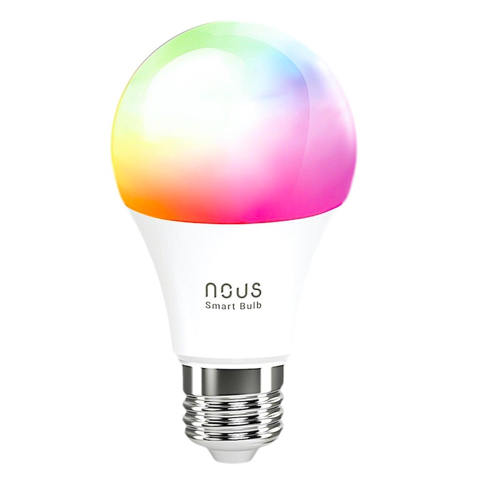
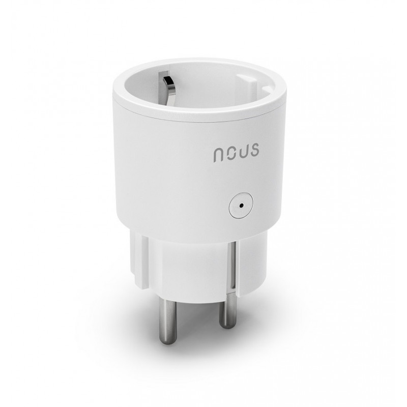
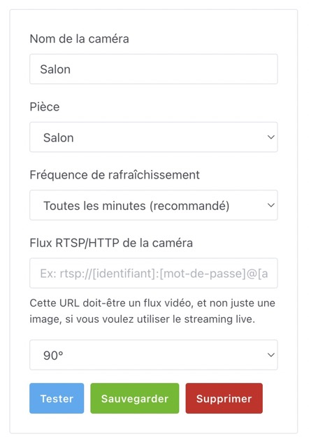

Salut à tous !

Je suis heureux d'annoncer aujourd'hui Gladys Assistant 4.26, une version qui apporte la compatibilité avec les appareils compatible Tuya.

Il était déjà possible d'utiliser certaines appareils Tuya Zigbee avec Gladys via notre intégration Zigbee2mqtt, mais désormais, les prises connectées et ampoules Wi-Fi sont aussi compatibles via une intégration Tuya officielle 🎉🎉

{/* truncate */}

## Les appareils compatibles

Les ampoules NOUS Wi-Fi Tuya E27 [à 7,64€ l'ampoule chez Domadoo](https://www.domadoo.fr/fr/peripheriques/6294-nous-ampoule-intelligente-rgb-wifi-tuya-format-e27-5907772033142.html?domid=17) sont compatibles.

Aussi, les prises NOUS Wi-Fi Tuya avec contrôle de la consommation électrique, disponible à [8€50 chez Domadoo](https://www.domadoo.fr/fr/peripheriques/6211-nous-prise-intelligente-wifi-mesure-de-consommation-10a-5907772033999.html?domid=17) sont compatibles avec Gladys !

Pour configurer ces appareils, vous pouvez suivre le tutoriel [dans la documentation de Gladys](/fr/docs/integrations/external/tuya/).

Si vous avez d'autres appareils Tuya qui ne sont pas encoré géré, n'hésitez pas à venir sur [le forum](https://community.gladysassistant.com/) pour en parler.

Un grand merci à [Lokkye](https://community.gladysassistant.com/u/lokkye/summary) sur le forum pour ce développement 🙌

## Rotation des images de caméras

Il est maintenant possible de tourner une image de caméra à 90°, 180°, et 270°, sur le tableau de bord et dans les lives vidéos.

Merci à Lokkye pour ce développement 🙌

## Comment mettre à jour ?

Pour mettre à jour Gladys, nous recommandons d'utiliser Watchtower : il met à jour votre conteneur automatiquement dès qu'une nouvelle version est disponible. Voir la [documentation](/fr/docs/installation/docker#mise-à-jour-automatique-avec-watchtower).

## Supporter le projet

Il y a plein de façons de supporter le projet :

- Participer aux discussions sur le forum, aider les nouveaux.
- Contribuer au projet en proposant des nouvelles intégrations/fonctionnalités.
- Améliorer la documentation, qui est open-source.
- S'inscrire à [Gladys Plus](/fr/plus/)

Merci à tous ceux qui supportent Gladys 🙏
