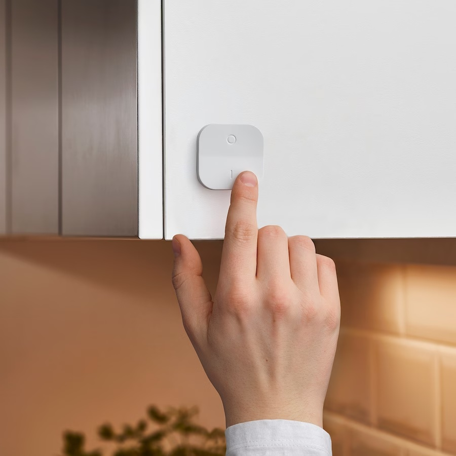
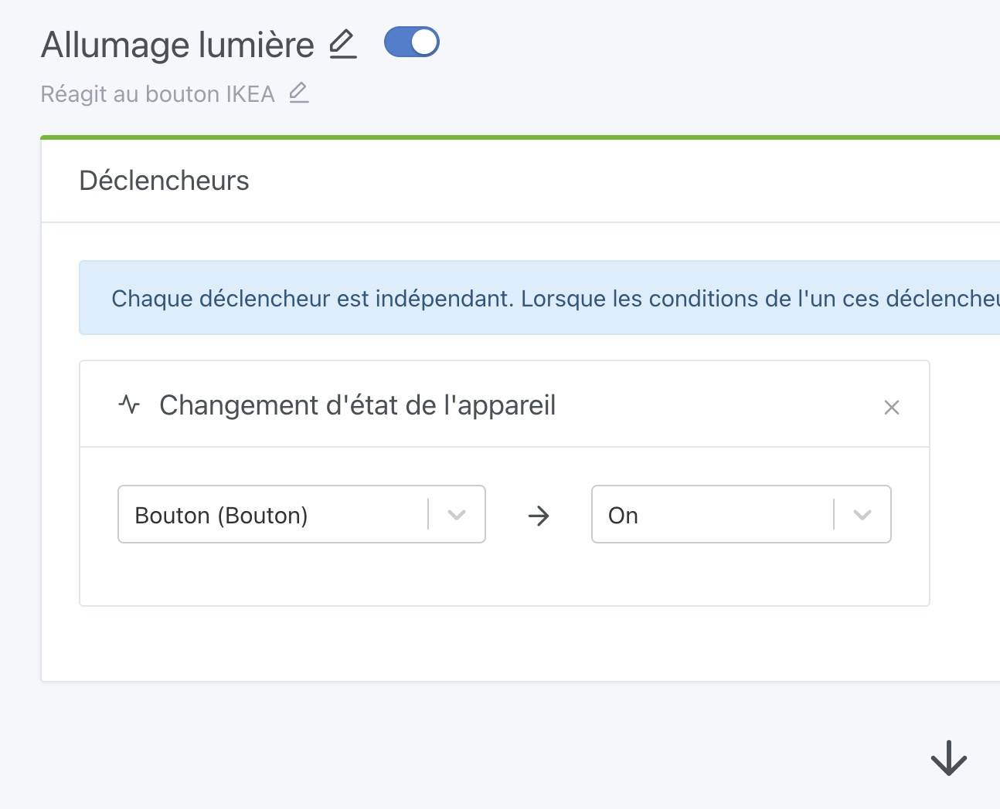
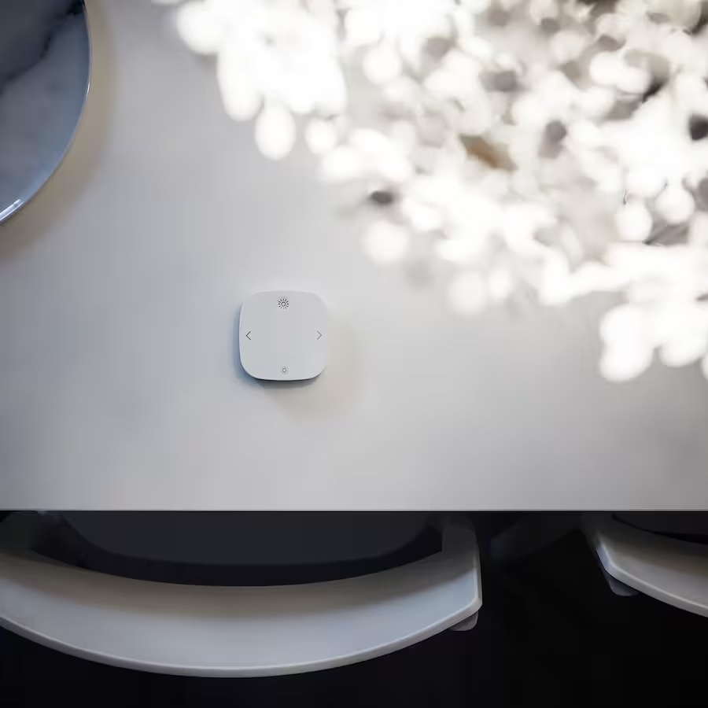

Salut à tous !

J'espère que vous avez passé de bonnes vacances ☀️

Côté Gladys Assistant, je suis rentré la semaine dernière avec une mise à jour v4.26.1 qui apportait un [ensemble de correctifs](https://community.gladysassistant.com/t/gladys-assistant-v4-26-1-mosquitto-fixe-a-la-v2-0-15-google-home-amelioration-courbes/8297) suite à vos retours de l'été.

J'enchaîne ensuite aujourd'hui avec une mise à jour plus importante en terme de fonctionnalités : Gladys Assistant 4.27.

## Renommer vos appareils sur le tableau de bord

<!--truncate-->

C'était une fonctionnalité qui animait les foules depuis longtemps : que faut-il afficher sur le tableau de bord pour bien "définir" une fonctionnalité : le nom de l'appareil ? Le nom et la pièce ? Le nom de la fonctionnalité ? Les deux ?

Après réflexion, je me suis rendu compte qu'on ne pourrait jamais contenter tout le monde et donc j'ai décidé de laisser l'utilisateur modifier le nom lors de l'affichage sur le tableau de bord.

Concrètement, sur le tableau de bord, vous pouvez dans le widget "Appareils" renommer et déplacer chaque appareil selon votre préférence :

<video  width="100%" controls autoplay loop muted>
<source src="https://gladysassistant-assets.b-cdn.net/gladys-4-27/gladys-rename-devices-fr.mp4" type="video/mp4" />
  Your browser does not support the video tag.
</video>

## Nouveaux appareils Zigbee

Gladys est désormais pleinement compatible avec 3 nouveaux appareils Zigbee, dont deux de la gamme connectée IKEA.

Pour ceux qui ne connaissent pas la gamme [éclairage connecté Zigbee IKEA](https://www.ikea.com/fr/fr/cat/eclairage-connecte-36812/), c'est une gamme très accessible (dès 9,99€ l'ampoule, 6,99€ l'interrupteur), et de bonne qualité. Si vous commencez en domotique, c'est un bon moyen de commencer. En plus, c'est trouvable dans tous les magasins IKEA ou en livraison sur leur site !

### Bouton IKEA TRÅDFRI avec variateur d'intensité

Ce bouton est un interrupteur On/Off très bon marché ([6,99€ chez IKEA](https://www.ikea.com/fr/fr/p/tradfri-variateur-dintensite-sans-fil-connecte-blanc-70408595/)), qui fait aussi variateur d'intensité en restant appuyé sur on ou off.

J'ai ajouté le support de 5 actions:

- On
- Off
- Augmenter luminosité
- Réduire luminosité
- Stopper luminosité

Ces actions sont disponibles dans les scènes :

### Bouton IKEA STYRBAR avec contrôle intensité et couleur

Cette télécommande connectée permet de contrôler la lumière en On/Off, variation d'intensité, et couleur d'une ou plusieurs ampoules. Elle est disponible pour [9,99€ chez IKEA](https://www.ikea.com/fr/fr/p/styrbar-telecommande-connecte-blanc-30488363/).

J'ai ajouté le support de 11 actions:

- On
- Off
- Augmenter luminosité
- Réduire luminosité
- Stopper luminosité
- Flèche gauche clic
- Flèche droite clic
- Flèche gauche maintenue
- Flèche droite maintenue
- Flèche gauche relâchée
- Flèche droite relâchée

Ces actions sont aussi disponibles dans les scènes pour automatiser ce que vous souhaitez.

Bien-sûr, utilisé dans Gladys, ces deux boutons peuvent contrôler tout et n'importe quoi.

Pour ceux qui veulent un contrôle plus "direct", il est possible de passer par les [Bindings Zigbee2mqtt](https://www.zigbee2mqtt.io/guide/usage/binding.html) afin de permettre une association directe entre l'interrupteur et l'ampoule, en Zigbee direct.

Cela vous permet d'avoir un contrôle en direct qui fonctionne même si votre domotique est inactive.

### Bouton Xiaomi WXKG01LM

J'ai ajouté quelques actions qui manquaient pour ce bouton :

- Clic triple
- Clic quadruple
- Clic relâché
- Plein de clics

## Des compatibilités Zigbee manquantes ?

Si vous avez un appareil Zigbee qui n'est pas entièrement géré par Gladys, n'hésitez pas à poster un message [sur le forum](https://community.gladysassistant.com/).

## Comment mettre à jour ?

Si vous avez installé Gladys avec l’image Raspberry Pi OS officielle, vos instances se mettront à jour **automatiquement** dans les heures à venir. Cela peut prendre jusqu’à 24h, pas de panique.

Si vous avez installé Gladys avec Docker, vérifiez que vous utilisez bien Watchtower. Voir la [documentation](/fr/docs/installation/docker#mise-à-jour-automatique-avec-watchtower).

Avec Watchtower, Gladys se mettra automatiquement à jour.

## Supporter le projet

Il y a plein de façons de supporter le projet :

- Participer aux discussions sur le forum, aider les nouveaux.
- Contribuer au projet en proposant des nouvelles intégrations/fonctionnalités.
- Améliorer la documentation, qui est open-source.
- S'inscrire à [Gladys Plus](/fr/plus) actuellement en promotion à -40% la première année !!

Merci à tous ceux qui supportent Gladys 🙏
