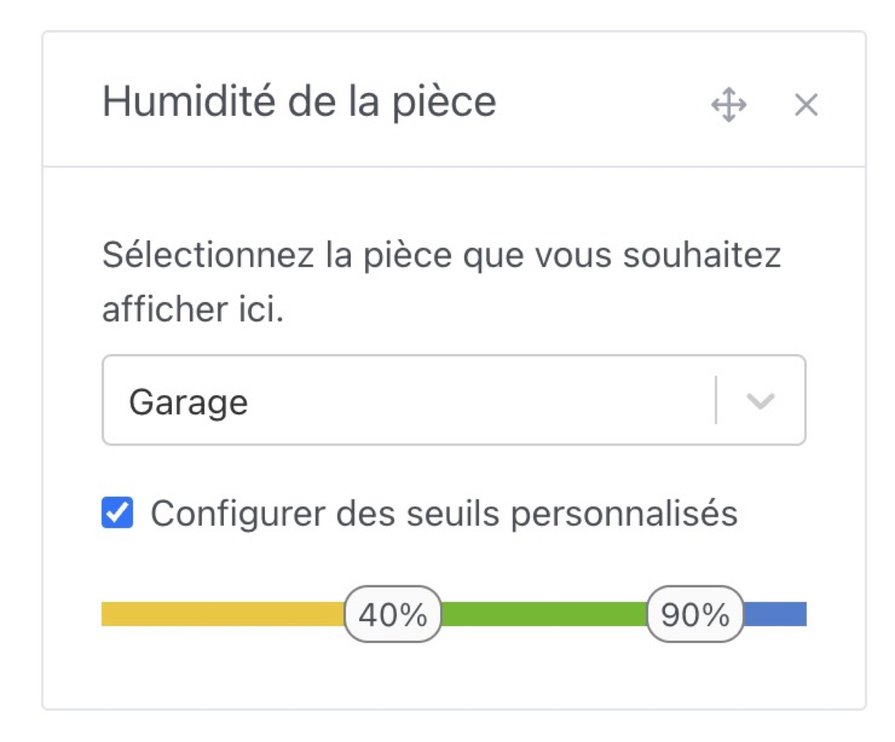
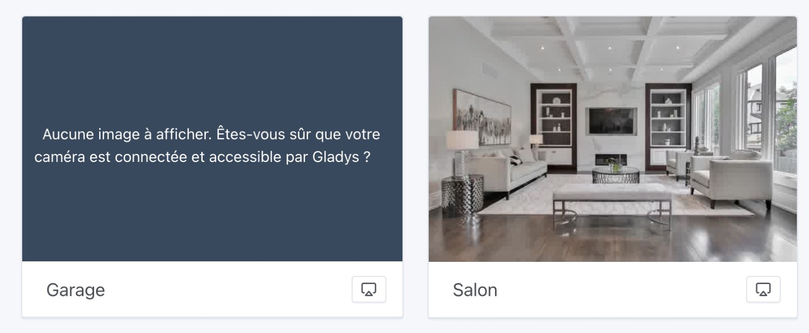

Salut à tous !

Encore une nouvelle mise à jour de Gladys avec pas mal de nouveautés 🥳

### Intégrations avec les climatiseurs Mitsubishi

Il est maintenant possible de connecter ses climatisateurs Mitsubishi (connecté via MELCloud) à Gladys !


Merci à @Lokkye pour le développement 🙌

### Mode plein écran pour les tablettes Gladys

Si vous utilisez Gladys sur une tablette tactile quelque part dans votre maison, il est probable que vous vouliez afficher en plein écran le tableau de bord de Gladys, sans avoir la possibilité de naviguer hors de cet écran.

C'est désormais possible grâce à un paramètre à rajouter dans L'URL :

```
?fullscreen=force
```

Afin de permettre un meilleur usage des appareils type "tablette au mur", la durée des sessions de connexion a été augmentée à 1 an pour permettre ces usages.

(Les sessions peuvent toujours être révoquées dans les paramètres de Gladys à tout moment)

### Définir les limites des widgets "température/humidité d'une pièce

Il est désormais possible de définir à quelle limite les couleurs des widgets "Température/Humidité" changent.

Une chambre n'a pas forcément les mêmes limites qu'une salle de bain, où d'un terrarium !

Lors de l'édition d'un tableau de bord, vous pouvez désormais définir des seuils personnalisés :




Merci @Lokkye pour ce développement 🙌

### Expiration des images de caméras

Désormais, les images de caméras expirées ne seront plus affichées sur le tableau de bord :



### Gestion des volets roulants Tuya

L'intégration Tuya est sortie cet été, et un nouveau type d'appareil vient d'être ajouté : les volets roulants.

Merci @Lokkye pour ce développement 🙌

### Plein de correctifs

- Dans l'intégration MQTT, NextCloud Talk et Tasmota, les champs mot de passe ne seront plus automatiquement complétées par les navigateurs (afin d'éviter des bugs de remplissage de champs automatiques) ([#1881](https://github.com/GladysAssistant/Gladys/pull/1881))
- Sur le tableau de bord, certains appareils n'ont désormais plus de date d'expiration de valeurs (détecteur de fumée, détecteur de fuite d'eau, bouton, et texte)
- Amélioration des traductions dans l'intégration OpenWeather ([#1897](https://github.com/GladysAssistant/Gladys/pull/1897))
- Dans les scènes, dans l'action "Contrôler un appareil", les appareils binaires sont initialisés à 0 par défaut et non plus à "valeur vide" ([#1901](https://github.com/GladysAssistant/Gladys/pull/1901))
- Dans l'intégration MQTT, ajout d'un message d'erreur lorsqu'un appareil est créé avec le même ID externe qu'un appareil existant ([#1902](https://github.com/GladysAssistant/Gladys/pull/1902))
- Meilleure validation des états "string" ([#1894](https://github.com/GladysAssistant/Gladys/pull/1894))

## Comment mettre à jour ?

Si vous avez installé Gladys avec l’image Raspberry Pi OS officielle, vos instances se mettront à jour **automatiquement** dans les heures à venir. Cela peut prendre jusqu’à 24h, pas de panique.

Si vous avez installé Gladys avec Docker, vérifiez que vous utilisez bien Watchtower. Voir la [documentation](/fr/docs/installation/docker#mise-à-jour-automatique-avec-watchtower).

Avec Watchtower, Gladys se mettra automatiquement à jour.

## Supporter le projet

Il y a plein de façons de supporter le projet :

- Participer aux discussions sur le forum, aider les nouveaux.
- Contribuer au projet en proposant des nouvelles intégrations/fonctionnalités.
- Améliorer la documentation, qui est open-source.
- S'inscrire à [Gladys Plus](/fr/plus) actuellement en promotion à -40% la première année !!

Merci à tous ceux qui supportent Gladys 🙏
