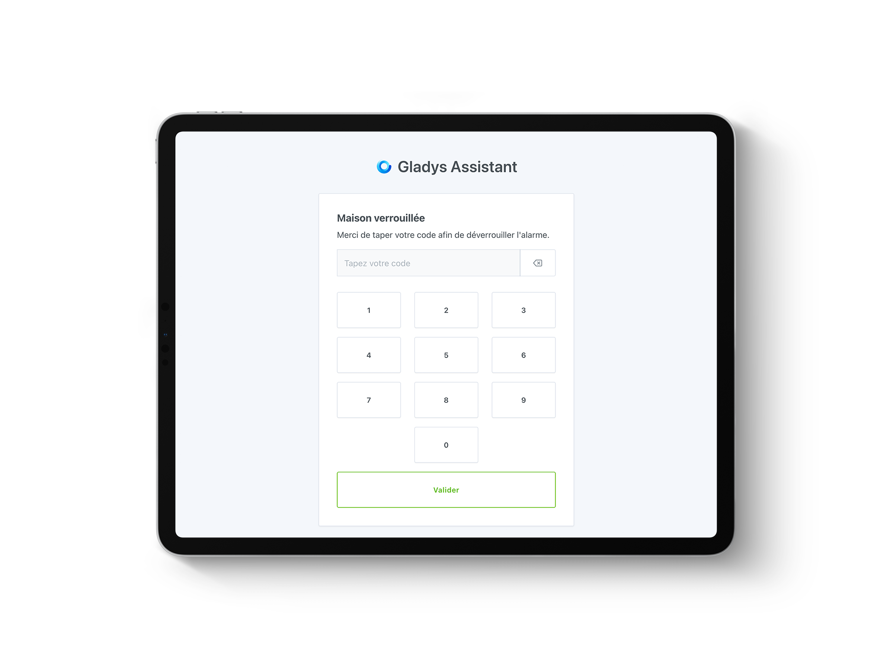
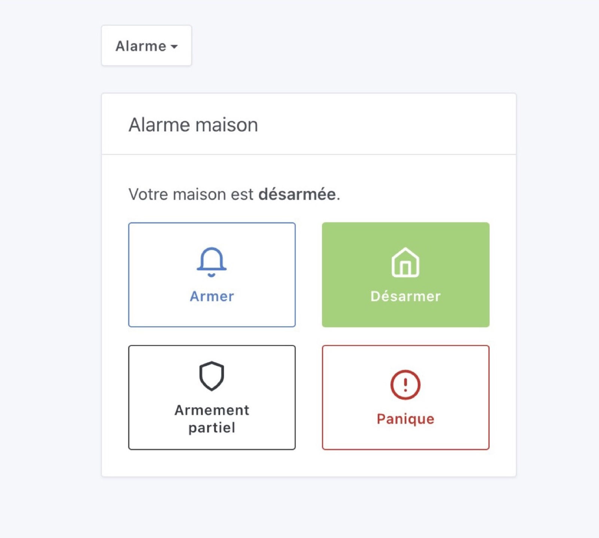
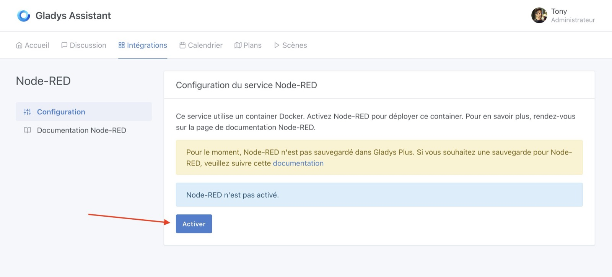
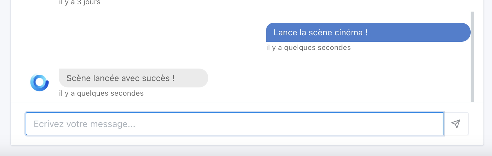
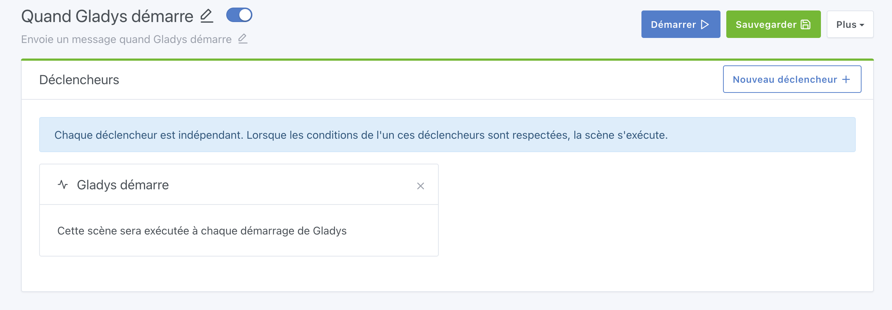
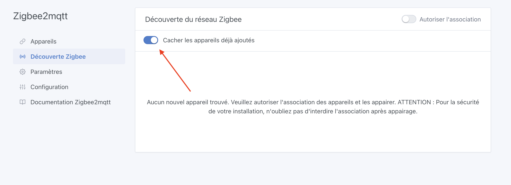
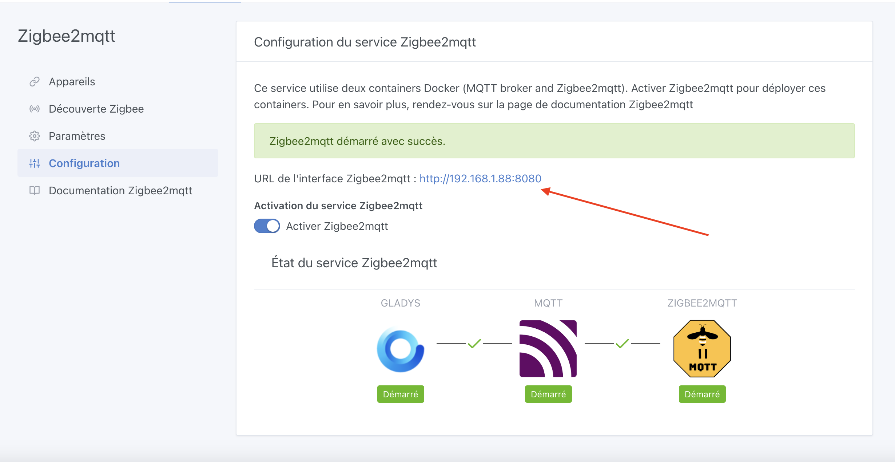

Salut à tous !

Gladys Assistant 4.30 vient de sortir, et c'est une sacré version !! 🥳

La principale fonctionnalité, c'est la gestion complète d'un mode Alarme qui vous permet de mettre en place un système de sécurité complet à la maison.



Avouez que ça donne envie 😎

**Promotion FLASH**: A l'occasion de ce lancement, j'offre un [capteur d'ouverture de porte/fenêtre Zigbee](https://www.domadoo.fr/fr/peripheriques/5320-sonoff-capteur-d-ouverture-de-portefenetre-zigbee-30-snzb-04-6920075776126.html?domid=17) à tous les nouveaux inscrits sur le plan annuel à [Gladys Plus](/fr/plus/) !! (En plus des -40% !!). Offre réservée aux résidents de l'union-européenne ⚠️

## Une alarme dans Gladys

Désormais, Gladys peut remplacer un système d'alarme complet en gérant les différents états de tout bon système d'alarme :

<!--truncate-->



Si vous voulez mettre en place une alarme avec Gladys, j'ai écris [un tutoriel complet](/fr/docs/dashboard/alarm/) sur le sujet !

## Intégration Node-RED

Il était déjà possible d'interfacer Node-RED avec Gladys (Voir [mon tutoriel Youtube sur le sujet](https://www.youtube.com/watch?v=bpmHzR8_S5g)), mais cela demandait quelques connaissances car il fallait lancer Node-RED soit même.

Lokkye a travaillé sur une intégration native afin de permettre à tous de lancer en un clic une instance Node-RED à côté de Gladys !

Désormais, rendez-vous dans l'intégration "Node-RED" puis cliquer sur "Activer" pour lancer un container Node-RED :



## Tuya: Gestion de la consommation électrique

L'intégration Tuya supporte désormais les prises connectées qui remontent des données de consommations électriques.

Merci Lokkye pour le développement 🙏

## Lancer une scène depuis le chat

C'était déjà possible avec l'intégration ChatGPT, mais cette commande vient d'être ajouté dans le modèle de discussion "local" à Gladys, il est possible de demander à Gladys de lancer une scène dans le chat :



Merci Lokkye pour le développement 🙏

## Lancer une scène en MQTT

Vous pouvez désormais lancer une scène en MQTT en publiant un message sur le topic:

```
gladys/master/scene/SCENE_SELECTOR/start
```

En remplaçant `SCENE_SELECTOR` par le selector de la scène, qui peut-être trouvé dans l'URL de l'édition de la scène.

Par exemple, pour la scène `http://192.168.1.10/dashboard/scene/cinema`, il faudra envoyer un message dans le topic:

```
gladys/master/scene/cinema/start
```

Merci Lokkye pour le développement 🙏

## Lancer une scène au démarrage de Gladys

Vous voulez recevoir un message quand Gladys redémarre ? Effectuer une opération à tous les démarrages de Gladys ?

Vous pouvez désormais lancer une scène au démarrage de Gladys :



Merci Lokkye pour le développement 🙏

## Zigbee2mqtt : Amélioration d'interfaces

Désormais, les appareils déjà ajoutés ne seront plus affichés par défaut dans la page "Découverte du réseau Zigbee":



L'URL de Zigbee2mqtt est désormais affichées sur la page de configuration :



**Correction de bug** : Lors de la modification du port de la clé USB, Gladys relancer le container Zigbee2mqtt avec le bon volume.

Merci à AlexTrovato et Cicoub13 pour ces améliorations 🙏

## Homekit : Gestion des capteurs d'humidité et de fuites

Désormais, vos capteurs de fuites et d'humidité remettrons dans Homekit !

Merci bertrandda pour le développement 🙏

Le CHANGELOG complet est disponible [ici](https://github.com/GladysAssistant/Gladys/releases/tag/v4.30.0).

## Comment mettre à jour ?

Si vous avez installé Gladys avec l’image Raspberry Pi OS officielle, vos instances se mettront à jour **automatiquement** dans les heures à venir. Cela peut prendre jusqu’à 24h, pas de panique.

Si vous avez installé Gladys avec Docker, vérifiez que vous utilisez bien Watchtower. Voir la [documentation](/fr/docs/installation/docker#mise-à-jour-automatique-avec-watchtower).

Avec Watchtower, Gladys se mettra automatiquement à jour.

## Supporter le projet

Il y a plein de façons de supporter le projet :

- Participer aux discussions sur le forum, aider les nouveaux.
- Contribuer au projet en proposant des nouvelles intégrations/fonctionnalités.
- Améliorer la documentation, qui est open-source.
- S'inscrire à [Gladys Plus](/fr/plus) actuellement en promotion à -40% la première année !!

Merci à tous ceux qui supportent Gladys 🙏
