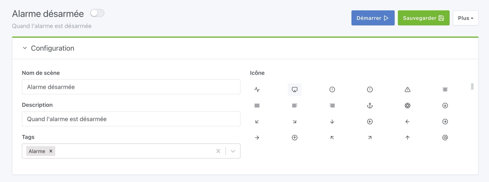
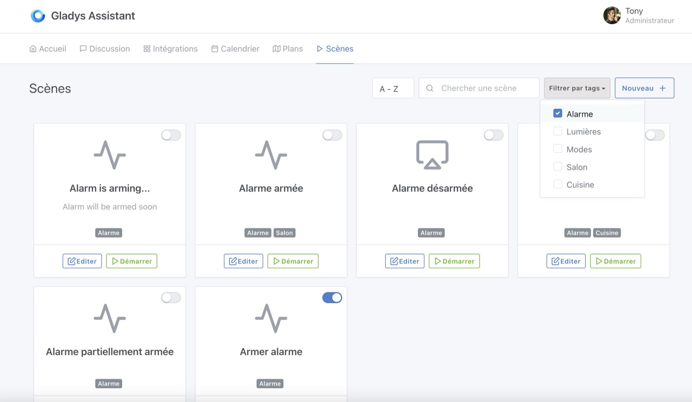
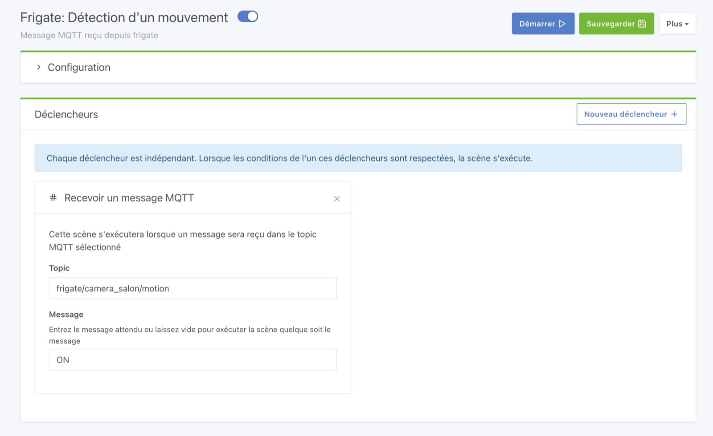
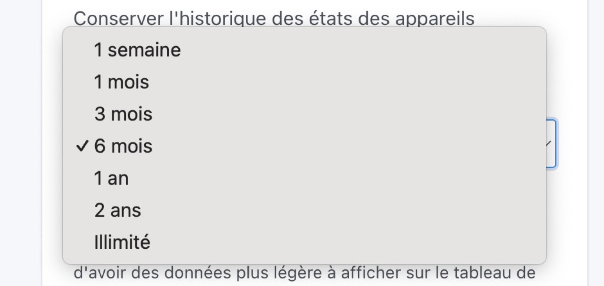
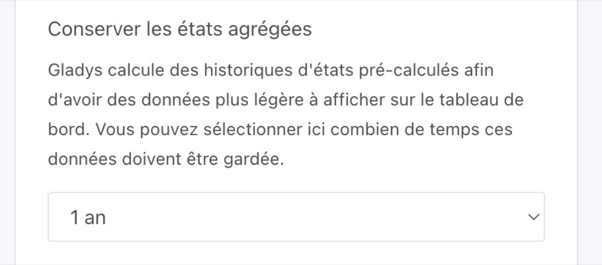
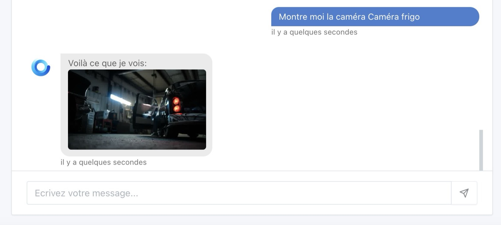

Salut à tous,

Je vous présentais fin Octobre [Gladys Assistant 4.30](/fr/blog/gladys-4-30-alarm-mode/), une version qui a apporté une alarme complète dans Gladys !

Aujourd'hui sort Gladys Assistant 4.31, une version qui apporte pas mal de nouveautés ainsi que des correctifs suite à vos retours sur le mode alarme 🎉🎉

## Filtrage par tag dans les scènes

Vous étiez nombreux à demander un mécanisme pour filtrer les scènes qui sont de plus en plus nombreuses sur vos instances, et @Lokkye l'a fait !

Vous pouvez désormais ajouter un ou plusieurs tags à vos scènes :

Et ensuite, vous pouvez filtrer vos scènes par tag :

Ce qui vous permet d'organiser vos scènes plus simplement (par pièce, par fonction).

## Nouveau déclencheur: Réception d'un message MQTT

Il est désormais possible de déclencher une scène sur réception d'un message MQTT customisé !

L'objectif de ce déclencheur étant de permettre des intégrations externes simplifiées pour les utilisateurs avancés, sans forcément passer par Node-RED.

Par exemple, si vous êtes utilisateur de [Frigate](https://docs.frigate.video/integrations/mqtt/) et que vous voulez recevoir un message MQTT dans Gladys quand un mouvement est détecté sur une caméra, c'est possible !

Ceci est juste un exemple, mais vous voulez aller beaucoup plus loin, et faire par exemple des scripts qui appellent Gladys via ce déclencheur !

## Nettoyage des états de capteurs en base de donnée

Lorsque vous avez installé Gladys, vous avez normalement choisi la durée de rétention des états de capteurs.

Aujourd'hui, j'ajoute dans Gladys des nouvelles durées pour ce paramètre :

Et j'ajoute un nouveau paramètre "Conserver les états agrégés" qui vous permet de dire à Gladys combien de temps elle doit garder les d'états pré-calculés pour l'affichage sur le tableau de bord :

L'idée de ce paramètre est de pouvoir garder par exemple "6 mois de données brutes" + "1 an de données agregées", et ainsi ne pas garder trop longtemps les données brutes, tout en ayant l'affichage de la dernière année toujours visible sur le tableau de bord.

**Note :** Si votre base de donnée Gladys est conséquente, pensez à changer ce paramètre. Le prochain nettoyage aura lieu à 4h du matin le jour suivant !

## Nouveau fichier docker-compose.yml

Cyril a travaillé sur le fichier [docker-compose.yml](https://github.com/GladysAssistant/Gladys/blob/master/docker/docker-compose.yml) que nous proposons sur le site pour installer Gladys.

Il est maintenant entièrement à jour !

## Philips Hue: Ajout d'un scan hybride + ajout manuel d'un pont

Certains d'entre vous avaient des difficultés à utiliser l'intégration Philips Hue car leur pont Philips Hue n'était pas détecté en local par Gladys.

Cyril a travaillé sur un nouveau scan "hybride" qui fait un scan "N-UpNp" en plus du scan "UpNp" que nous faisions.

Si toutefois Gladys ne détecte pas votre pont Philips Hue, vous pourrez l'ajouter en manuel via son adresse IP.

## Chat: Afficher une caméra par son nom

Il est désormais possible d'afficher une caméra dans le chat en l'appelant par son nom (et plus nécessairement par le nom de la pièce)

Si par exemple votre caméra s'appelle "Caméra frigo", vous pouvez demander à Gladys de l'afficher :

Si vous demandez "Montre moi la caméra du salon" et qu'il y a plusieurs caméras dans le salon, désormais Gladys vous enverra toutes les images.

## Correctifs

- Inversion des labels de capteurs d'ouvertures de portes dans les scènes. Ouvert devient fermé et fermé devient ouvert (c'était une erreur!). Il n'y a rien à changé de votre côté sur vos scènes existantes si ces scènes fonctionnaient, seul le label a changé, et non pas la valeur.
- Le nom du widget "Alarme" est maintenant optionnel. Si il n'est pas renseigné, la barre de titre sera masquée.
- Dans l'alarme, lorsque le paramètre `?fullscreen=force` est fourni, il doit être conservé malgré les redirections sur l'écran verrouillé, ainsi qu'après un déverouillage de l'alarme.

Le CHANGELOG complet est disponible [ici](https://github.com/GladysAssistant/Gladys/releases/tag/v4.31.0).

## Comment mettre à jour ?

Si vous avez installé Gladys avec l’image Raspberry Pi OS officielle, vos instances se mettront à jour **automatiquement** dans les heures à venir. Cela peut prendre jusqu’à 24h, pas de panique.

Si vous avez installé Gladys avec Docker, vérifiez que vous utilisez bien Watchtower. Voir la [documentation](/fr/docs/installation/docker#mise-à-jour-automatique-avec-watchtower).

Avec Watchtower, Gladys se mettra automatiquement à jour.

## Supporter le projet

Il y a plein de façons de supporter le projet :

- Participer aux discussions sur le forum, aider les nouveaux.
- Contribuer au projet en proposant des nouvelles intégrations/fonctionnalités.
- Améliorer la documentation, qui est open-source.
- S'inscrire à [Gladys Plus](/fr/plus) actuellement en promotion à -40% la première année !!

Merci à tous ceux qui supportent Gladys 🙏
