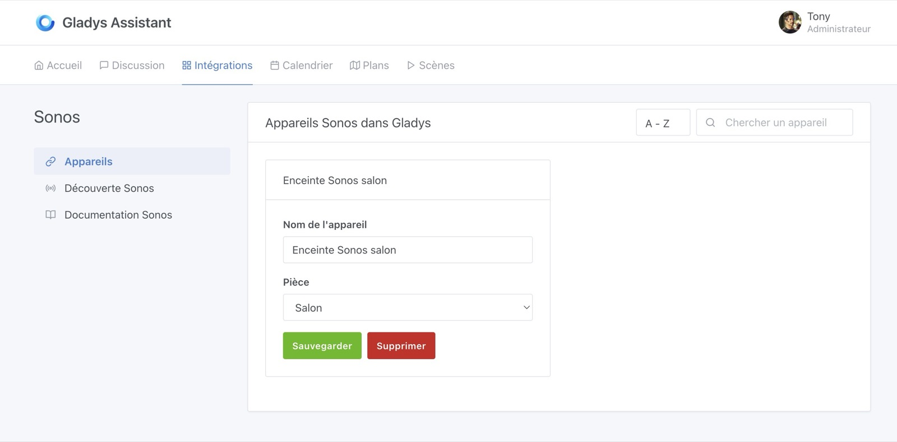
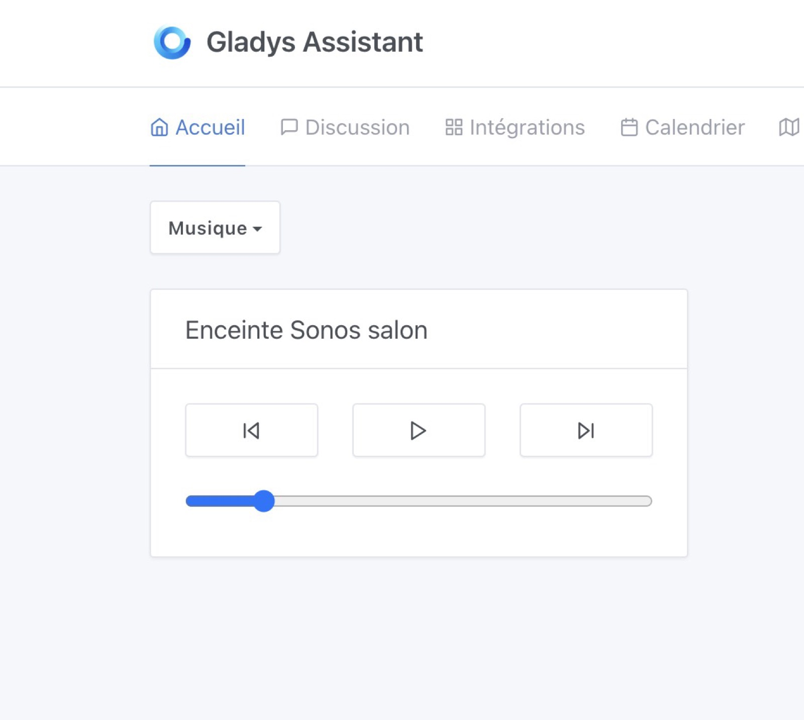
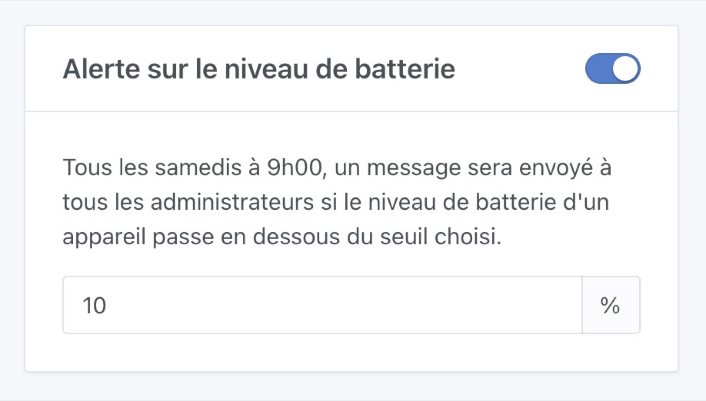
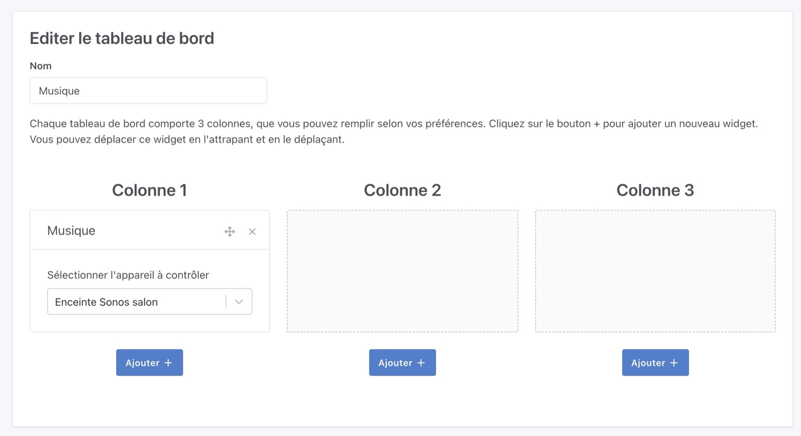
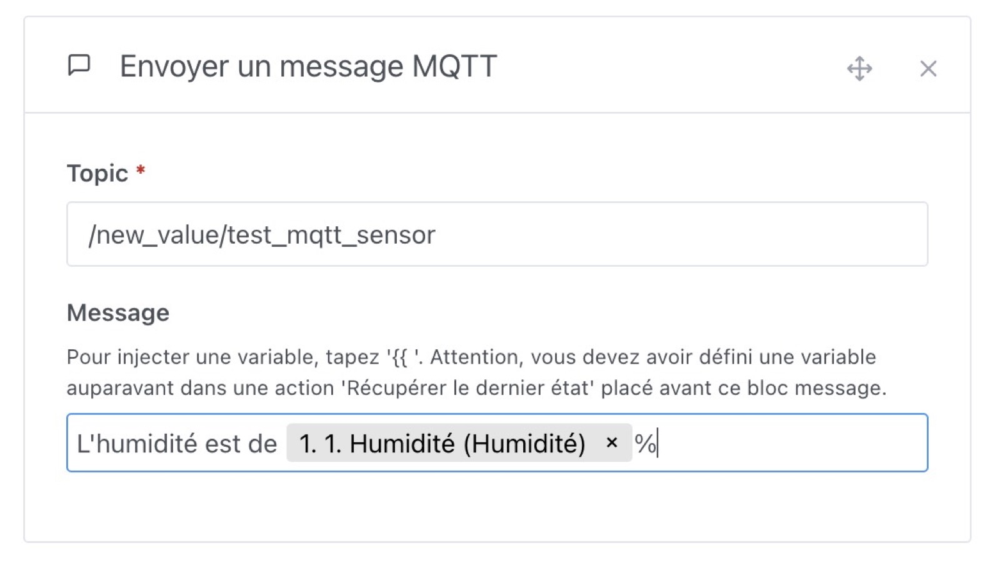

Salut à tous !

Il y a 2 semaines, j'étais en direct sur Youtube pour une séance de live coding qui a duré plus de 7 heures !!

Dans ce live, j'ai développé de bout en bout une intégration Sonos pour Gladys.

Le replay du live est disponible ici :

    <iframe src="https://www.youtube.com/embed/M4vOjQXMiZI" title="YouTube video player" frameborder="0" allow="accelerometer; autoplay; clipboard-write; encrypted-media; gyroscope; picture-in-picture" allowfullscreen></iframe>

Aujourd'hui, je vous présente Gladys Assistant 4.32 qui apporte notamment cette intégration Sonos 😁

## Intégration Sonos dans Gladys

Désormais, vous pouvez connecter vos enceintes Sonos à Gladys.

<!--truncate-->

Sur le tableau de bord, vous pourrez un widget "Musique" qui vous permet de contrôler une enceinte :

Et c'est tout pour le moment !

Et oui, l'objectif de ce développement c'était d'avoir un MVP fonctionnel d'une intégration Sonos dans Gladys, et je crois que le contrat est rempli 😊

Maintenant, je suis à la recherche d'un mainteneur qui aimerait aider pour faire avancer cette intégration.

Si tu veux donner un coup demain, rejoins nous [sur le forum](https://community.gladysassistant.com/) !

## Envoi d'un message quand la batterie est faible

Vous en avez rêvé ? Lokkye l'a fait pour vous !

Désormais, tous les samedis matins à 9h, si un ou plusieurs appareils de votre maison connectée ont un niveau de batterie inférieur à un certain seuil, Gladys vous enverra un message (sur Telegram si vous l'avez configuré) :

Merci Lokkye pour le développement 🙌

## Zigbee2mqtt : Gestion du capteur IKEA Vindstyrka

Le capteur [IKEA Vindstyrka Zigbee](https://www.ikea.com/fr/fr/p/vindstyrka-capteur-qualite-de-lair-connecte-00498231/) renvoyait une valeur de `voc_index` que nous ne gérions pas dans Gladys pour l'instant. Contrairement à une valeur "brute" de VOC, celle-ci représente une variation :

> L’indice a une échelle de 0 à 500 avec pour valeur de référence 100 qui représente la qualité moyenne de l’air au cours des 24h dernières heures.
> Une mesure inférieure à 100 indique une amélioration de la qualité de l’air, et au-dessus une dégradation.

Will_71 sur le forum s'est penché sur le sujet et nous a apporté la comptabilité ! Merci 🙌

## Zigbee2mqtt : Gestion complète du détecteur OWON PIR313-E

Ce capteur expose 2 fonctionnalités que nous ne gérions pas encore : "batterie faible" (nous gérons déjà le niveau de batterie), et la "détection de sabotage" (si un voleur essaie de retirer le capteur de mouvement).

C'est encore Will_71 qui a bossé sur le sujet, un grand merci 🙌

## Tableau de bord : Ajout d'un bouton "Ajouter" par colonne

Un petit correctif UX qui peut paraitre simple mais qui va grandement nous simplifier la vie : Il y a désormais un bouton "Ajouter +" par colonne sur le tableau de bord !

Merci Brisou pour ta première PR sur Gladys, qui j'espère sera la première d'une longue série 🙌

## Envoi d'un message MQTT dans les scènes

Il est maintenant possible d'envoyer un message MQTT dans les scènes, vers un topic custom et avec un message custom.

Merci Lokkye pour la super PR 🙌

## Correctifs

Quelques correctifs se sont glissés dans cette version !

- Quelques correctifs sur la nouvelle fonctionnalité de filtrages par tag des scènes par Lokkye 🙌
- Dans les scènes, certains sélecteurs se superposaient entre eux, ce n'est plus le cas. Merci Will_71 🙌
- Le container Gladys lance directement le process Node, ce qui permet à la base de donnée d'être correctement fermée quand Gladys s'arrête. Merci cicoub13 pour le correctif 🙌

Le CHANGELOG complet est disponible [ici](https://github.com/GladysAssistant/Gladys/releases/tag/v4.32.0).

## Comment mettre à jour ?

Si vous avez installé Gladys avec l’image Raspberry Pi OS officielle, vos instances se mettront à jour **automatiquement** dans les heures à venir. Cela peut prendre jusqu’à 24h, pas de panique.

Si vous avez installé Gladys avec Docker, vérifiez que vous utilisez bien Watchtower. Voir la [documentation](/fr/docs/installation/docker#mise-à-jour-automatique-avec-watchtower).

Avec Watchtower, Gladys se mettra automatiquement à jour.

## Supporter le projet

Il y a plein de façons de supporter le projet :

- Participer aux discussions sur le forum, aider les nouveaux.
- Contribuer au projet en proposant des nouvelles intégrations/fonctionnalités.
- Améliorer la documentation, qui est open-source.
- S'inscrire à [Gladys Plus](/fr/plus)

Merci à tous ceux qui supportent Gladys 🙏
