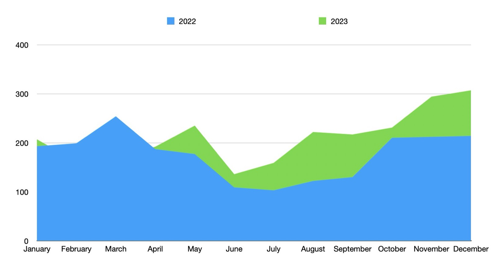
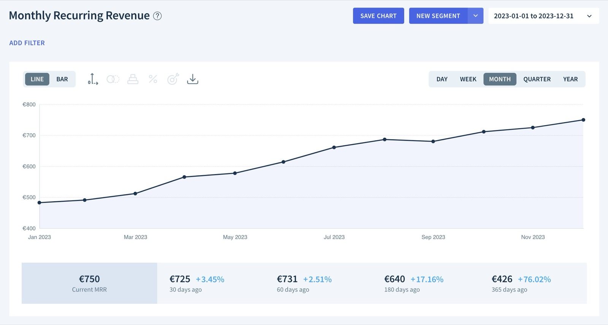
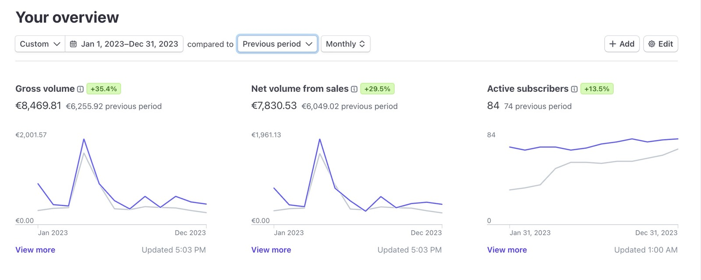
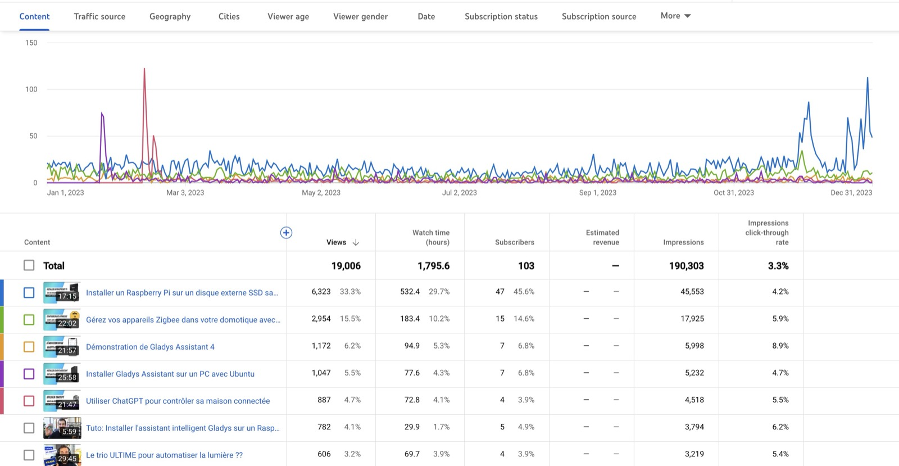

Bonne année à tous 🙌

J'espère que 2024 sera une année pleine de bonne choses pour vous : santé, famille, projets !

Comme chaque année, je fais le bilan de l'année précédente et je vous présente mes plans pour la nouvelle année.

Si vous préférez ce bilan en vidéo, j'ai fais un live YouTube qui est disponible en replay ici :

    <iframe  src="https://www.youtube.com/embed/9aHgmzqObxQ" title="YouTube video player" frameborder="0" allow="accelerometer; autoplay; clipboard-write; encrypted-media; gyroscope; picture-in-picture; web-share" allowfullscreen></iframe>

 

Les bilans des années précédentes:

[2022](/fr/blog/2022-year-in-review), [2021](/fr/blog/2021-year-in-review), [2020](/fr/blog/bilan-2020-gladys-assistant), [2019](/fr/blog/bilan-2019-gladys-assistant), [2018](/fr/blog/bilan-2018-pour-gladys-assistant), [2017](/fr/blog/bilan-gladys-2017), [2016](/fr/blog/bilan-annee-2016) et [2015](/fr/blog/bilan-2015-et-projets-pour-2016).

## Que s'est-il passé en 2023 ?

<!--truncate-->

2023 a été une année riche en nouvelle fonctionnalités :

- [Une intégration avec OpenAI ChatGPT](/fr/blog/open-ai-gpt-3-in-gladys-assistant/)
- [Le live streaming de caméra sur le tableau de bord](/fr/blog/camera-live-streaming-gladys-assistant-4-23/)
- [La compatibilité avec la gamme Tuya](/fr/blog/gladys-assistant-tuya/)
- [Un mode alarme complet dans Gladys](/fr/blog/gladys-4-30-alarm-mode/)
- [Intégration Sonos dans Gladys](/fr/blog/gladys-4-32-sonos-integration/)

Encore MERCI à tous les développeurs qui ont contribué à ces versions, l'année 2023 a été exceptionnelle et c'est grâce à vous tous 🎉

Merci à Alexandre Trovato, Vincent Kulak, Bertrand D'Aure, Cyril Beslay, Corentin Allemand, NickDub, Terdious, Romuald Pochet, Quentin Legay, Jonathan Brisavoine, William Deren, Nicolas Geissel, euguuu, Patrick Scheips et
Brad Sanders ! 🙏

### L'usage

En 2O23, le nombre de nouvelles installations a été en croissance par rapport à 2022, sauf en février-mars, ce qui s'explique par le fait que j'étais en congés d'été en février-mars cette année et que je n'ai donc pas été actif sur cette période !!

Au contraire, sur juillet-août 2023, je n'ai pas posé de congés et cela se ressent sur le nombre de nouvelles installations :

En terme de MRR (Monthly Recurring Revenue = Revenu mensuel récurrent), Gladys Plus est désormais à 750€ de MRR, en augmentation de +76% depuis l'année dernière.

Gladys Plus a fait 8 469€ de chiffre d'affaire en 2023, soit une augmentation de +35%.

J'avais annoncé fin 2022 que je souhaitais faire 18k€ de chiffre d'affaire en 2023.

C'est un objectif manqué, la principale raison est que je n'ai pas pu sortir le nouveau produit que je voulais lancer en 2023, mais qui arrive donc début 2024... 😎

### La chaine YouTube

La [chaîne YouTube](https://www.youtube.com/@GladysAssistant) a continué sa dynamique de 2022 !

19 000 vues sur la chaine, 1800 heures de watch time, c'est une belle année, mais on fait un peu moins qu'en 2022 car j'ai sorti moins de vidéos.

YouTube reste pour moi un excellent canal d'acquisition de nouveaux utilisateurs, que je compte continuer à utiliser en 2024.

Les live coding de la fin d'année ont énormément plu, et c'est quelque chose que je vais continuer à faire !!

Quelques vidéos qui ont bien marché en 2023 :

- [Le trio ULTIME pour automatiser la lumière ??](https://www.youtube.com/watch?v=gNlZ2bId8Z0)
- [Live coding : Une intégration Sonos en une journée ?](https://www.youtube.com/watch?v=M4vOjQXMiZI)
- [Live coding : Une intégration Z-Wave en une journée ?](https://www.youtube.com/live/f6mWvy2kWSs?si=tSEA8-RtAdbY2C5d&t=454)
- [Live : Le mode "Alarme" débarque dans Gladys Assistant 🎉](https://www.youtube.com/watch?v=qEcVqvkg-Yc)
- [Gérez vos appareils Zigbee dans votre domotique avec Zigbee2mqtt et Gladys Assistant](https://youtu.be/ALW3uDB9P0s)

### Les réseaux sociaux

Sur les réseaux sociaux:

- [@gladysassistant sur Twitter](https://twitter.com/gladysassistant) rassemble 2 721 followers
- [Gladys Assistant Facebook](https://www.facebook.com/gladysassistant) comptabilise 760 likes
- [@gladysassistant sur instagram](https://www.instagram.com/gladysassistant) rassemble 579 abonnés

Et enfin 2 335 followers sur [mon Twitter personnel](https://twitter.com/pierregillesl) !

### La newsletter

Au niveau de la newsletter, vous êtes 3 277 à suivre la [newsletter Gladys Assistant](https://email-list.gladysassistant.com/subscription/1mXJoEWEl).

- 2775 abonnés en français
- 502 abonnés en anglais

C'est une année globalement en baisse. La newsletter est un canal que j'utilise toujours autant mais que je mets assez peu en avant. Peut-être du travail à faire sur cette partie en 2024 !

### Le GitHub Gladys Assistant

Nous sommes à 2 430 stars ⭐ sur le [repo Gladys Assistant](https://github.com/GladysAssistant/Gladys).

C'est +9% par rapport à l'année dernière !

Je compte sur vous pour nous soutenir sur GitHub en mettant une étoile ⭐ au projet.

## Projets et objectifs pour 2024

Bon, le plus important: que nous réserve 2024 sur Gladys ?

### C'est le moment de scaler

Pour moi, Gladys Assistant v4 arrive à un stade où le produit a fait ses preuves : autant au niveau du core, que des intégrations, nous avons une base qui tourne avec grande satisfaction chez des centaines d'utilisateurs.

Maintenant, il faut qu'on arrive à "scaler", c'est à dire à parler de ce produit suffisamment pour que d'autres utilisateurs nous rejoignent.

Il faut qu'on arrive à montrer au monde que oui, Gladys Assistant est une solution de maison connectée sérieuse en 2024.

Pour cela, j'ai un plan bien précis en tête que je vous dévoilerais dès le mois de février 2024 normalement, et **ça va tout changer** (#teasing!!)

Sur l'année 2024, j'aurais besoin de vous la communauté Gladys pour parler en positif du projet, prendre des initiatives qui mettent en avant Gladys ( présence sur les réseaux sociaux, en parler aux amis/familles, contacter des bloggeurs/YouTubeur ) et surtout accompagner les nouveaux arrivants sur le forum.

Je pense qu'il est temps qu'une solution française puisse titiller notre grand concurrent américain 😁

### Côté produit

Côté produit, j'ai plein d'idées pour 2024, et comme toujours nous allons continuer à abattre les demandes de fonctionnalités sur le forum pour **satisfaire les utilisateurs**.

Vous êtes beaucoup à faire des [demandes de fonctionnalités sur le forum](https://community.gladysassistant.com/c/feature-requests/43/l/latest?order=votes), et l'objectif reste d'abattre ces demandes une par une.

2 objectifs à court terme que j'ai en tête :

- Sortir l'intégration Z-Wave JS UI et ajouter une par une les compatibilités
- Continuer le travail de fond sur Zigbee2mqtt & Tuya pour avoir le plus d'appareils compatibles possibles.

Le reste sera décidé par la communauté au fil de l'année : comme toujours, il n'y a pas de roadmap, c'est à vous de choisir ce qui arrivera dans Gladys en 2024 🙌

## Merci à tous !

Merci à tous ceux qui supportent Gladys, que ce soit en développant des nouvelles fonctionnalités, en contribuant via [Gladys Plus](/fr/plus/), via des [dons ponctuels](https://www.buymeacoffee.com/gladysassistant), ou en aidant sur le [forum](https://community.gladysassistant.com/).

Encore bonne année à tous !

Pierre-Gilles Leymarie
