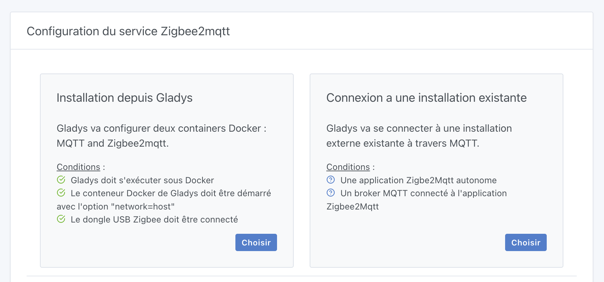
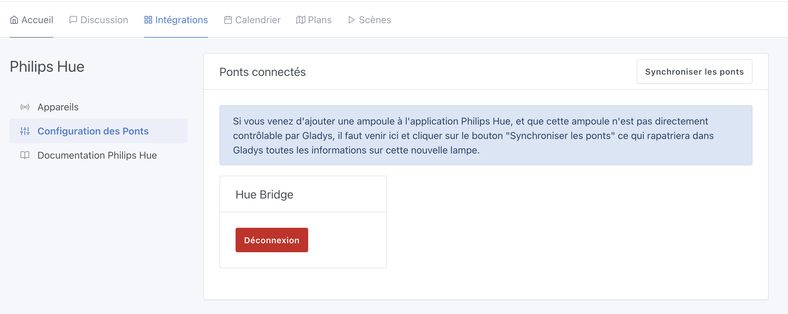
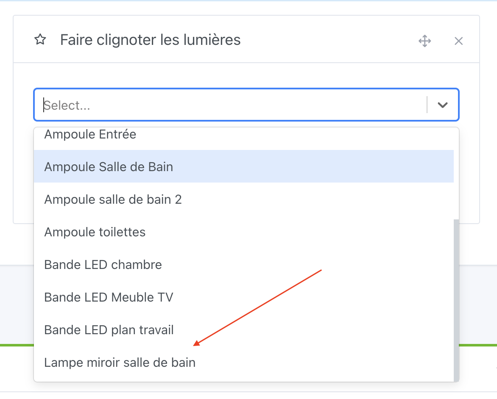

Salut à tous !

Je lance aujourd'hui Gladys Assistant 4.40, une mise à jour de Gladys qui apporte une fonctionnalité très demandée : la possibilité d'utiliser Gladys avec une instance Zigbee2mqtt existante.

:::info
Les ponts de mai, c'est toujours un bon moment pour se lancer sur un sujet.

A cette occasion, je fais -25% sur [le guide ULTIME pour mettre en place sa maison connectée](https://formation.gladysassistant.com/) avec le code **PONT_MAI_2024** ! 🚀
:::

## Utiliser Gladys avec une instance Zigbee2mqtt existante

Désormais, lorsque vous configurerez Zigbee2mqtt dans Gladys, Gladys vous proposera 2 choix :

<!--truncate-->

Soit vous êtes un débutant qui commence de zéro, et Gladys peut s'occuper de toute la configuration de Zigbee2mqtt (c'est ce que faisait Gladys jusque-là).

Soit vous êtes un utilisateur confirmé qui a déjà une installation Zigbee2mqtt existante (par exemple si vous utilisez Home Assistant ou tout autre plateforme domotique), et dans ce cas vous pouvez connecter Gladys à une installation existante.

Cette deuxième option vous permet de tester Gladys sans toucher à votre installation et vous pouvez même utiliser 2 systèmes domotiques en même temps !

C'est ça, la puissances des systèmes open-source, et ouvert 😊

Si tu es utilisateur d'une autre solution domotique, je suis preneur de ton retour : viens tester notre intégration Zigbee2mqtt, et dis nous sur [notre forum](https://community.gladysassistant.com/) si certains appareils ne pas encore géré : ça nous aide beaucoup et ça nous permet de nous améliorer !

Merci à AlexTrovato pour son travail sur ce développement 🙌

## Philips Hue : Ajout d'un bouton "Synchroniser les ponts"

Dans l'intégration Philips Hue, dans le passé si vous ajoutiez une ampoule Philips Hue à votre pont alors que Gladys tournait déjà, Gladys n'avait pas conscience de cette nouvelle ampoule.

L'explication vient de la librairie que nous utilisons, qui garde un cache des lumières disponibles car la synchronisation avec le pont est une opération coûteuse.

Désormais, j'ai rajouté un bouton "Synchroniser les ponts" qui permet de rapatrier la dernière version de la liste d'ampoules dans Gladys :

## Faire clignoter les prises dans les scènes

L'action de scène "Faire clignoter les lumières" vous permet désormais de sélectionner des prises connectées, ou tout commutateur, ce qui vous permet de faire clignoter une lumière qui serait branché sur une prise.

Attention néanmoins à ne pas faire clignoter une ampoule traditionnelle, elle risquerait de claquer. A ne faire qu'avec des LEDs !

Par exemple, chez moi l'ampoule du miroir de ma salle de bain est contrôlée par un [commutateur Zigbee ZBMINIL2](https://www.domadoo.fr/fr/peripheriques/6619-sonoff-commutateur-intelligent-sans-neutre-zigbee-30-zbminil2.html?domid=17), et apparait donc dans cette action de scène :

Merci à Cicoub13 pour ce développement 🙌

## LAN Manager: Augmentation du timeout à 60 secondes

J'ai eu des retours comme quoi le timeout de scan réseau de l'intégration LAN Manager n'était pas suffisant : je l'ai désormais augmenté de 30 secondes à 60 secondes.

## Comment mettre à jour ?

Si vous avez installé Gladys avec l’image Raspberry Pi OS officielle, vos instances se mettront à jour **automatiquement** dans les heures à venir. Cela peut prendre jusqu’à 24h, pas de panique.

Si vous avez installé Gladys avec Docker, vérifiez que vous utilisez bien Watchtower. Voir la [documentation](/fr/docs/installation/docker#mise-à-jour-automatique-avec-watchtower).

Avec Watchtower, Gladys se mettra automatiquement à jour.

## Supporter le projet

Il y a plein de façons de supporter le projet :

- Participer aux discussions sur le forum, aider les nouveaux.
- Contribuer au projet en proposant des nouvelles intégrations/fonctionnalités.
- Améliorer la documentation, qui est open-source.
- Acheter notre [guide ULTIME pour mettre en place sa maison connectée](https://formation.gladysassistant.com/)
- S'inscrire à [Gladys Plus](/fr/plus)

Merci à tous ceux qui supportent Gladys 🙏
