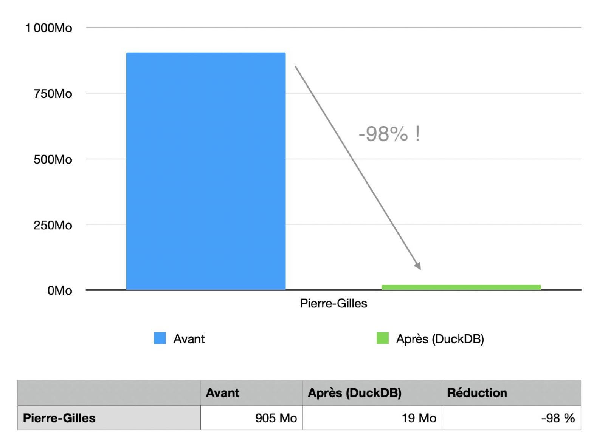
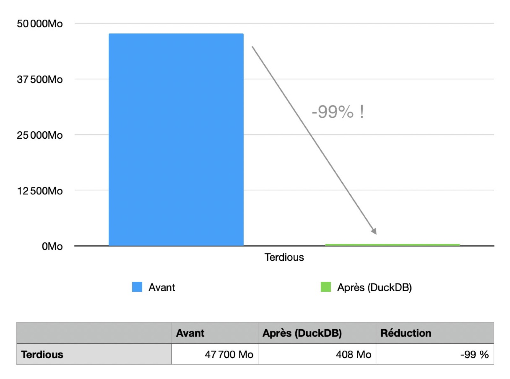
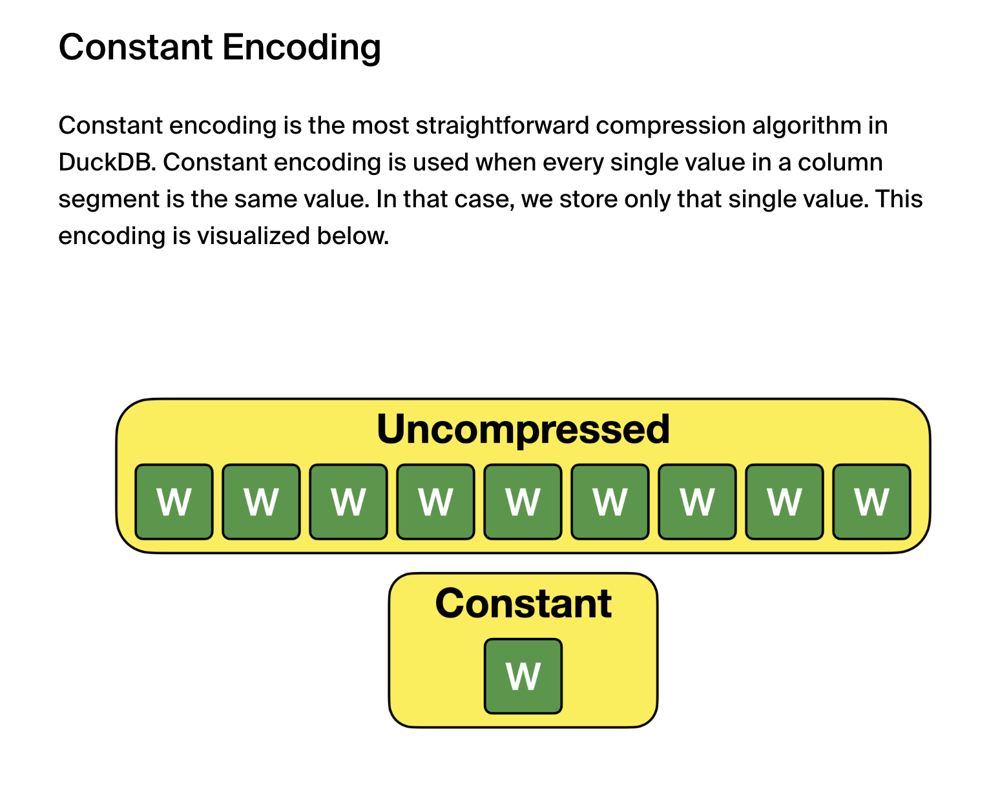
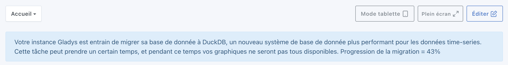
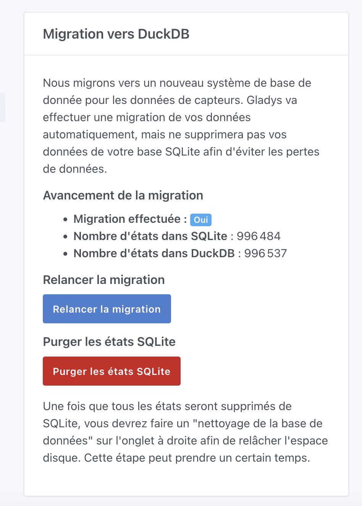
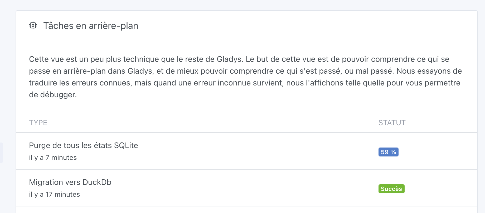
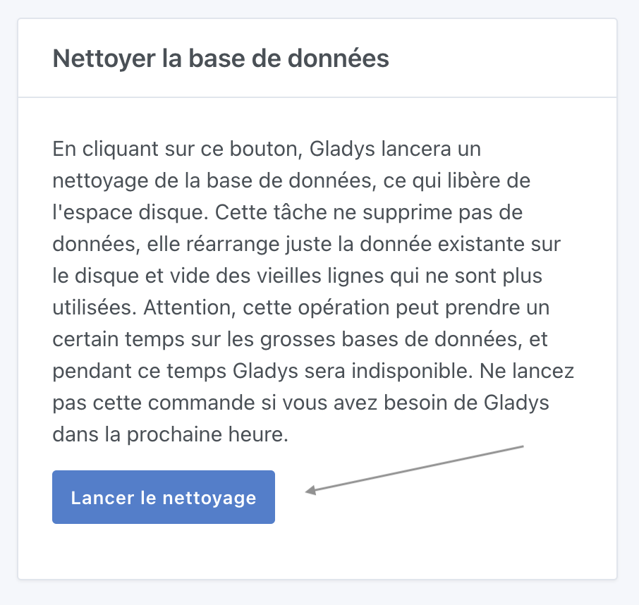

Salut à tous,

Aujourd'hui est un grand jour : je sors une version majeure de Gladys qui va améliorer drastiquement l'expérience Gladys et qui nous permet d'être à la pointe en termes de technologie de stockage de données.

Imaginez...

➡️ Votre base de donnée Gladys qui passe de 47 Go à 1.5 Go...\
➡️ Vos graphiques qui s'affichent instantanément, même sur de longues périodes de données...\
➡️ Vos sauvegardes Gladys Plus plus légères et plus rapides...

Et bien, on l'a fait !

## La technologie : DuckDB

[DuckDB](https://duckdb.org/) est un système de base de donnée OLAP, qui comme SQLite stocke les données dans un seul fichier.

<!--truncate-->

Si on devait définir DuckDB :

> DuckDB est un moteur de base de données analytique conçu pour offrir des performances optimales sur des volumes de données importants, tout en restant léger et facile à intégrer. Il est particulièrement adapté pour l’analyse de données embarquée, avec une prise en charge native des requêtes SQL complexes et un traitement en mémoire efficace.

DuckDB avec son approche OLAP + fichier est unique en son genre, et je surveillais cette techno depuis plusieurs années.

Jusque-là, DuckDB était en alpha et n'était donc pas prêt à être utilisée en production sur un produit aussi critique que Gladys.

Mais en juin, DuckDB est enfin sorti en 1.0, et a clairement annoncé que l'API et le format de fichier n'allaient plus changer de façon majeure, et ainsi DuckDB devenait utilisable en production.

## L'intégration dans Gladys

Suite au lancement de la 1.0, j'ai directement commencé le développement dans Gladys et j'ai fait un live YouTube pour tester la techno avec vous :

<div class="youtubeVideoContainerInBlog">
    <iframe  src="https://www.youtube.com/embed/EtEfyS6uHoE" title="YouTube video player" frameborder="0" allow="accelerometer; autoplay; clipboard-write; encrypted-media; gyroscope; picture-in-picture; web-share" allowfullscreen></iframe>
</div>
<br />

On a tout de suite vu ensemble que la techno était très prometteuse, et j'ai donc poursuivi le développement.

En gros, il fallait :

- Migrer les historiques de capteurs actuellement dans SQLite vers DuckDB (et si possible, sans downtime)
- Mettre en place une interface de suivi de la migration + une façon de "nettoyer" ensuite la DB SQLite
- Modifier tout le code d'écriture des valeurs de capteurs historiques
- Re-écrire les requêtes d'affichage de graphiques du tableau de bord
- Revoir tout le processus de sauvegarde Gladys Plus
- Enfin, tester avec des cas réels la migration et voir si DuckDB fonctionne bien au quotidien sur des vraies instances.

Bref, il y avait du boulot !!

## Le résultat

Le 6 août, j'ai lancé les tests "réels" en commençant sur mon installation Gladys personnelle.

Mon instance a une quarantaine d'appareils, et est live depuis février 2024.

J'avais une base de donnée de 905 Mo, pour 996 000 états de capteurs, qui une fois migrée est passée à :



Oui, vous avez bien lu, je suis passé à une base de donnée de 19 Mo ! C'est limite ridicule !

Chez le plus gros utilisateur Gladys, Terdious, avec 80 millions d'états pour une base de donnée de 47,7 Go, il est passé à :



Bref, c'est assez révolutionnaire !

Depuis maintenant 20 jours, cette nouvelle version tourne chez moi et d'autres utilisateurs Gladys sans aucun soucis.

Les graphiques sont beaucoup plus rapides, Terdious a remarqué des temps de chargement 2 fois plus rapide sur son mini-PC.

Sur son Pi 4, c'est encore plus impressionnant, les tableaux de bords comportant des graphiques s'affichent en 150 ms désormais contre 1 à 5 secondes avant.

## Comment ça marche sous le capot ?

À ce niveau-là, vous devez vous dire : mais c'est de la magie là ?

En fait, pas vraiment :

- Déjà, SQLite n'étant pas adapté pour cet usage, nous étions obligés de stocker l'information 4 fois dans la base de donnée : une fois pour la donnée "brute", une fois pour des données agrégées mensuelles, une fois pour des données agrégées journalières, et une fois pour des données agrégées horaires. Cela nous permettait d'aller chercher plus vite dans des jeux de données réduits en amont.
- Ensuite, côté SQLite, j'avais ajouté des index très précis pour répondre à des requêtes du style "Montre-moi les valeurs du capteur de température XX entre ce matin et maintenant". Ces index multicolonnes permettaient d'avoir de bonnes performances, mais étaient gourmands en stockage (là encore, c'est de la redondance).
- Enfin, DuckDB fait un travail formidable. Les données sont compressées aggressivement (Si ça vous intéresse, il y a [article sur leur blog](https://duckdb.org/2022/10/28/lightweight-compression.html)).

Par exemple, dans le cas de Gladys, si vous avez un capteur binaire (capteur d'ouverture de porte, de mouvement, de fuite, etc.), les données ne sont que des 0 et des 1 : il n'y a que 2 valeurs possibles.

Ce genre de jeu de donnée est très facile à compresser :



## Comment mettre à jour ?

Gladys va normalement se mettre à jour automatiquement si vous utilisez Watchtower.

Si vous avez installé Gladys avec Docker, vérifiez que vous utilisez bien Watchtower. Voir la [documentation](/fr/docs/installation/docker#mise-à-jour-automatique-avec-watchtower).

Si vous êtes impatient et que vous savez ce que vous faites, il est aussi possible de lancer Watchtower manuellement en "one-shot" :

```sh
docker run --rm \
    -v /var/run/docker.sock:/var/run/docker.sock \
    containrrr/watchtower \
    --run-once
```

(Pensez au sudo si vous faites tourner Gladys en tant qu'administrateur)

Une fois Gladys à jour en `v4.45.0`, il y a plusieurs étapes à faire avant de voir votre DB réduite.

## La migration

Dès que votre instance se sera mise à jour, la migration vers DuckDB va se lancer.

En haut de votre tableau de bord, vous verrez un message :



Pendant cette migration, votre instance peut être ralentie et vos graphiques ne seront pas disponibles.

Vous pouvez retrouver l'état de la migration dans les "Paramètres → Systèmes" :



Une fois la migration terminée, la ligne "Migration effectuée" passera de "Non" à "Oui".

Prenez un moment pour parcourir Gladys et vérifier que tous vos graphiques semblent bons.

Si c'est le cas, vous pouvez alors purger les états SQLite en cliquant sur le bouton rouge "Purger les états SQLite", ce qui lancera une tâche :



Pendant cette tâche, votre instance Gladys sera un peu ralentie, ce qui est normal.

Suivant le nombre d'états dans votre base de donnée et la vitesse de votre disque, cette tâche peut prendre quelques heures, voire des jours si vous avez une grosse DB.

Gladys reste utilisable, mais ralentie !

Enfin, une fois cette purge terminée, vous devrez faire un nettoyage de la DB SQLite pour que le fichier sur votre disque soit finalement réduit.

Pour cela, cliquez sur le bouton "Nettoyer la base de données" :



Cette tâche est **bloquante** et Gladys ne sera pas disponible pendant le nettoyage.

Enfin, une fois la tâche terminée, redémarrez Gladys.

C'est bon, vous devriez avoir une base de données beaucoup plus petite et une instance Gladys bien plus rapide !

## Conclusion

J'espère que cette mise à jour aura chez vous les mêmes résultats que chez tous les testeurs !

En tout cas, je suis persuadé que cette mise à jour va révolutionner l'utilisation de Gladys, et je suis preneur de vos retours.

Merci encore à tous les testeurs qui ont aidé au développement 🙏

## Se lancer sur Gladys ?

Si tu veux te lancer sur Gladys et que tu n'as pas de matériel, je lance un kit de démarrage inédit !

Je te propose :

- Un mini-PC surpuissant (le même que j'ai chez moi)
- Un accès à la formation Gladys (plein de contenu vidéo et écrit)
- Un an de Gladys Plus

Le tout, pour un prix imbattable.

Pour en savoir plus, [c'est ici](/fr/starter-kit/) !

## Supporter le projet

Il y a plein de façons de supporter le projet :

- Participer aux discussions sur le forum, aider les nouveaux.
- Contribuer au projet en proposant de nouvelles intégrations/fonctionnalités.
- Améliorer la documentation, qui est opensource.
- Profiter de la [la formation Gladys (-25% actuellement !)](https://formation.gladysassistant.com/?coupon=DUCKDB_LAUNCH)

Merci à tous ceux qui supportent Gladys 🙏
