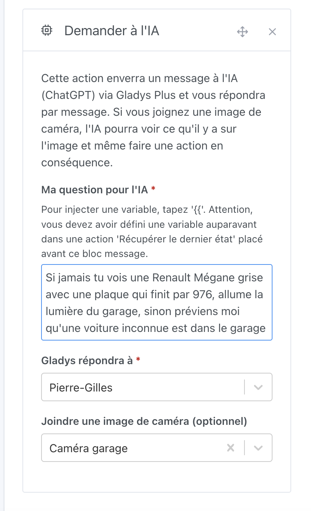
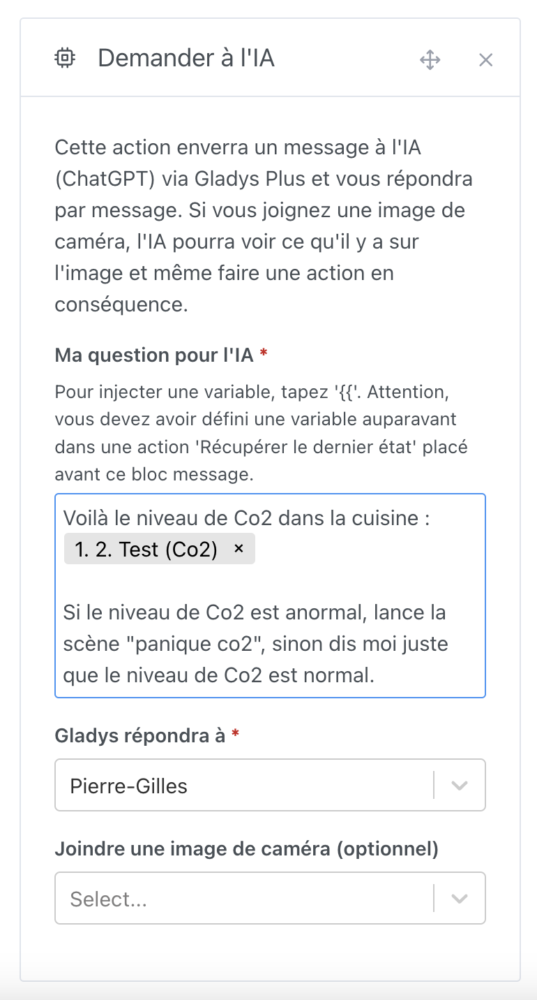

Salut à tous !

Aujourd’hui, je suis heureux de vous présenter Gladys Assistant 4.48, une version où l’intelligence artificielle s’intègre encore plus profondément dans Gladys pour rendre votre maison encore plus intelligente et réactive.

Depuis janvier 2023, vous pouviez déjà poser des questions à ChatGPT via Gladys.

C’était un bon début, mais je veux aller encore plus loin ! Et si l’IA pouvait être proactive et prendre des décisions pour vous ?

## Imaginez les possibilités

Imaginez qu’une voiture arrive devant chez vous. Un agent de sécurité dévoué surveillerait, reconnaîtrait votre voiture – sa forme, sa couleur, sa plaque – et saurait immédiatement que c’est bien vous. Mais embaucher un agent 24/24, ce n’est pas à la portée de tous !

Et si l’IA pouvait remplir ce rôle ?

Dans Gladys, vous pouvez désormais écrire une instruction simple, par exemple :

> “Si une voiture est devant la maison, et qu’il s’agit d’une Renault Mégane rouge immatriculée XXX, allume le garage ; sinon, préviens-moi qu’un intrus est là.”

Avec Gladys 4.48, cette scène devient réalité ! Vous avez une IA généraliste prête à surveiller et à prendre des décisions, exactement comme un agent dédié, mais sans en payer le prix.

## Un exemple concret

Cette nouveauté repose sur l’API OpenAI ChatGPT 4o-mini, avec sa toute dernière fonctionnalité de vision, disponible pour les abonnés [Gladys Plus](/fr/plus/).

Dans une scène, vous pouvez créer une action “Demander à l’IA” et, si vous le souhaitez, lui transmettre une image de caméra.

Prenons l’exemple de la voiture :

Si un mouvement est détecté devant chez vous, Gladys enverra l’image de la caméra du garage et analysera la situation. Ensuite, selon la détection :

- Si la bonne voiture est reconnue, le garage s’allume.
- Si une autre voiture est détectée, vous recevez une alerte d’intrus sur votre téléphone.

## Analyser une valeur de capteur

La caméra n’est qu’un exemple parmi tant d’autres ! Vous pouvez aussi envoyer des données de capteurs à l’IA et lui demander d’agir en fonction des résultats.

Par exemple, vous pourriez transmettre la valeur d’un capteur de CO2 et demander une action en cas de niveau anormal :

Pas besoin de chercher les niveaux recommandés de CO2 dans une pièce : l’IA se base sur ses connaissances étendues (en gros, tout internet !) pour évaluer la situation et agir intelligemment.

Il est même possible d’injecter des valeurs récupérées d’autres API pour :

- Recevoir un bulletin météo dès le réveil
- Suivre les marchés financiers avec un récapitulatif boursier
- Faire un point d’actualité avec un flux RSS
- Vérifier la sécurité de la maison chaque jour durant vos vacances (température normale, etc.)

Les possibilités sont infinies ! J’ai vraiment hâte de voir ce que vous allez créer avec cette mise à jour. Partagez vos essais sur le forum pour inspirer les autres !

## Les autres nouveautés

- Dans les scènes, les filtres par tag ou titre sont maintenant persistés dans l’URL, ce qui permet de retrouver facilement un filtre après avoir navigué dans les scènes.
- Support des chauffages fil-pilote dans les scènes.
- Les images de caméras sont maintenant récupérées via TCP (au lieu d'UDP), évitant les erreurs d’affichage (notamment le bug des bandes vertes).
- Correction des graphiques binaires : la première valeur s’affiche désormais correctement.
- DuckDB : les connexions sont maintenant fermées proprement lors de l’extinction de Gladys.

Merci à tous ceux qui ont contribué à cette mise à jour ! 🙌

## Prêt à découvrir Gladys ?

Si vous débutez et cherchez un kit tout-en-un, j’ai ce qu’il vous faut !

Je propose un pack incluant :

- Un mini-PC surpuissant (celui que j’utilise chez moi !)
- Un accès à la formation Gladys (contenu vidéo et écrit)
- Un an de Gladys Plus

Le tout pour un prix imbattable de [259,97€](/fr/starter-kit/) !

## Comment mettre à jour ?

Assurez-vous d’utiliser Watchtower pour des mises à jour automatiques. Consultez la [documentation](/fr/docs/installation/docker#mise-à-jour-automatique-avec-watchtower).

Avec Watchtower, Gladys se mettra à jour automatiquement.
