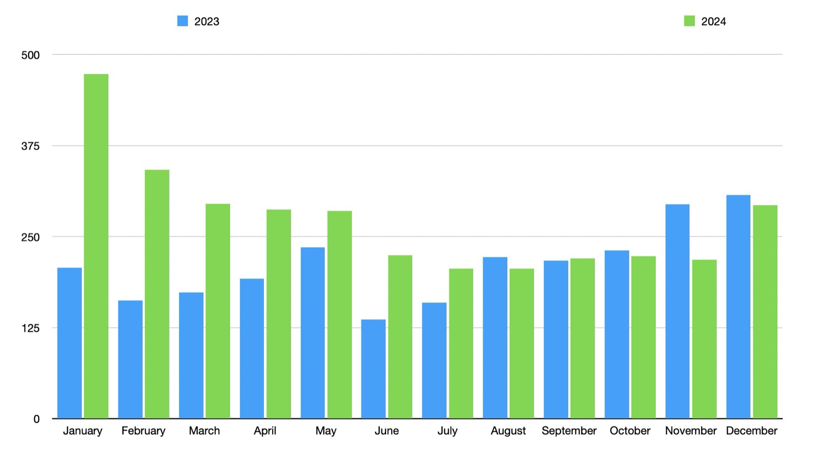
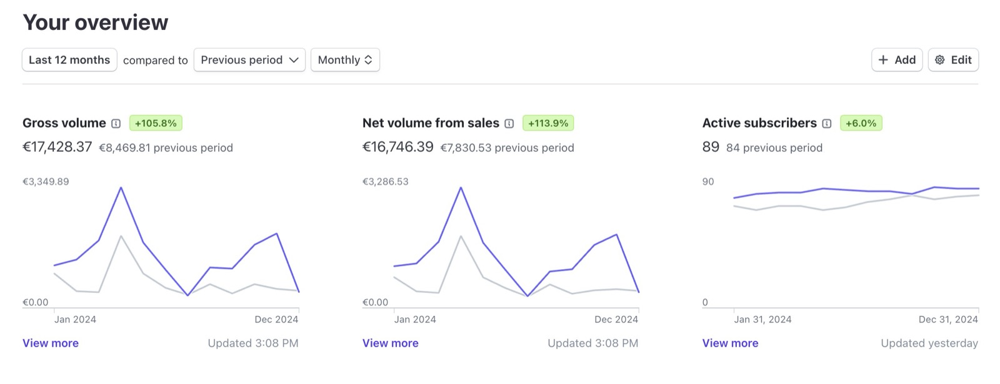
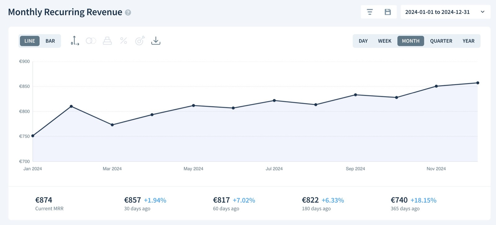
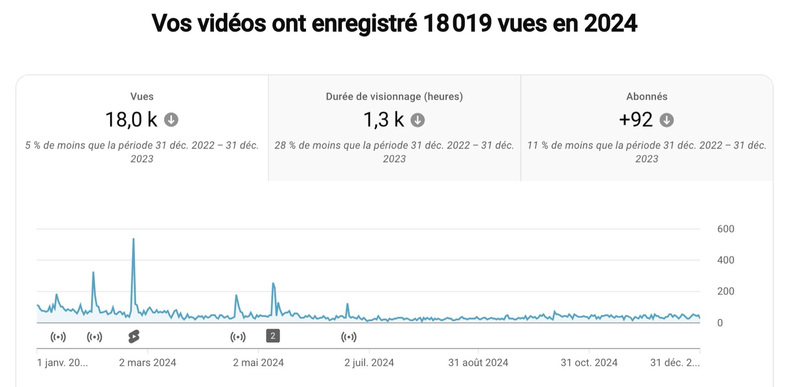

Salut à tous, et bonne année 2025 !

J'espère que vous avez passé une excellente année 2024.

Côté Gladys, 2024 a été une année charnière, marquée par des changements dans ma vie personnelle qui ont permis à Gladys de se développer à son plein potentiel !

En effet, j'ai déménagé dans un appartement que j'ai entièrement domotisé avec Gladys. Cela en fait maintenant une véritable vitrine de tout ce travail et m'a permis d'enregistrer des dizaines de tutoriels sur la domotique.

Si vous préférez ce bilan en vidéo, j'ai fais un live YouTube qui est disponible en replay ici :

    <iframe  src="https://www.youtube.com/embed/_bmsWALVePc" title="YouTube video player" frameborder="0" allow="accelerometer; autoplay; clipboard-write; encrypted-media; gyroscope; picture-in-picture; web-share" allowfullscreen></iframe>

 

## Que s'est-il passé en 2024 ?

{/* truncate */}

L'année 2024 a été très active :

- **27 versions de Gladys** (environ une toutes les deux semaines)
- Tournage et lancement d'une [formation domotique complète](https://formation.gladysassistant.com/) (41 vidéos/articles actuellement)
- Lancement d'un [kit de démarrage](/fr/starter-kit/) incluant du hardware

### Développement

De nombreux chantiers majeurs ont été déployés cette année :

- Migration à **DuckDB**, réduisant le stockage jusqu'à 97 %
- Intégration de **Z-Wave JS**, **Netatmo**, **Sonos**, **Free Mobile**, **Airplay**, etc.
- Gestion du **Tempo EDF**
- Prise en charge de **Zigbee2mqtt** en externe
- **IA** : Voix sur enceintes (Sonos, Google Home, HomePod)
- **IA** : ChatGPT 4.0 et IA proactive dans les scènes

Et il y en a eu plein d'autres !

## Usage

Le début de l'année 2024 a connu une forte hausse des nouvelles installations par rapport à 2023 :

La fin de l’année a été plus calme, et il est difficile de dire si cette baisse d’activité est liée à ma propre réduction de rythme — j'étais en voyage en septembre/octobre, puis en congés de Noël en fin d'année — ou si c’est simplement une période où tout le monde était globalement moins disponible. Quoi qu’il en soit, ces variations sont normales : il y a toujours des hauts et des bas 😄

## Chiffre d'affaires

Gladys Plus a généré **17 428 € de chiffre d'affaires en 2024**, soit une augmentation de **+105,8 %**. Ce bond s'explique notamment par le lancement du kit de démarrage qui est un vrai succès.

Ces résultats confirment la pertinence des choix stratégiques faits pour Gladys, et je vais poursuivre dans cette direction en 2025.

Le MRR de Gladys Plus est désormais de **874 €**, en augmentation de **+18,15 %** par rapport à l'année dernière.

## La chaîne YouTube

Cette année, la [chaîne YouTube](https://www.youtube.com/@GladysAssistant) a connu une légère baisse de vues, car je n'ai pas publié de vidéos dans la seconde moitié de l'année.

Travaillant à temps partiel sur Gladys, j'ai dû arbitrer entre le développement, le support, la documentation, l'enregistrement de la formation et le kit de démarrage. Mettre de côté la chaîne YouTube a été un choix stratégique, et les résultats le confirment. 😄

En 2025, je souhaite relancer cette chaîne pour séduire de nouveaux utilisateurs. Pourquoi pas organiser de nouveaux **live coding** ?

Quelques vidéos publiées en 2024 :

- [Live Coding: Tempo EDF intégré](https://youtube.com/live/XhizKv8KNLQ?feature=share)
- [Live Coding: Découverte de DuckDB](https://youtube.com/live/EtEfyS6uHoE?feature=share)
- [Live: Je vous dévoile un nouveau produit !](https://youtube.com/live/60hu25gmTYA?feature=share)

## Les réseaux sociaux

Sur les réseaux sociaux :

- [Twitter de Gladys Assistant](https://twitter.com/gladysassistant) : **2 680 followers**
- [Facebook Gladys Assistant](https://www.facebook.com/gladysassistant) : **759 likes**
- [Instagram de Gladys Assistant](https://www.instagram.com/gladysassistant) : **580 abonnés**

Sur mon compte personnel : **2 354 followers** sur [Twitter](https://twitter.com/pierregillesl).

## La newsletter

Vous êtes **3 187** à suivre la [newsletter Gladys Assistant](https://email-list.gladysassistant.com/subscription/1mXJoEWEl), répartis comme suit :

- **2 647** abonnés en français
- **540** abonnés en anglais

Bien que la newsletter française ait légèrement diminué, celle en anglais est en hausse. J'ai également renforcé l'utilisation de cet outil de communication en 2024.

## Le GitHub Gladys Assistant

Le dépôt [Gladys Assistant sur GitHub](https://github.com/GladysAssistant/Gladys) compte désormais **2 743 étoiles ⭐**, soit une augmentation de **+12,88 %**.

N'oubliez pas de soutenir le projet en laissant une étoile ⭐ si ce n'est pas déjà fait !

# Projets et objectifs pour 2025

## Intégration Matter

L’écosystème Matter devient de plus en plus mature : des appareils sérieux arrivent sur le marché, et les bibliothèques commencent à se développer.

Côté Node.js, la bibliothèque Matter officielle est désormais disponible, ce qui va nous permettre de développer une compatibilité.

Ma vision de Matter est très positive : il pourrait enfin représenter le protocole domotique unique dont je rêve depuis le début du projet.

Je pense qu’à terme, il n’y aura peut-être plus que Matter, ce qui diminuerait le fossé entre les différents logiciels de maison connectée. Aujourd’hui, des logiciels comme Home Assistant bénéficient d’un avantage significatif grâce à leur nombre d’intégrations, mais cet avantage serait réduit si Matter devenait le protocole unique.

Si la couche de communication se standardisait avec Matter, seule l’expérience utilisateur ferait la différence entre les différents logiciels...

Ce qui m’amène au deuxième point :

## Améliorations UX

J’aime régulièrement faire des "passes UX" sur Gladys et vous poser la question : y a-t-il de petites choses qui vous gênent au quotidien et qui changeraient votre vie si on les corrigeait ?

Chaque petit changement améliore le produit de manière incrémentale, et ces ajustements cumulés rendent Gladys de plus en plus simple à utiliser.

En 2025, je veux réaliser un gros travail sur l’UX pour amener Gladys à un niveau encore supérieur en termes de simplicité.

## Encore plus d’IA

Si 2024 a été sans aucun doute l’année de l’IA, cette tendance va se confirmer en 2025.

Je continuerai de suivre l’état de l’art en matière d’IA pour vous offrir le meilleur dans Gladys.

L’objectif reste le même : faire de Gladys l’assistant intelligent de votre maison.

## Expansion en Amérique du Nord

Le [forum international Gladys](https://community.gladysassistant.com/) s’est beaucoup développé en 2024.

Côté installations, 12 % des nouvelles installations se font désormais aux États-Unis, et 7 % au Canada.

Je pense que le marché nord-américain doit être mon prochain focus, car c’est un marché gigantesque (491 millions d’habitants) et très technophile. Il y a aussi beaucoup de développeurs là-bas, qui pourraient devenir contributeurs et nous aider à avancer.

Pour toucher ce marché, voici quelques pistes :

- Développer des compatibilités avec les appareils qu’ils utilisent (d’où le développement Matter !).
- Communiquer là où cette population est active sur Internet (Reddit, X ?).
- Contacter des influenceurs locaux.

Si vous avez des idées à ce sujet, je suis preneur ! 😄  
En plus, nous avons un fervent utilisateur du projet qui vit désormais au Canada et pourra nous aider à mieux comprendre ce marché. (Coucou @lmilcent 👋)

## Un kit de démarrage plus abordable ?

Le kit de démarrage en 2024 a été un succès, mais j’aimerais proposer un kit encore moins cher.

Le problème, c’est qu’à 259 €, il est déjà difficile de faire mieux, sauf lorsque mes fournisseurs baissent leurs prix ponctuellement.

Une solution pourrait être de proposer un kit basé sur un mini-PC moins puissant, ce qui permettrait de réduire le coût. Je pense notamment à la version non-pro du Beelink S12, équipée de 8 Go de RAM, 256 Go de SSD, et d’un processeur Intel N95.

Pensez-vous qu’un kit moins puissant mais plus abordable pourrait vous intéresser ? 😄

## Des idées de fonctionnalités ?

Si vous avez des idées ou des demandes de nouvelles fonctionnalités, n’hésitez pas à les proposer sur le [forum](https://community.gladysassistant.com/c/feature-requests/43/l/latest?order=votes) !

# Bonne année, et merci à tous !

Merci à tous ceux qui soutiennent Gladys, que ce soit via votre aide sur le forum, votre abonnement à Gladys Plus, ou l’achat du kit de démarrage.

J’espère que 2025 sera une année aussi radieuse que 2024 ! 🚀

Pierre-Gilles Leymarie
