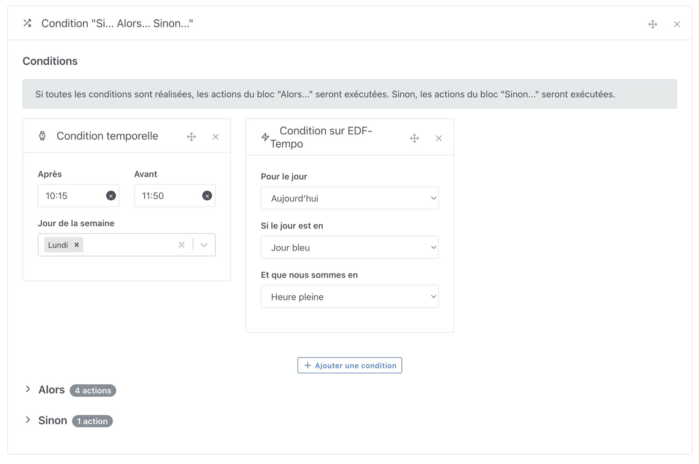
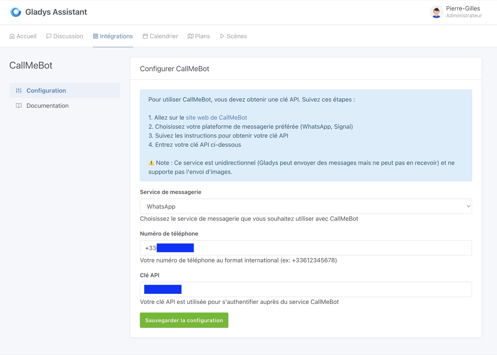
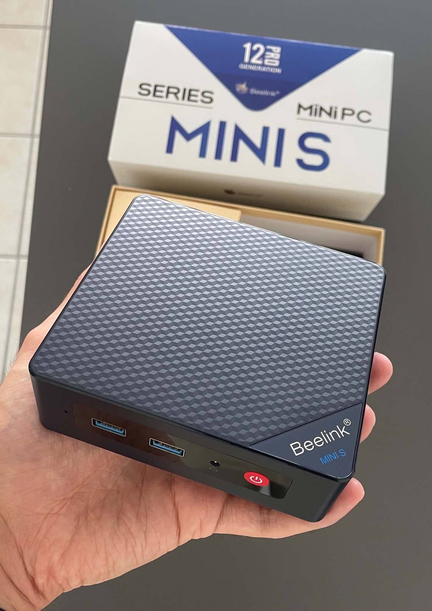

Je suis ravi d'annoncer la sortie de Gladys Assistant 4.55.0, une mise à jour qui apporte des améliorations significatives pour rendre votre maison connectée encore plus intelligente et flexible.

## Condition "Si... Alors... Sinon" dans les scènes

L'une des fonctionnalités les plus attendues est enfin là !

Vous pouvez désormais ajouter des conditions "Si... Alors... Sinon" dans vos scènes, ce qui vous permet de créer des scénarios avancés avec plusieurs chemins d'exécution. Cette amélioration vous offre un contrôle plus fin sur vos automatisations, sans multiplier les scènes.

<!-- truncate -->

### Exemples d'utilisation :

- **Si** la température dépasse 25°C **alors** allumer le ventilateur, **sinon** fermer les volets.
- **Si** quelqu'un est à la maison **alors** allumer les lumières, **sinon** activer le mode absence.

J'ai hâte de voir comment vous allez utiliser cette nouveauté !

## Envoi de messages vers WhatsApp et Signal avec CallMeBot

Vous souhaitez recevoir des alertes directement sur WhatsApp ou Signal ?

C'est désormais possible grâce à l'intégration de CallMeBot.

Vous pouvez envoyer des notifications instantanées sur ces plateformes pour être informé en temps réel d'un événement dans votre maison.

Idéal pour recevoir une alerte en cas d’intrusion ou de fuite d’eau !

## Autres améliorations

- **Qualité d’image améliorée pour les caméras** : Résolution augmentée à 1280px pour un affichage plus net sur le tableau de bord et dans les messages Telegram.
- **Correction de l'affichage des unités sur les graphiques du tableau de bord** : Lors de la modification d'un graphique, les unités des équipements sont désormais bien affichées. Pour ceux qui ont des graphiques sans unités, il faut désélectionner les fonctionnalités puis les resélectionner. Désolé pour le dérangement 🙏
- **Redirection des utilisateurs allemands vers la documentation en anglais** pour une meilleure accessibilité.

## Mettez à jour dès maintenant !

Cette version apporte encore plus de flexibilité et de puissance à Gladys Assistant.

Si vous utilisez WatchTower, Gladys se mettra à jour automatiquement dans les prochaines 24 heures.

## Commencez sur Gladys Assistant avec notre kit de démarrage dès 165€

Le kit de démarrage est de retour, avec deux offres :

- Un mini-PC Beelink mini S12 (Processeur N95, 8Go RAM, 256Go SSD) à 165€
- Un mini-PC Beelink mini S12 Pro (Processeur N100, 16Go RAM, 500Go SSD) à 199€

Dans ce kit, vous trouverez le mini-PC + l’accès à la formation complète Gladys + un an d’accès à Gladys Plus 🔥

👉 [J’en profite !](/fr/starter-kit/)
