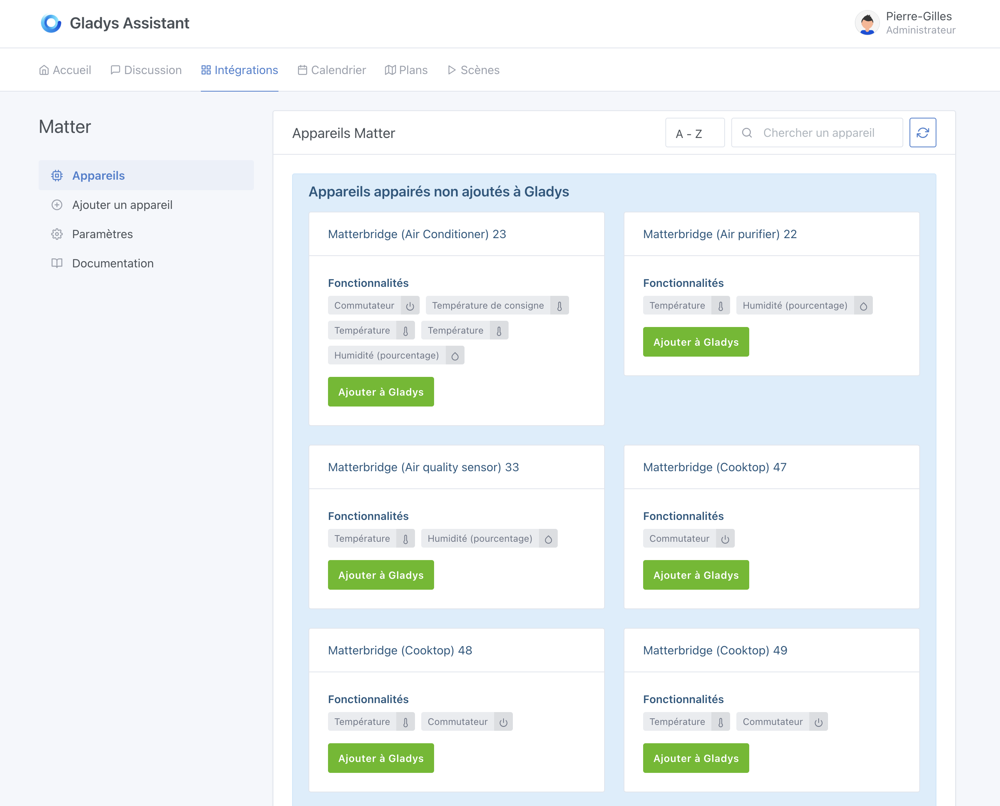
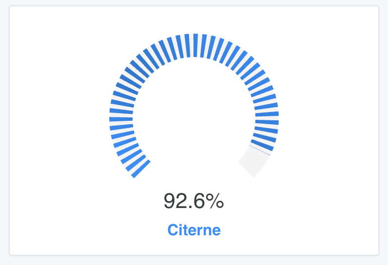
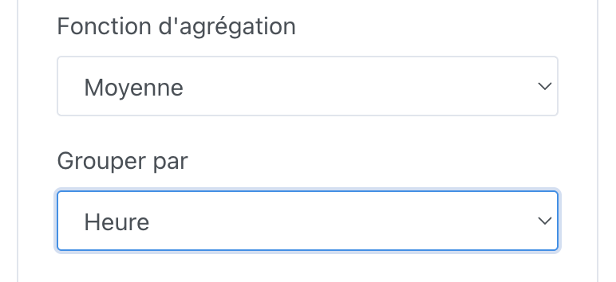
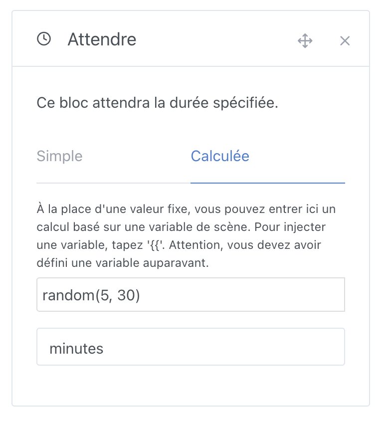
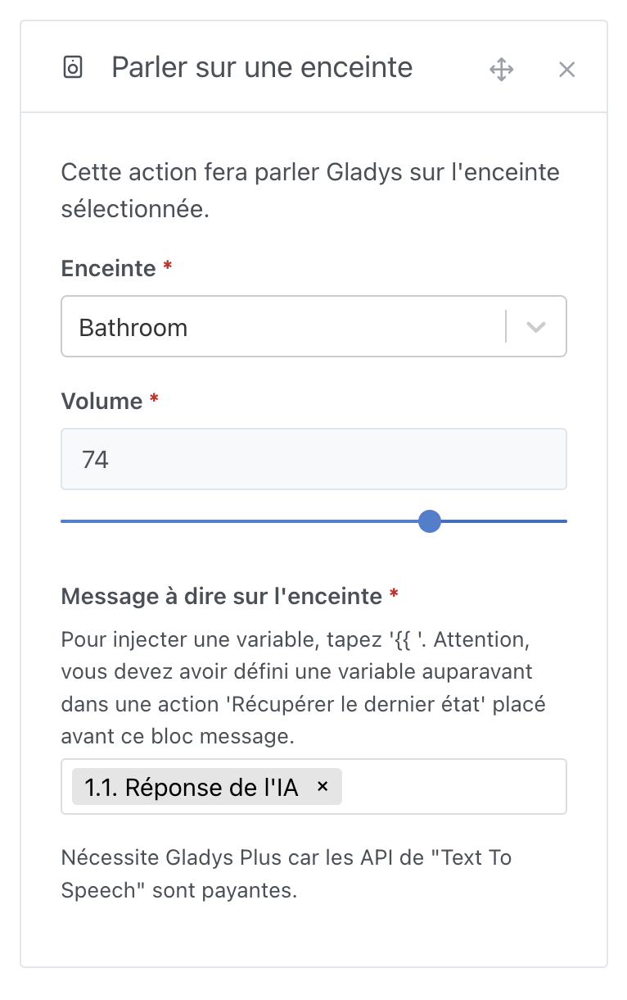
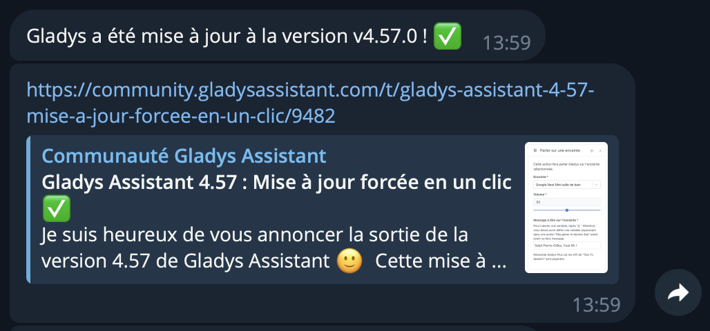
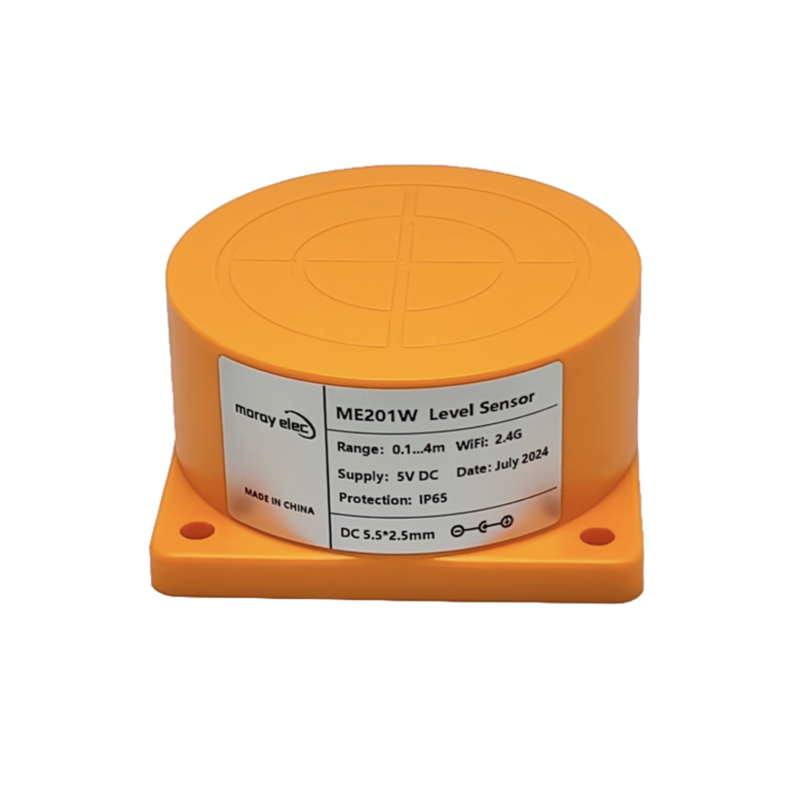

Si vous êtes sur le forum Gladys, vous l'aurez remarqué, les dernières semaines ont été particulièrement actives !

Aujourd'hui, je suis très heureux de sortir Gladys Assistant 4.58, qui apporte notamment le support de Matter, mais c'est loin d'être la seule chose intéressante dans cette version 😄

## Intégration Matter

J'en parlais dans mon [bilan de l'année 2024](/fr/blog/2024-year-in-review/), je suis persuadé que Matter est une petite révolution dans le monde de la maison connectée, et une révolution qui aura un **impact extrêmement positif pour Gladys**.

Ce protocole est ouvert, fonctionne entièrement en local, et permet enfin d'avoir un language commun entre des appareils de marques diverses.

Fini les protocoles propriétaires, fini les applications tierces, fini les API cloud, fini les données qui partent sur des serveurs tiers 😎

Je dis que ce protocol est ouvert car n'importe qui peut créer un appareil Matter, même en DIY.

Il y a par exemple un excellent projet open-source, [Matterbridge](https://github.com/Luligu/matterbridge), qui a pour objectif de connecter des appareils qui ne sont pas compatible Matter à un réseau Matter. Ce projet permet par exemple de rendre compatible Matter des appareils **Shelly**, **Somfy Tahoma**, **Zigbee2mqtt**, **Home Assistant**, et plus.

Grâce à ce projet, tous ces appareils deviennent de-facto compatible Gladys Assistant !

Pour certains d'entre vous qui ont des appareils farfelus, il est même possible de coder un petit plugin Matterbridge pour ajouter le support Matter à votre appareil, et ainsi l'intégrer facilement dans Gladys Assistant.

En tout cas, cette intégration est maintenant disponible :

L'objectif pour moi est de couvrir 100% des appareils Matter, et je suis preneur de vos retours pour que nous puissions y parvenir.

Pour commencer avec l'intégration Matter, vous pouvez suivre ce tutoriel :

👉 [Intégrer des appareils Matter dans Gladys Assistant](/fr/docs/integrations/matter/)

## Widget Jauge sur le tableau de bord

Vous pouvez maintenant ajouter un widget "Jauge" à votre tableau de bord, pratique pour visualiser le taux de remplissage d'une citerne, le niveau de batterie d'un appareil et bien plus!

## Amélioration du widget "Graphiques"

Le widget "Graphiques" supporte désormais des fonctions d'agrégations personnalisées :

Ainsi que du groupage par interval de heure, jour, semaine, mois, année :

Ces améliorations vous permettront de mieux visualiser vos données, par exemple :

- Afficher le **cumul** de précipitations **par jour**
- Afficher la **somme** par mois de consommation électrique
- Afficher le **nombre** de valeurs de capteurs reçues **par semaine**
- Afficher la **valeur minimum** de batterie **par jour** de votre stockage batterie

Les possibilités sont infinies !

## L'action de scène "Attendre" support des valeurs dynamiques

Il est maintenant possible d'injecter des variables et de faire des calculs dans le widget "Attendre".

Par exemple, si vous voulez attendre entre 5 et 30 minutes de manière aléatoire, vous pouvez utiliser cette fonction :

Super pratique pour simuler une présence !

Il est aussi possible d'injecter une variable venant d'un capteur, ou même de l'IA Gladys...

## Récupérer le résultat d'une requête à l'IA

Dans les scènes, vous pouvez utiliser notre bloc "Demander à l'IA" pour poser une question à l'intelligence artificielle et avoir un avis sur une situation.

C'est la véritable "IA Proactive" dont nous avons tous rêvé !

Par exemple, cette action vous permet d'identifier une voiture sur une image de caméra, d'analyser une valeur de capteur sans que vous ayez besoin d'intervenir.

La réponse de l'IA est désormais injecté dans une variable de scène qui est utilisable dans tous les autres blocs, par exemple, parler sur une enceinte :

## Notification de mise à jour Gladys

Désormais, Gladys vous enverra une notification quand elle vient de se mettre à jour.

La notification est envoyée aux administrateurs Gladys, dans leur langue, sur leurs moyens de communications configurés: Telegram, What's App, Signal ou NextCloud Talk.

## Alarme : L'armement partiel verrouille désormais vos tablettes

Si vous utilisez l'alarme dans Gladys, et que vous utilisez l'armement partiel la nuit ou quand vous faites une sieste en journée, sachez qu'il verrouille désormais toutes les tablettes de la maison, afin d'empêcher un potentiel intru d'accéder à votre domotique pendant votre sommeil !

Concrètement, dès que le mode "Armement partiel" est activé, toutes les tablettes de la maison auront cet affichage afin de protéger votre installation :

## Zigbee2mqtt : Support du capteur de niveau Tuya ME201WZ

Si vous voulez mesurer le niveau d'un réservoir en temps réel, et recevoir des alertes quand le niveau est trop bas ou trop haut, vous pouvez maintenant utiliser le [capteur Zigbee Tuya ME201WZ](https://www.domadoo.fr/fr/produits-compatibles-jeedom/7616-moray-capteur-de-niveau-d-eau-liquide-carburant-zigbee-tuya-me201wz.html?srsltid=AfmBOopJAiC11SjrgcWMaoOQF1aLvJhvA_dW97shKq8eHXQ_cpz1thNj?domid=17), qui est pleinement supporté par Gladys 🙂

## ZWaveJS: Support de la mesure d'énergie

Les appareils qui supportent les mesures d'énergies comme le ZW075 AEON Labs Smart Switch Gen5 sont désormais supportés par notre intégration ZWave, basée sur ZWaveJS.

Merci à @Sescandell pour le développement !

## Et ce n'est pas tout !

Cette intégration apporte de nombreux autres améliorations, notamment :

- **HomeKit** : Limitation du nom des accessoires à 64 caractères maximum (conformité avec les spécifications). Merci à @bertrandda pour le développement 🙏
- **MQTT** & **Zigbee2MQTT** : Amélioration des performances de recherche sur la page des appareils.
- **Scènes** :
  - Possibilité de supprimer la première condition dans un groupe de conditions multiples.
  - Nouvelle barre inférieure pour sauvegarder et tester une scène + confirmation avant suppression. Merci à @cicoub13 pour le développement 🙏
  - Ajout d’un bouton pour insérer un groupe d’actions.
  - Les filtres sont maintenant conservés après suppression d’une scène.
- **Dashboard** :
  - Ajout d’un bouton pour insérer un widget à une position précise.
  - Affichage des appareils MQTT "non capteurs" mais non contrôlables comme des capteurs.
  - Correction de l’affichage des placeholders MQTT dans les scènes.
  - Le widget de contrôle d’éclairage n’apparaît que s’il y a plus de deux lumières.
- **Websocket locaux** : Correction d’un bug causant un clignotement visuel sur le tableau de bord.

Le CHANGELOG complet est disponible [sur Github](https://github.com/GladysAssistant/Gladys/releases/tag/v4.58.0).

Merci à tous les contributeurs, et à tous les testeurs qui m'ont bien aidé pour cette release, notamment @mutmut qui m'a énormément aidé pour le support Matter.

## Comment mettre à jour ?

Gladys se mettra automatiquement à jour si vous utilisez Watchtower.

Sinon, vous pouvez utiliser notre nouveau bouton pour mettre à jour Gladys en un clic :

Ce bouton est disponible depuis Gladys Assistant v4.57 dans l'onglet `Paramètres` -> `Système`.

## Envie de vous lancer avec Gladys ?

Si vous débutez et cherchez une solution simple et complète, j’ai conçu un kit idéal pour démarrer sereinement :

- Un mini-PC performant: 4 cœurs, 8/16 Go de RAM, 256/500 Go de SSD
- Un accès à une formation complète dans laquelle je vous présente mon installation pas à pas.
- Un an d’abonnement à Gladys Plus, avec sauvegardes automatiques, accès à distance chiffré, et bien plus.

Le tout à partir de [165,98€](/fr/starter-kit/).

En choisissant ce kit, vous gagnez du temps, vous soutenez un projet open-source français, et vous profitez d’une solution pensée pour durer 😎
