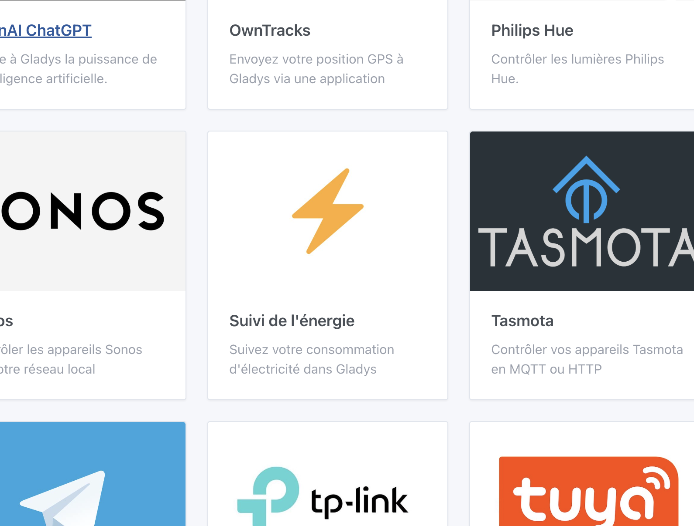
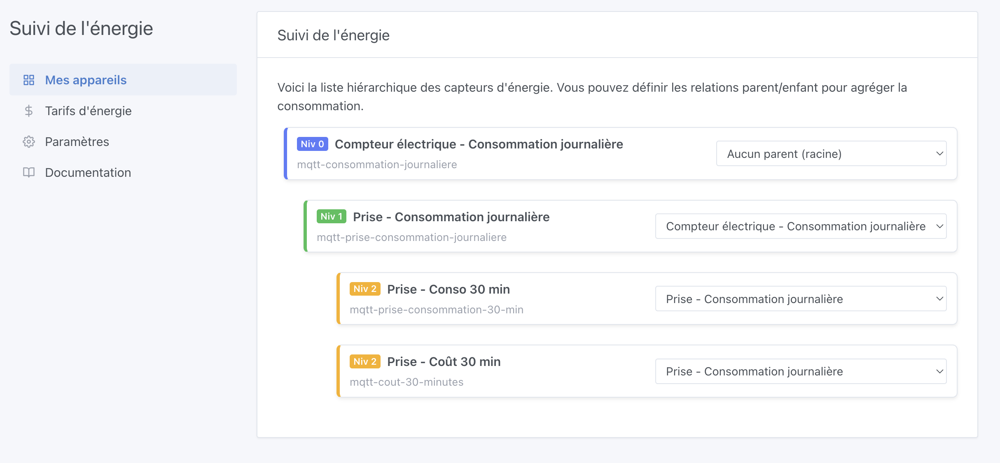
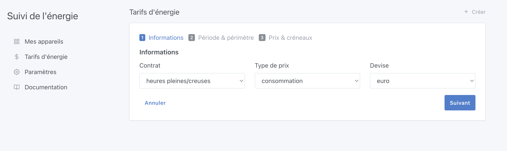
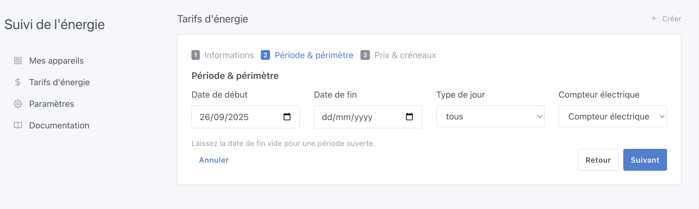
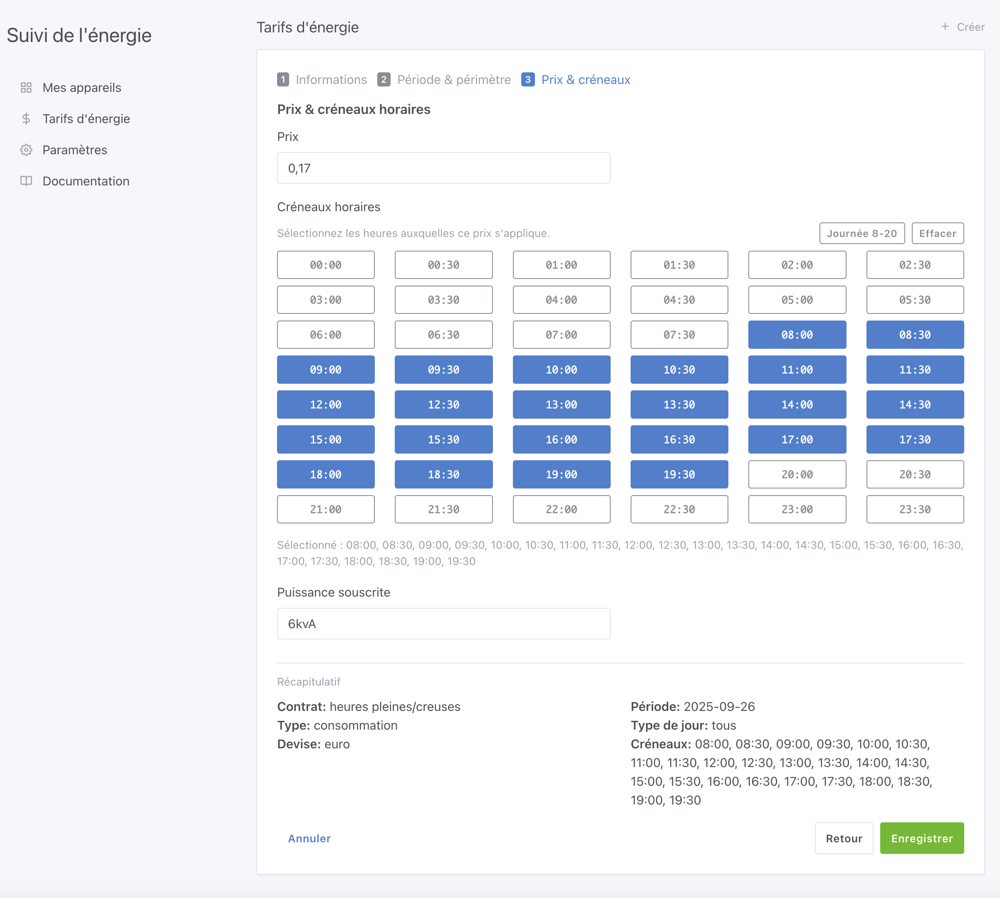
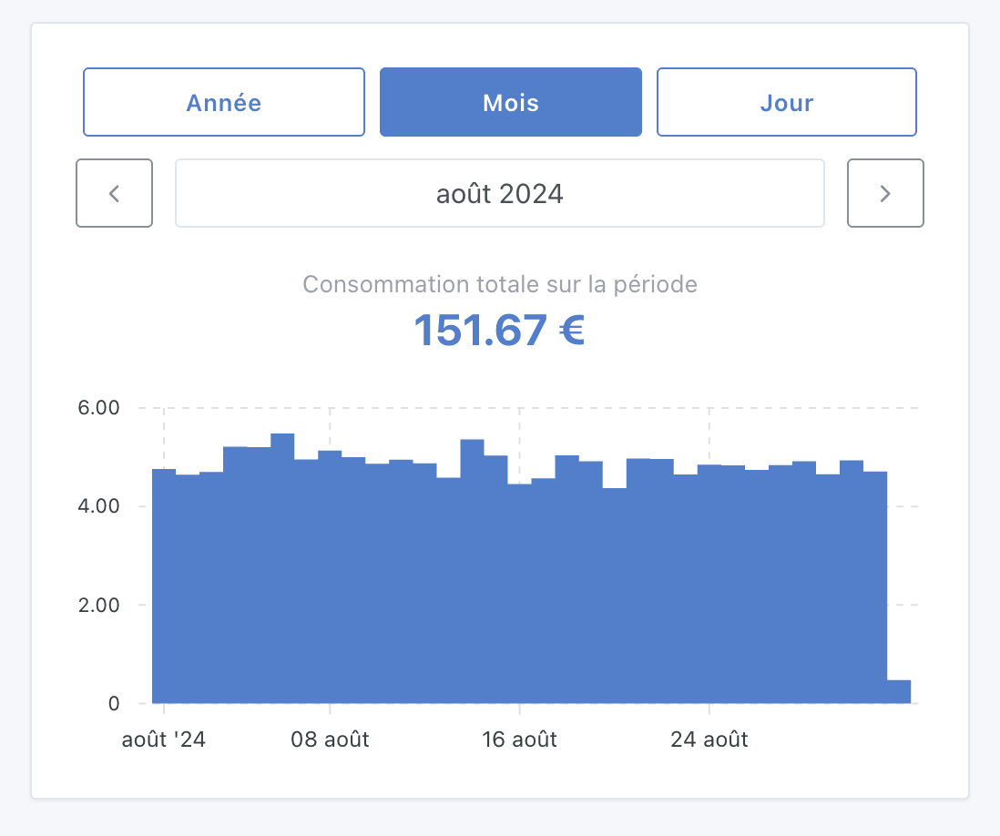

Salut à tous,

Fin mai, je discutais avec Thomas Lemaistre ([**@Terdious**](https://community.gladysassistant.com/u/terdious/summary) sur le forum), et il m’expliquait son installation électrique : plusieurs compteurs, des panneaux solaires, une voiture électrique… et bientôt des batteries pour stocker son énergie.

**Son objectif dans Gladys :**

👉 Suivre sa consommation directement en **euros**\
👉 Visualiser les différents flux d’énergie dans sa maison\
👉 Mesurer la performance de ses panneaux solaires\
👉 Et surtout, savoir jusqu’où il se rapproche de **l’autosuffisance énergétique** 🌞🔋

Autant vous dire que ce genre de fonctionnalités, j’en rêve pour Gladys depuis longtemps 😍 Mais c’est un gros chantier, difficile à lancer sans financement.

En juin, **@Terdious m’a proposé de financer le développement lui-même**. Rien que ça ! 🎉

Il m’a préparé un cahier des charges précis, j’ai proposé un devis, il a accepté… et j’ai pu me lancer dans ce projet dès cet été.

Aujourd’hui, je suis super heureux de vous dévoiler la **première partie** de ce développement !

## Ce qui a été développé jusqu’ici

### La configuration

Une toute nouvelle intégration a fait son apparition dans Gladys : **“Suivi de l'énergie”** 🎉

C’est ici que vous retrouverez toutes les options liées au suivi de l’énergie dans Gladys.

Dans un premier onglet, vous pouvez définir le schéma de votre installation électrique, en organisant vos équipements de manière hiérarchique. Cela permet à Gladys de comprendre comment circule l’électricité chez vous.

👉 Ensuite, vous pouvez renseigner vos tarifs d’électricité. Et grosse nouveauté : Gladys gère aussi l’historique des tarifs ! Car contrairement à d’autres logiciels domotiques, nous savons tous que les prix changent au fil des années… et que vos calculs doivent refléter la réalité, année après année.

Pour l’instant la saisie est manuelle, mais un import automatique est déjà prévu.

**3 types de contrats sont déjà supportés :**

- Base
- Heures pleines / Heures creuses
- EDF Tempo

Les 2 premiers sont totalement génériques, donc utilisables partout dans le monde. Un utilisateur américain avec un contrat heures pleines/heures creuses, par exemple, pourra l’utiliser sans problème.

Mon ambition est claire : que les calculs Gladys soient aussi précis que ceux de votre fournisseur d'énergie. Au centime près.

**Pas d’approximation** : la fiabilité est la clé.

C’est d’ailleurs là que résidait le plus gros du travail : mettre en place un moteur de calcul ultra-précis. J’ai fait des tests avec mon propre contrat EDF Tempo, et les résultats correspondent exactement aux valeurs du portail EDF ✅

Et bonne nouvelle : cette intégration est compatible aussi bien avec des données provenant de l’intégration Enedis (via Gladys Plus) qu’avec n’importe quelle source de consommation personnalisée :

- une prise Zigbee,
- un capteur MQTT,
- ou toute autre mesure que vous envoyez à Gladys.

### 📊 **Le tableau de bord**

J’ai ajouté un widget “Suivi énergétique”.

Il vous permet de visualiser vos consommations par année, mois ou jour, en un coup d’œil.

Et ce n’est que le début : d’autres widgets viendront enrichir le suivi.

## **La suite**

C’est là que j’ai besoin de vous:

Je cherche des utilisateurs Gladys Plus + intégration Enedis prêts à m’aider à tester l’algorithme.

Concrètement : si vous acceptez de me partager en message privé [sur le forum](https://community.gladysassistant.com/) un screenshot de votre portail EDF (consommation mois par mois), je pourrai comparer avec les calculs Gladys et m’assurer que les résultats correspondent parfaitement.

L’objectif : sortir rapidement une première bêta du suivi énergétique dans Gladys, avant d’enchaîner sur les autres fonctionnalités demandées par @Terdious.

## **Merci Thomas**

Je tiens à remercier énormément @Terdious, sans qui ce développement n’aurait tout simplement pas vu le jour. C’est grâce à son financement que j’ai pu lancer ce chantier, et je pense que toute la communauté peut lui dire un grand MERCI 🙌

Et pour ceux qui se demandent parfois pourquoi certaines demandes ne sont pas réalisées rapidement : ce n’est jamais une question de mauvaise volonté, mais bien de moyens. Je travaille sur Gladys à hauteur des financements disponibles et des contributions comme celle-ci sont un **énorme accélérateur** pour le projet 🚀
