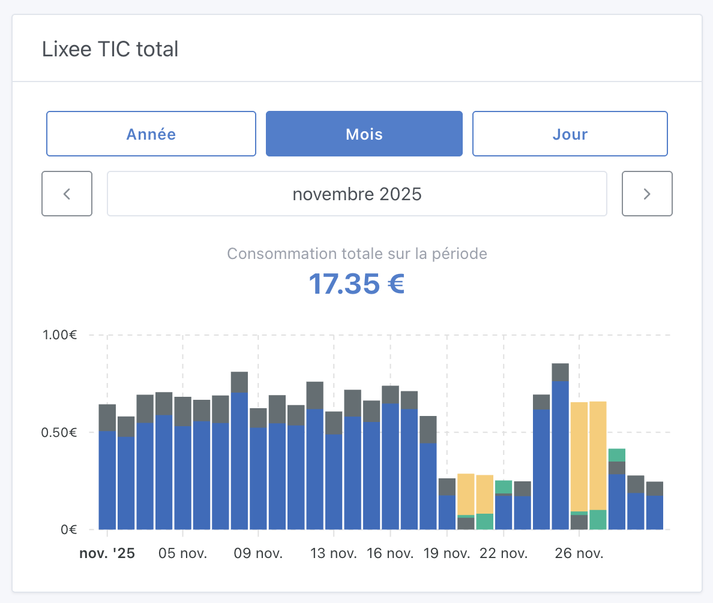

Salut à tous,

En septembre dernier, j'annonçais que [le suivi de l'énergie arrivait dans Gladys](/fr/blog/energy-monitoring-coming-soon/). Aujourd'hui, je suis ravi de vous annoncer que **c'est officiellement disponible dans Gladys Assistant 4.66 !** 🎉

## Suivi de l'énergie

- **Suivez votre consommation en kWh et en euros** avec une précision identique à celle de votre fournisseur d'énergie
- **Support de plusieurs types de tarifs** : base, heures pleines/heures creuses, et EDF Tempo
- **Gestion de l'historique des tarifs** : parce que les prix changent au fil du temps
- **Un beau widget tableau de bord** pour visualiser votre consommation par jour, mois ou année
- **Compatible avec les appareils Zigbee, les capteurs MQTT et l'intégration Enedis**

<!--truncate-->

Pour utiliser cette fonctionnalité, mettez à jour vers Gladys 4.66 et consultez la documentation complète :

👉 [Documentation du suivi de l'énergie](/fr/docs/integrations/energy-monitoring/)

## Serveur MCP : Support de l'historique

Le [serveur MCP](/fr/docs/integrations/mcp/) supporte maintenant l'interrogation de l'historique des appareils ! Votre assistant IA peut désormais répondre à des questions comme "Quelle était la température du salon hier ?" ou "Montre-moi ma consommation d'énergie de la semaine dernière."

## Zigbee2mqtt 2.7.0

Nous avons mis à jour Zigbee2mqtt de la version 2.6.1 à 2.7.0, avec le tout nouveau frontend **Windfront** pour une interface plus moderne et réactive.

Consultez le [changelog complet](https://github.com/Koenkk/zigbee2mqtt/releases) pour toutes les améliorations.

## Remerciements

Un grand merci à **Thomas Lemaistre** ([@Terdious](https://community.gladysassistant.com/u/terdious/summary)) qui a financé ce développement et l'a rendu possible !

Si vous avez des questions ou des retours, n'hésitez pas à poster un message [sur le forum](https://community.gladysassistant.com/).
