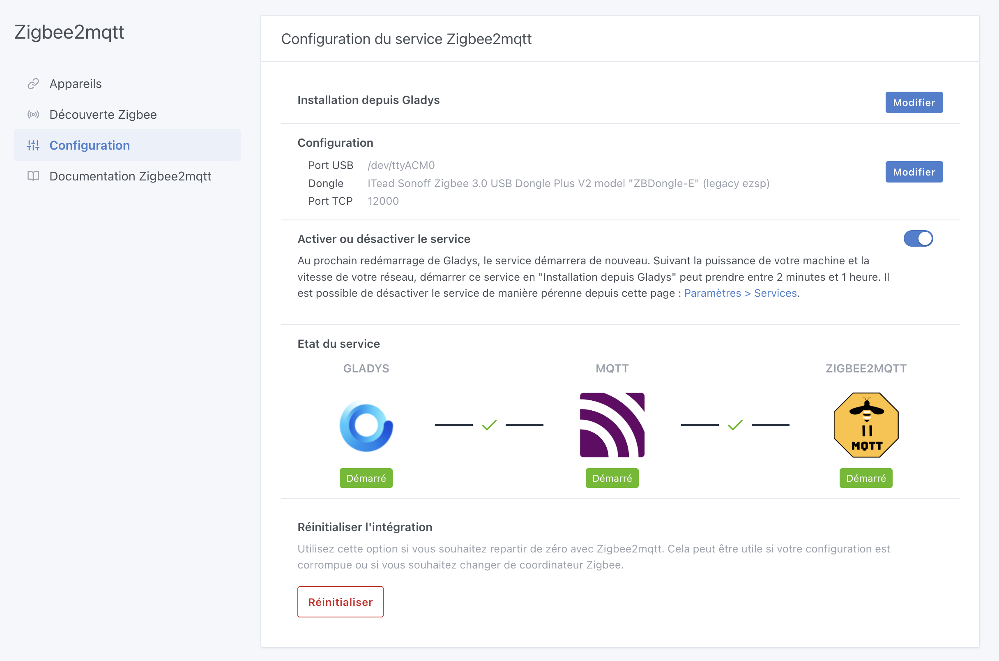
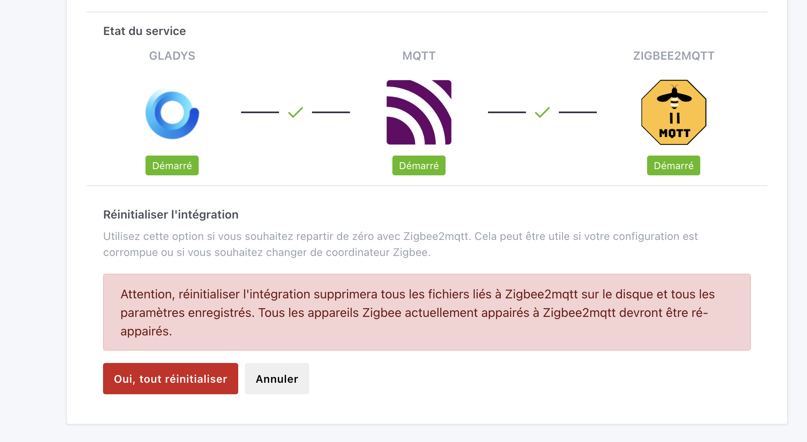

Salut à tous,

Je viens de sortir une nouvelle version de Gladys, avec des améliorations d'UX et de stabilité sur les intégrations **Zigbee2mqtt** et **MQTT**.

{/* truncate */}

## 🔧 Ce qui change dans cette version

### Un bouton de réinitialisation pour Zigbee2mqtt

Un nouveau bouton **« Réinitialiser »** fait son apparition dans l'intégration Zigbee2mqtt. Il permet aux utilisateurs qui ont une intégration corrompue — ou qui souhaitent changer de dongle — de réinitialiser totalement l'intégration en un clic.

C'est la direction que je veux donner au projet : **tout doit être faisable depuis l'interface, sans jamais toucher une ligne de commande.** Le [kit de démarrage](/fr/starter-kit/) étant de plus en plus populaire, il est essentiel que Gladys reste accessible à tous, quel que soit le niveau technique.

⚠️ Attention, ce bouton est à utiliser avec précaution : il supprime totalement toutes les données de l'intégration Zigbee2mqtt, et si vous avez des appareils appairés, il faudra tout ré-appairer !

### Mise à jour de Zigbee2mqtt vers 2.9.1

Gladys embarque maintenant la dernière version de Zigbee2mqtt (2.9.1). [Voir le changelog](https://github.com/Koenkk/zigbee2mqtt/releases).

### Amélioration de l'interface Zigbee2mqtt/MQTT

L'affichage des boutons dans la liste des appareils a été revu pour une meilleure ergonomie sur mobile. Merci [@Will_71](https://community.gladysassistant.com/) pour cette contribution !

---

Comme d'habitude, la mise à jour est automatique sous 24 h. Pour la forcer, rendez-vous dans **Paramètres → Système**.
