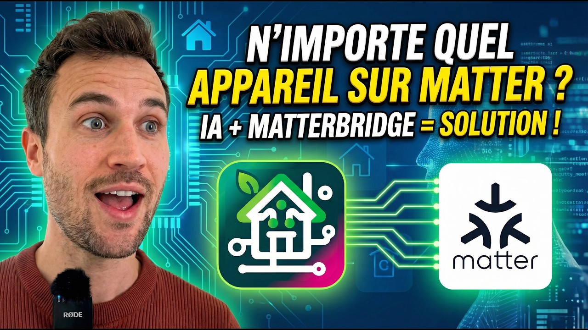
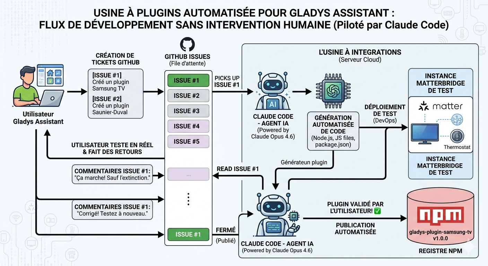

Salut à tous,

J'ai pas mal bidouillé la semaine dernière autour de Matterbridge, et j'ai eu une vraie révélation que je voulais vous partager : on va pouvoir rendre **n'importe quel appareil** compatible Matter, et donc compatible Gladys, sans écrire une seule ligne de code.

{/* truncate */}

## Un peu de contexte

Je vous avais déjà parlé de Matterbridge : un projet qui permet d'installer des plugins pour ajouter dans Matter des appareils non-Matter. Aujourd'hui, Matterbridge vous permet déjà d'utiliser dans Gladys :

- des [volets Somfy](/fr/docs/integrations/somfy-tahoma/)
- des [appareils Shelly](/fr/docs/integrations/shelly/) de génération 1, 2 et 3
- et bientôt votre aspirateur robot Roborock

Mais Matterbridge est encore jeune, et n'a pas de plugin pour tout.

## Le problème que ça résout

Dans Gladys, j'ai toujours pris l'approche de développer de « grandes intégrations » sur-mesure, en passant beaucoup de temps sur l'expérience utilisateur et l'interface. Sauf que certains d'entre vous ont des besoins très spécifiques : des appareils peu répandus, parfois même plus vendus. Pour ces produits, difficile de justifier le temps de développement d'une intégration native pour ne servir qu'une poignée d'utilisateurs.

**Et si ces intégrations pouvaient être de simples plugins Matterbridge, développés par une IA ?**

Le système de plugin Matterbridge est bien codifié, bien documenté, avec plein d'exemples. Et souvent, ces intégrations existent déjà ailleurs en open-source (Node-RED, Home Assistant) : on peut simplement demander à l'IA de traduire un plugin Node-RED en plugin Matterbridge. Il n'y a rien à inventer, c'est juste « traduire du code » !

## Ce que j'ai testé

J'ai développé un plugin Matterbridge pour ma climatisation Mitsubishi, **sans écrire une seule ligne de code.** Je vous montre tout ça ici :

## Et maintenant ?

La suite logique : **et si on automatisait complètement la création de plugins Matterbridge ?** Imaginez une « usine à plugins », pilotée par Claude Code, tournant sur un serveur, qui dépilerait des tickets GitHub et développerait les plugins sans intervention humaine.

Avec un système pareil, on pourrait industrialiser le développement d'intégrations et réduire l'écart entre Gladys et des projets comme Home Assistant. Je pense que c'est une vraie révolution, et ça me conforte dans mon choix d'investir beaucoup de ressources sur Matter cette année, car c'est vraiment l'avenir de la maison connectée.

Qu'en pensez-vous ?
