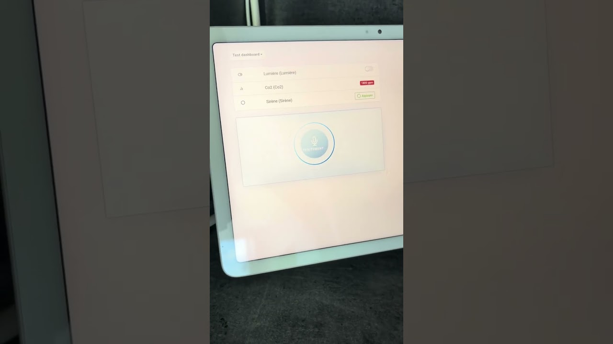
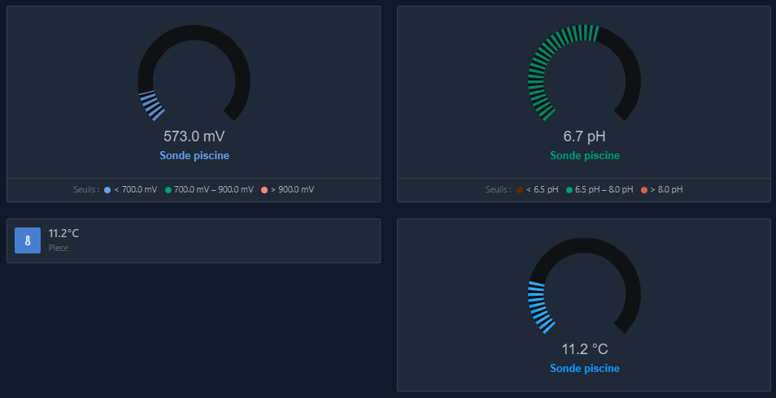
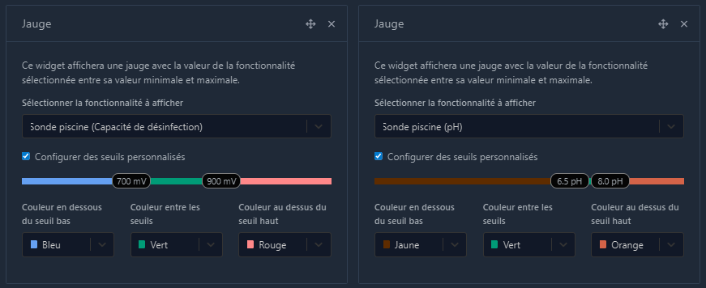
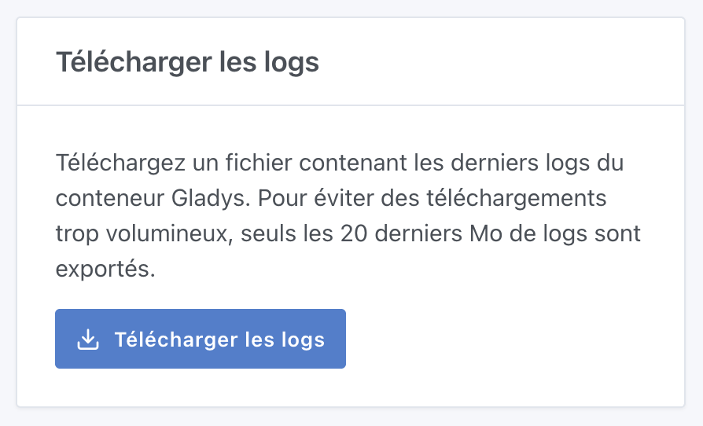

Salut à tous,

Une nouvelle version de Gladys est disponible, avec plusieurs améliorations sympas — dont un tout nouveau widget **Assistant Vocal** à poser directement sur votre tableau de bord 🎙️

{/* truncate */}

## 🎙️ Nouveau widget Assistant Vocal

Vous pouvez désormais ajouter un widget **Assistant Vocal** directement sur votre tableau de bord.

Pratique sur une tablette murale ou un smartphone. Je suis preneur de vos retours : c'est avant tout une première preuve de concept qui pourrait évoluer vers plus de voix dans Gladys si vous trouvez ça utile !

## 📊 Widget Jauge : seuils de couleur personnalisables

Grâce à la contribution de [@Terdious](https://community.gladysassistant.com/), le widget Jauge devient encore plus flexible. Il est maintenant possible de définir des **seuils de couleur personnalisés** afin de visualiser instantanément si une valeur est dans une zone basse, normale ou critique.

Parfait pour le suivi de températures, d'humidité, de consommation électrique ou tout autre indicateur important.

## 📥 Téléchargement des logs système

Le diagnostic d'un problème devient plus simple. Un nouveau bouton permet désormais de **télécharger facilement les logs système** depuis les paramètres de Gladys, ce qui facilite le partage d'informations lors d'une demande d'assistance.

## 🔌 Améliorations de l'intégration Tuya

L'intégration Tuya continue de progresser grâce au travail de [@Terdious](https://community.gladysassistant.com/) :

- Support local du protocole Tuya 3.4
- Support local du protocole Tuya 3.5
- Diverses améliorations de stabilité et de compatibilité

Une excellente nouvelle pour les utilisateurs d'appareils Tuya souhaitant garder un contrôle local de leurs équipements.

---

📋 [Changelog complet](https://github.com/GladysAssistant/Gladys/compare/v4.76.0...v4.77.0)

Bonne mise à jour à tous ! 🎉
