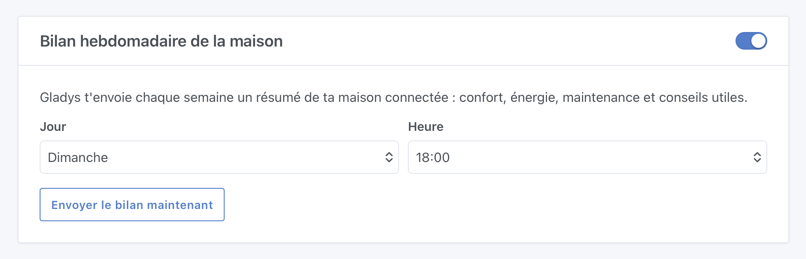
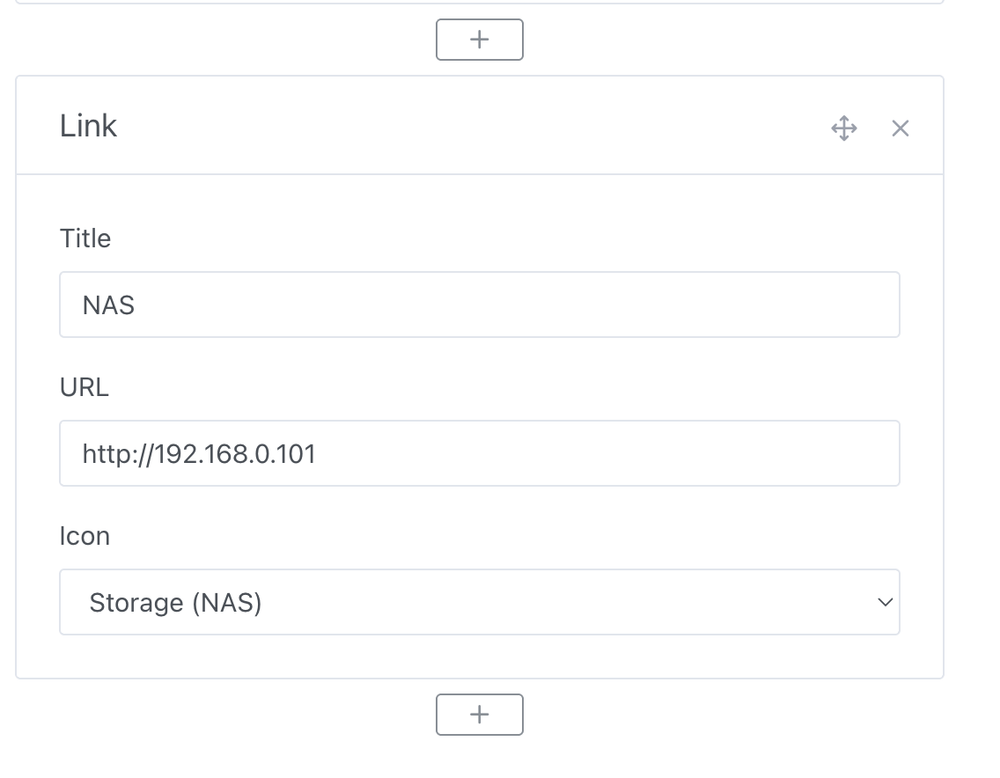
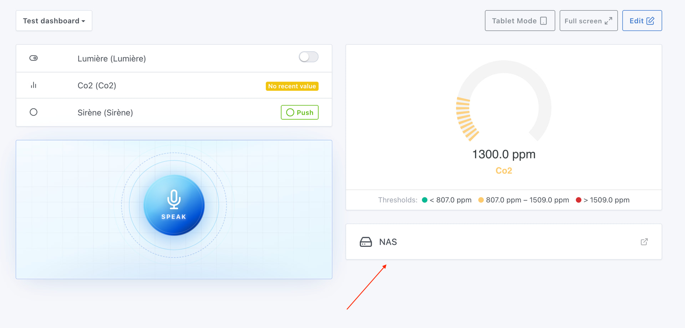
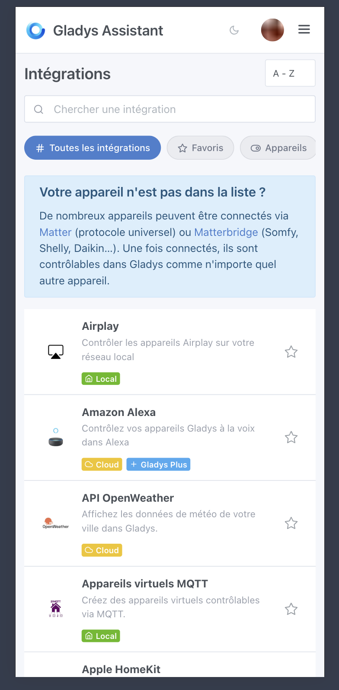

Salut à tous 🙂

Je viens de publier Gladys Assistant 4.78 ! Voilà les nouveautés, en commençant par la fonctionnalité phare : un **bilan hebdomadaire de votre maison généré par l'IA**.

{/* truncate */}

## 🤖 Bilan hebdomadaire IA

La fonctionnalité phare de cette version : le bilan hebdomadaire de la maison. Chaque semaine, Gladys peut vous envoyer un résumé personnalisé de votre maison connectée : confort, consommation d'énergie, capteurs déconnectés, tendances et conseils pratiques.

Par défaut, le bilan est envoyé tous les dimanches à 18h, ce qui est configurable dans l'intégration « Intelligence Artificielle » :

Voici un exemple de bilan chez moi en production :

> Bonjour, voici votre résumé hebdomadaire de la maison pour la période du 2 au 8 juin 2026.
>
> Votre consommation électrique totale pour cette semaine s'est élevée à 55,99 kWh, pour un coût de 8,26 euros. On observe une tendance à la baisse par rapport à la semaine précédente, qui affichait une consommation de 59,12 kWh et un coût de 9,36 euros. La prise du lave-linge située dans le cellier a quant à elle consommé 2,11 kWh sur la période.
>
> Concernant la maintenance de vos équipements, plusieurs capteurs sont silencieux et nécessitent votre attention. Le capteur de CO2 dans le bureau n'a plus transmis de données depuis plusieurs mois. De plus, le capteur de mouvement de la salle de bain est sans activité depuis 5 semaines, et le détecteur de présence dans les toilettes est hors ligne depuis très longtemps.

Bien sûr, on peut faire évoluer ce bilan si vous avez des idées !

## 📊 Tableau de bord : widget Lien

Vous pouvez maintenant ajouter un widget Lien sur votre tableau de bord pour accéder en un clic à une interface externe : Zigbee2mqtt, Tasmota, l'interface de votre box, un NAS, une caméra, etc.

Chaque lien est personnalisable, titre, URL et icône (site web, serveur, NAS, Wi-Fi, interface web…) :

Pratique pour centraliser tous vos accès depuis Gladys.

## 🔌 Liste d'intégrations : interface repensée sur mobile

La page des intégrations a été retravaillée pour une navigation plus claire et agréable sur mobile.

## 🧠 Suppression de l'ancien « cerveau » local

L'ancien système d'IA local (questions/réponses pré-enregistrées) a été retiré. Il datait d'une époque où l'IA n'existait pas, et aujourd'hui il donnait une mauvaise impression de Gladys à quelqu'un qui l'installe pour la première fois. Retirer ce vieux code permet d'alléger Gladys, de supprimer une librairie de NLP qui n'est plus utile, et de faire que Gladys démarre plus rapidement 🙂

## ⚡ Suivi énergétique

Correction d'un bug de regroupement dans le widget de consommation mensuelle / annuelle. Les données devraient maintenant s'afficher correctement sur ces périodes.

## 🎬 Scènes

Lors de la sélection d'une propriété d'appareil dans un déclencheur de scène « Changement d'état de l'appareil », les appareils sans pièce sont désormais visibles avec une catégorie « Sans pièce ». Fini les appareils « fantômes » impossibles à sélectionner 🙂

## 📡 Zigbee2mqtt

Deux ajouts pour les utilisateurs Zigbee2mqtt :

- **Clavier DEVELCO :** prise en charge des actions du keypad (désarmement, armement zones jour / nuit / toutes zones, délai de sortie, urgence).
- **Sirènes d'alarme :** nouvelles actions `trigger_alarm` et `stop_alarm` (ex. sirène Bosch outdoor), utilisables dans vos scènes et automatisations.

---

Comme d'habitude, la mise à jour sera faite automatiquement sous 24 h si vous utilisez Watchtower. Sinon, vous pouvez la lancer en un clic dans les paramètres.

Merci à toute la communauté pour les retours, les tests et les suggestions. Je suis très curieux de voir ce que donne le bilan hebdomadaire IA chez vous !

Changelog complet : [v4.77.0 → v4.78.0](https://github.com/GladysAssistant/Gladys/compare/v4.77.0...v4.78.0)
