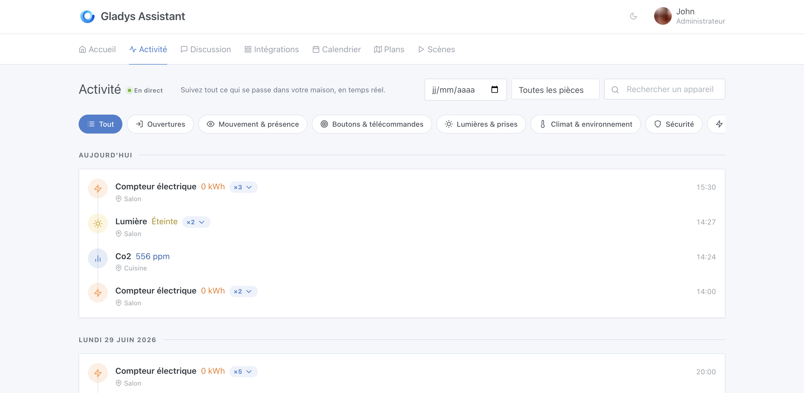
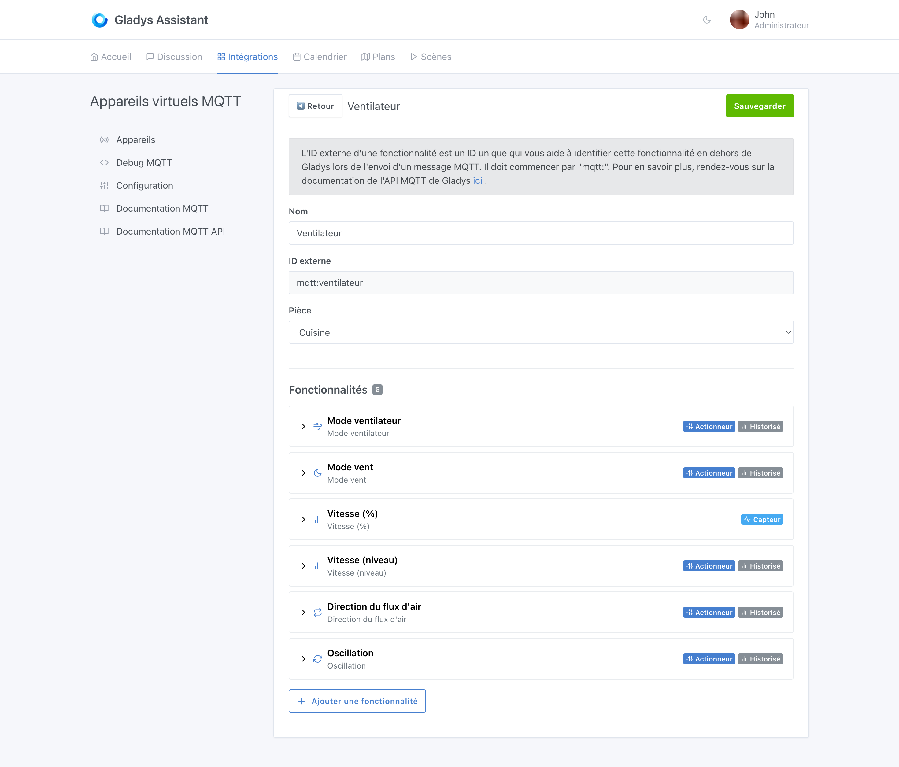
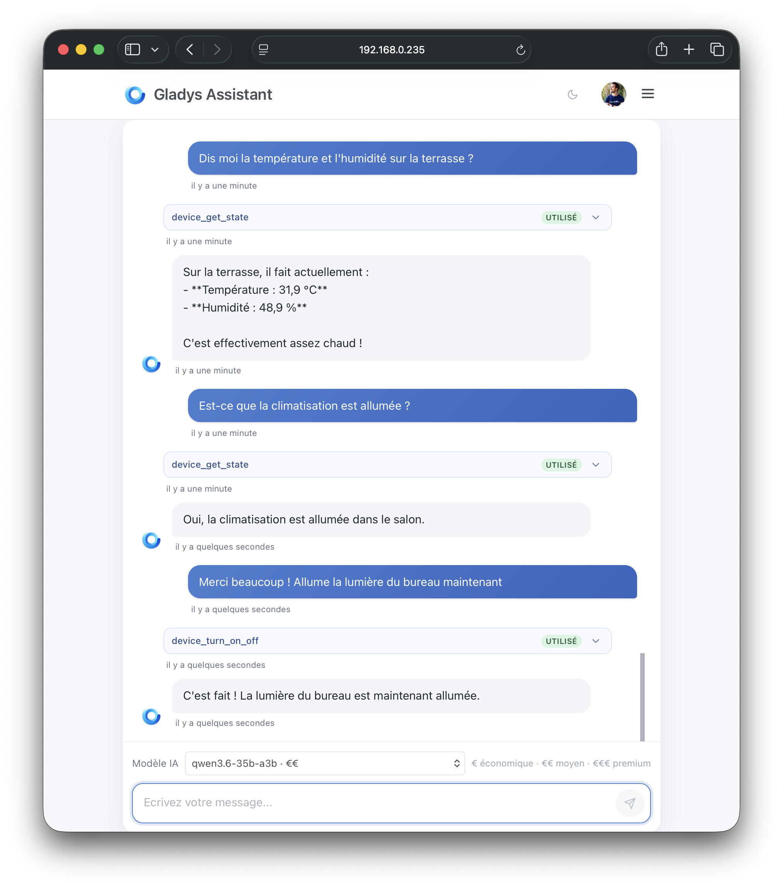

Salut à tous,

Je sors aujourd'hui ce qui est, pour l'instant, l'une des plus grosses releases de l'année, et il y a une vraie raison à ça.

On est clairement à un tournant dans la façon de développer : les modèles d'IA gagnent en puissance, et les outils pour s'en servir au quotidien deviennent enfin matures. Depuis deux semaines, deux d'entre eux ont changé ma manière de travailler sur Gladys.

**Claude Fable 5**, le modèle phare d'Anthropic, celui qui a été temporairement restreint aux États-Unis tant ses capacités inquiétaient les autorités. Il m'a permis d'aborder des sujets très techniques qui m'auraient pris des journées entières, et de développer des fonctionnalités majeures comme le journal d'activité que je détaille plus bas.

**Les agents IA cloud de Cursor**, pilotables depuis mobile. Il y a une dizaine de jours, Cursor a lancé son application iOS : on peut désormais déléguer une tâche de développement à un agent depuis son téléphone, et le laisser travailler en autonomie, sans ordinateur. La refonte complète de l'intégration MQTT a été réalisée **entièrement** par un agent Cursor pendant que j'étais en déplacement.

{/* truncate */}

## 🏠 Nouvelle page Activité : l'historique de votre maison en direct

La fonctionnalité phare de cette release : un nouvel onglet **Activité** qui affiche une timeline visuelle de tout ce qui se passe chez vous : ouvertures de porte, détections de mouvement, allumages et extinctions, valeurs de capteurs, etc.

Ce qui rend cette page utile au quotidien :

- Timeline groupée par jour (« Aujourd'hui », « Hier », puis dates complètes) avec icônes colorées par famille d'événement.
- **Regroupement des rafales** : les états consécutifs d'un même capteur sont fusionnés en une seule ligne avec un badge `×N`, extensible pour voir chaque occurrence horodatée. Indispensable pour les installations avec 100 à 200 appareils.
- Filtres par famille (Ouvertures, Mouvement & présence, Boutons, Lumières, Climat, Sécurité, Énergie, etc.), sélecteur de pièce et recherche d'appareil.
- **Temps réel**, avec une pastille flottante « N nouveaux événements » quand vous avez scrollé vers le bas.
- Scroll infini avec pagination.

## 📡 MQTT : refonte complète de l'expérience des appareils virtuels

L'intégration MQTT bénéficie d'une refonte UX majeure, inspirée des retours de la communauté ([forum](https://community.gladysassistant.com/t/catalogue-des-features-supportees-en-mqtt/8452)) :

- **Liste compacte** des appareils groupés par pièce.
- **Catalogue de features** avec aperçu dashboard réaliste et recherche.
- **Auto-génération des ID externes** (`mqtt:{slug}-{4chars}`), toujours modifiable.
- Bouton **copier** pour les identifiants et URL MQTT.

## 🤖 IA : choix du modèle et contexte amélioré

Je continue de pousser l'agent IA dans Gladys, parce que je suis convaincu que c'est l'avenir de la domotique : contrôler sa maison à la voix ou par écrit, exécuter n'importe quelle action, interroger ses capteurs.

Cette release ajoute un **sélecteur de modèle IA** dans le chat. Vous pouvez tester les différents modèles Scaleway (Mistral, Llama, Qwen, Gemma, etc.) et comparer leurs réponses dans des situations réelles chez vous. Un indicateur de coût (€, €€, €€€) vous aide à vous repérer.

Une fois le meilleur modèle identifié, je ferai le calcul pour l'intégrer durablement dans Gladys Plus, de façon rentable pour le projet. En attendant, testez et partagez vos retours sur le forum !

Autres améliorations côté IA :

- **Contexte enrichi** : les appels d'outils et messages non pertinents sont exclus du contexte pour de meilleures réponses.
- Correction du schéma d'action « allumer/éteindre un appareil ».
- Fichier de debug enrichi (50 derniers messages).

## ⚡ Tuya : support des compteurs intelligents

- Prise en charge des **compteurs intelligents Tuya** en cloud et en local.
- Lecture via l'API **Thing Model shadow** pour les appareils sans spécifications legacy.
- Mesures : puissance totale, énergie active et réactive, tension, courant.
- Noms d'affichage propres (les typos des codes Tuya ne remontent plus dans l'UI).
- Infrastructure de tests par fixtures pour industrialiser l'ajout de nouveaux appareils Tuya.

## 📱 Interface & tableau de bord

Le widget **Jauge** supporte désormais un nom personnalisable pour distinguer plusieurs jauges du même appareil (par exemple deux cuves d'eau MQTT), et nous avons corrigé le scroll bloqué sur mobile quand on pose le doigt sur une jauge.

Côté mobile, les boutons d'action et les en-têtes sont maintenant responsives sur de nombreuses pages (intégrations, paramètres, etc.), avec des boutons empilés sur mobile et un meilleur wrapping des groupes de boutons.

## 🔧 Intégrations & correctifs

| Intégration | Changement |
|-------------|------------|
| **Z-Wave JS** | Correction de l'intégration après mise à jour de ZWaveJS |
| **Matter** | Mise à jour de matter.js 0.17.3 vers 0.17.4 |
| **Climatisation** | Correction : le mode climatisation s'affichait comme mode ventilateur depuis la v4.79.0 |
| **iOS** | Le mode sombre n'est plus écrasé au lancement de l'app |
| **Scènes** | Les messages contenant des caractères spéciaux ne provoquent plus de bugs d'affichage |

## 🛠️ Technique (pour les contributeurs)

- **Migration du front de preact-cli (webpack) vers Vite** : démarrage dev plus rapide, HMR amélioré, build modernisé. Aucun changement visible pour l'utilisateur final, mais une base technique plus saine pour la suite.
- Nouveau champ `supported_options` sur les DeviceFeature : les intégrations peuvent désormais déclarer les modes et valeurs supportés par une feature (par exemple les modes d'aspirateur).
- Documentation développeur enrichie (`AGENTS.md`).

## ❤️ Merci aux contributeurs

Merci à @Terdious, @Will_71, @Sescandell et @bertrandda pour leurs contributions, ainsi qu'à toute la communauté pour les retours sur MQTT, le journal d'activité et l'UX mobile.

Un mot aussi pour les abonnés [Gladys Plus](https://gladysassistant.com/fr/plus/) : c'est grâce à vous que je peux payer les outils IA qui rendent tout ça possible. Si vous voulez voir Gladys avancer encore plus vite, Gladys Plus est le meilleur levier. En plus de soutenir le projet, vous débloquez les fonctionnalités avancées : sauvegardes, agent IA, accès à distance, assistants vocaux, intégration MCP, Enedis, et bien d'autres.

Comme toujours, Gladys se met à jour automatiquement dans les 24 h si vous utilisez Watchtower, sinon vous pouvez le faire en un clic dans les paramètres. Voir [la note de version complète](https://github.com/GladysAssistant/Gladys/releases/tag/v4.82.0).
