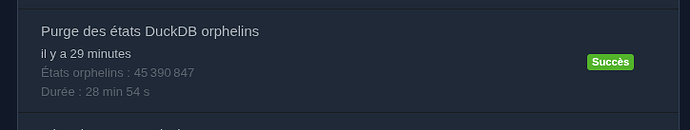
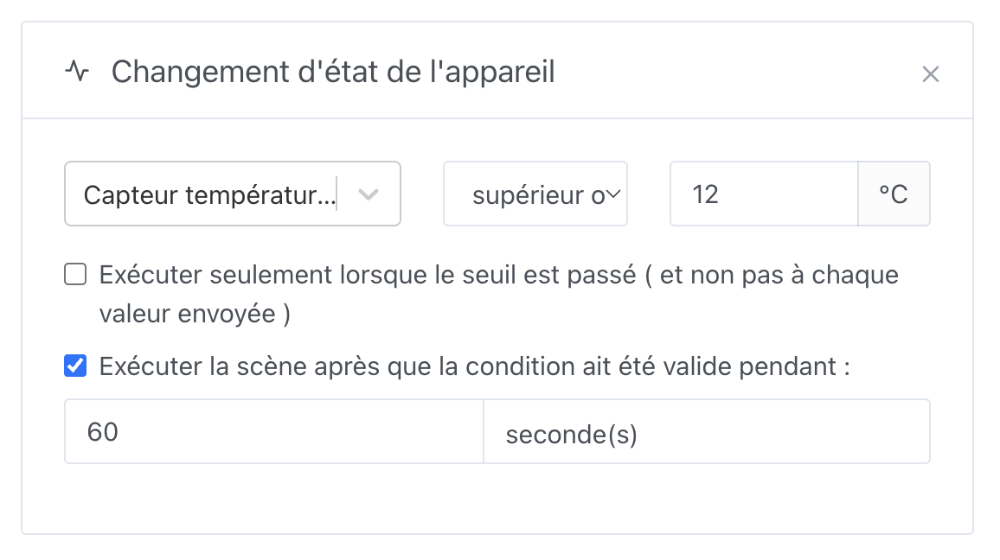

Salut à tous !

La version **4.83.0** est disponible ! Après la grosse release 4.82 (journal d’activité + MQTT), cette version se concentre sur la **fiabilité**, les **performances** et quelques améliorations bien concrètes au quotidien — notamment pour les installations avec beaucoup d’historique, et pour Gladys Plus.

{/* truncate */}

## ⚡ Page Activité : affichage instantané, même sur les grosses bases

Sur une installation avec des centaines de millions d’états, filtrer l’activité sur une catégorie peu fréquente (ouvertures, boutons…) pouvait bloquer l’interface pendant plusieurs dizaines de secondes.

La page **Activité** charge désormais l’historique par fenêtres de temps progressives : les premiers événements s’affichent tout de suite, et la recherche continue en arrière-plan avec un bandeau du type « Recherche d’activité — {mois}… ».

Sur une base de **448 millions d’états**, un filtre « Ouvertures » qui mettait 20–33 s à répondre affiche maintenant les premiers résultats en ~100 ms.

Merci à @Terdious pour ce travail !

## 🧹 Nettoyage automatique des états orphelins (DuckDB)

Depuis la migration des historiques vers DuckDB, un bug faisait que la purge « ne plus garder d’historique » d’une feature, ainsi que la suppression d’appareils dans certains cas, ne nettoyaient pas correctement les états dans DuckDB.

Résultat : des états « zombies » (features sans historique, ou features déjà supprimées) pouvaient s’accumuler pendant des années sans qu’on s’en rende compte — jusqu’à l’arrivée du journal d’activité.

Cette release corrige la purge, et lance **une seule fois au démarrage** un job d’arrière-plan qui nettoie les états orphelins, en douceur (par tranches, avec pauses), pour ne pas saturer le CPU ni bloquer le reste de Gladys.

Sur une installation de test, **45 millions** d’états orphelins ont ainsi été purgés. Vous pouvez suivre l’avancement dans **Paramètres → Tâches**.

Merci encore à @Terdious !

## 🔐 Gladys Plus : parcours 2FA repensé

Tout le flux de double authentification Gladys Plus a été retravaillé pour mieux gérer plein de petits cas pas agréables qui m’avaient été remontés (configuration manquante, erreurs de code, retour en arrière, etc.).

N’hésitez pas à me faire vos retours sur la 2FA. J’aimerais vraiment que ce soit plus simple pour les utilisateurs débutants, et je suis conscient que les étapes d’authentification restent un peu complexes pour un non-technique.

Une prochaine étape serait d’ajouter des **codes de récupération**, pour pouvoir réinitialiser la 2FA soi-même en cas de perte du téléphone ou de l’appli d’authentification.

## 🛟 Restauration Gladys Plus : plus de compte temporaire

Lors d’une restauration de sauvegarde depuis l’écran d’inscription, Gladys créait auparavant un compte local temporaire avec des identifiants hardcodés. Si le flux était interrompu ou échouait, ce compte pouvait rester, bloquer l’inscription… et laisser une instance dans un état pénible.

Ce compte temporaire a été **supprimé**. La restauration fonctionne sans créer d’utilisateur local, et les instances déjà « bloquées » par un ancien compte temporaire sont guéries automatiquement au démarrage.

## 🎬 Scènes : durée en secondes sur le déclencheur d’état

Sur le déclencheur **Changement d’état d’un appareil**, l’option « exécuter après que la condition soit valide depuis… » ne proposait que des **minutes**.

Vous pouvez maintenant choisir **secondes** ou **minutes**, pratique pour réagir vite (ex. : « si le mouvement reste détecté pendant 10 secondes »).

Les scènes existantes restent en minutes par défaut.

## 🖥️ Interface

- **Tableau de bord** : les types de widgets sont triés alphabétiquement selon la langue de l’interface (merci @Will_71)
- **Scènes** : idem pour les listes de déclencheurs et d’actions (merci @Will_71)
- **MQTT** : espacement vertical excessif corrigé dans la liste des appareils
- **Activité** : scroll horizontal des filtres amélioré sous Windows
- **Scènes** : correction d’un écart noir sur les chips de variables multi-lignes
- **HomeKit** : les valeurs de température de couleur hors limites (ex. bandes LED) sont désormais bornées au max HomeKit (500 mireds), ce qui évite les warnings HAP du type « characteristic was supplied illegal value »

## 🛠️ Technique

- **Migration DuckDB** : passage du package `duckdb` (déprécié) vers `@duckdb/node-api`. Même moteur, mêmes fichiers `.duckdb` : **aucune migration de données** côté utilisateur. Les binaires précompilés remplacent la compilation native.
- Publication automatique du front Gladys Plus après une release production

## ❤️ Merci aux contributeurs

Un grand merci à @Terdious et @Will_71 pour leurs contributions à cette version, et merci à toute la communauté pour vos retours et vos tests — surtout ceux d’entre vous qui font tourner Gladys sur de très grosses bases d’historique : c’est grâce à vous qu’on peut valider ces perfs en conditions réelles.

Comme toujours, Gladys se met à jour automatiquement dans les 24 h si vous utilisez Watchtower, sinon vous pouvez le faire en un clic dans les paramètres.

Pensez à configurer Telegram pour recevoir une alerte sur votre téléphone quand Gladys se met à jour !

Voir [la note de version complète sur GitHub](https://github.com/GladysAssistant/Gladys/releases/tag/v4.83.0).
