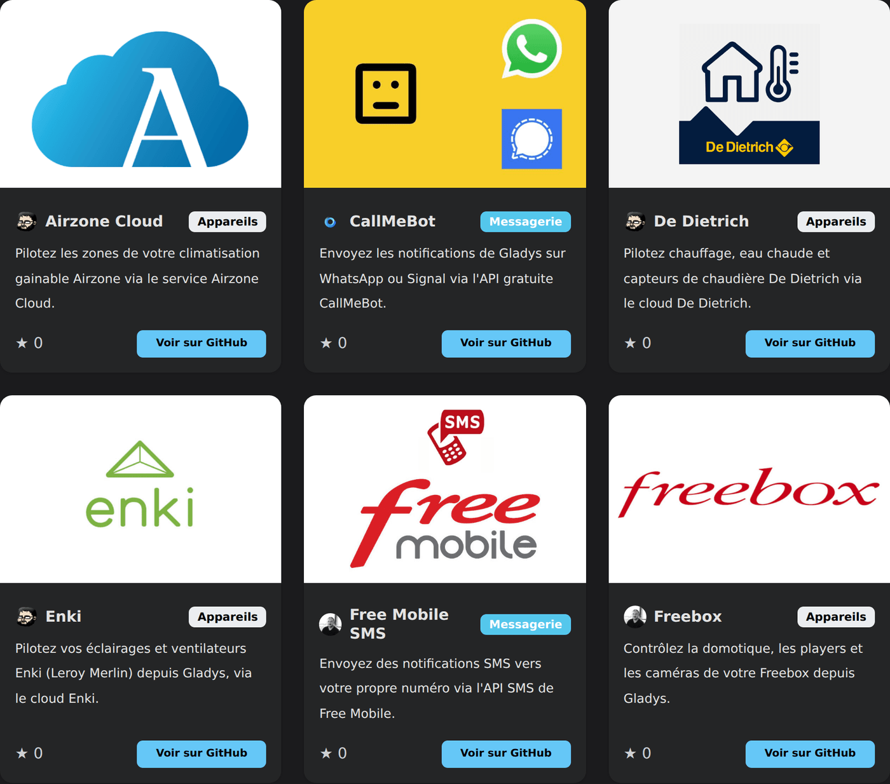

Salut à tous !

La version **4.84.0** est disponible, et c'est sans doute la release la plus importante de l'histoire du projet. 🚀

Pendant 6 ans, on a construit patiemment **36 intégrations** dans le cœur de Gladys. Chacune demandait une pull request, une review, des tests, et beaucoup de temps de ma part. C'était le goulot d'étranglement du projet.

Aujourd'hui, ce goulot d'étranglement disparaît. Avec les **intégrations externes**, n'importe qui peut créer et publier une intégration Gladys, sans me demander la permission. Le résultat ne s'est pas fait attendre : **20 intégrations sont déjà disponibles**, développées en quelques jours par 6 contributeurs différents.

Autrement dit : en quelques jours, la communauté a produit **plus de la moitié** de ce qu'on avait accompli en 6 ans. C'est un changement de dimension pour le projet.

{/* truncate */}

## 🧩 Les intégrations externes, comment ça marche

Une intégration externe est un **conteneur Docker** que Gladys supervise. Elle dialogue avec Gladys via une API dédiée, et Gladys génère automatiquement toute son interface : liste des appareils, découverte, formulaire de configuration.

Concrètement, pour vous en tant qu'utilisateur :

- Vous ouvrez le catalogue d'intégrations dans Gladys
- Les intégrations externes apparaissent à côté des intégrations natives, avec un badge communautaire
- Vous cliquez sur **Installer** : Gladys télécharge l'image, démarre le conteneur, et affiche l'interface
- Vous pouvez la démarrer, l'arrêter, la mettre à jour, voir ses logs ou la désinstaller, directement depuis Gladys

Chaque intégration tourne dans un **bac à sable isolé** (256 Mo de RAM, 0,5 CPU, système de fichiers en lecture seule, réseau isolé). Si une intégration plante, elle plante toute seule : elle ne peut pas emporter votre instance Gladys avec elle. C'est cette garantie qui permet de publier sans review.

## 📦 20 intégrations, en quelques jours

Voici ce que la communauté a déjà publié :

**Appareils** : Airzone Cloud, De Dietrich, Enki, Freebox, MELCloud, MELCloud Home, MyNeomitis (Axenco), Netatmo, Philips Hue, Roborock, SmartThings, Spotify, TP-Link Kasa, Tuya, UPnP / IGD, Zendure

**Messagerie** : CallMeBot, Free Mobile SMS, ntfy, Telegram

Merci à [@callemand](https://github.com/callemand), [@cicoub13](https://github.com/cicoub13), [@Dreamthy](https://github.com/Dreamthy), [@Terdious](https://github.com/Terdious) et [@William-De71](https://github.com/William-De71) pour ces premières intégrations !

👉 **[Parcourez le catalogue complet sur le site](/fr/docs/integrations/external/)**, mis à jour en direct.

## 👨‍💻 Appel aux développeurs : on a besoin de vous

C'est là que j'ai besoin de vous.

Si vous avez un appareil qui n'est pas supporté par Gladys, vous pouvez maintenant **le rendre compatible vous-même**, et le partager avec toute la communauté. Voilà ce que ça implique concrètement :

- **Un template à cloner.** Le [template officiel](https://github.com/GladysAssistant/integration-template-js) contient déjà une intégration qui fonctionne (capteurs, interrupteur, lampe variable, prise, caméra), le SDK JavaScript, un Dockerfile et un workflow GitHub Actions qui construit et publie votre image en un clic. Vous partez d'une base qui tourne, et vous remplacez la logique par la vôtre.
- **Avec l'IA, c'est encore plus rapide.** Le plus simple aujourd'hui : clonez le template, et demandez à Claude de réécrire l'intégration pour votre appareil en partant de cette base. C'est exactement comme ça que j'ai porté l'intégration CallMeBot en intégration externe, et de mon expérience, le résultat était bon du premier coup.
- **Vous n'êtes pas seul face à votre protocole.** Beaucoup d'appareils ont déjà une bibliothèque ou une intégration open-source ailleurs. Vous pouvez vous en inspirer, ou réutiliser directement la dépendance qui existe : c'est souvent le gros du travail en moins.
- **Aucune pull request, aucune review, aucune validation de ma part.** Vous publiez un dépôt GitHub public avec un fichier manifeste, vous ajoutez le topic `gladys-assistant-integration`, et c'est tout.
- **Publication en une heure.** Un indexeur automatique passe toutes les heures, valide votre manifeste, et publie votre intégration dans le catalogue de **toutes les instances Gladys**.

Il n'y a jamais eu de moyen aussi simple de contribuer à Gladys. Si chacun apporte l'intégration dont il a besoin, on peut couvrir en quelques mois ce qu'on n'aurait jamais couvert en années.

👉 **[Lisez le guide développeur, étape par étape](/fr/docs/dev/external-integrations/)**

Et si vous publiez quelque chose, venez le montrer [sur le forum](https://community.gladysassistant.com/) : j'ai hâte de voir ce que vous allez construire.

## 🤖 L'IA de Gladys progresse encore

L'assistant IA continue de s'améliorer, avec plusieurs demandes venues directement du forum :

- **Pilotage complet des lumières** : vous pouvez maintenant demander à Gladys de régler la **luminosité, la couleur et la température de couleur** d'une ampoule, et plus seulement de l'allumer ou de l'éteindre.
- **Questions sur l'énergie** : Gladys répond désormais aux questions de **consommation (kWh) et de coût sur une période donnée** (« combien m'a coûté l'électricité en juillet ? »).
- **Création de scènes plus fiable** : un routage des outils en deux étapes améliore nettement la qualité des scènes générées par l'IA.
- **Réponses mieux affichées** : le Markdown des réponses de l'IA est enfin rendu correctement dans le chat. Fini les `**27 °C**` affichés tels quels.

## 🏠 Matter

- **Climatiseurs** : gestion des modes de fonctionnement (Thermostat SystemMode), demandée sur le forum.
- **Capteurs de CO2** : désormais supportés.
- **Correction d'un crash** « Cannot mix BigInt and other types » sur les attributs électriques.
- Mise à jour de matter.js en 0.17.6.

## 🔌 Autres intégrations

- **Enedis** : les coûts énergétiques sont recalculés après chaque synchronisation.
- **CalDAV** : meilleure synchronisation, avec la prise en charge des événements supprimés.
- **Zigbee2MQTT** : l'adresse IEEE et le lien vers Z2M ne sont plus perdus après l'enregistrement d'un appareil.
- **MQTT** : un topic personnalisé vide n'attrape plus tous les messages, et le statut « arrêté manuellement » est bien réinitialisé à l'enregistrement de la configuration.
- **Telegram** : possibilité de désactiver l'intégration (arrêt du bot, suppression de la clé, dissociation des utilisateurs).
- **Caméras RTSP** : logs d'échec de récupération d'image plus lisibles.

## 🖥️ Interface

- **Graphiques** : les unités affichées suivent maintenant celles de l'appareil en direct, et les valeurs indéfinies ne cassent plus le formatage.
- **Tableau de bord** : il est désormais clair que le mode tablette ne s'applique qu'au navigateur en cours.
- **Catalogue d'intégrations** : vos filtres et votre tri sont conservés quand vous revenez en arrière depuis une fiche d'intégration, et un bouton permet de rafraîchir le catalogue à la demande.

## 🛠️ Technique

- Installation des dépendances des services **parallélisée** (4 en simultané), ce qui accélère nettement le build de Gladys. Côté développement uniquement : ça ne change rien à votre instance.
- Les échecs d'un service de messagerie sont désormais isolés : un service en erreur n'empêche plus les autres de recevoir le message.
- Côté CI : images Docker de branche publiées automatiquement sur le registre GitHub, et commande `/build-arm64` pour générer une image ARM64 à la demande sur une PR.

## ❤️ Merci

Merci à tous ceux qui ont contribué à cette version, et surtout aux premiers développeurs d'intégrations externes qui se sont lancés avant même l'annonce officielle. Vous avez prouvé en quelques jours que le modèle fonctionne.

Comme toujours, Gladys se met à jour automatiquement dans les 24h si vous utilisez Watchtower, sinon vous pouvez le faire en un clic dans les paramètres.

Pensez à configurer Telegram pour recevoir une alerte sur votre téléphone quand Gladys se met à jour !

[Voir la note de version complète sur GitHub](https://github.com/GladysAssistant/Gladys/releases/tag/v4.84.0)
