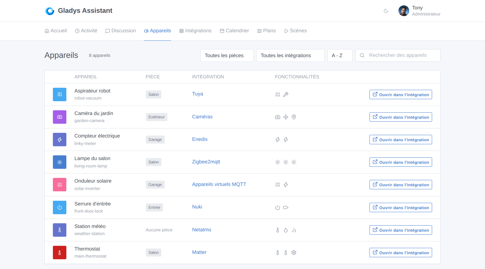
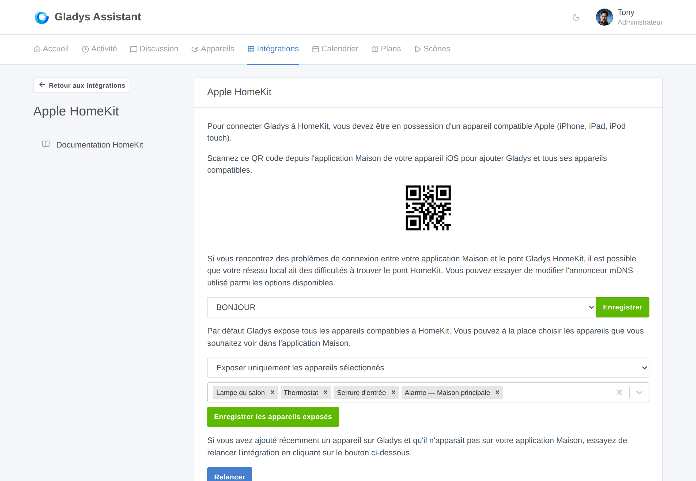
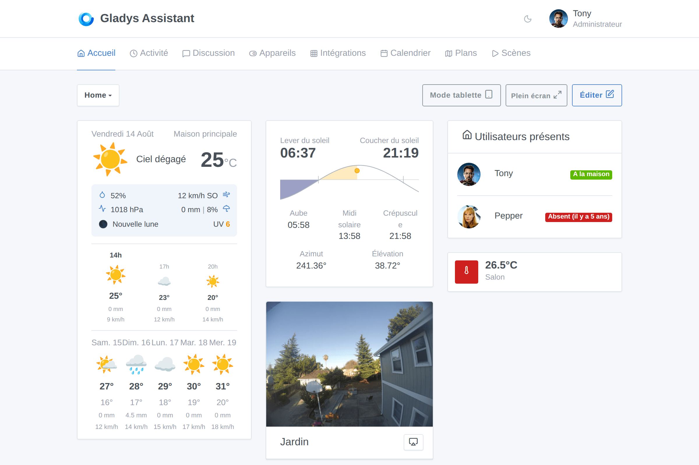
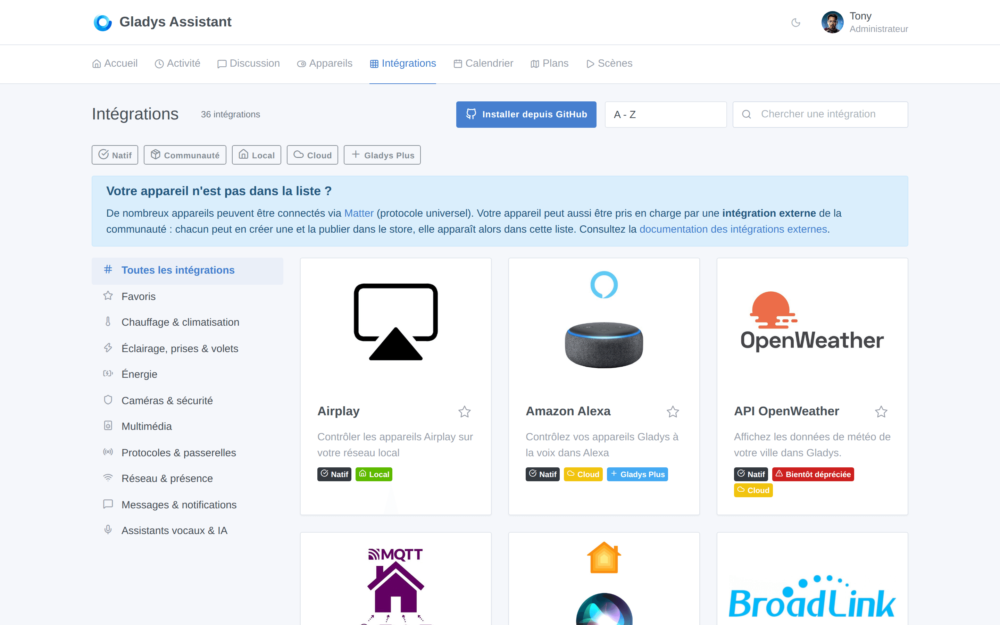
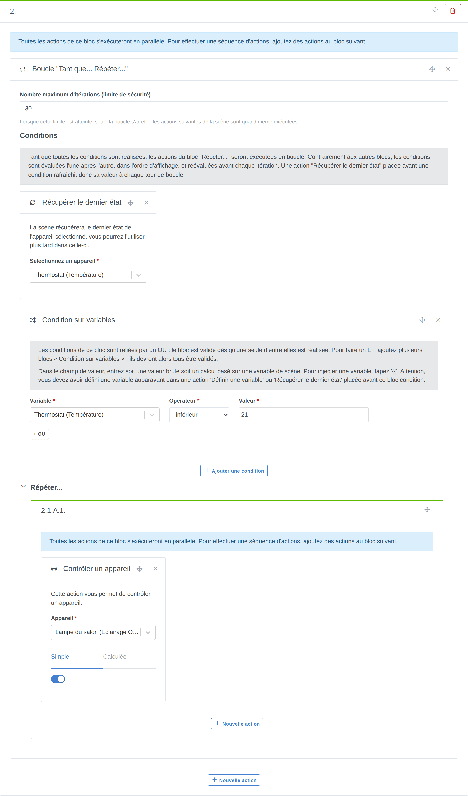
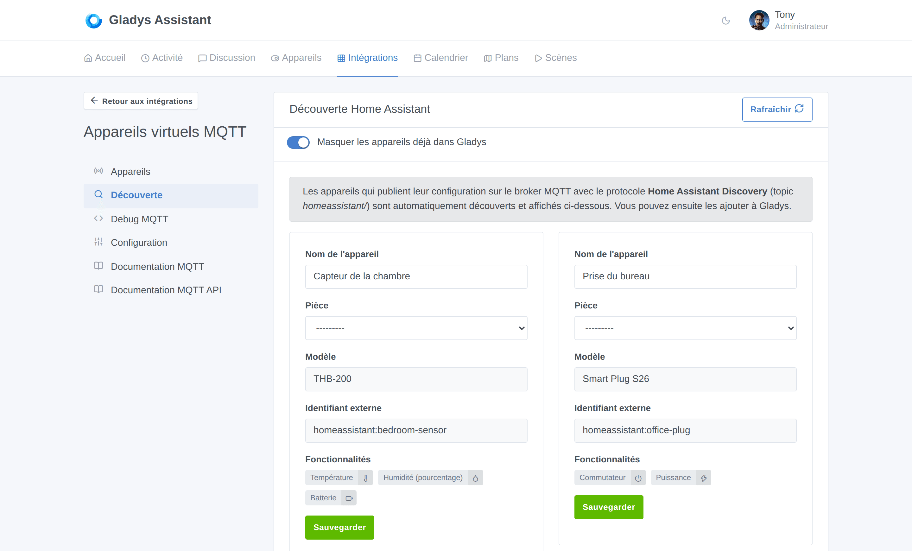

Salut à tous !

La version **4.86.0** est disponible, et celle-là est simple à résumer : c'est **la plus grosse release de l'histoire du projet**. 🚀

Les chiffres parlent d'eux-mêmes. En **7 jours**, on a fusionné **68 pull requests**, touchant plus de **1 000 fichiers** et ajoutant environ **28 000 lignes de code**. Pour comparaison, nos plus grosses releases plafonnaient jusqu'ici à **35 pull requests**, sur deux semaines. On vient de faire **le double, en deux fois moins de temps**.

Et ce n'est pas un pic isolé. Chaque semaine, on explose un peu plus la productivité de ce projet, et la raison n'est un secret pour personne : **l'IA**. Sur les 68 pull requests de cette version, **62 ont été co-écrites avec Claude**. Specs, implémentation, tests, revue de code, et même la CI qui corrige ses propres erreurs : l'IA est maintenant partout dans la boucle de développement de Gladys, et le résultat, c'est un rythme que ce projet n'a jamais connu.

👉 **Vous pouvez suivre ce rythme en direct, jour par jour, sur la [page d'activité de développement](/fr/dev/)**. Commits, contributeurs, séries en cours : tout y est, mis à jour automatiquement.

Maintenant, voyons ce qui arrive concrètement chez vous.

{/* truncate */}

## 📱 Une nouvelle page Appareils

Jusqu'ici, voir tous les appareils de votre Gladys voulait dire parcourir chaque intégration une par une. C'est terminé.

Gladys a maintenant une page **Appareils**, dans le menu principal, qui liste **tous les appareils de votre instance** au même endroit :

- **Recherche** par nom
- **Filtres** par pièce et par intégration
- **Tri** A-Z, Z-A, ou par pièce
- Les **fonctionnalités** de chaque appareil en un coup d'œil
- Un accès direct à l'appareil dans son intégration avec **Ouvrir dans l'intégration**

Ça a l'air tout simple, et c'est exactement l'objectif : quand vous avez 60 appareils répartis sur 8 intégrations, c'est la page que vous gardez ouverte.

## 🍏 HomeKit passe au niveau supérieur

C'est sans doute le plus gros morceau de cette version. Le pont HomeKit est passé de « les lumières et les capteurs » à **quasiment tout ce que Gladys sait piloter**.

Désormais exposés à l'app Maison de votre iPhone :

- Les **thermostats** (avec les modes et l'état de fonctionnement)
- Les **serrures**
- Les **ventilateurs**
- Les **boutons**
- Les **détecteurs de fumée**
- Les **capteurs de présence**, exposés en *capteurs d'occupation* HomeKit
- Les **batteries des appareils**, pour qu'iOS vous prévienne avant qu'un capteur ne tombe
- **L'alarme de votre maison**, exposée en *système de sécurité* HomeKit : vous pouvez armer et désarmer Gladys directement depuis l'app Maison, ou avec Siri

Et comme tout exposer n'est pas toujours souhaitable, vous pouvez maintenant **choisir exactement quels appareils sont visibles dans HomeKit** :

Le pont redémarre automatiquement à l'enregistrement, et **votre appairage est conservé** : pas besoin de supprimer puis de rajouter Gladys dans l'app Maison.

Deux bugs de longue date ont aussi été corrigés au passage : les modes de thermostat sont maintenant correctement mappés, et les services HomeKit sont recherchés par fonctionnalité plutôt que par type d'appareil (ce qui cassait les appareils mélangeant plusieurs catégories).

## 🌤️ Un tout nouveau widget météo, et un widget soleil

Le widget météo a été **entièrement repensé**, et il affiche bien plus que la température actuelle :

- **Prévisions par heure** et **par jour**
- **Pluie** (quantité et probabilité), **vent** et sa direction
- **Indice UV**, **pression**, **humidité**, **phase de la lune**
- **Alertes météo**
- Et un **sélecteur de modes d'affichage** : vous choisissez les blocs que vous voulez, le widget n'affiche que ceux-là

Juste à côté, un tout nouveau **widget Soleil** affiche la position du soleil sur votre journée : lever, coucher, aube, midi solaire, crépuscule, ainsi que l'azimut et l'élévation actuels, dessinés sous forme de courbe d'horizon.

Petit détail très satisfaisant sur les tableaux de bord : **les infobulles des graphiques suivent maintenant le curseur** au lieu de masquer la courbe que vous essayez de lire.

## 🧩 Un catalogue d'intégrations enfin navigable

Avec les intégrations natives plus **45 intégrations externes communautaires** déjà publiées, le catalogue avait besoin d'une vraie structure. Il en a maintenant une :

- **Navigation par catégorie** : chauffage & climatisation, éclairage, énergie, caméras & sécurité, multimédia, protocoles & hubs, réseau & présence, messagerie, assistants vocaux & IA…
- **Filtres à facettes** : Native, Communautaire, Local, Cloud, Gladys Plus
- **Tri par nouveauté**, pour voir ce que la communauté a publié cette semaine
- Des badges **Nouveau** et **Bientôt déprécié**
- Une **recherche insensible aux accents** (taper « camera » trouve « caméra »)
- Vos filtres et votre tri sont **conservés quand vous revenez en arrière** depuis une fiche d'intégration

Et quand une recherche ne donne rien, Gladys vous oriente maintenant vers les **intégrations externes** : la façon recommandée d'ajouter une nouvelle compatibilité, que vous pouvez [développer vous-même en un après-midi](/fr/docs/dev/external-integrations/).

## 🎬 Scènes : boucles, variables et agenda

Les scènes reçoivent leur plus grosse mise à jour depuis longtemps.

- **Les boucles.** Un nouveau bloc **« Tant que… Répéter… »** répète un groupe d'actions tant que ses conditions sont remplies. Les conditions sont réévaluées avant chaque itération : une action « Récupérer le dernier état » placée avant une condition rafraîchit donc sa valeur à chaque tour de boucle. Un **nombre maximum d'itérations** sert de limite de sécurité.
- **Définir une variable.** Une nouvelle action définit une variable (texte fixe ou calcul), réutilisable dans toutes les actions suivantes de la scène.
- **Récupérer les événements de l'agenda.** Une nouvelle action récupère les événements du jour, de demain, ou des X prochaines heures dans vos agendas partagés, et fournit aux actions suivantes une phrase prête à l'emploi, le nombre d'événements et la liste des événements — parfait pour une annonce matinale sur votre enceinte.
- **Sélection multiple dans le déclencheur d'état d'appareil.** Un déclencheur peut maintenant surveiller **plusieurs fonctionnalités du même type** : la scène démarre dès que l'une d'elles remplit la condition.
- **Choisir le canal** de l'action « Envoyer un message », au lieu de systématiquement diffuser sur tous les services de messagerie configurés.
- **Envoyer du texte à un appareil** directement depuis l'action « Contrôler un appareil ».
- Les listes de valeurs de l'éditeur affichent enfin des **libellés lisibles** au lieu de nombres bruts.

## 📡 MQTT : le Home Assistant Discovery

Gros morceau pour les utilisateurs de MQTT : Gladys comprend maintenant le protocole **Home Assistant Discovery**.

Tout appareil qui publie sa configuration sur le topic `homeassistant/` de votre broker est **découvert automatiquement** et affiché dans un nouvel onglet **Découverte**. Vous le nommez, choisissez une pièce, et vous l'ajoutez à Gladys en un clic.

En pratique, ce sont énormément d'appareils ESPHome, Tasmota, Zigbee2MQTT et DIY qui apparaissent maintenant dans Gladys avec **zéro configuration manuelle**.

## 🎥 Caméras : le pilotage PTZ

Les caméras motorisées peuvent maintenant être **pilotées depuis Gladys**. Un appareil caméra peut exposer :

- Une fonctionnalité de **mouvement** (gauche/droite, haut/bas, zoom avant/arrière, stop)
- Des **préréglages** que vous définissez vous-même (nom + valeur envoyée à la caméra), pour rappeler un cadrage comme « Entrée » ou « Jardin »
- Des fonctionnalités de **position** de pan, tilt et zoom

Une croix directionnelle et un sélecteur de préréglages apparaissent sur le flux en direct du widget caméra, et dans le widget de la pièce. Vous choisissez quels mouvements votre caméra supporte réellement, pour n'afficher que les boutons qui fonctionnent.

Corrigé également : les caméras conservent maintenant leurs **vraies couleurs en plein écran en mode sombre**.

## ⚡ Énergie : production solaire et flux réseau

Gladys modélise désormais tout le flux énergétique de la maison, avec de nouvelles catégories de fonctionnalités :

- **Capteur de production** : puissance produite (vos panneaux solaires)
- **Capteur réseau** : puissance importée, puissance exportée, puissance réseau signée (import +, export −), et index d'import/export
- **Capteur de sortie maison** : puissance et index de sortie de la maison, y compris en hors réseau

Par-dessus, Gladys sait maintenant **calculer un index de production à partir des relevés du compteur**, comme elle le faisait déjà pour la consommation — vous obtenez donc un vrai historique de production, même avec des appareils qui ne remontent qu'un index brut.

## 🧠 De nouveaux types de fonctionnalités

Plusieurs nouvelles briques ont été ajoutées, pour les intégrations comme pour les appareils virtuels MQTT :

- Les types **Texte** et **Sélection**. « Sélection » vous permet de définir votre propre liste de choix (scènes, modes, sources…), avec un libellé lisible et la valeur publiée vers votre appareil.
- Une catégorie **Maintenance**, pour suivre la durée de vie restante des consommables (brosse d'aspirateur, filtre…).
- Les capteurs **NO2, O3 et SO2**, à côté des catégories de qualité de l'air existantes.
- Un **pas de consigne par fonctionnalité**, piloté par l'appareil : votre thermostat peut maintenant avancer par 0,5 °C quand il le supporte, au lieu d'un pas de 1 codé en dur.

## 🤖 L'IA continue d'apprendre

L'assistant IA de Gladys sait maintenant **répondre aux questions météo** dans le chat : « Quel temps fera-t-il demain ? » est traité à partir de votre fournisseur météo configuré, comme l'étaient déjà les questions de température ou d'humidité.

Corrigé aussi : quand vous posez une question sur toute la maison plutôt que sur une pièce précise, l'IA ne se trompe plus de cible.

## 🏠 Maison : trouver son adresse en la tapant

Définir la position de votre maison ne demande plus de chercher sur une carte : **tapez votre adresse, et Gladys la trouve**. La recherche s'appuie sur OpenStreetMap (Nominatim), et Gladys vous indique clairement que l'adresse saisie est envoyée à ce service tiers.

## 🔌 Intégrations et intégrations externes

- Les **intégrations externes** peuvent maintenant être installées et mises à jour **depuis une image Docker construite en local** — sans registre, ce qui accélère énormément le développement.
- Une nouvelle **permission Wake-on-LAN** : une intégration peut demander à envoyer des paquets magiques via Gladys sur votre réseau local, et vous l'approuvez explicitement.
- Les images Docker laissées derrière elles par les intégrations externes sont maintenant **nettoyées**.
- Un nouveau champ de configuration **lien de compte**, pour les fournisseurs qui n'utilisent pas OAuth2.
- **Zigbee2MQTT** : prise en charge des fonctionnalités du HS1SA-E, la politique de redémarrage du conteneur est réconciliée au démarrage, et l'action de scène indique clairement que le topic doit inclure le préfixe `zigbee2mqtt/`.
- **Z-Wave JS UI** : l'intégration intégrée est désormais marquée **dépréciée** dans le catalogue, et chacun de ses appareils dispose d'un bouton **Migrer** pour le déplacer — avec son historique — vers une autre intégration.
- Les payloads publiés en MQTT et Zigbee2MQTT sont maintenant **journalisés**, avec un avertissement en cas de JSON invalide. Déboguer une automatisation devient nettement plus simple.

## 🛠️ Sous le capot

C'est là que le rythme permis par l'IA se voit vraiment. En une semaine :

- **Gladys tourne maintenant sur Node.js 24.**
- **Les tests serveur s'exécutent en parallèle**, un worker par cœur, avec une réinitialisation de base par snapshot et des sandboxes par fichier. La suite de tests est passée de goulot d'étranglement à non-sujet.
- Le **job CI Cypress** a été allégé et mis en cache.
- **Sécurité** : toutes les alertes de dépendances de niveau élevé et critique ont été corrigées.
- Sequelize est passé en 6.29.
- Les formules de conditions de scènes échouent maintenant **en mode fermé**, avec une liste d'opérateurs figée.
- Et la CI lance désormais une **passe de correction automatique quotidienne** : les retours du bot de revue déclenchent des sessions Claude Code dans le cloud qui ouvrent elles-mêmes la correction.

Sans oublier une longue série de corrections d'interface : le contrôle de boost du chauffe-eau ne déborde plus des cartes étroites, le glisser-déposer fonctionne à la souris sur les PC tactiles, les détecteurs de mouvement n'affichent plus leur dernier rapport d'état comme dernier mouvement, les boutons binaires sont libellés avec l'action qu'ils appliquent, et le badge des intégrations est aligné dans le menu mobile.

## 🚀 Pourquoi ce rythme est important

Je veux être clair sur ce qui se passe ici, parce que c'est la partie la plus importante de cette release.

Une version de cette taille était auparavant un chantier de **plusieurs mois**. Celle-là a pris **une semaine** — et pas en rognant sur la qualité : les specs sont écrites, les tests sont là, le code est relu, et la suite de tests est même devenue *plus rapide* au passage. L'IA a supprimé la partie du travail qui n'était que friction : le boilerplate, les tests, les refactos, les passes de revue, la plomberie de CI.

Ce que ça change pour vous est simple : **les fonctionnalités que vous demandez sur le forum sortent maintenant en quelques jours, pas en quelques trimestres**. Plusieurs éléments de cette version viennent directement d'un fil du forum de cette semaine.

👉 **[Suivez le rythme du projet sur la page d'activité de développement](/fr/dev/)** — elle est mise à jour automatiquement, et honnêtement, c'est devenue ma page préférée du site.

## ❤️ Merci

Un immense merci à tous ceux qui ont contribué à cette version : [@Dreamthy](https://github.com/Dreamthy), [@William-De71](https://github.com/William-De71), [@callemand](https://github.com/callemand), [@cicoub13](https://github.com/cicoub13), [@bertrandda](https://github.com/bertrandda), [@prohand](https://github.com/prohand), [@Terdious](https://github.com/Terdious), Stéphane Escandell et Anupam Mediratta.

Et merci à tous ceux qui publient des **intégrations externes** : le catalogue est passé de 20 à **45 intégrations communautaires** en deux semaines. Si votre appareil n'est pas encore supporté, [vous pouvez désormais le rendre compatible vous-même](/fr/docs/dev/external-integrations/).

Comme toujours, Gladys se met à jour automatiquement dans les 24h si vous utilisez Watchtower, sinon vous pouvez le faire en un clic dans les paramètres.

Pensez à configurer Telegram pour recevoir une alerte sur votre téléphone quand Gladys se met à jour !

[Voir la note de version complète sur GitHub](https://github.com/GladysAssistant/Gladys/releases/tag/v4.86.0)
