Salut à tous !

**Gladys Assistant 5 est disponible.** 🎉

C'est la première version majeure de Gladys depuis presque six ans, et c'est celle que j'avais envie de sortir depuis très longtemps : une refonte complète de l'interface, du dashboard jusqu'à la dernière page de paramètres.

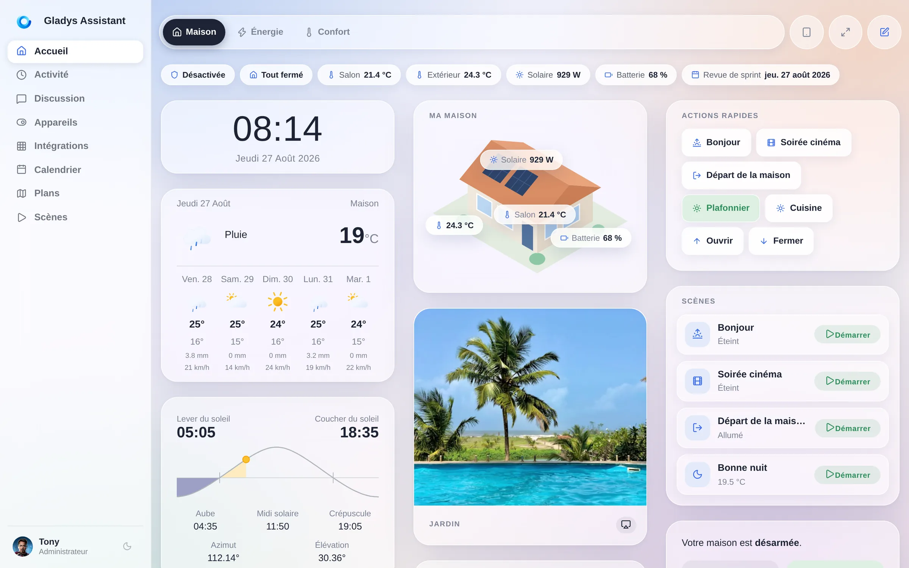

{/* truncate */}

## Un peu d'histoire

Gladys est open source **depuis 2013**. Ça a commencé comme un projet perso sur un Raspberry Pi, dans une chambre, avec une idée toute simple : votre maison devrait être pilotée par une machine **qui vous appartient**, **chez vous**, qui continue de marcher quand internet tombe et quand une startup se fait racheter.

Treize ans plus tard, l'idée n'a pas bougé d'un millimètre, et elle a plutôt bien vieilli.

- **2013** : les premières lignes de code, Gladys v1, sur un Raspberry Pi.
- **2015** : Gladys v2, et une communauté qui se forme autour.
- **2016** : Gladys v3.
- **3 novembre 2020** : **Gladys 4**, une réécriture complète, en Docker, avec l'interface que la plupart d'entre vous utilisent aujourd'hui.
- **27 août 2026** : **Gladys Assistant 5**.

Entre la v4 et aujourd'hui, on a sorti **86 mises à jour de fonctionnalités**, chacune avec son lot de nouveautés, sans compter les correctifs publiés entre les deux. Le moteur est devenu très bon : Zigbee, Z-Wave, Matter, MQTT, caméras, énergie, scènes, un assistant IA, un système de plugins. Mais l'interface, elle, est restée celle dessinée en 2020, pour un écran d'ordinateur portable, à une époque où je n'imaginais pas vraiment que vous alliez fixer des tablettes au mur et piloter votre maison depuis votre téléphone au fond du lit.

C'est exactement ce que vous avez fait. Donc la version 5 est faite pour l'écran que vous utilisez vraiment.

## ☀️ Horizon, le nouveau design

Le nouveau design s'appelle **Horizon**. C'est un thème glass, doux et lumineux : des surfaces givrées qui flottent au-dessus d'un dégradé vivant, des arrondis généreux, de la vraie profondeur, et une échelle typographique qui laisse enfin respirer les chiffres.

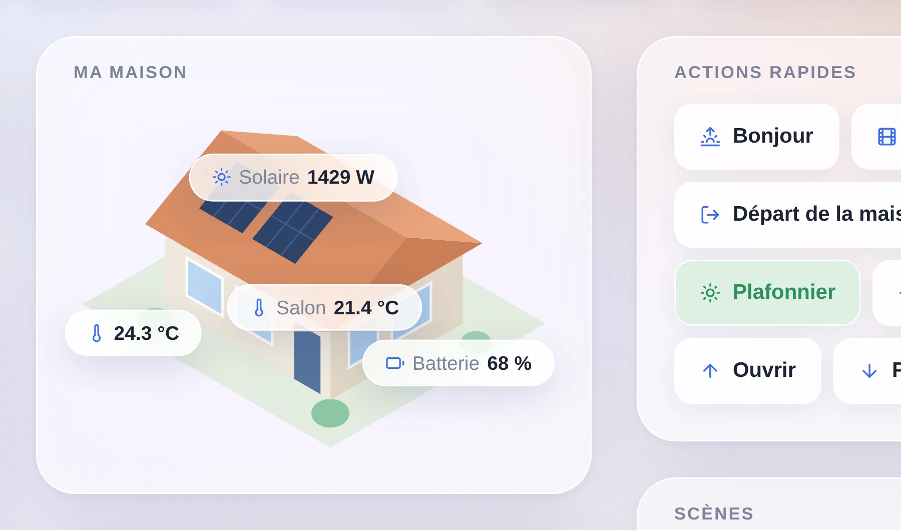

Ça, c'est un zoom sur le haut d'un tableau de bord, à taille réelle. Chaque widget est un panneau givré à grand rayon, posé sur un dégradé qui court derrière toute la page au lieu d'être repeint carte par carte. Au milieu, le **widget vue de la maison**, la signature de cette version : votre maison en illustration, avec les valeurs en direct épinglées exactement là où il faut.

Ce n'est pas un coup de peinture sur deux écrans. **Toutes les pages de Gladys y sont passées** : le dashboard, les Appareils, les Intégrations et chacune de leurs sous-pages, la Discussion, l'Activité, le Calendrier, les Plans, les Scènes, les Paramètres, le profil, et même l'écran de connexion.

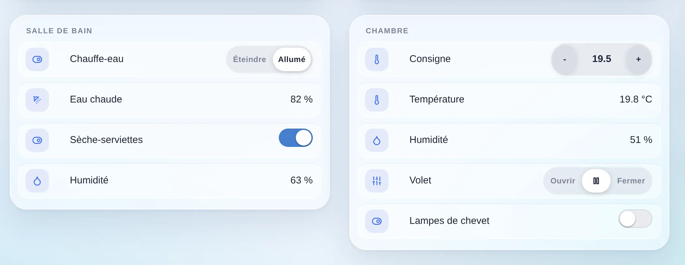

Et les contrôles ont été redessinés un par un. Les anciens groupes de boutons Bootstrap sont devenus des **contrôles segmentés à la iOS** : une piste douce, un seul segment blanc actif. Les consignes sont devenues des **capsules** avec un moins et un plus. Chaque ligne d'appareil est devenue sa propre tuile de verre imbriquée. Rien de tout ça ne change ce que Gladys sait faire. Tout ça change la sensation de l'utiliser vingt fois par jour.

Mon détail préféré, on ne le voit vraiment qu'en mouvement. Le sélecteur de tableaux de bord n'est pas posé dans une barre en haut de la page : c'est une **capsule flottante** qui reste épinglée pendant que le tableau de bord défile en dessous, et son fond dépoli givre tout ce qui passe au travers. Une photo, un graphique, un titre de carte : tout se floute en passant dessous, et ressort net de l'autre côté.

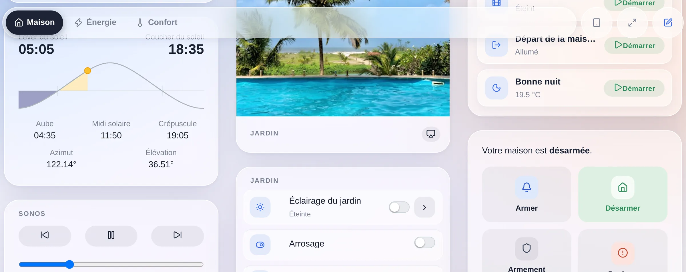

La capsule est aussi transparente au pointeur partout sauf sur ses propres pastilles, donc les widgets qui glissent dessous restent cliquables. C'est un petit détail. C'est aussi le moment où l'interface cesse de ressembler à une page web.

## 📱 Pensé pour le téléphone dans votre poche

C'est la partie qui me tient le plus à cœur, et la plus difficile à montrer en capture d'écran, alors soyons précis.

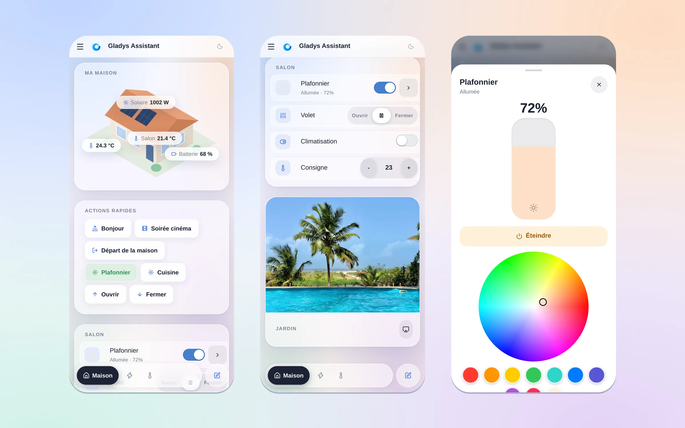

Ces trois écrans sont à un geste les uns des autres. Vous ouvrez Gladys et vous voyez votre maison. Vous faites défiler une fois et vous êtes sur les contrôles d'une pièce : une lumière, un volet, la climatisation et sa consigne, tous à taille de doigt. Vous appuyez sur la lumière et vous obtenez un panneau plein écran, avec un curseur de luminosité que vous faites glisser au pouce et une roue de couleurs. C'est tout l'objet de cette version.

**Le sélecteur de dashboards est passé en bas.** Sur un téléphone, le bord accessible au pouce est celui du bas, pas celui du haut. Donc en dessous du point de rupture desktop, la barre d'onglets se détache de l'en-tête et devient un dock flottant à portée de pouce. Elle respecte `safe-area-inset-bottom`, donc elle passe au-dessus de la barre d'accueil d'un iPhone, et elle suit le **visual viewport** : Safari iOS anime sa propre barre du bas quand vous faites défiler la page, et sans cette correction le dock se cachait dessous en permanence. Ce n'est plus le cas.

**Seul l'onglet actif garde son nom.** Les autres se réduisent à des pastilles d'icône. Sur un écran de 390 pixels, c'est la différence entre voir deux dashboards et en voir cinq.

**On peut balayer d'un dashboard à l'autre, et ça fait natif.** Pas un rechargement de page : le dashboard voisin **glisse sous votre doigt sous forme de squelette**, exactement à la mise en page qu'il aura, puis bascule sur les vraies données dès qu'elles arrivent. Le geste se verrouille sur un axe après 12 pixels, se valide à 15 % de la largeur d'écran ou sur un flick, et rebondit en élastique quand il n'y a pas de dashboard de ce côté. Les widgets qui ont leur propre geste horizontal (une carte, un curseur, un tableau d'appareils qui défile) le gardent : le pager les détecte par géométrie, pas par une liste en dur, donc un nouveau widget qui défile est couvert par construction.

**Les zones tactiles ne grossissent que pour les doigts.** Chaque contrôle d'un widget atteint le plancher des ~44 pixels des règles Apple, mais uniquement sous `@media (pointer: coarse)`, pour qu'un PC portable tactile garde le dimensionnement compact à la souris au lieu de se transformer en borne interactive. Même logique pour appuyer sur une ligne d'appareil : au doigt, toute la ligne est la cible ; à la souris, non, parce qu'un clic qui dérape sur le nom d'un appareil ne doit jamais écrire dans vos lumières.

**Les contrôles segmentés sont l'exception à la règle des 44 pixels**, volontairement : dans une piste segmentée, c'est *toute la piste* qui est la zone tactile, donc ses segments restent à la hauteur des segmented controls iOS au lieu de s'empiler en tour de gros boutons.

**Les popups s'échappent de leur carte.** Sélecteurs de date, choix de période et menus déroulants sont rendus en haut du document plutôt que dans le widget qui les a ouverts, donc sur un petit écran ils ne sont jamais coupés par la carte à laquelle ils appartiennent.

**Le menu des paramètres défile horizontalement**, avec des flèches de débordement, au lieu de se replier sur six lignes, et les colonnes qui ne rentrent plus **passent à la ligne** au lieu d'être écrasées.

Vingt petites décisions. Mises bout à bout, c'est la différence entre une interface qui *fonctionne* sur téléphone et une interface qui a été *faite* pour lui.

## 🌙 Clair ou sombre, comme vous voulez

Horizon existe dans les deux. Le thème sombre n'est pas un filtre inversé, il est dessiné : le même verre, la même profondeur, plus chaud sur les bords.

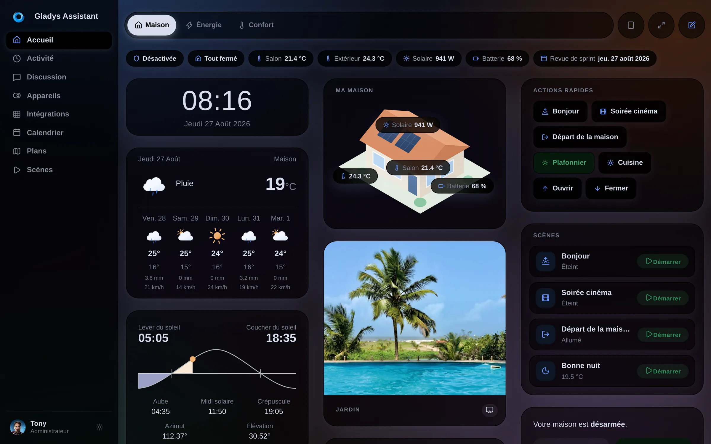

## 🧱 Un dashboard qu'on peut enfin mettre en page

L'ancien dashboard, c'était N colonnes de largeur égale, point. Si vous vouliez une grande vue de maison à gauche et une pile de petites tuiles à droite, c'était impossible.

Maintenant un dashboard est fait de **sections**, et chaque section a ses propres colonnes :

- **Des largeurs de colonnes pondérées.** Une colonne est *normale* ou *large*. Une section `large | normale` met un grand panneau à gauche et une pile de tuiles à droite. Deux clics, deux valeurs, pas de bricolage au pixel.
- **Une barre de chips.** Des pastilles d'état compactes en haut du dashboard : état de l'alarme, « tout fermé », une température, la production solaire, le prochain événement du calendrier. Elles se réorganisent sur téléphone au lieu de déborder.
- **Des actions rapides et des scènes avec leur état en direct.** Un bouton de scène vous dit maintenant ce que la scène a fait : `Départ de la maison · Allumé`.
- **Un widget vue de la maison** : une illustration de chez vous, avec les valeurs en direct épinglées dessus.
- **L'éditeur montre le vrai résultat.** Le canvas d'édition et la vue partagent désormais la même mise en page de colonnes, avec les mêmes pourcentages, donc ce que vous arrangez est ce que vous obtenez.
- **Un sélecteur de widgets avec recherche**, une icône et un nom par type, au lieu d'une liste déroulante brute.

Les dashboards **demandent aussi une icône** à la création, et les dashboards existants dont le nom commençait par un emoji voient cet emoji promu en icône automatiquement.

## 🎬 L'éditeur de scènes, réécrit

Les scènes étaient la partie la plus puissante et la plus intimidante de Gladys. L'éditeur est maintenant un **flux vertical** : un bloc **QUAND** pour les déclencheurs, un bloc **ALORS** pour les étapes, chaque étape repliable, chaque action choisie dans un **sélecteur par catégories** au lieu d'une liste à plat.

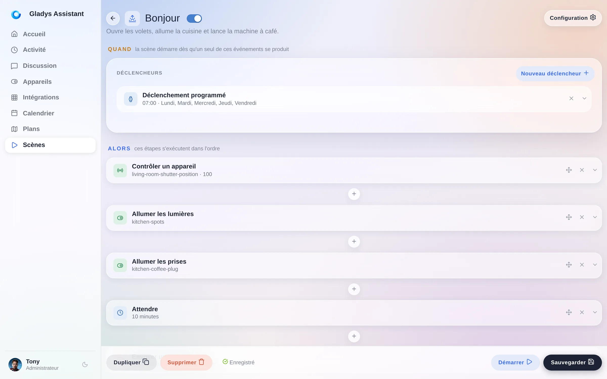

Également nouveau côté scènes :

- **Voir et arrêter les scènes en cours d'exécution**, enfin.
- Une action **« Obtenir la date et l'heure actuelles »**.
- Un mode **« n'importe quel changement d'état »** sur le déclencheur d'état d'appareil.
- Le sélecteur de canal de message ne liste que les services de messagerie réellement configurés.
- On peut supprimer le premier bloc d'actions d'une scène.
- Les événements du calendrier reviennent sous forme de liste lisible dans les variables de scène.

## 🧩 67 intégrations communautaires, et ça continue

Il y a deux versions, on a ouvert les **intégrations externes** : n'importe qui peut empaqueter une compatibilité d'appareil sous forme de petite image Docker, la publier, et elle apparaît dans le catalogue de toutes les instances Gladys de la planète.

Le catalogue est passé de 20 à **67 intégrations en un peu plus de deux semaines**. Airzone, Apple TV, Daikin, De Dietrich, bornes de recharge, CallMeBot, Docker, onduleurs solaires : presque tout est écrit par la communauté, pas par moi.

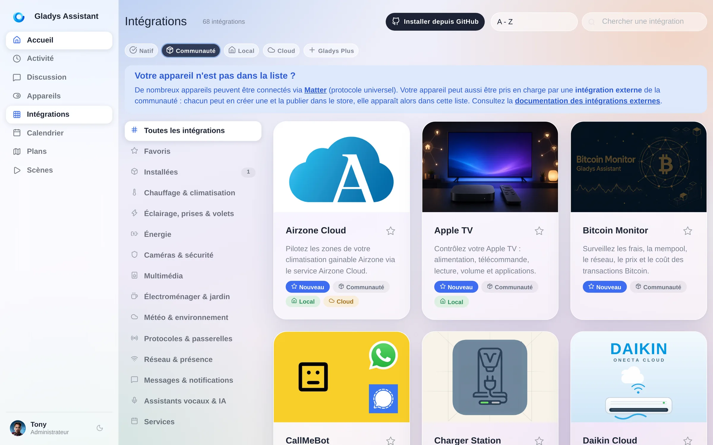

Cette version peaufine toute cette boucle : une vue **Installées** qui montre ce qui tourne réellement sur votre instance, des numéros de version **liés à leur changelog**, la nouvelle version affichée dans la bannière « mise à jour disponible », la **rétention d'historique par fonctionnalité** sur les appareils externes, et le **suivi énergétique automatique** pour les fonctionnalités qui remontent une puissance.

Si votre appareil n'est pas encore supporté, [vous pouvez écrire l'intégration vous-même en une après-midi](/fr/docs/dev/external-integrations/).

## 🤖 L'assistant reçoit un micro

La page Discussion est passée sur Horizon comme le reste : la conversation est posée sur le même verre, et les outils utilisés par l'assistant pour vous répondre sont présentés en chips que vous pouvez déplier.

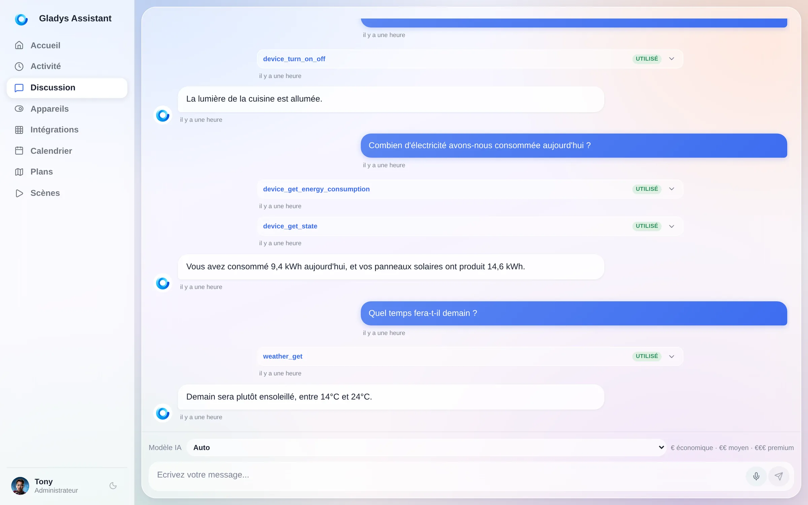

La nouveauté est juste à côté du bouton d'envoi : un **micro**. Vous appuyez dessus et vous dictez votre message au lieu de le taper. Sur un téléphone, c'est la différence entre utiliser l'assistant et ne pas s'en donner la peine.

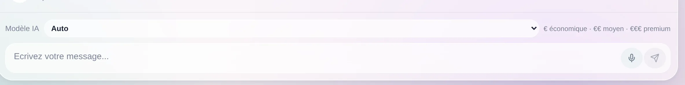

L'assistant a aussi appris un nouvel outil : il sait lire le **niveau de batterie de vos appareils**, donc « quels capteurs ont besoin de piles ? » obtient enfin une vraie réponse.

## ⚡ Énergie

Les widgets d'énergie ont eu droit au traitement Horizon, et à une amélioration que vous verrez tous les mois : la période de suivi peut désormais **commencer n'importe quel jour du mois**, pour coller à votre vraie période de facturation au lieu du calendrier.

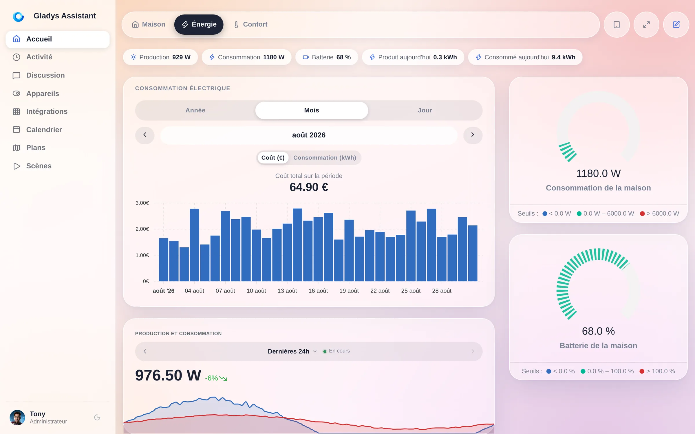

Pour les utilisateurs Enedis : le nouveau callback de consentement **DataConnect 2026** est pris en charge, et une synchronisation ne recalcule plus que les coûts des appareils réellement concernés, au lieu de tout l'historique.

## 🔌 Appareils, protocoles, système

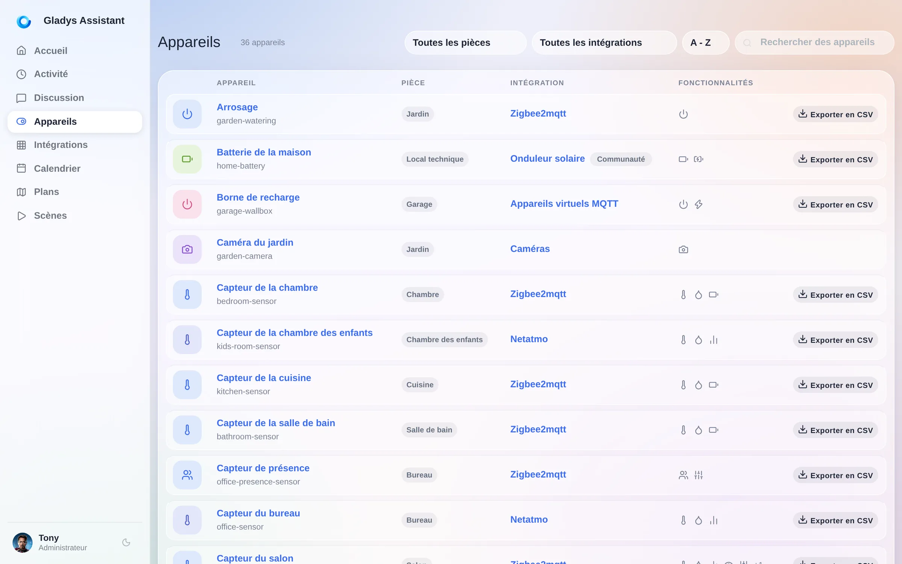

- **Exporter l'historique d'un appareil en CSV**, directement depuis la liste des appareils.
- **Matter** : détecteurs de fuite d'eau, capteurs d'ouverture et de pluie, et **serrures**.
- **Zigbee2MQTT 2.13**, la prise en charge des **coordinateurs réseau** (SMLIGHT SLZB-06/07 et compagnie), des sirènes solaires d'extérieur et du Heiman HS2WD-E.
- **MQTT** : topics d'état avec joker dans la découverte Home Assistant.
- **Google Home** : les capteurs de température et d'humidité sont exposés.
- **Caméras** : désactiver une caméra sans la supprimer, un vrai mode privé.
- **Redémarrer ou éteindre la machine hôte** depuis les paramètres Système, et ça fonctionne maintenant aussi sur les installations Docker standard.
- **Gladys s'annonce sur votre réseau local en mDNS**, donc trouver son instance n'est plus une chasse à l'adresse IP.
- **Codes de récupération pour la double authentification** Gladys Plus, et Gladys recommande désormais des applications 2FA grand public.
- Les icônes météo ont été redessinées et les conditions pivots étendues.

Sans oublier la longue traîne : les pièces triées par ordre alphabétique, le nom des intégrations affiché dans la liste des appareils, l'onglet des maisons transformé en liste lisible, la carte de migration DuckDB qui se cache une fois qu'il n'y a plus rien à migrer, et une pile de corrections.

**92 pull requests, 720 fichiers, environ 52 000 lignes ajoutées, en 12 jours.**

## 🏡 Vous venez de Home Assistant ?

L'objection habituelle, c'est le nombre d'intégrations. Cet argument est en train de s'épuiser : le catalogue communautaire est passé de 20 à **67 intégrations en un peu plus de deux semaines**, écrites par des gens qui n'avaient jamais ouvert le code de Gladys, et ça accélère encore. On va chercher cet écart, volontairement, et vite. En attendant, voilà tout ce que vous avez déjà aujourd'hui.

- **Une interface que vous n'avez pas à construire.** Pas de YAML, pas de langage de dashboard, pas de catalogue de cartes à apprendre. Vous installez Gladys et ça ressemble déjà aux captures de cet article, sur votre téléphone, en mode sombre, sans un seul fichier de configuration.
- **Vos appareils actuels fonctionnent probablement déjà.** Gladys parle le **Home Assistant Discovery en MQTT** : vos appareils ESPHome, Tasmota et Zigbee2MQTT sont découverts automatiquement, sans aucune configuration manuelle. Gladys parle aussi Zigbee2MQTT nativement, Matter, Z-Wave, et sait dialoguer avec HomeKit et Google Home.
- **Un seul bouton de mise à jour.** Gladys est une image Docker. Elle se met à jour toute seule, en un clic, ou automatiquement avec Watchtower.
- **Un assistant IA réellement intégré**, qui voit vos appareils, agit dessus, et vous dit quels outils il a utilisés.
- **La même promesse depuis 2013** : local d'abord, open source, pas de cloud obligatoire, pas de compte obligatoire, vos données sur votre matériel.

Le plus rapide, ce n'est pas de me lire. C'est de cliquer sur le lien juste en dessous.

## 👉 Essayez tout de suite

**[Ouvrez la démo en ligne](https://demo.gladysassistant.com/dashboard)**. C'est un Gladys Assistant 5 complet qui tourne entièrement dans votre navigateur, avec une vraie maison, de vrais dashboards, de vraies scènes. Rien à installer, aucune inscription.

Ensuite, quand vous serez convaincu : **[installez Gladys](/fr/docs/)**. Sur un Raspberry Pi, un NAS, un vieux portable, tout ce qui fait tourner Docker. Ça prend quelques minutes.

## ❤️ Merci

La version 5 existe grâce aux gens qui ont signalé, argumenté, testé sur leurs propres tablettes murales et m'ont envoyé des captures de ce qui cassait sur mobile.

Un immense merci à [@Dreamthy](https://github.com/Dreamthy), [@William-De71](https://github.com/William-De71), [@callemand](https://github.com/callemand), [@cicoub13](https://github.com/cicoub13), [@vincentBesseau](https://github.com/vincentBesseau), Stéphane Escandell et Valentin Hutter pour le code de cette version, et à tous ceux qui publient des intégrations externes : c'est grâce à vous que le catalogue a triplé en deux semaines.

Comme toujours, Gladys se met à jour automatiquement dans les 24h si vous utilisez Watchtower, sinon vous pouvez le faire en un clic dans les paramètres.

Pensez à configurer Telegram pour recevoir une alerte sur votre téléphone quand Gladys se met à jour !

[Voir la note de version complète sur GitHub](https://github.com/GladysAssistant/Gladys/releases/tag/v5.0.0)
