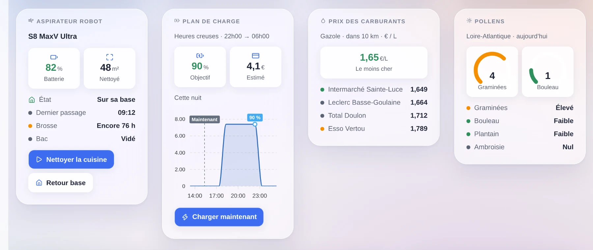
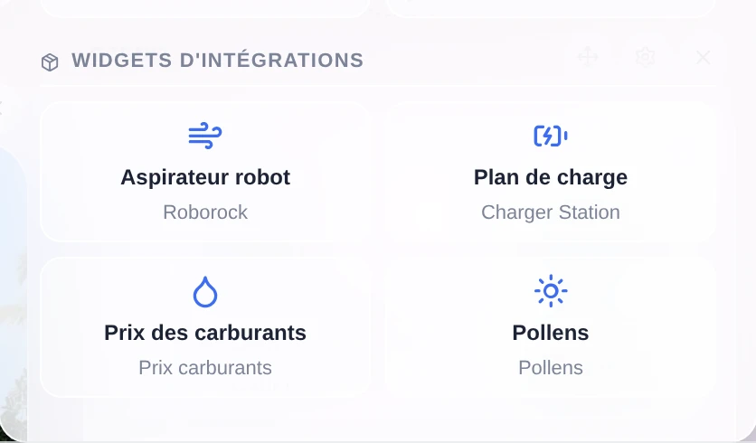
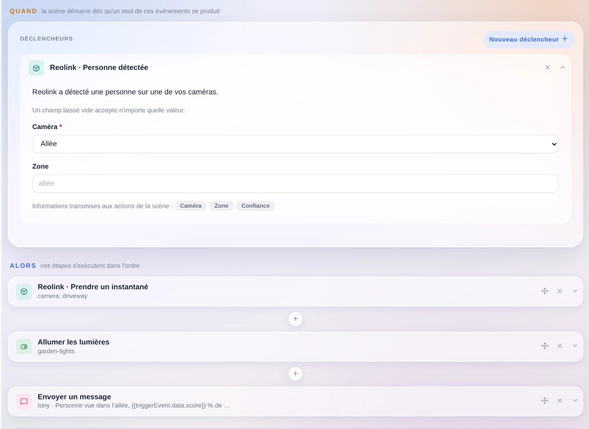
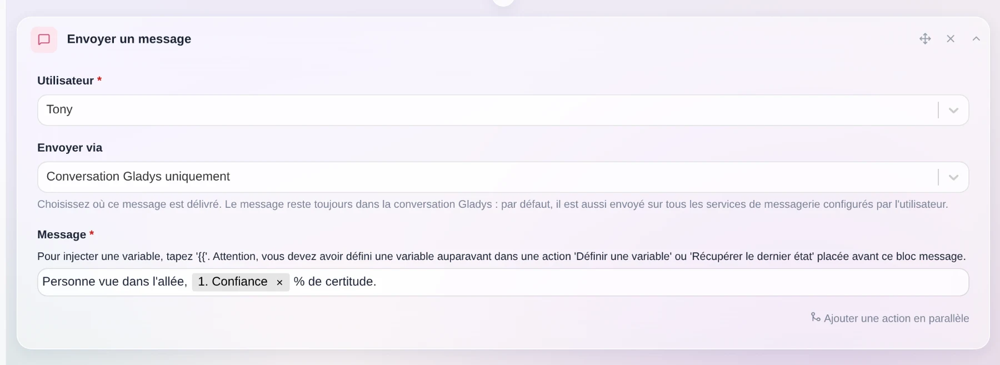
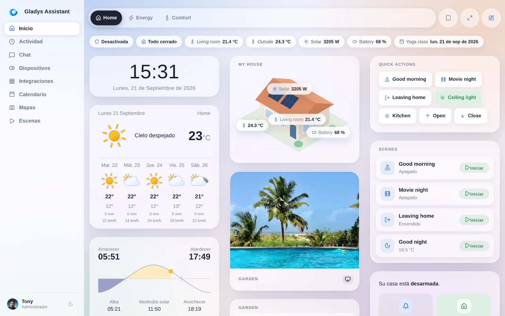
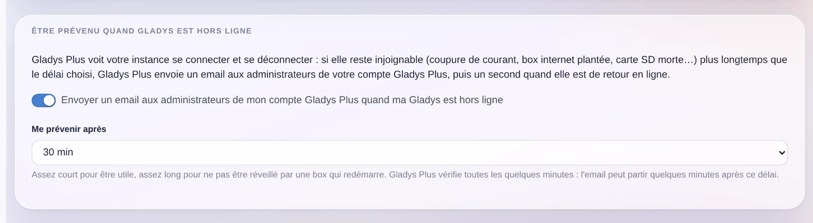
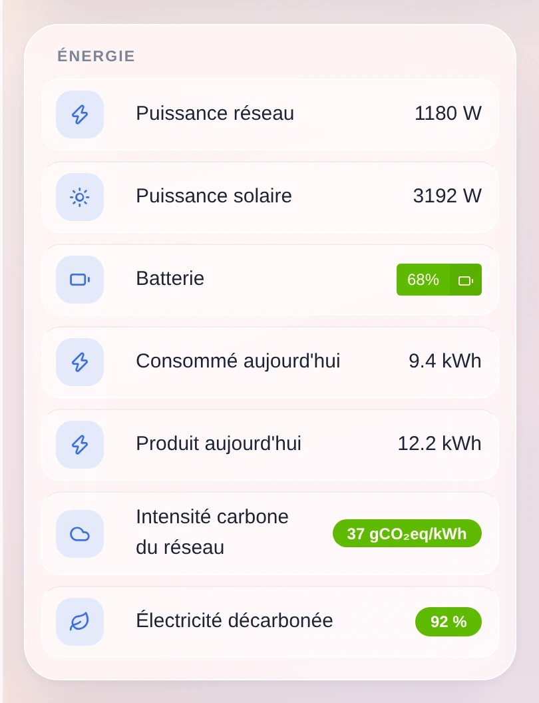
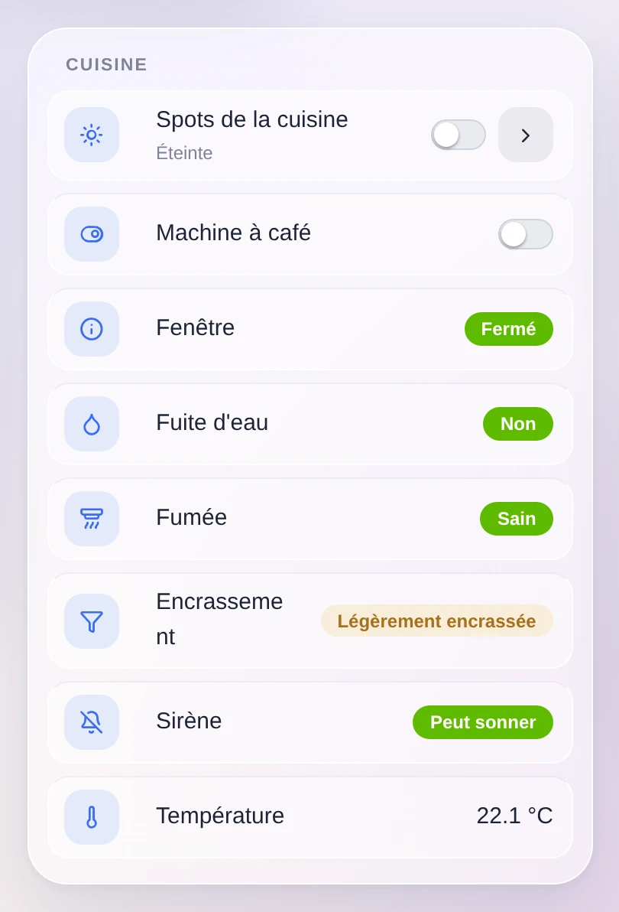

Salut à tous !

**Gladys Assistant 5.1 est disponible.** 🎉

La version 5 parlait de l'interface. Celle-ci parle de ce que la communauté peut en faire, et elle fait tomber deux murs présents depuis le début : une intégration ne pouvait rien poser sur votre tableau de bord, et elle ne pouvait rien ajouter à vos scènes. Les deux sont tombés.

{/* truncate */}

## 🧩 Les intégrations peuvent publier des widgets de tableau de bord

Il y a quelques versions, on a ouvert les **intégrations externes** : n'importe qui peut empaqueter la compatibilité d'un appareil dans une petite image Docker, la publier sur GitHub, et elle apparaît dans le catalogue de toutes les instances Gladys de la planète. Il y en a **81 aujourd'hui**, écrites presque entièrement par des gens qui n'avaient jamais ouvert le code de Gladys.

Sauf que ces intégrations ne savaient faire qu'une chose : publier des appareils. Or une grande partie de ce qu'une intégration sait n'est pas un appareil. Votre prévision de production solaire pour demain n'est pas un appareil. La carte de nettoyage d'un aspirateur non plus. Le gazole le moins cher autour de vous, le risque pollinique du jour, le plan que votre voiture va suivre cette nuit pour charger en heures creuses : rien de tout ça ne rentre dans « une température et un interrupteur », et tout ça est exactement ce qu'on veut voir sur un tableau de bord.

**Une intégration peut donc maintenant déclarer ses propres widgets**, et Gladys les affiche.

Ils apparaissent dans le sélecteur de widgets de l'éditeur de tableau de bord, dans leur propre section, chacun portant le nom de l'intégration qui le publie. On en ajoute un comme n'importe quel autre widget, et s'il a des réglages — quel aspirateur, quelle région, quelle période — on les remplit là, dans un formulaire décrit par l'intégration et généré par Gladys.

### L'intégration dit *quoi*, Gladys décide *comment*

C'est la partie qui me tient à cœur, et c'est un choix de conception assumé, pas un raccourci.

Aucune intégration tierce n'injecte de HTML dans votre Gladys. Pas d'iframe, pas de script, pas de CSS, pas de couleurs ni de tailles personnalisées. Une intégration envoie un **arbre de contenu** dans un petit vocabulaire déclaratif — un titre, des tuiles de valeurs, une jauge, une liste d'états, un graphique, une grille d'affiches, une image, des boutons — et le cœur se charge du rendu.

Ce qui veut dire que chaque widget, y compris celui écrit par quelqu'un dont vous n'avez jamais entendu parler, hérite gratuitement du thème glass Horizon, du mode sombre, de la mise en page mobile, de votre langue et de votre fuseau horaire, et continue de marcher quand l'interface évolue. C'est le modèle des widgets iOS et Android, et personne ne trouve ces écosystèmes pauvres.

Le vocabulaire refuse aussi qu'un widget soit moche. Le style n'est pas la seule façon de rater une carte — l'encombrement est l'autre, et c'est celle que produit la composition libre. Un widget a donc un **budget de contenu** : 8 composants au maximum, un seul composant focal (un graphique *ou* une liste *ou* une image, jamais deux), 6 tuiles de valeurs au maximum, 4 boutons au maximum, des listes bornées, des textes courts. Et **l'ordre est imposé par le cœur**, pas par l'intégration : en-tête, tuiles, composant focal, états, boutons. Quoi qu'une intégration envoie, deux widgets qui affichent « une valeur, une courbe et deux boutons » sortent avec la même silhouette.

Le pire widget qu'une intégration puisse produire ressemble à un widget Gladys un peu chargé. C'était l'objectif.

Quelques précisions qui vont avec :

- **Le contenu est produit à la volée**, pas figé dans le manifeste. Un aspirateur en train de nettoyer peut renvoyer une mise en page différente d'un aspirateur sur sa base, sans qu'il faille inventer, spécifier et maintenir à vie un langage de template.
- **Rien n'est digne de confiance.** Chaque contenu est normalisé et borné avant d'atteindre l'interface : uniquement des types de composants connus, des chaînes et des listes bornées, des nombres finis, des dates validées, des liens `https` uniquement, et des images servies par votre propre Gladys plutôt que récupérées chez un tiers par votre navigateur.
- **Un bouton peut agir.** Il peut appeler l'intégration, ou écrire une valeur sur une de ses fonctionnalités d'appareil, avec le résultat affiché dans la carte.
- **Un widget peut tracer votre historique**, en pointant une fonctionnalité d'appareil de l'intégration, ou tracer des données dont Gladys n'a aucun historique (une prévision, un plan de charge, les prix de demain) en envoyant les points directement — avec des annotations sur la courbe et un repère « maintenant ».
- **Une intégration qui n'a aucun appareil** — un indice de prix des carburants, un flux de sorties cinéma — a enfin sa place : le nouveau type d'intégration `provider`, dont tout le contrat est ce qu'elle fournit.

Les widgets des captures ci-dessus sont des exemples de ce que le vocabulaire sait exprimer. Le mécanisme sort aujourd'hui ; les intégrations qui l'utilisent sont désormais écrivables par les mêmes personnes qui ont triplé le catalogue en deux semaines.

## 🎬 Les intégrations peuvent ajouter des déclencheurs et des actions à vos scènes

Même mur, autre côté de la maison.

Jusqu'à aujourd'hui, chaque déclencheur et chaque action de l'éditeur de scènes était codé en dur dans Gladys. Une intégration externe n'avait aucune porte d'entrée — et les deux surfaces génériques dont elle disposait ne couvrent pas le besoin :

- **Une fonctionnalité d'appareil est un état, pas un événement.** Une température, un interrupteur, une présence : ce sont des valeurs, et `device.new-state` les gère parfaitement. Mais une plaque d'immatriculation reconnue dans l'allée, une sonnette pressée avec un instantané, un tag NFC scanné, une commande vocale comprise — ce sont des *choses qui arrivent*, avec des données attachées. Les plier en fonctionnalité perd la donnée, se marche dessus quand deux événements s'enchaînent, et pollue votre historique.
- **Écrire une valeur n'est pas une opération.** « Prends un instantané et donne-moi l'image », « nettoie ces trois pièces », « annonce ça sur cette enceinte » sont des opérations avec des paramètres et un résultat.

Une intégration peut donc désormais déclarer **ses propres déclencheurs et ses propres actions de scène**, dans son manifeste, et ils apparaissent dans l'éditeur de scènes comme le reste.

La carte est générée par Gladys à partir de la déclaration : les champs deviennent un formulaire, un champ laissé vide accepte n'importe quelle valeur, et les détails portés par l'événement deviennent des **variables de scène** réutilisables dans les étapes suivantes — l'indice de confiance de la capture ci-dessus vient directement du déclencheur.

La règle de conception est la même que partout ailleurs dans ce système : **c'est le cœur qui fait la correspondance, l'intégration ne sait rien de vos scènes.** L'intégration émet un événement typé avec ses données ; Gladys le compare aux déclencheurs que vous avez configurés. L'intégration n'apprend jamais quelles scènes existent, il n'y a rien à fuiter ni rien à resynchroniser à la reconnexion, et votre configuration reste dans Gladys. Une action est émise une seule fois, un timeout fait échouer cette action et seulement celle-là.

Ce qui veut dire aussi qu'une scène peut enfin mélanger des choses qui n'avaient jamais eu l'occasion de se croiser : un événement d'une intégration, une action d'une autre, et les étapes Gladys habituelles entre les deux.

## 💬 « Conversation Gladys uniquement »

Une petite nouveauté que beaucoup d'entre vous demandaient. Quand une scène vous envoie un message, il part par défaut sur tous les services de messagerie que vous avez configurés — Telegram, SMS, etc.

Vous pouvez maintenant choisir. **« Conversation Gladys uniquement »** garde le message dans Gladys, et seulement là. C'est la seule façon d'écrire un message qu'une installation de Telegram six mois plus tard ne transformera pas silencieusement en notification sur votre téléphone, et l'option est disponible même si vous n'avez aucun canal de messagerie configuré. La même option existe sur l'action de scène « Demander à l'IA ».

Tant qu'on est dans les scènes : **les scènes créées par l'IA sont maintenant taguées « AI »**, pour distinguer ce que vous avez écrit de ce qu'elle a écrit — et le filtre par tag correspond désormais exactement, au lieu de retenir tout ce qui contient le mot.

## 🇪🇸 Gladys parle espagnol

**Gladys est maintenant disponible en espagnol**, la quatrième langue après l'anglais, le français et l'allemand. Toute l'interface : le tableau de bord, les appareils, l'éditeur de scènes, les paramètres, les pages d'intégrations, et jusqu'aux mots-clés de recherche d'icônes.

Un immense merci à **Nestor Alonso Torres** pour celle-là. Si vous voulez Gladys dans votre langue, les fichiers de traduction sont de simples JSON dans le dépôt et la voie est ouverte.

## 📩 Être prévenu quand votre Gladys tombe

Gladys Plus voit votre instance se connecter et se déconnecter. Autant qu'il vous prévienne quand elle s'arrête.

**Gladys Plus peut désormais envoyer un e-mail aux administrateurs de votre compte quand votre instance est injoignable depuis plus longtemps qu'un délai que vous choisissez** — de 10 minutes à une journée — puis un second e-mail quand elle est revenue. Coupure de courant, box internet tombée, carte SD morte, mise à jour Docker qui a mal tourné : vous l'apprenez le jour même, au lieu du soir où vous rentrez et où les lumières ne s'allument pas.

Le réglage appartient à votre compte Gladys Plus, on le change donc depuis Gladys Plus, et Gladys vous y envoie directement.

## 🌍 Une nouvelle catégorie d'appareil : le carbone du réseau

Gladys gagne une catégorie **capteur carbone du réseau** : l'intensité carbone de votre réseau électrique en gCO₂eq/kWh, la part d'électricité décarbonée, et la part de renouvelable. Trois valeurs avec leurs unités, leur historique, leurs graphiques — et surtout trois valeurs qu'une scène peut lire.

« Lance la machine à laver quand le réseau est propre » est désormais une scène que vous pouvez écrire, et les intégrations qui publient ces chiffres pour votre pays ont enfin où les publier.

## 🔥 Les détecteurs de fumée disent plus que « fumée / pas fumée »

Les détecteurs de fumée Zigbee remontent bien plus que l'alarme elle-même, et Gladys les mappe maintenant : **l'encrassement de la chambre de détection** (un détecteur encrassé est un détecteur aveugle, et il vous dit de le nettoyer ou de le remplacer), **le fait que le détecteur se soit mis en silence**, et une commande pour **couper l'alarme** aussi longtemps que l'appareil l'autorise.

Cette dernière reste volontairement hors de la catégorie interrupteur générique : couper une alarme incendie ne doit jamais être atteignable par un « éteins tout » dans une scène ou un assistant vocal.

## 🔌 Appareils, protocoles, système

- **Matter** : matter.js passe en 0.17.9, ce qui corrige les erreurs `Node ID X is already commissioned` qui bloquaient certains appairages.
- **HomeKit** : les climatisations sont exposées en HeaterCooler, donc demander à Siri d'en allumer une conserve le mode dans lequel elle était au lieu de le réinitialiser.
- **Zigbee2MQTT** : les **étiquettes triphasées du ZLinky_TIC** sont mappées (`SINSTS1`, `SMAXSN*`, `IINST1`, `IMAX1`), `probe_temperature` obtient son propre type de température au lieu d'être écrasé sur la principale, et le conteneur Zigbee2MQTT tourne désormais dans **le fuseau horaire de votre instance** — ses logs et ses horaires arrêtent d'être décalés de deux heures.
- **Sonos** : l'intégration native porte maintenant un badge *déprécié* et un **bouton de migration** vers l'intégration communautaire, qui fait plus, avec un avertissement dans la fenêtre sur ce qui change pour les notifications vocales.
- **Tableau de bord** : le curseur et le champ numérique respectent désormais le **pas** déclaré par une fonctionnalité d'appareil, une consigne qui bouge par 0,5 arrête donc de sauter par 1.
- **Calendrier** : correction d'une régression où le chargement du plugin timezone de dayjs cassait le calendrier.
- **Gladys Plus** : le verrou de paiement dans lequel certains comptes étaient restés à cause du bug 402 de l'offre Lite est levé automatiquement, et chaque version est maintenant publiée sur Gladys Plus directement depuis le workflow de release.
- **Sécurité** : correction d'une faille de réinitialisation de mot de passe où une origine choisie par un attaquant pouvait empoisonner le lien envoyé par e-mail.

Côté documentation, les routes d'API qui manquaient à l'apidoc généré sont publiées, et la spécification des intégrations externes est désormais découpée en un fichier par sujet — ce qui compte plus qu'il n'y paraît, parce que cette spécification est ce que lit toute personne qui écrit une intégration.

## 🩹 Et tout ce que les 5.0.x ont déjà corrigé

Entre la 5.0 et aujourd'hui, quatre versions correctives sont sorties — 5.0.1, 5.0.2, 5.0.3 et 5.0.4 — avec une cinquantaine de correctifs, presque tous issus de vos retours sur la nouvelle interface : tablettes en portrait, noms d'appareils trop longs, dock mobile, icônes météo, ConBee III, renumérotation des variables de scène, menus déroulants qui tombaient en bas de l'écran, latence de défilement du tableau de bord.

**Près de 70 pull requests depuis la version 5.0**, dont 23 dans cette version.

## ❤️ Merci

Merci à [@cicoub13](https://github.com/cicoub13), [@William-De71](https://github.com/William-De71), [@vincentBesseau](https://github.com/vincentBesseau) et **Nestor Alonso Torres** pour le code de cette version, et à tous ceux qui publient des intégrations externes — le catalogue est à **81** et il continue de monter.

Si vous voulez en construire une, [le guide développeur est ici](/docs/dev/external-integrations/) — et vous pouvez maintenant lui donner un widget et quelques déclencheurs de scène au passage. Le guide n'a pas encore rattrapé ces deux nouveautés ; en attendant, leurs champs de manifeste, leurs charges utiles et leurs limites sont spécifiés en détail dans [la spécification des intégrations externes](https://github.com/GladysAssistant/Gladys/tree/master/docs/specs/external-integrations/capabilities).

Comme toujours, Gladys se met à jour automatiquement sous 24 h si vous utilisez Watchtower, sinon vous pouvez le faire en un clic depuis les paramètres.

Pensez à configurer Telegram pour recevoir une alerte sur votre téléphone quand Gladys se met à jour !

[Voir les notes de version complètes sur GitHub](https://github.com/GladysAssistant/Gladys/releases/tag/v5.1.0)
