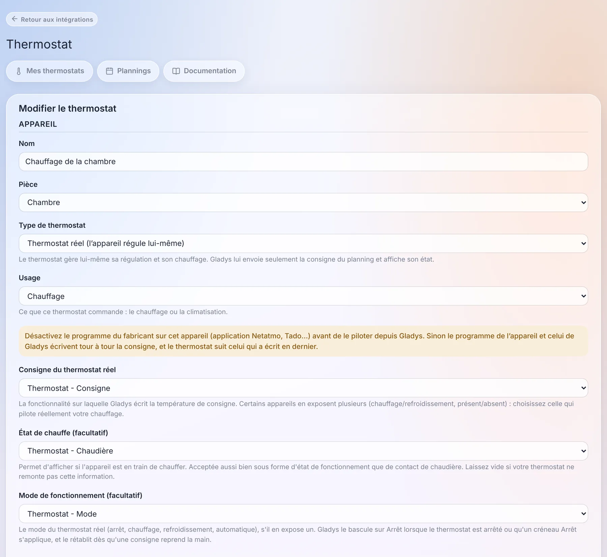
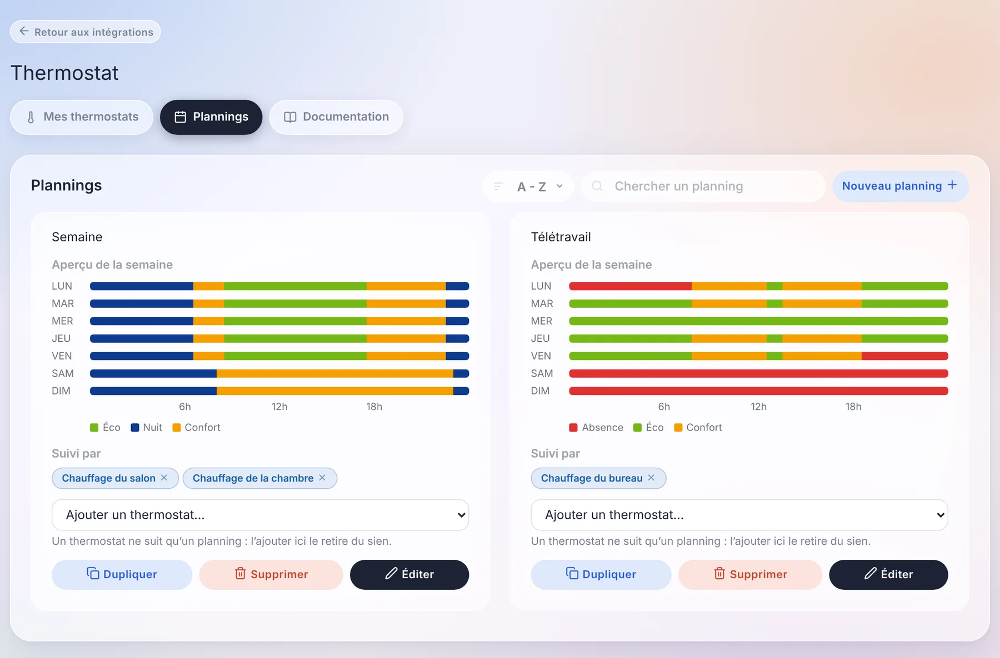
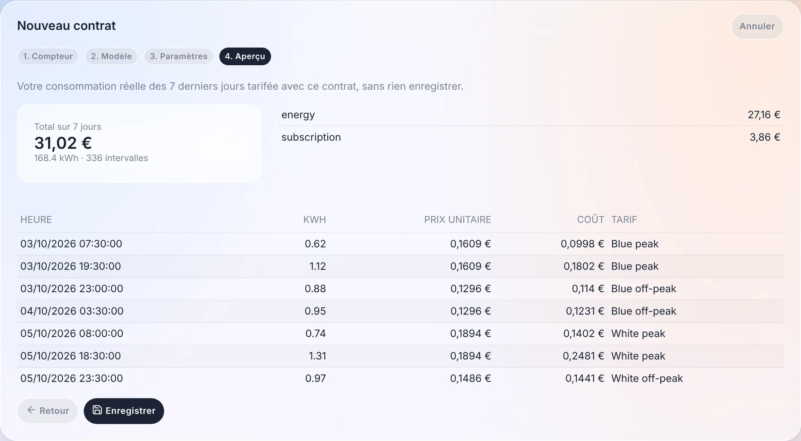
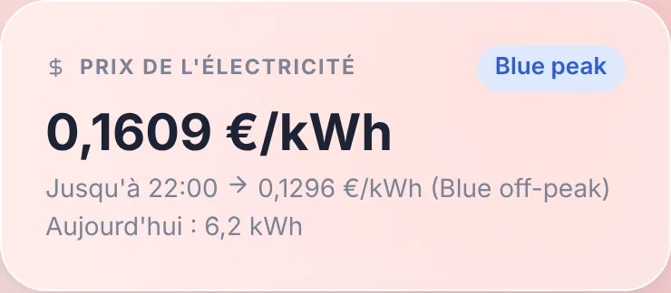
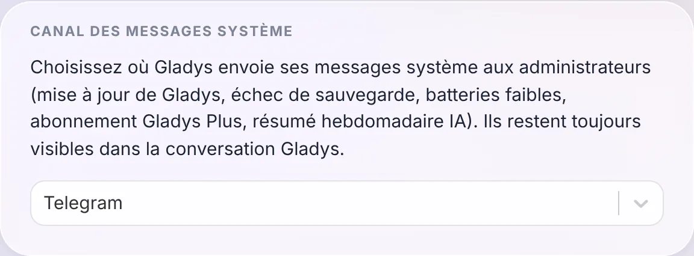
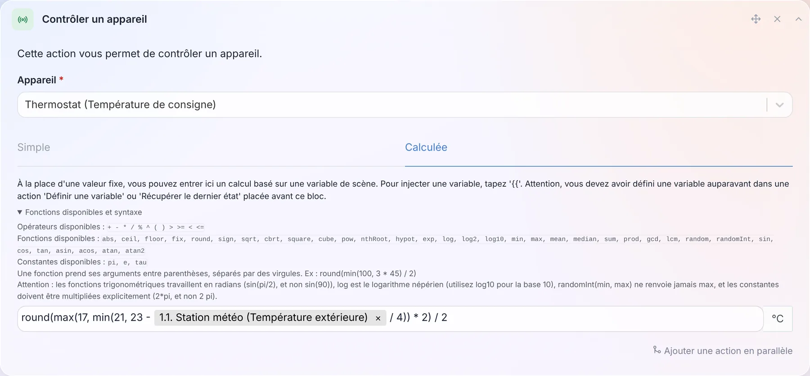
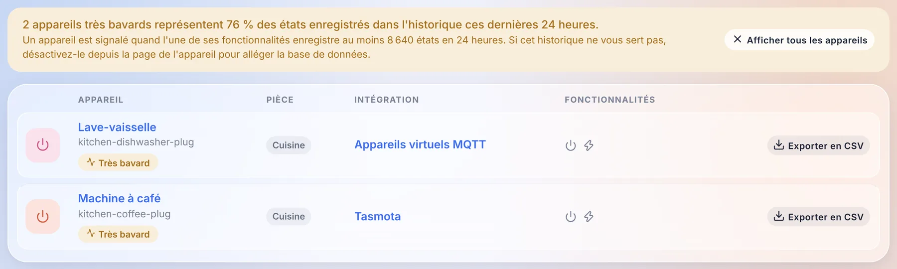

Salut à tous !

Nouvelle version de Gladys aujourd'hui, la 5.2 🎉

Deux gros morceaux dans celle-ci, et tous les deux parlent de votre maison plutôt que de l'interface. Gladys peut maintenant **être votre thermostat**, ou programmer celui que vous avez déjà, avec des plannings hebdomadaires. Et **le suivi de l'énergie s'ouvre à tous les contrats d'électricité** : plus seulement les trois contrats français que Gladys connaissait jusqu'ici, mais les plages horaires, les saisons, les tranches, les prix spot, de presque tous les pays.

{/* truncate */}

## Gladys devient un thermostat

C'était une des plus vieilles demandes du forum, et sans doute l'installation la plus répandue en France : un radiateur électrique piloté par un relais ou une prise connectée, un capteur de température quelque part dans la pièce, et aucun thermostat de marque. Jusqu'ici, la réponse dans Gladys, c'était une scène par seuil de température. Pas de planning, pas d'hystérésis, et un radiateur qui clignotait autour de 21 °C.

Il y a maintenant une intégration native **Thermostat**, et elle gère deux cas.

**Gladys est le thermostat.** Vous choisissez un capteur de température et un interrupteur (un relais, une prise, un contact de chaudière), et Gladys régule : elle lit la température toutes les minutes et allume ou éteint le chauffage pour atteindre la consigne. Vous avez le choix entre une hystérésis (chauffe sous 20,5 °C, s'arrête au-dessus de 21,5 °C) et une régulation TPI, qui chauffe pendant une part d'un cycle fixe proportionnelle à l'écart. La seconde ménage mieux les radiateurs qui ont beaucoup d'inertie. Un capteur d'ouverture coupe le chauffage à la seconde où la fenêtre s'ouvre.

**Gladys programme votre thermostat existant.** Un Netatmo, une tête thermostatique Zigbee, un thermostat Matter ou MQTT régule déjà très bien tout seul. Ce qui lui manquait, c'est un planning qui vive dans Gladys, à côté du reste de la maison, plutôt que dans l'application du fabricant. Gladys écrit maintenant sa consigne selon le planning, bascule son mode sur Arrêt quand il le faut, et affiche s'il est en train de chauffer.

Un détail dont je suis assez content : si quelqu'un tourne la molette du vrai thermostat, ou change la température depuis l'application du fabricant, Gladys le voit et le traite comme un changement manuel. Elle ne l'écrase pas une minute plus tard, ce qui est le bug classique des thermostats pilotés par deux maîtres.

### Des plannings hebdomadaires, par maison

Les plannings appartiennent à une maison. Avec deux maisons, chacune a sa propre « Semaine », et un thermostat ne peut suivre qu'un planning de sa maison.

Sous le capot, un planning est une liste de **points de bascule**, comme chez Netatmo et Tado : « à partir du lundi 06:30, Confort, jusqu'au point suivant ». Ça a l'air d'un détail, mais ça supprime toute une famille de bugs :

- une nuit de 22:30 à 06:30 est un seul créneau, pas deux moitiés recollées à minuit ;
- il n'y a ni trou ni chevauchement : ajouter un créneau raccourcit ceux qu'il recouvre, supprimer un créneau prolonge le précédent ;
- un jour sans créneau à lui garde le dernier préréglage de la veille. Un planning de bureau sans créneau le week-end garde son préréglage du vendredi soir tout le week-end, et l'aperçu de la semaine montre exactement ça.

« Copier vers… » copie un jour sur les autres : vous écrivez le lundi, vous le copiez sur toute la semaine, c'est fait.

### Le widget, et tout le reste

Le nouveau widget de tableau de bord affiche la température et l'humidité de la pièce, la consigne en grand, et un halo orange quand le chauffage tourne. Le bandeau dit ce que fait le thermostat (« Confort jusqu'à 22:30 »), et la barre du bas donne les préréglages : Arrêt, Hors-gel, Absence, Éco, Nuit, Confort.

Choisir un préréglage ou tourner la molette, c'est un changement manuel, qui dure par défaut **jusqu'au prochain créneau du planning**, comme chez Tado ou Netatmo. Vous pouvez aussi régler une durée fixe à la place. Et sans planning, un changement manuel reste, comme sur un thermostat classique.

La partie qui compte le plus pour moi ne se voit pas à l'écran : le préréglage, le mode et la consigne sont des **fonctionnalités d'appareil standard**. Une scène peut donc passer la maison en « Absence » quand tout le monde part, et l'IA, MQTT, Gladys Plus et les assistants vocaux voient un thermostat comme un autre, avec son préréglage et son état de chauffe.

Un immense merci à [@William-De71](https://github.com/William-De71), qui a écrit l'essentiel de cette intégration : 84 commits, et beaucoup de patience pendant la revue !

La [documentation du thermostat est ici](/fr/docs/integrations/thermostat).

## Des contrats d'énergie, pour tous les pays

Le suivi de l'énergie de Gladys connaissait trois contrats : base, heures pleines / heures creuses et EDF Tempo. Tout le reste demandait une pull request sur Gladys et une nouvelle version. Des heures creuses le week-end, un tarif été / hiver aux États-Unis, les tranches d'Hydro-Québec, un prix spot horaire en Norvège : impossible.

Dans la 5.2, un contrat n'est plus une liste de prix mais un **ensemble de règles**, interprétées par un moteur de tarification qui ne connaît aucun fournisseur par son nom. Une règle peut dépendre de l'heure, du jour de la semaine, de la saison, d'une période de dates, d'un calendrier tarifaire (couleur Tempo, jours fériés, jours de pointe), de tranches de consommation par jour, par mois ou par période de facturation, ou de la puissance maximale. Par-dessus viennent les frais fixes, les taxes en pourcentage, les composantes de puissance par kW et les prix spot avec un coefficient et une marge.

Le moteur est testé sur des contrats réels de **12 pays** : France, Belgique, Royaume-Uni, Allemagne, Finlande, Norvège, États-Unis, Canada, Australie, Japon, Corée du Sud et Inde.

### Un assistant, et un aperçu sur votre propre consommation

Créer un contrat se fait en quatre étapes : le compteur, le modèle de contrat (filtré par pays, avec une recherche), ses paramètres, et un **aperçu**.

L'aperçu tarifie votre consommation réelle des 7 derniers jours avec le contrat, sans rien enregistrer : le total, le détail par composante, et un échantillon de créneaux avec le prix appliqué à chacun. Si ça ne colle pas avec votre facture, vous le savez avant d'enregistrer.

Vos prix existants sont **convertis automatiquement** en contrats au premier démarrage, sans toucher à l'historique des coûts. Gladys vérifie elle-même la conversion en comparant l'ancien et le nouveau calcul sur les 7 derniers jours, et signale un contrat qui diffère.

### Le prix sur le tableau de bord, et dans vos scènes

Un nouveau widget **Prix de l'électricité** affiche le prix actuel, la tranche en cours, jusqu'à quand il s'applique et le prix suivant, ainsi que la consommation du jour.

Et comme Gladys connaît maintenant le prix à chaque instant, les scènes peuvent s'en servir : un déclencheur **« Changement de prix de l'électricité »**, et une action **« Condition sur le prix de l'électricité »**. Lancer le lave-vaisselle quand l'électricité devient moins chère tient en trois blocs :

### Un contrat peut venir de partout

Les modèles viennent de trois endroits : le [catalogue communautaire](https://github.com/GladysAssistant/energy-contracts), téléchargé par Gladys sans avoir besoin de mise à jour, les services internes de Gladys (EDF Tempo), et les **intégrations externes**. Une intégration peut maintenant déclarer des modèles de contrat, publier des calendriers tarifaires (couleurs de jour, prix spot à la demi-heure ou au quart d'heure, jours fériés) et, pour les contrats que les règles ne savent pas exprimer, calculer le coût elle-même.

Concrètement : une intégration Octopus Agile, Tibber ou Nord Pool peut être publiée par n'importe qui, sans toucher à Gladys. Et si votre contrat manque, vous pouvez aussi l'écrire vous-même en JSON dans l'assistant, puis l'exporter comme modèle pour le partager.

La [documentation du suivi de l'énergie](/fr/docs/integrations/energy-monitoring) est à jour.

## Choisissez où partent les messages système

Gladys envoie des messages aux administrateurs d'elle-même : une mise à jour, une sauvegarde qui échoue, des batteries faibles, l'abonnement Gladys Plus, le résumé hebdomadaire de l'IA. Jusqu'ici, ils partaient sur tous les canaux de messagerie que vous aviez configurés.

Vous choisissez maintenant le canal dans `Paramètres / Système` : tous, Telegram uniquement, ou la conversation Gladys uniquement. Ils restent de toute façon toujours visibles dans la conversation Gladys.

Merci à [@cicoub13](https://github.com/cicoub13) pour celle-ci !

## 35 fonctions mathématiques dans les formules de scène

Les valeurs calculées des scènes (attendre, contrôler un appareil, définir une variable, conditions, volume d'une enceinte) ne connaissaient que `+ - * / % ^` et cinq fonctions. Il y en a maintenant 35, plus 3 constantes : `min`, `max`, `mean`, `median`, `sum`, `sqrt`, `pow`, `log10`, `exp`, les fonctions trigonométriques, `pi`… Et un lien « Fonctions disponibles et syntaxe » déplie la liste complète juste sous le champ.

Une consigne qui suit la température extérieure tout en restant entre 17 et 21 °C, arrondie au demi-degré, tient donc en une ligne, comme sur la capture : `round(max(17, min(21, 23 - exterieur / 4)) * 2) / 2`, où `exterieur` est la température lue à l'étape précédente de la scène.

Autre changement : une formule qui ne peut pas être calculée **arrête maintenant la scène**, au lieu de la laisser continuer avec la valeur précédente.

[La liste complète est dans la documentation](/fr/docs/scenes/math-functions).

## Retrouvez les appareils qui remplissent votre base de données

Certains appareils envoient une valeur toutes les quelques secondes. Une prise connectée qui remonte sa puissance dix fois par minute, gardée pour toujours dans l'historique, finit par peser plus lourd que tout le reste de la maison.

La page des appareils les signale maintenant : un bandeau indique quelle part de l'historique ils représentent sur les dernières 24 heures, un filtre n'affiche qu'eux, et chaque page d'appareil affiche la taille de l'historique de chaque fonctionnalité. Si vous n'avez pas besoin de cet historique, désactivez-le depuis la page de l'appareil, votre base de données vous remerciera.

## Pour les développeurs d'intégrations

- **Calendriers** : un nouveau type d'intégration `calendar` permet à une intégration de synchroniser des calendriers et leurs événements dans Gladys : un serveur CalDAV ou Nextcloud, iCloud, un flux ICS public (emploi du temps scolaire, collecte des déchets, matchs)… Ils apparaissent dans la vue calendrier et fonctionnent avec les déclencheurs de scène calendrier, exactement comme les calendriers de l'intégration CalDAV, et chaque utilisateur relie son propre compte depuis la page de l'intégration. Google Agenda et Outlook, qui demandent une connexion OAuth par utilisateur, viendront dans un second temps.
- **Contrats d'énergie** : la nouvelle capacité `energy_contracts`, décrite plus haut.
- **Widgets** : un bouton de widget peut maintenant ouvrir un petit formulaire (4 champs maximum) avant d'envoyer son action, par exemple le prix d'une livraison de granulés tapé depuis la tablette murale.
- **Maisons** : un champ peut proposer la liste des maisons de Gladys avec `source: "houses"`, dans la configuration, les widgets et les scènes.

Tout est dans [le guide développeur](/fr/docs/dev/external-integrations/).

## Les correctifs, et tout ce que les 5.1.x ont déjà apporté

Quatre versions correctives sont sorties depuis la 5.1 (5.1.1 à 5.1.4). Voici ce qu'elles et cette version corrigent :

- **Mises à jour** : quand Gladys n'arrive pas à télécharger sa nouvelle image, la mise à jour affiche maintenant la vraie erreur Docker (connexion internet, espace disque, délai dépassé) au lieu d'un message générique.
- **CalDAV** : les événements dont les propriétés ont des paramètres et les fuseaux horaires `GMT+hhmm` sont synchronisés correctement, et un événement impossible à formater ne bloque plus les autres.
- **Zigbee2MQTT** : le conteneur embarqué passe en 2.14.2.
- **Broadlink** : l'interrupteur des prises connectées reste synchronisé avec l'état réel de la prise.
- **Aspirateurs robots** : les commandes de mode de nettoyage et de mode de fonctionnement ne proposent que les options gérées par l'appareil.
- **Widget caméra** : seuls les états texte de la fonctionnalité image sont affichés.
- **Intégrations** : les champs secrets des actions peuvent être saisis, les valeurs par défaut des champs d'action sont appliquées, les champs numériques acceptent les décimales, et les boutons de widget gardent leurs couleurs en mode sombre.
- **Connexion** : après une connexion locale, Gladys vous ramène sur la page que vous essayiez d'ouvrir.
- **Base de données** : la purge quotidienne garde les 1 000 messages les plus récents par utilisateur et les 2 000 tâches de fond les plus récentes, ces tables ne grossissent donc plus indéfiniment.
- **Sécurité** : les routes de localisation et de présence d'un utilisateur sont maintenant réservées à cet utilisateur et aux administrateurs, et plusieurs dépendances sont mises à jour pour corriger des alertes npm.
- **Gladys Plus** : la vérification de version n'est envoyée que par les images officielles, et la page des tarifs met en avant l'alerte e-mail hors ligne arrivée avec la 5.1.

Ça fait 38 pull requests depuis la version 5.1, dont 19 dans cette version.

## Remerciements aux contributeurs

Merci à [@William-De71](https://github.com/William-De71) pour le thermostat, à [@cicoub13](https://github.com/cicoub13) pour le canal des messages système et le correctif du widget caméra, et à [@bertrandda](https://github.com/bertrandda) pour le correctif CalDAV. Et merci à tous ceux qui ont remonté des bugs sur le forum !

On se retrouve sur [le forum](https://community.gladysassistant.com/) si vous voulez parler de cette version :)

## Comment mettre à jour ?

Comme toujours, Gladys se met à jour automatiquement sous 24 h si vous utilisez Watchtower, sinon vous pouvez le faire en un clic depuis les paramètres.

Pensez à configurer Telegram pour recevoir une alerte sur votre téléphone quand Gladys se met à jour, et depuis cette version, vous pouvez choisir exactement où partent ces messages !

Le [CHANGELOG complet de la 5.2.0](https://github.com/GladysAssistant/Gladys/releases/tag/v5.2.0) est sur GitHub.
