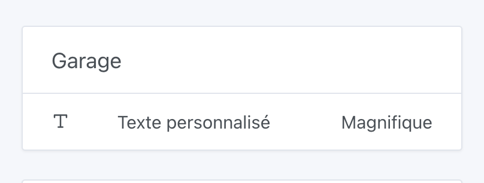

Si vous avez configurer un broker MQTT avec Gladys, vous pouvez communiquer avec Gladys via MQTT.

#### Envoyer un nouvel état décimal

Si vous avez un capteur de température qui doit retourner des valeurs en MQTT, vous pouvez envoyer vos valeurs sur le topic suivant:

```
Topic: gladys/master/device/:device_external_id/feature/:device_feature_external_id/state
Body: 22.2
```

#### Envoyer un nouvel état textuel

Si vous voulez afficher du texte sur le tableau de bord Gladys, c'est possible avec l'intégration MQTT !



Pour cela, vous devez créer un appareil avec une fonctionnalité "Texte" dans l'intégration MQTT, puis publier un message sur le topic suivant :

```
Topic: gladys/master/device/:device_external_id/feature/:device_feature_external_id/text
Body: Magnifique
```

#### Contrôler un périphérique depuis Gladys

Imaginons que vous êtes une ampoule contrôlable via MQTT.

Vous devez écouter le topic MQTT:

```
gladys/device/:device_external_id/feature/:device_feature_external_id/state
```

Ou vous allez recevoir des valeurs comme par exemple:

```
1
```

Ce qui veut dire "Gladys demande à la lampe de s'allumer".

Ou

```
0
```

Ce qui veut dire "Gladys demande à la lampe de s'éteindre".
