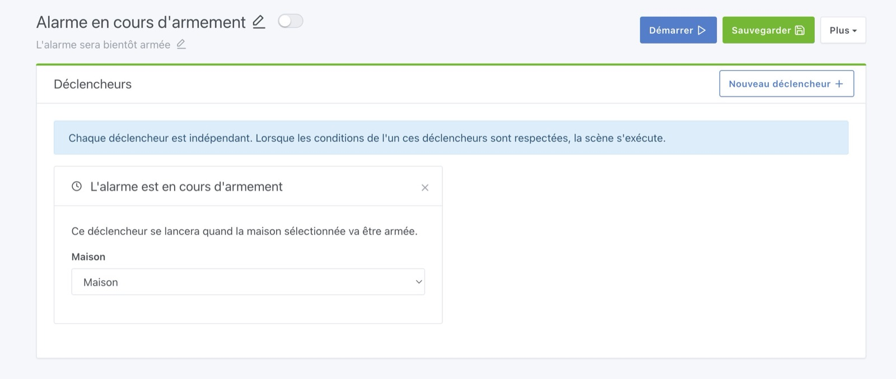

Dans Gladys, il est possible de configurer un véritable système d'alarme.

## Configurer le tableau de bord

Sur le tableau de bord, vous pouvez ajouter un widget "Alarme" :

L'alarme dans Gladys a 4 modes :

- **Armée** : La maison est armée. Mode utile quand vous êtes absent de la maison.
- **Désarmée** : La maison est désarmée, l'alarme n'est pas active.
- **Armement partiel** : Ce mode est pratique pour faire un "mode nuit" ou un "mode sieste". Vous êtes à la maison et vous souhaitez surveillez uniquement l'extérieur de la maison mais pas l'intérieur pour pouvoir continuer à vous déplacer.
- **Mode panique** : Un intrus est dans la maison et vous voulez déclencher l'alarme, peut-être envoyer un message automatique à un proche ?

Maintenant que vous avez compris les différents modes, il faut configurer des scènes pour mettre en place votre stratégie d'alarme.

## Configurer le délai d'armement et le code de l'alarme

Il y a 2 paramètres à définir dans les paramètres de la maison ("Paramètres" -> "Maisons")

- **Code de l'alarme** : Si vous utilisez le "mode tablette", Gladys affichera un clavier numérique sur ces tablettes quand l'alarme est armée. Le code défini ici servira à désactiver l'alarme. Nous parlerons de ce mode tablette plus bas dans ce tutoriel.
- **Délai avant l'armement** : Si vous voulez laisser un délai avant l'armement de l'alarme (entre 5 secondes et 1 minute), vous pouvez le configurer ici. Cela vous permet de sortir de la maison avant que l'alarme soit active.

## Configurer des scènes

Maintenant, il va falloir dire à Gladys ce que le mode alarme va faire.

La première scène à créer, c'est une scène qui se déclenchera quand l'armement de l'alarme est en cours.

Par exemple, vous pouvez vous envoyer un message Telegram quand l'alarme est en cours d'armement, ou déclencher un signal sonore dans la maison, faire clignoter les lumières, tout est possible !

Ensuite, le scénario le plus important: que faire en cas d'intrusion ?

Vous pouvez créer une scène sur plusieurs déclencheurs:

- "Quand un mouvement est détecté dans le salon"
- "Quand un mouvement est détecté dans la cuisine"
- "Quand la porte d'entrée est ouverte"

Puis ajouter une condition "Si l'alarme est en mode" "Armée" :

Si cette condition est vérifiée, la scène continuera et vous pouvez ensuite vous envoyer un message Telegram, vous envoyez une image de caméra via Telegram, déclencher une alerte sonore dans la maison, etc...

Si quelqu'un s'introduit chez vous, il va peut-être essayer de déverrouiller Gladys via vos tablettes au mur.

Il est possible de tester 3 codes avant que le clavier se bloque pour 5 minutes, et au bout de 3 codes échoués, ce déclencheur de scène sera appelé :

Vous pouvez créer une scène sur ce déclencheur qui vous préviendras par message.

## Mode tablette

Si vous avez une tablette au mur chez vous, vous pouvez la déclarer à Gladys via le bouton "Mode tablette" :

En cliquant sur ce bouton, vous verrez un formulaire qui vous invite à renseigner la maison dans laquelle cette tablette est située.

Gladys vous demande cette information pour savoir quand elle devra "verrouiller" la tablette :

Je le précise sur cet écran, si vous voulez que votre tablette soit en plein-écran (et le reste), vous pouvez ajouter un paramètre à l'URL: `?fullscreen=force`.

Ce "plein écran forcé" n'a pas de rapport avec le mode tablette, l'un et l'autre sont entièrement indépendants.

Quand l'alarme sera armée, Gladys ira chercher automatiquement toutes les tablettes de la maison et les verrouillera.

Ces tablettes afficheront un clavier numérique qui vous permettra de déverrouiller l'alarme :

Ce clavier est une alternative aux claviers physiques, mais vous pouvez tout à fait utiliser un vrai clavier physique Zigbee et faire une scène qui désarme l'alarme quand ce clavier est utilisé.

Vous pouvez aussi entièrement vous passer de ces claviers et désarmer l'alarme via votre téléphone via le widget "Alarme".
