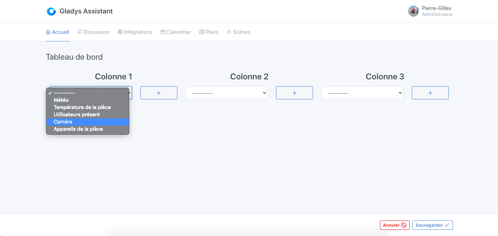
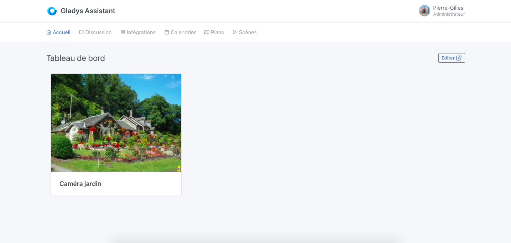

Dans Gladys Assistant, il est possible d'afficher sur le tableau de bord les images de vos caméras.

Ces images sont rafraichies à intervalle régulier suivant l'intervalle que vous avez spécifié dans la configuration de votre caméra.

Vous pouvez aussi afficher le flux vidéo de la caméra en direct grâce au bouton "Live".

## Pré-requis

Vous devez avoir configuré une caméra, voir [la documentation](/fr/docs/integrations/camera/) de l'intégration caméra.

## Configuration

Rendez-vous sur le tableau de bord de Gladys Assistant, puis cliquez sur le bouton "Editer".

Sélectionnez la box "Caméra", et cliquez sur le bouton +.

Ensuite, sélectionnez la caméra que vous voulez afficher.

Donnez un nom à cette box, c'est ce texte qui s'affichera sur le tableau de bord sous l'image de la caméra.

Cliquez sur "Sauvegarder".

Voilà ! Vous devriez voir l'image de votre caméra.

Cette image se rafraîchira automatiquement selon la fréquence que vous avez définie dans l'intégration caméra.
