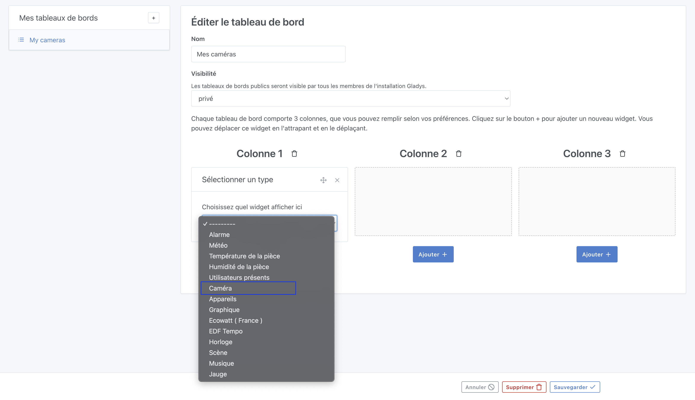
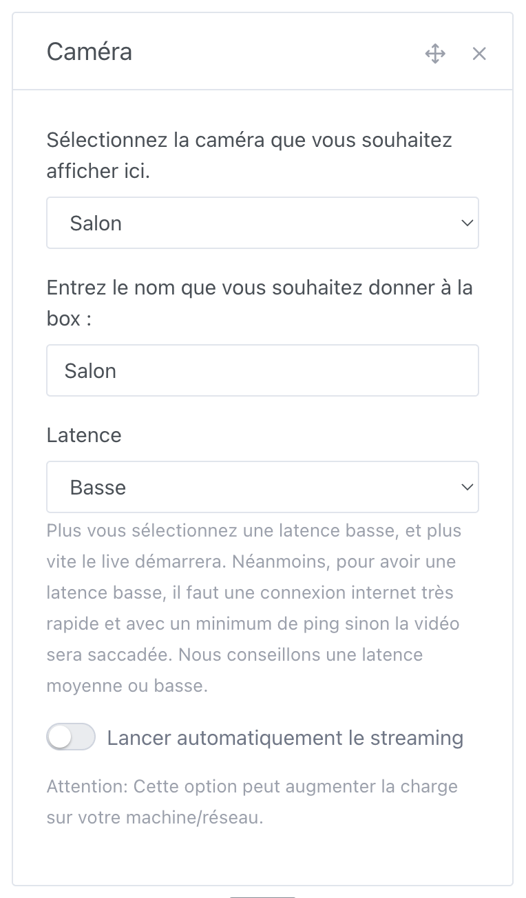

Vous pouvez afficher une image de caméra sur le tableau de bord, et suivre en direct le flux vidéo de la caméra.

## Pré-requis

Vous devez avoir configuré une caméra, voir [la documentation](/fr/docs/integrations/camera/) de l'intégration caméra.

## Configuration

Rendez-vous sur le tableau de bord de Gladys Assistant, puis cliquez sur le bouton "Editer".

Sélectionnez le widget "Caméra" :

Ensuite, sélectionnez la caméra que vous voulez afficher.

Donnez un nom à cette box, c'est ce texte qui s'affichera sur le tableau de bord sous l'image de la caméra.

Cliquez sur "Sauvegarder".

Voilà ! Vous devriez voir l'image de votre caméra.

Cette image se rafraîchira automatiquement selon la fréquence que vous avez définie dans l'intégration caméra.
