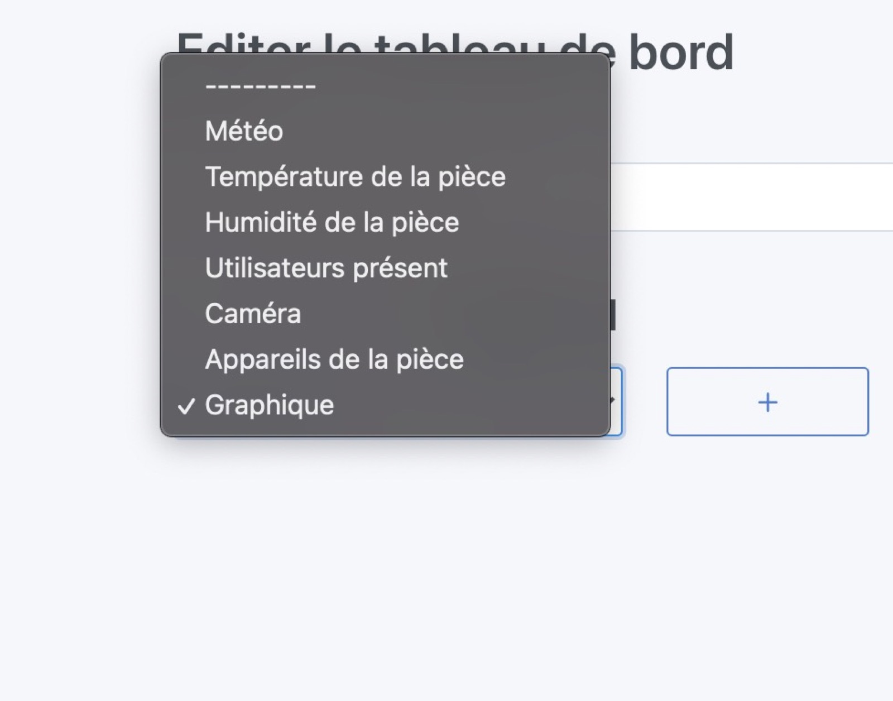
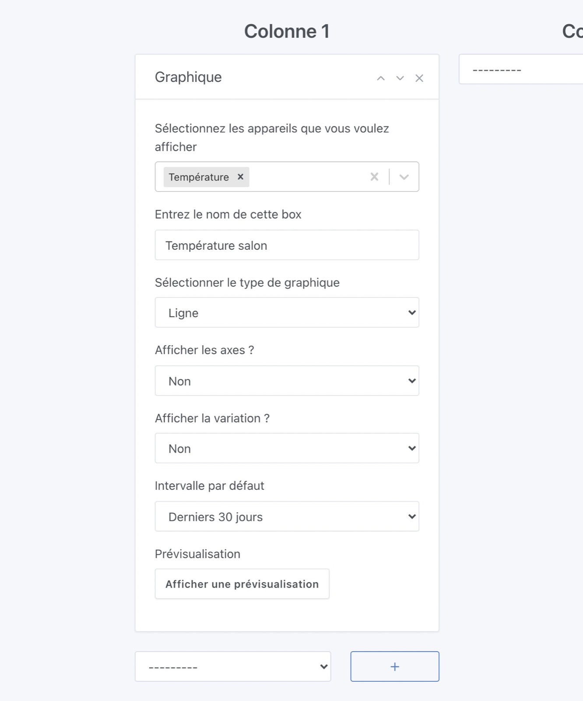
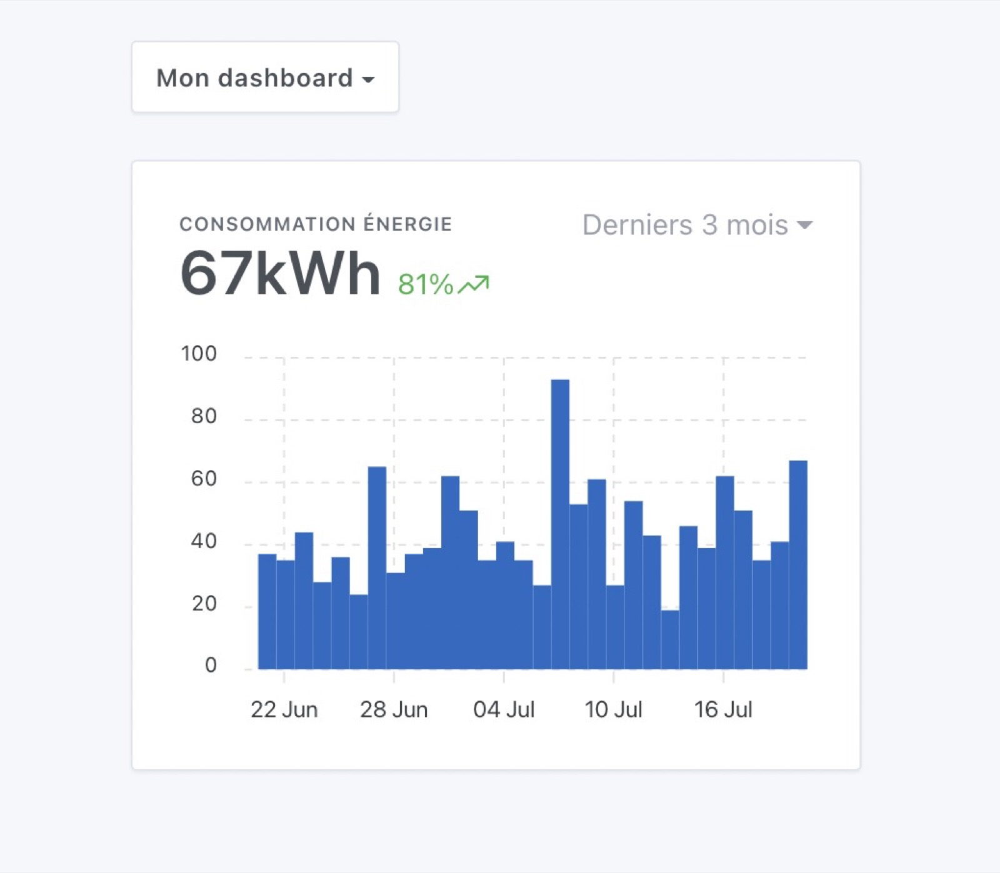
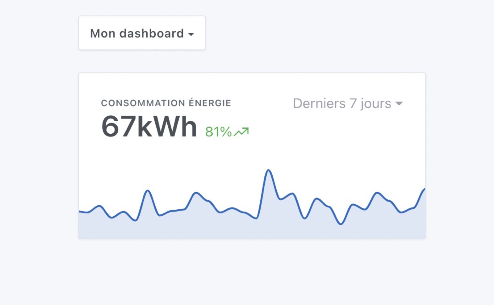
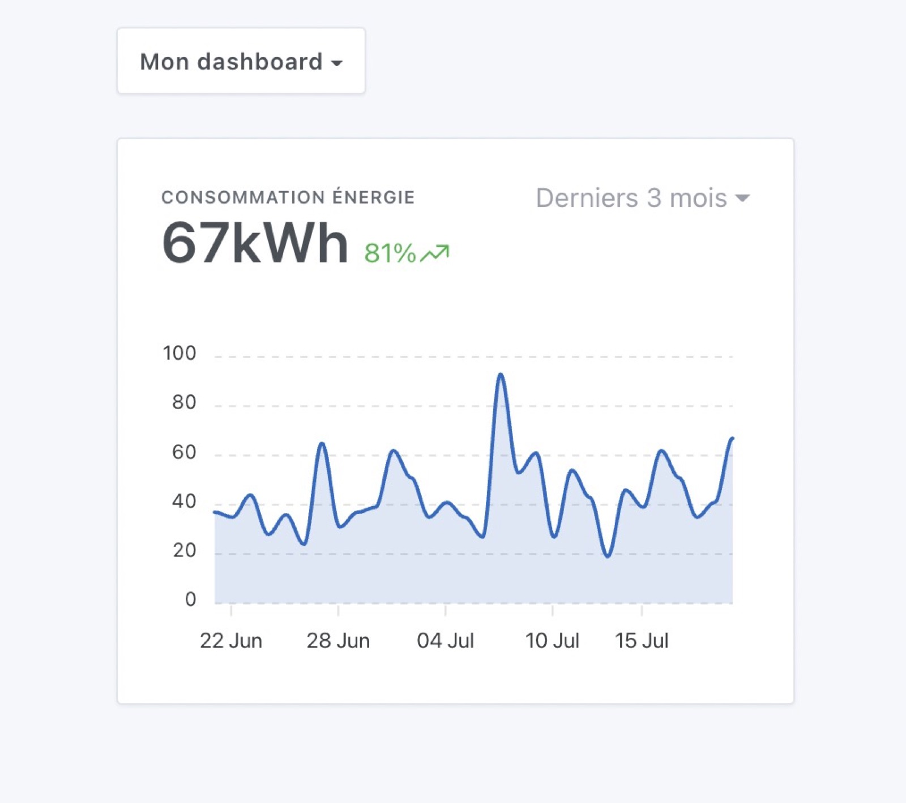
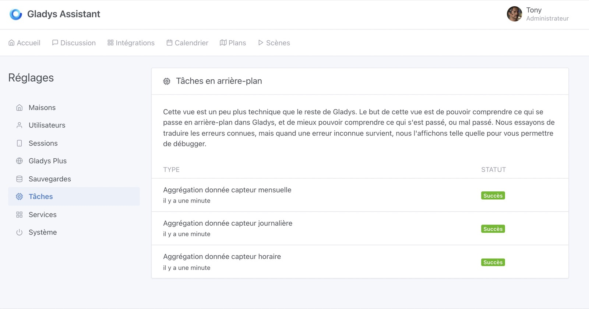

Depuis Gladys Assistant v4.6, il est possible d'afficher des graphiques sur le tableau de bord.

## Pré-requis

Votre installation de Gladys doit être en version >= 4.6, et vous devez avoir configuré au moins un capteur envoyant des données dans Gladys.

## Configuration

Allez sur le tableau de bord de Gladys, et cliquez sur le bouton "Editer".

Ajoutez une box "graphique":

Sélectionnez l'appareil que vous voulez afficher, puis configurer le reste de la box:

- Nom: Sera affiché en haut de la box sur le dashboard
- Type de graphique: Il est possible d'afficher plusieurs types de graphique dans Gladys (Ligne, Histogramme, Aire, Ligne droite)
- Afficher les axes: Nous proposons deux types d'affichage, un affichage plus design sans les axes et un avec les axes.
- Afficher la variation: Si sélectionné, le graphique affichera la variation relative entre la première et la dernière valeur sur l'interval sélectionné.

Enregistrez, et hop c'est bon !

## Quelques exemples de graphiques

Imaginons que vous vouliez afficher la consommation énergetique d'un de vos appareils, le graphique "histogramme" est assez adapté pour ça :

Vous pouvez aussi afficher ça sous la forme d'une courbe "aire", sans les axes pour affichage plus design :

Ou avec les axes pour plus de lisibilité :

Les possibilités sont infinies !

## Vérifier que l'agrégation fonctionne bien

Toutes les heures, Gladys va calculer des valeurs "agrégées" pour tous les appareils de votre installation, afin de permettre à l'affichage d'être très rapide.

Par exemple, si jamais vous voulez afficher les 6 derniers mois de votre capteur de température, si ce capteur envoie une valeur toutes les 30 secondes, cela fait:

- 2 x 60 x 24 = 2 880 valeurs de capteurs par jour
- soit 2 880 x 30 = 86 400 valeurs par mois
- soit 86 400 x 6 = 518k valeurs de capteurs pour 6 mois

Lors de l'affichage de la courbe sur le tableau de bord, Gladys n'a besoin que d'une centaine de points (afficher plus n'a aucun sens), il faut donc faire de l'échantillonage sur cet ensemble de données.

Cependant, si Gladys devait faire cet échantillonage en direct, ce serait trop long, et l'interface de Gladys serait lente.

Gladys pre-calcule donc des valeurs agrégées par heure, jour et mois afin de simplifier les requêtes.

Vous pouvez vérifier dans les paramètres que ces tâches en arrière-plan fonctionnent bien en allant dans l'onglet "Tâches en arrière-plan" dans les paramètres :

