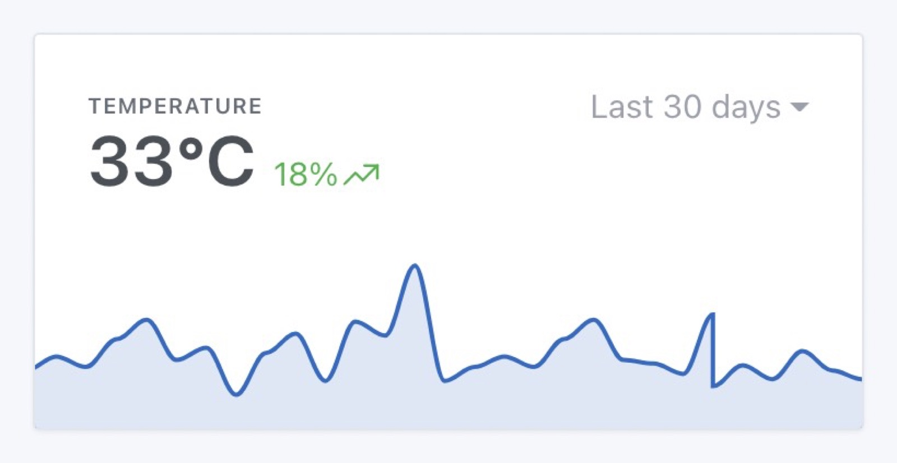

Depuis Gladys Assistant v4.6, il est possible d'afficher des graphiques sur le tableau de bord.

## Pré-requis

Votre installation de Gladys doit être en version >= 4.6, et vous devez avoir configuré au moins un capteur envoyant des données dans Gladys.

## Configuration

Allez sur le tableau de bord de Gladys, et cliquez sur le bouton "Editer".

Ajoutez une box "graphique":

Sélectionnez l'appareil que vous voulez afficher, puis configurer le reste de la box:

- Nom: Sera affiché en haut de la box sur le dashboard
- Type de graphique: Il est possible d'afficher plusieurs types de graphique dans Gladys (Ligne, Histogramme, Aire, Ligne droite)
- Afficher les axes: Nous proposons deux types d'affichages, un affichage plus design sans les axes et un avec les axes.
- Afficher la variation: Si sélectionné, le graphique affichera la variation relative entre la première et la dernière valeur sur l'interval sélectionné.

Enregistrez, et hop c'est bon !
