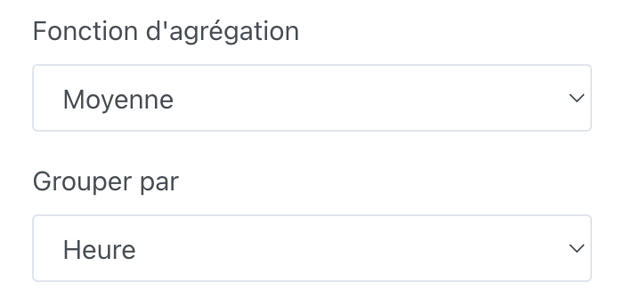

## Prérequis

Vous devez avoir configuré au moins un capteur envoyant des données dans Gladys.

## Configuration

Allez sur le tableau de bord de Gladys et cliquez sur le bouton "Éditer".

Ajoutez un widget "Graphique" :

Sélectionnez les appareils que vous souhaitez afficher, puis configurez le reste du widget :

- **Nom** : Sera affiché en haut du widget sur le tableau de bord
- **Type de graphique** : Il est possible d'afficher plusieurs types de graphiques dans Gladys (Ligne, Histogramme, Aire, Ligne droite, Binaire)
- **Afficher les axes** : Nous proposons deux types d'affichage, un affichage plus design sans les axes et un avec les axes
- **Afficher la variation** : Si sélectionné, le graphique affichera la variation relative entre la première et la dernière valeur sur l'intervalle sélectionné

Si vous souhaitez regrouper les données par intervalle de temps, vous pouvez modifier cette option dans les paramètres avancés :

## Exemples de graphiques

Imaginons que vous souhaitiez afficher la consommation énergétique d'un de vos appareils, le graphique "histogramme" est particulièrement adapté pour cela :

Vous pouvez également afficher ces données sous forme d'une courbe "aire", sans les axes pour un affichage plus design :

Ou avec les axes pour plus de lisibilité :

Les possibilités sont infinies !
