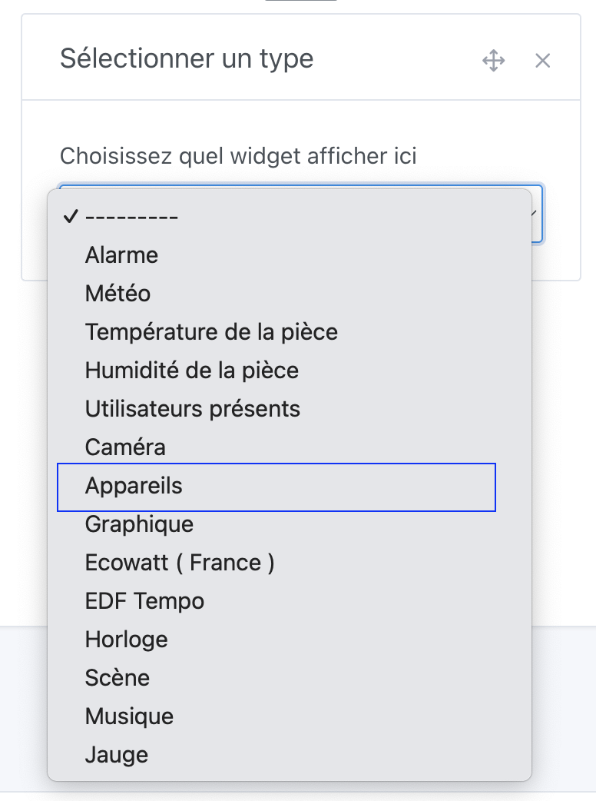
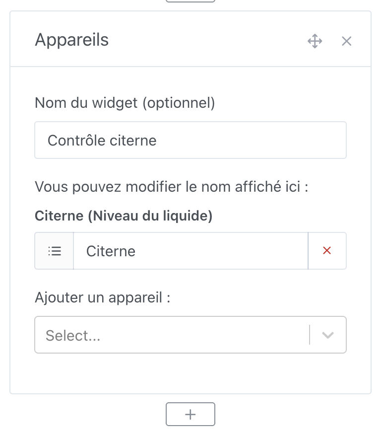
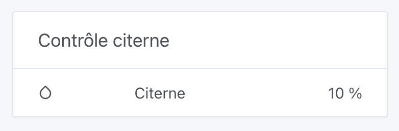
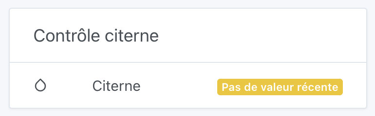
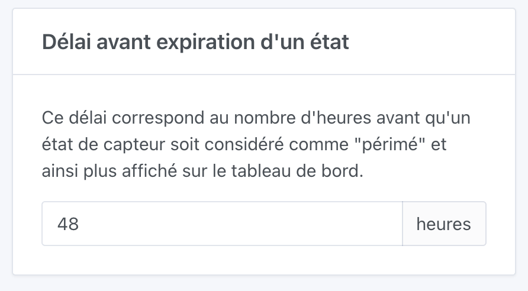

Dans Gladys Assistant, vous pouvez contrôler vos appareils directement depuis le tableau de bord, et afficher les valeurs de vos capteurs dans l'interface.

## Pré-requis

Vous devez avoir ajouté au moins quelques appareils à Gladys, sinon cela a peu d'intérêt 😄

## Configuration

Rendez-vous sur le tableau de bord de Gladys, et cliquez sur "Editer".

Sélectionnez le widget "Appareils", et cliquez sur le bouton +.

Ensuite, sélectionnez les appareils que vous voulez afficher.

Vous pouvez donner un nom au widget, mais c'est optionnel.

Cliquez sur "Sauvegarder".

## Utilisation

Vous pouvez maintenant voir vos appareils sur le tableau de bord, voir leurs dernières valeurs si c'est un capteur, ou contrôler directement vos appareils.

## Si aucun valeur n'est affichée

Si vos appareils affichent "pas de valeur récente", cela signifie que le capteur n'a pas envoyé de valeur depuis plus de 48 heures.

Vous pouvez changer ce délai dans les paramètres de Gladys (`Paramètres` -> `Système` -> `Délai avant expiration d'un état`)

