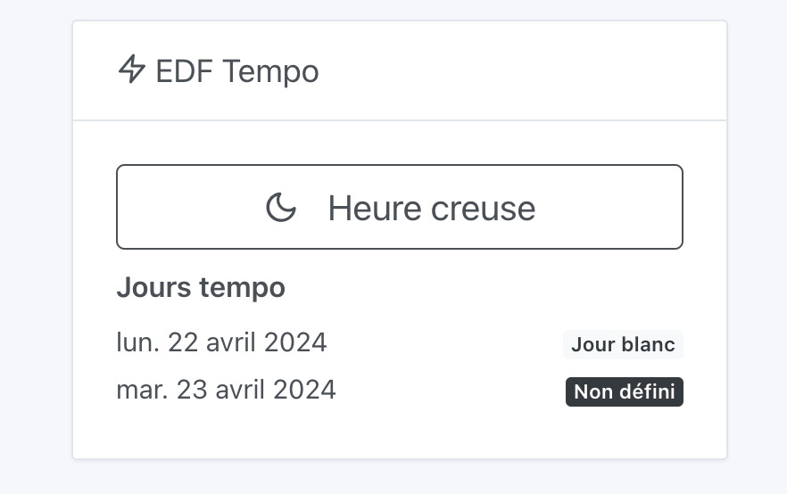
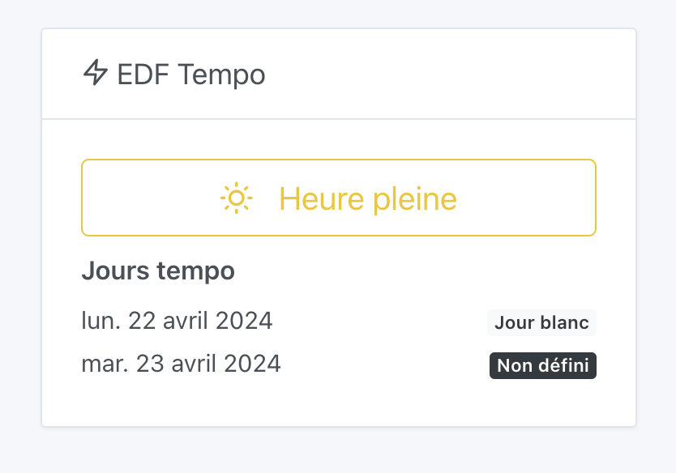

En France, EDF fournit un service [EDF Tempo](https://particulier.edf.fr/fr/accueil/gestion-contrat/options/tempo.html) où le coût de l'électricité est globalement moins cher toute l'année, sauf certains jours "blancs" et "rouges" où le prix de l'électricité est bien plus cher.

En 2024, il y a 301 jours bleus, 43 jours blancs et 22 jours rouges.

Ce type de contrat est pratique pour les utilisateurs pouvant facilement décaler leurs usages.

### EDF Tempo et la domotique

Dans Gladys, il est possible de visualiser sur son tableau de bord l'état actuel de l'option Tempo : heure pleine / heure creuse et la couleur du jour actuel / jour suivant.

En heure creuse :

En heure pleine :

