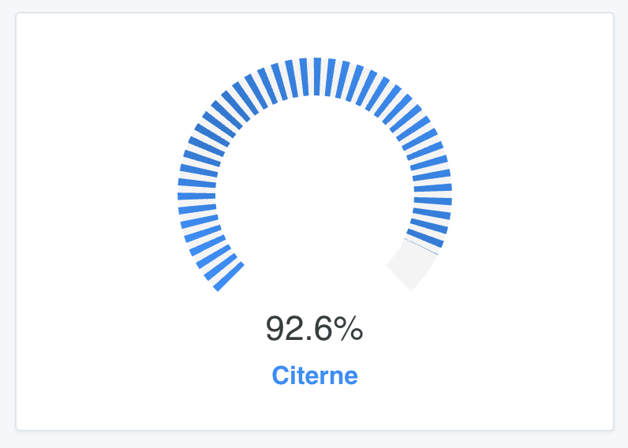
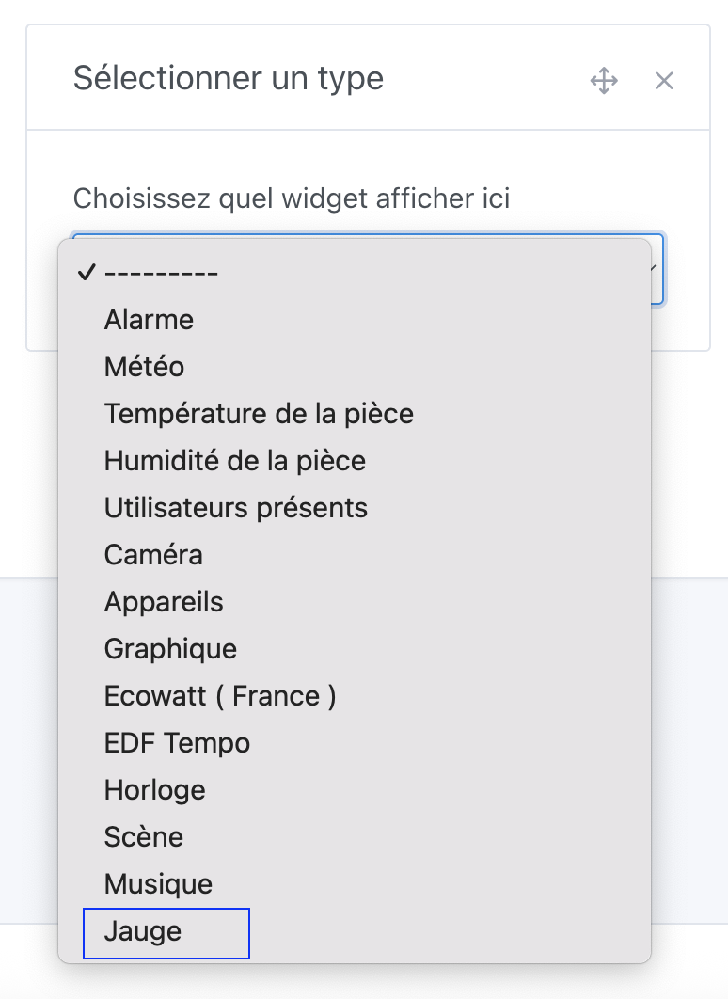
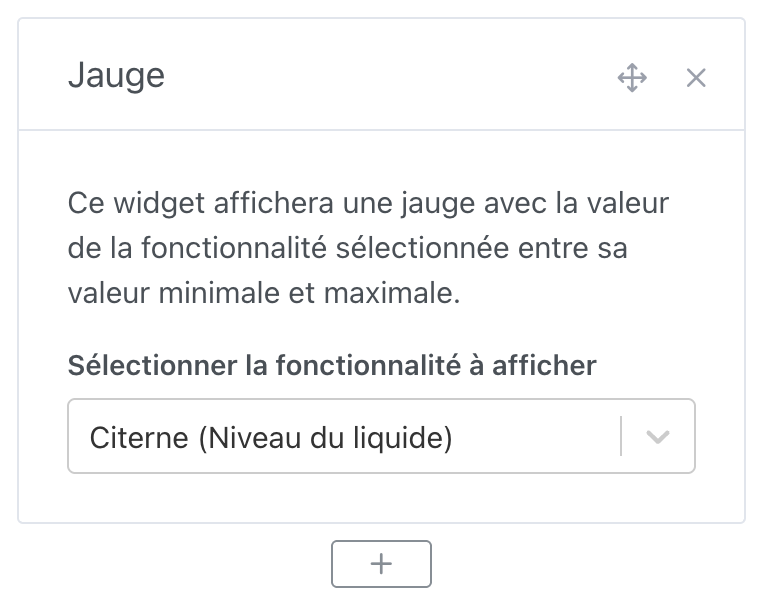

Vous pouvez afficher une jauge sur le tableau de bord.

Cette jauge affiche la valeur actuelle du capteur, entre le minimum et le maximum défini au niveau du capteur.

:::note
Si vous avez créé le capteur vous-même dans l'intégration MQTT, vous pouvez modifier vous-même les valeurs minimum et maximum.

Sinon, c'est la responsabilité de l'intégration de définir correctement les valeurs minimum et maximum.

Si les valeurs minimum et maximum ne sont pas correctement définies, n'hésitez pas à venir sur le forum pour en discuter !
:::

## Pré-requis

Vous devez avoir configuré au moins un capteur envoyant des données dans Gladys.

## Configuration

Rendez-vous sur le tableau de bord, et cliquez sur "Éditer".

Ajoutez un widget "Jauge" :

Ensuite, sélectionnez le capteur que vous voulez afficher :

Cliquez sur "Sauvegarder", c'est bon !
