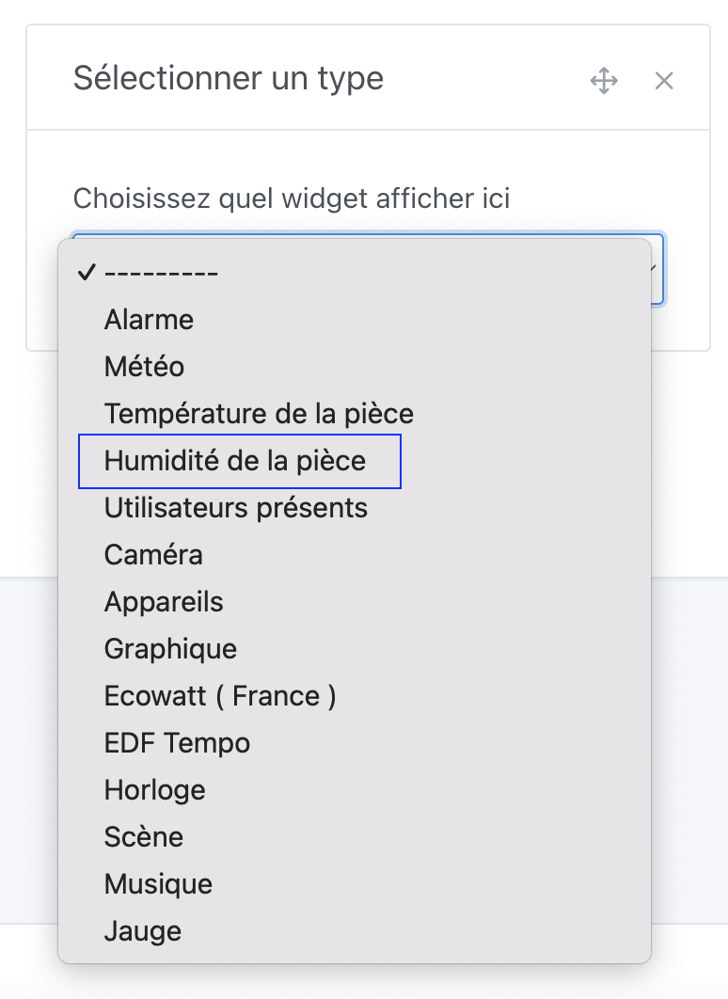

Dans Gladys Assistant, vous pouvez afficher l'humidité moyenne d'une pièce sur votre tableau de bord.

Ce widget va chercher l'humidité de tous les capteurs d'humidité présents dans la pièce, et en afficher une moyenne sur le tableau de bord.

## Pré-requis

Vous devez au préalable avoir configuré au moins un capteur d'humidité.

Cela peut être un capteur de n'importe quel protocole (Zigbee, Matter, MQTT, peu importe), et avoir affecté ce capteur à une pièce.

## Configuration

Rendez-vous sur le tableau de bord, et cliquez sur "Éditer".

Sélectionnez le widget "Humidité de la pièce", et cliquez sur le bouton +.

Ensuite, sélectionnez la pièce que vous voulez afficher.

Vous pouvez configurer des seuils personnalisés où la couleur du widget changera en fonction de l'humidité.

Cliquez sur "Sauvegarder".

Si vous n'avez pas de capteurs dans la pièce, ou si ces capteurs n'ont pas envoyé de valeurs dans la dernière heure, vous verrez:

