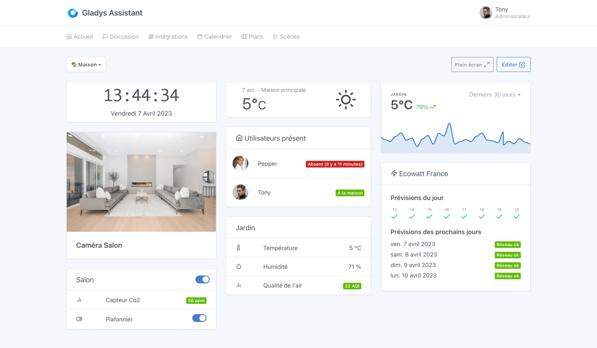
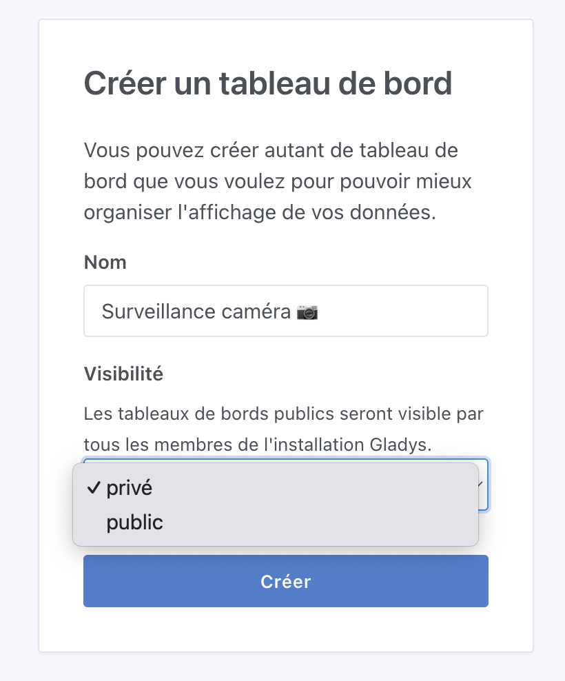

Dans Gladys Assistant, le tableau de bord est la page principale de Gladys.

Vous pouvez créer plusieurs tableaux de bord, et partager ces tableaux de bord avec les membres de votre famille.



Afficher des images de caméras ? Surveiller des valeurs de capteurs ? Contrôler ses lumières ?

Tout est possible !

## Visibilité d'un tableau de bord

Lorsque vous créez un tableau de bord, il peut être "privé" ou "public" :

- Un tableau de bord "privé" est visible uniquement par vous-même.
- Un tableau de bord "public" est visible par tous les utilisateurs de l'instance Gladys.



### Mode tablette

Si vous utilisez Gladys sur une tablette tactile quelque part dans votre maison, il est probable que vous vouliez afficher en plein écran le tableau de bord de Gladys, sans avoir la possibilité de naviguer hors de cet écran.

Il est possible de forcer un mode plein écran en ajoutant un paramètre à l'URL :

```
?fullscreen=force
```

### Des retours ?

Si vous avez des besoins qui ne sont pas couverts par le tableau de bord actuel de Gladys, n'hésitez pas à nous contacter sur [le forum](https://community.gladysassistant.com/) afin de voir si on peut développer un widget spécifique.
