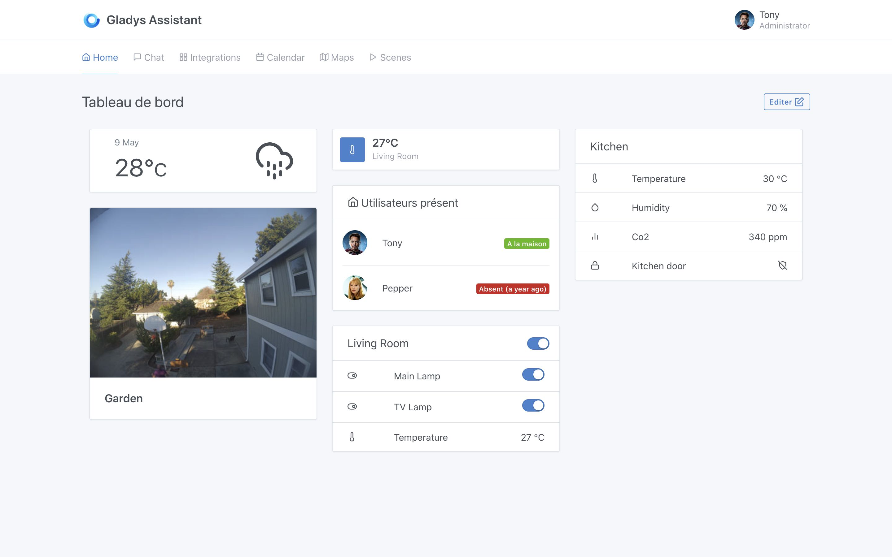

Dans Gladys Assistant, le tableau de bord est la page principale de Gladys.

Cette page est entièrement configurable pour répondre à votre besoin.

Afficher des images de caméras ? Surveiller des valeurs de capteurs ? Contrôler ses lumières ?

Dans cette catégorie de la documentation, nous parcourerons tous les types de "box" (ou widget si vous voulez!), et expliquerons comment chacun fonctionne.

Si vous avez des besoins qui ne sont pas couverts par le tableau de bord actuel de Gladys, n'hésitez pas à nous contacter sur [le forum](https://community.gladysassistant.com/) afin de voir si on peut développer une box spécifique.
