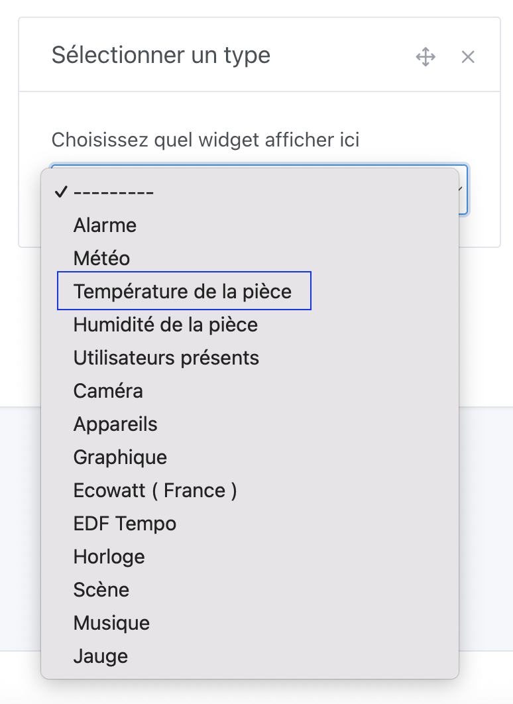
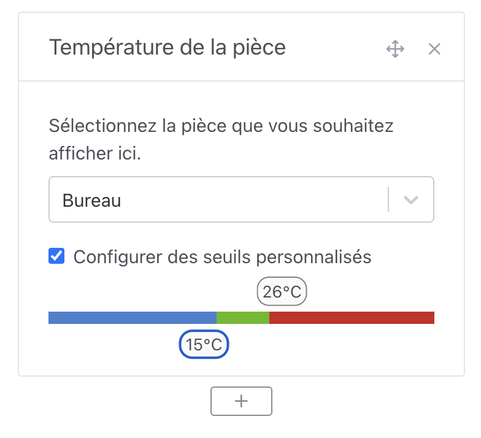
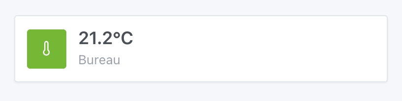
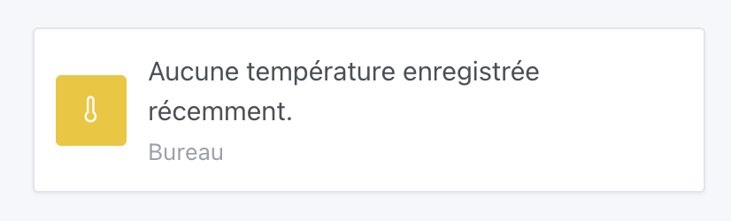

Dans Gladys Assistant, vous pouvez afficher la température moyenne d'une pièce sur votre tableau de bord.

Ce widget va chercher la température de tous les capteurs de températures présents dans la pièce, et en afficher une moyenne sur le tableau de bord.

## Pré-requis

Vous devez au préalable avoir configuré au moins un capteur de température.

Cela peut être un capteur de n'importe quel protocole (Zigbee, Matter, MQTT, peu importe), et avoir affecté ce capteur à une pièce.

:::note
Certains capteurs renvoient une "Température de l'appareil", par exemple un ordinateur peut renvoyer la température de son CPU. Gladys ne comptabilise pas ces valeurs comme des valeurs de températures sur ce widget.
:::

## Configuration

Rendez-vous sur le tableau de bord, et cliquez sur "Éditer".

Sélectionnez le widget "Température de la pièce", et cliquez sur le bouton +.

Ensuite, sélectionnez la pièce que vous voulez afficher.

Vous pouvez configurer des seuils personnalisés où la couleur du widget changera en fonction de la température.

Cliquez sur "Sauvegarder".

Si vous n'avez pas de capteurs dans la pièce, ou si ces capteurs n'ont pas envoyé de valeurs dans la dernière heure, vous verrez:

