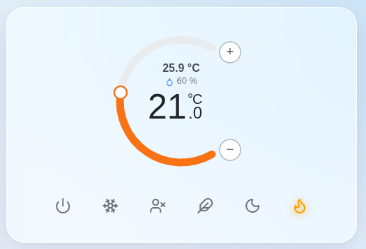
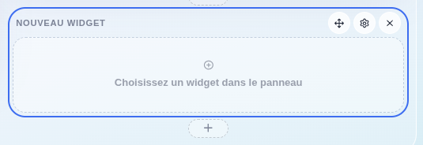
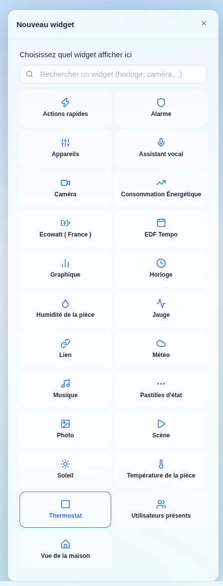
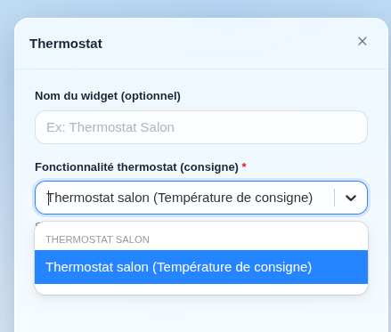
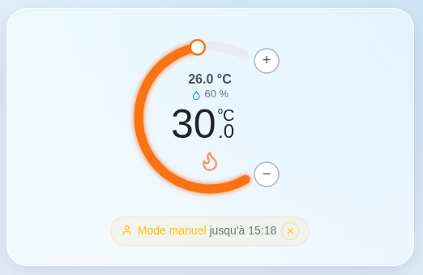
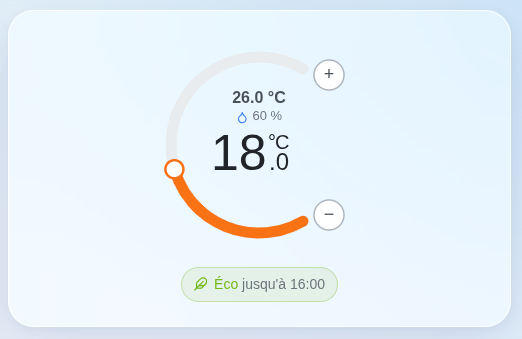

Le widget thermostat affiche et pilote un thermostat directement depuis votre tableau de bord : température actuelle, consigne, preset en cours et planning appliqué.

Il est conçu pour les thermostats créés par l'[intégration Thermostat](../integrations/thermostat.md). Tout autre thermostat de Gladys exposant une température de consigne (Netatmo, Zigbee, Z-Wave, Matter…) peut également être sélectionné, et vous pourrez modifier sa consigne depuis la molette — mais le planning, les presets et la gestion des fenêtres ouvertes n'existent que sur les thermostats virtuels.

## Ajouter le widget

Éditez votre tableau de bord, cliquez sur « Ajouter une box » et choisissez « Thermostat ».

Sélectionnez ensuite la fonctionnalité thermostat (la consigne) que vous souhaitez piloter, et donnez éventuellement un nom au widget.

## Lire le widget

La molette affiche la **consigne**, le grand nombre au centre. Autour, vous retrouvez la température mesurée, ainsi que l'humidité si un capteur d'humidité est configuré sur le thermostat.

L'anneau autour de la molette est orange en mode chauffage, bleu en mode climatisation, et gris lorsque le thermostat est à l'arrêt ou suspendu.

Sous la molette, les six presets — Arrêt, Hors-gel, Absence, Éco, Nuit, Confort — permettent de changer de température de consigne en un clic.

## Changer la température

Faites glisser la molette, ou utilisez les boutons + et −, pour modifier la consigne.

Le thermostat passe alors en **mode manuel** : votre température prend le pas sur le planning, pendant la durée configurée sur le thermostat (30 minutes par défaut). Un bandeau indique jusqu'à quand la consigne tient, avec un bouton pour l'annuler et rendre immédiatement la main au planning.

Sur un thermostat qui ne suit aucun planning, une consigne manuelle est conservée indéfiniment, comme sur un thermostat physique.

## Suivre le planning

Lorsque le thermostat suit un planning hebdomadaire, le widget affiche le preset en cours et jusqu'à quelle heure il s'applique.

:::note
La plage en cours est résolue dans le fuseau horaire configuré dans Gladys, et non dans celui de votre navigateur — un tableau de bord consulté depuis un autre pays affiche donc bien la plage qui chauffe réellement votre maison.
:::

## États suspendus

Deux situations suspendent la régulation, et le widget l'indique explicitement :

- **Fenêtre ouverte** : un capteur d'ouverture configuré sur le thermostat est en position « ouvert », le chauffage est donc coupé jusqu'à la fermeture de la fenêtre.
- **Preset Arrêt** : le thermostat est à l'arrêt, aucune température n'est visée.

